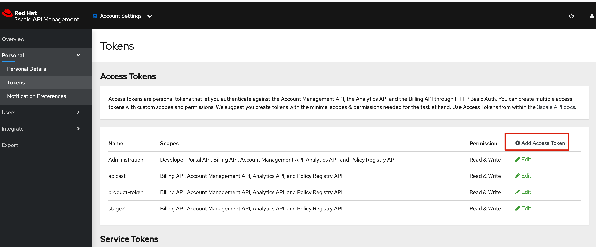
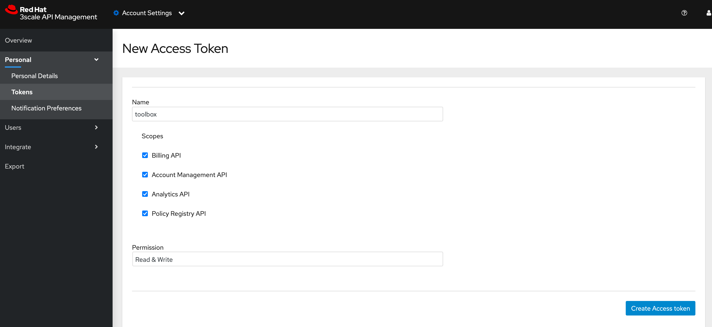

# 创建toolbox








这里会产生一串字符串，copy出来，保存好，注意，这里只会出现一次

```
8bc67b0041cfb6c1f4ba395a84f33057e988244577094a7bfe58ee5baeee3127
```


执行以下命令

```

podman run --name=toolbox-original \
registry.redhat.io/3scale-amp2/toolbox-rhel8:3scale2.12 3scale remote \
add 3scale-tenant -k https://bef0fb95ea20f75d133994e56c585682f870f7a220898464099598c002f0a078@3scale-admin.apps.infra-cluster.example.com


[root@bastion-infra ~]# podman run --name=toolbox-original \
> registry.redhat.io/3scale-amp2/toolbox-rhel8:3scale2.12 3scale remote \
> add 3scale-tenant -k https://bef0fb95ea20f75d133994e56c585682f870f7a220898464099598c002f0a078@3scale-admin.apps.infra-cluster.example.com
[root@bastion-infra ~]#
[root@bastion-infra ~]# podman commit toolbox-original toolbox
Getting image source signatures
Copying blob db1385a464bb skipped: already exists
Copying blob 152757e7d372 skipped: already exists
Copying blob 1e0c9e96598d skipped: already exists
Copying blob 43d527da02d7 skipped: already exists
Copying blob 9f09913bf7ec skipped: already exists
Copying blob e05130d30a17 skipped: already exists
Copying blob 8675bd507d9c done
Copying config 3dc2d48ea0 done
Writing manifest to image destination
Storing signatures
3dc2d48ea071906c2566a61a37d5437b5246e0c42a6a76addbfd1491c7619e58
[root@bastion-infra ~]#

# 将以下内容加入 ~/.bashrc 中
alias 3scale="podman run toolbox 3scale -k"

[root@bastion-infra ~]# 3scale remote list
3scale-tenant https://3scale-admin.apps.infra-cluster.example.com bef0fb95ea20f75d133994e56c585682f870f7a220898464099598c002f0a078
[root@bastion-infra ~]#
```


# toolbox 命令


```

[root@localhost ~]# 3scale remote list
3scale-tenant https://3scale-admin.apps.ocp1.wsansan.com 0cd824986768fcc1e443e25256ead9e69c4f84f6e1d5b143824e3689d5fb10dc

[root@localhost ~]# 3scale application list 3scale-tenant
ID	NAME	STATE	ENABLED	ACCOUNT_ID	SERVICE_ID	PLAN_ID
5	Developer's App	live	true	3	2	7
7	wss-demo-sso	live	true	3	3	10
[root@localhost ~]#
[root@localhost ~]#
[root@localhost ~]# 3scale application-plan list 3scale-tenant
list: incorrect number of arguments given: expected 2, but got 1
[root@localhost ~]#
[root@localhost ~]# 3scale application-plan list 3scale-tenant 3
ID	NAME	SYSTEM_NAME
10	wss-demo-plan	wss_demo_plan
[root@localhost ~]#
[root@localhost ~]# 3scale applicatoin show 3scale-tenant 7
3scale: unknown command 'applicatoin'
[root@localhost ~]#
[root@localhost ~]# 3scale application show 3scale-tenant 7
ID	NAME	DESCRIPTION	STATE	ENABLED	ACCOUNT_ID	SERVICE_ID	PLAN_ID	USER_KEY	APPLICATION_ID
7	wss-demo-sso	wss 测试应用	live	true	3	3	10	(empty)	948f60a6
[root@localhost ~]#
[root@localhost ~]#
[root@localhost ~]#
[root@localhost ~]# 3scale application apply --application-key=customerkey --name=customer-app-sso --plan=10 --service=3 --account=3  3scale-tenant zhangsan001
Applied application id: 8

```


# Reference

https://github.com/3scale/3scale_toolbox/blob/main/docs/applications.md

