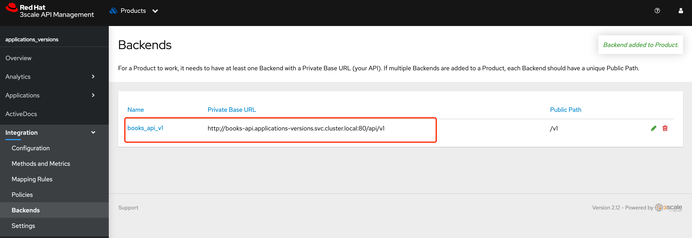

API 版本控制是一种在不破坏客户端代码的情况下，发布对API向后不兼容的变更的方法。常见的向后不兼容的例子是，删除了客户端里的一个字段，这样会导致客户端在读取被删除的字段时报错

常见的版本控制的方案有以下几种

* 将版本号作为URL中的一部分，或者放入URL查询参数中
* 在HTTP header 中添加版本号。可以自定义标头


# 目标

1. 为一个已经存在的product 配置一个新版本的后端
2. 创建一个mapping rule，允许访问新版本
3. 创建一个新的metrics来记录新版本的访问记录
4. 


# 试验前准备

## 部署应用和svc

```
oc new-project applications-versions

cat << EOF | oc apply -f -
apiVersion: apps/v1
kind: Deployment
metadata:
  creationTimestamp: null
  name: books-api-v2
spec:
  replicas: 1
  selector:
    matchLabels:
      app: books-api
      version: v2
  strategy: {}
  template:
    metadata:
      creationTimestamp: null
      labels:
        app: books-api
        version: v2
    spec:
      containers:
      - image: quay.io/redhattraining/3scale-books-api:2
        name: books-api
        ports:
        - containerPort: 8080
        resources: {}
EOF

# expose service 
oc expose deployment books-api-v2 --name=books-api --target-port=8080 --port=80

# 部署 tool
oc create deployment tools --image=quay.io/junkai/tools:jq

```


## 创建 product 以及相关资源

### 创建 product

创建名为 applications_versions product 


### 创建 application-plan

applications_versions_basic 


### 创建application 

| name                      | account   | product               | plan                        |
| ------------------------- | --------- | --------------------- | --------------------------- |
| applications_versions_app | Developer | applications_versions | applications_versions_basic |


### 创建backend


| name         | Private Base URL                                             |
| ------------ | ------------------------------------------------------------ |
| books_api_v1 | http://books-api.applications-versions.svc.cluster.local:80/api/v1 |


### 修改map rule

修改这里的路径为v1 


### 为product 关联 backend

为 product applications_versions 添加后端 books_api_v1




### 测试环境ready

promete APIcast 


执行以下命令，获取v1 版本 信息，可以正常获取

```
[root@bastion-infra ~]# curl "https://applications-versions-3scale-apicast-staging.apps.infra-cluster.example.com:443/v1/books/?user_key=ca91b019d249dc8cbff9983810f86cd1"  | jq
  % Total    % Received % Xferd  Average Speed   Time    Time     Time  Current
                                 Dload  Upload   Total   Spent    Left  Speed
100   248  100   248    0     0   4275      0 --:--:-- --:--:-- --:--:--  4275
[
  {
    "authorName": "Mary Shelley",
    "title": "Frankenstein",
    "copies": 10,
    "year": 1818
  },
  {
    "authorName": "Charles Dickens",
    "title": "A Christmas Carol",
    "copies": 5,
    "year": 1843
  },
  {
    "authorName": "Charles Dickens",
    "title": "Pride and Prejudice",
    "copies": 3,
    "year": 1813
  }
]
```


执行命令查看 v2 信息，显示  `No Mapping Rule matched`

```
[root@bastion-infra ~]# curl  "https://applications-versions-3scale-apicast-staging.apps.infra-cluster.example.com/v2/books?user_key=ca91b019d249dc8cbff9983810f86cd1"
No Mapping Rule matched[root@bastion-infra ~]#
```


# Demo


## 验证 v2 应用


## 部署backend v2

创建backend v2

| name             | private base url                                             |
| ---------------- | ------------------------------------------------------------ |
| books-backend-v2 | http://books-api.applications-versions.svc.cluster.local:80/api/v2 |


为product 添加新的 backends 


创建新的Metrics 

| Friendly name | System name | Unit |
| ------------- | ----------- | ---- |
| hits_v2       | hits_v2     | hit  |


创建新的map rule 

| Field                         | Value                       |
| ----------------------------- | --------------------------- |
| Verb                          | GET                         |
| Pattern                       | /v2                         |
| Method or Metric to increment | 选择 Metrics， 输入 hits_v2 |


## 验证

此时验证 v1 和 v2 两个链接都能正常工作，

```

curl  "https://applications-versions-3scale-apicast-staging.apps.infra-cluster.example.com/v1/books?user_key=ca91b019d249dc8cbff9983810f86cd1" | jq


curl  "https://applications-versions-3scale-apicast-staging.apps.infra-cluster.example.com/v2/books?user_key=ca91b019d249dc8cbff9983810f86cd1" | jq
```


同时可以查看Traffic，分别查看 两个版本的访问情况 


