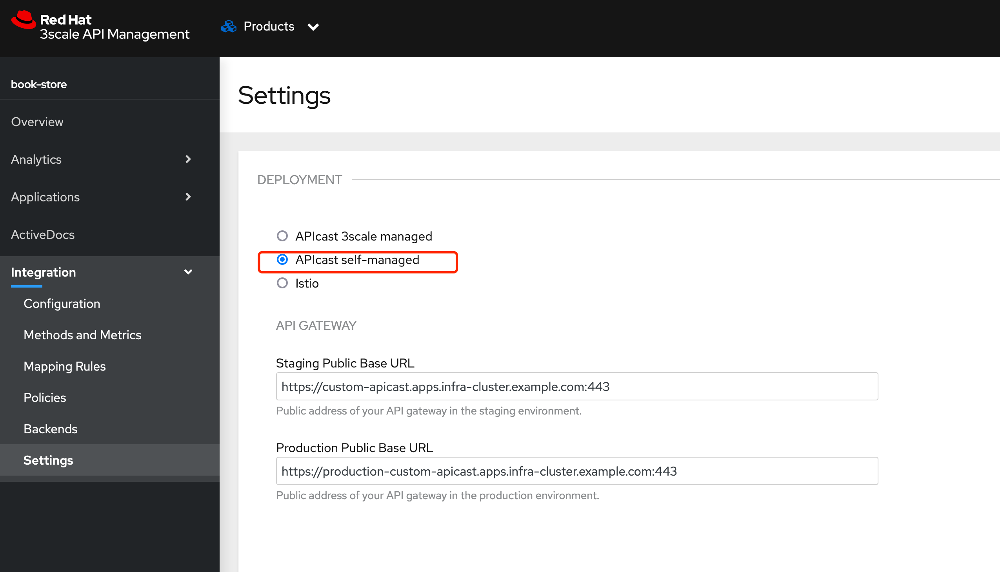

# 目标

1. 创建API cast


# 部署


```
 oc new-project my-apicast
 
```

部署 APIcast operator 


为 apicast 创建token

- **Name:** `myapicast`
- **Scopes:** `Account Management API`
- **Permission:** `Read Only`

> 注意： 创建完之后会生成的token及时保存下来，只会显示一次


创建 secret

```
# 使用上边生成的Token 创建 secret 

oc create secret generic apicast-secret \
--from-literal=AdminPortalURL=https://<ACCESS_TOKEN>@3scale-admin.apps.infra-cluster.example.com

```


创建 apicast 实例

```
apiVersion: apps.3scale.net/v1alpha1
kind: APIcast
metadata:
  name: custom-apicast
  namespace: my-apicast
spec:
  adminPortalCredentialsRef:
    name: apicast-secret
  deploymentEnvironment: staging
  exposedHost:
    host: custom-apicast.apps.infra-cluster.example.com
    tls:
    - {}
  resources:
    limits:
      cpu: '0'
      memory: 128Mi
  timezone: Asia/Shanghai
  replicas: 2

```


更新DEPLOYMENT 类型为APIcast self-managed

> 使用了 self-managed 之后，不能再继续使用之前的地址，所以需要同时为 staging 和 production 配置apicast 



# 部署测试环境 APIcast


## 创建apicast token

```
0c1bee804acb97450b4eb7afcf12f70d12de2acfe377c8950a8048c2350a0d09
```


# 部署生产 APICast

## 创建 production apicast token

按照上边的做法在3scale里创建token

创建 secret

```
oc create secret generic product-apicast-secret \
--from-literal=AdminPortalURL=https://d124a3410d03be2572a231917ce771366563e3cb8697de5dbe6635c6ba6dc094@3scale-admin.apps.infra-cluster.example.com

```


创建实例

```
apiVersion: apps.3scale.net/v1alpha1
kind: APIcast
metadata:
  name: product-apicast
  namespace: apicast
spec:
  adminPortalCredentialsRef:
    name: product-apicast-secret
  deploymentEnvironment: production
  exposedHost:
    host: production-custom-apicast.apps.infra-cluster.example.com
    tls:
    - {}
  resources:
    limits:
      cpu: '0'
      memory: 128Mi
  timezone: Asia/Shanghai
  replicas: 2
```

