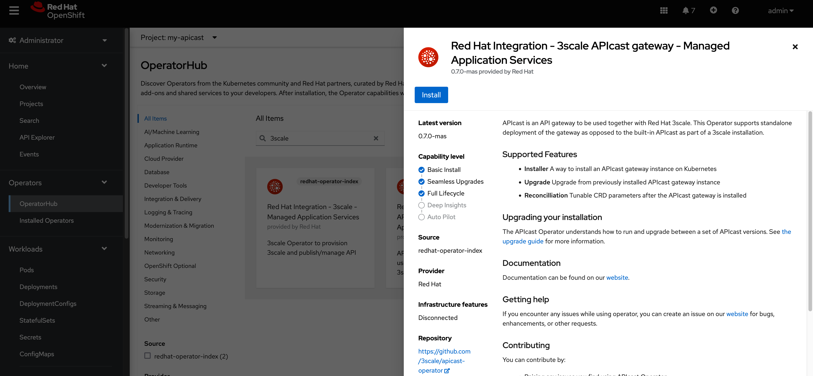
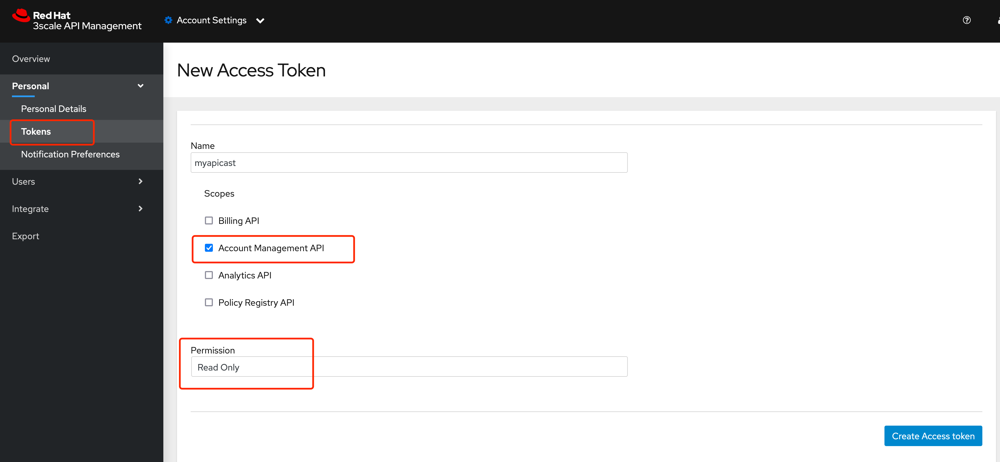

# 目标

1. 创建API cast


# 部署


```
 oc new-project my-apicast
 
```

部署 APIcast operator 




为 apicast 创建token

- **Name:** `myapicast`
- **Scopes:** `Account Management API`
- **Permission:** `Read Only`

> 注意： 创建完之后会生成的token及时保存下来，只会显示一次




创建 secret

```
# 使用上边生成的Token 创建 secret 

oc create secret generic apicast-secret \
--from-literal=AdminPortalURL=https://<ACCESS_TOKEN>@3scale-admin.apps.infra-cluster.example.com

```


创建 apicast 实例


```
apiVersion: apps.3scale.net/v1alpha1
kind: APIcast
metadata:
  name: custom-apicast
  namespace: my-apicast
spec:
  adminPortalCredentialsRef:
    name: apicast-secret
  deploymentEnvironment: staging
  exposedHost:
    host: custom-apicast.apps.infra-cluster.example.com
  resources:
    limits:
      cpu: '2'
      memory: 128Mi
  timezone: Asia/Shanghai
  replicas: 2

```

