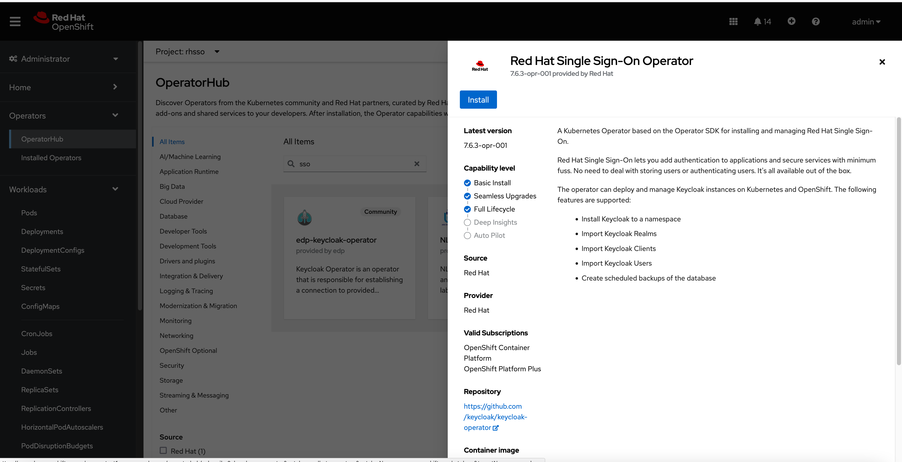
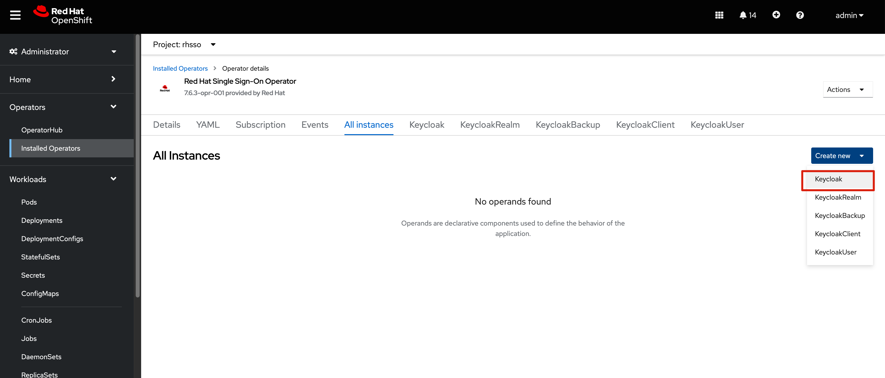
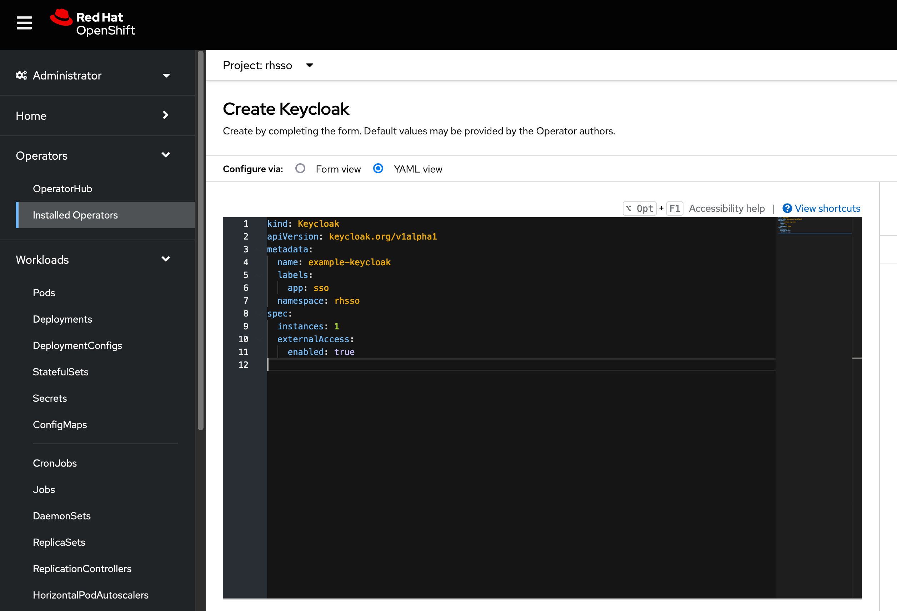

[TOC]


# install


安装 rhsso operator 




创建 instance 



直接使用默认值，创建实例




# 登陆console，配置

```
oc -n rhsso get secret \
  credential-example-keycloak --template={{.data.ADMIN_PASSWORD}} \
  | base64 -d ; echo

# 使用 admin/mJSED7GlKeOaHQ== 登陆 sso console
```


