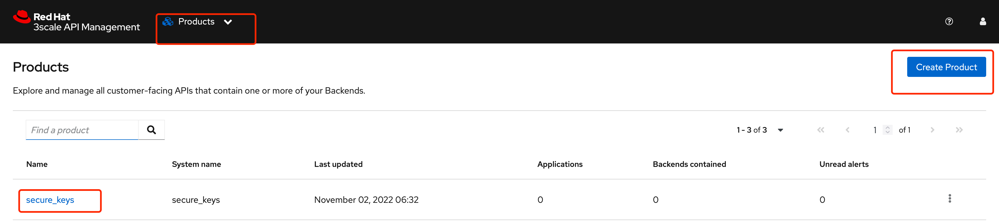
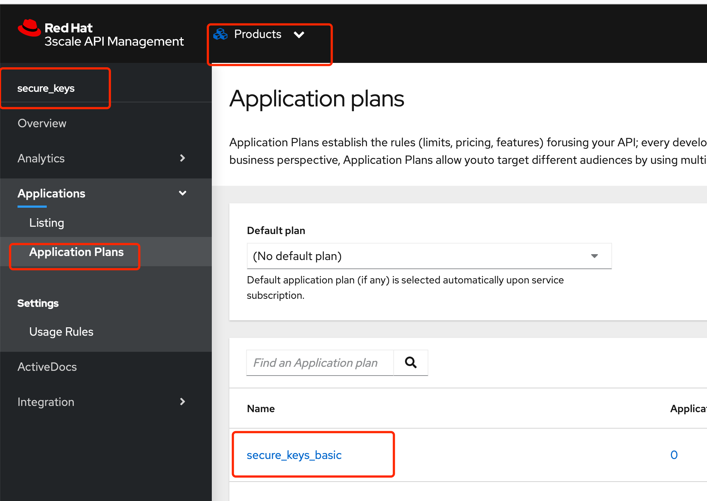
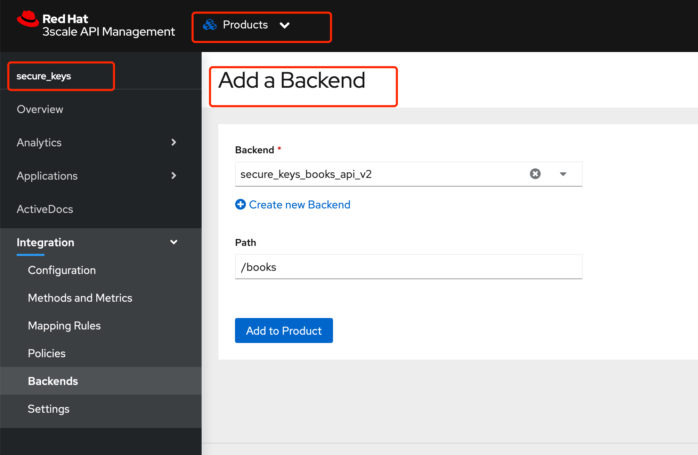
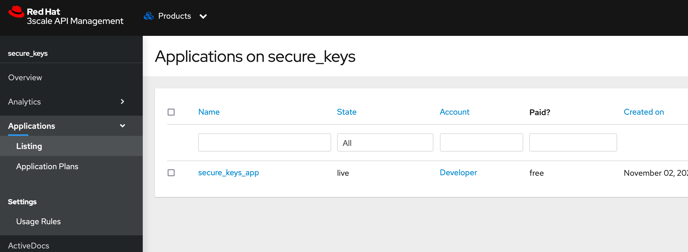
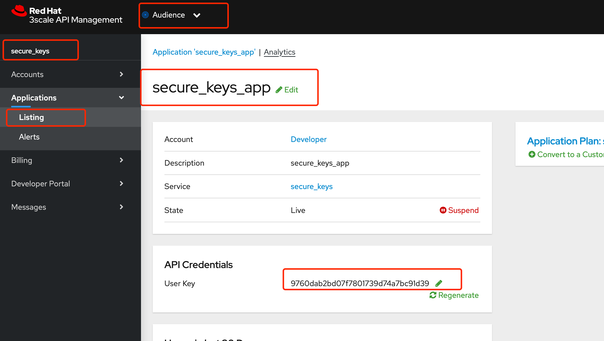
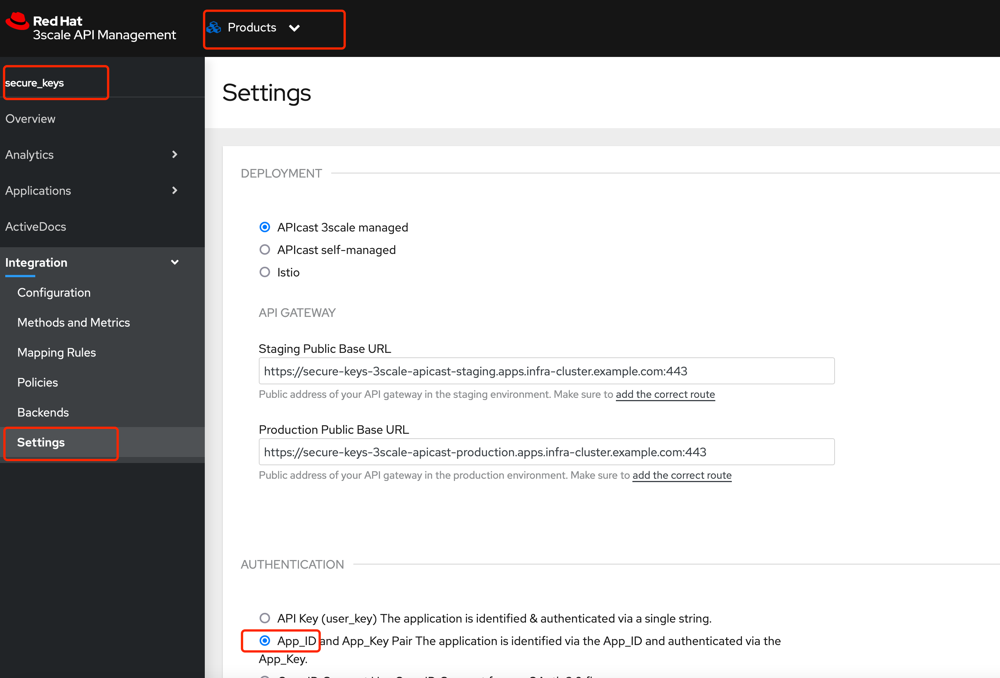
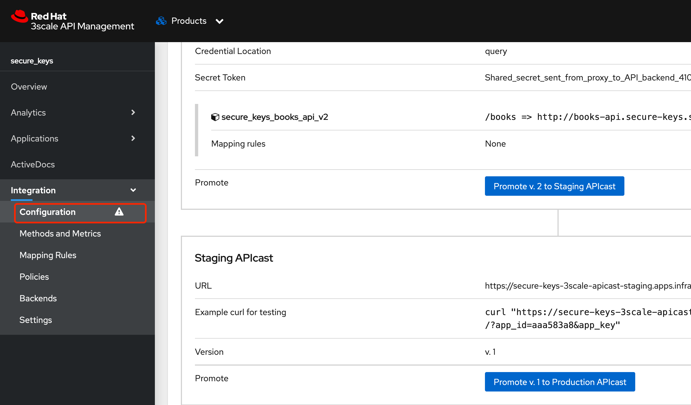
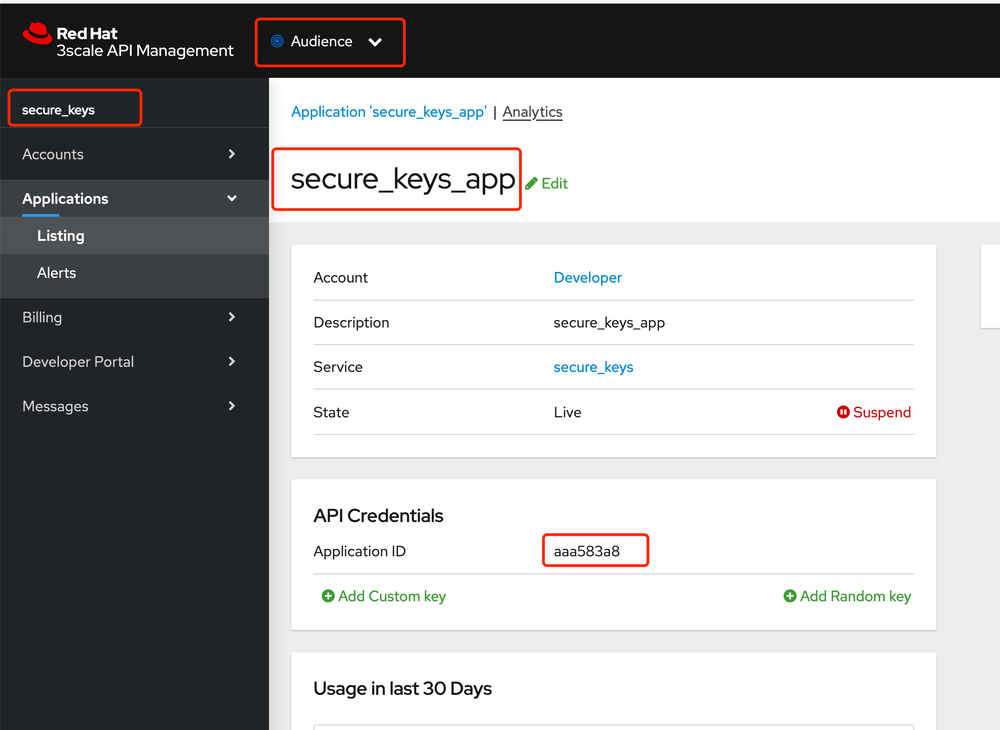
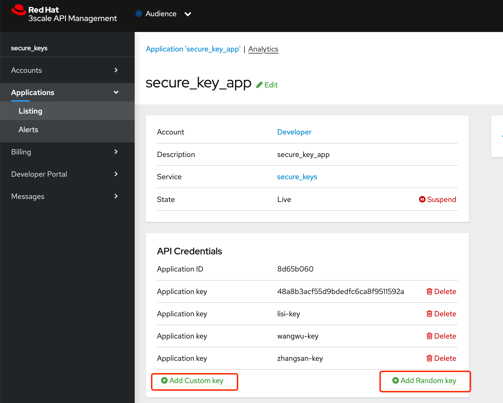

### 

# 环境初始化

## 部署应用

```

oc new-project secure-keys

oc create deploy books-api-v2 --image=quay.io/redhattraining/3scale-books-api:2 --port=8080 
oc expose deployment books-api-v2 --name=books-api --target-port=8080 --port=80

# 部署测试tools， 验证服务
oc create deployment tools --image=quay.io/junkai/tools:jq

oc rsh tools-7587988746-drgn8

curl http://books-api.secure-keys.svc.cluster.local:80/api/v2/books 

```


## 创建product 和 application plan

创建 名为 secure_keys 的product




创建名为secure_key_basic 的application plan 




## 创建Backend

按照以下参数创建Backend

| Name                     | System name              | Private base URL                                             |
| ------------------------ | ------------------------ | ------------------------------------------------------------ |
| secure_keys_books_api_v2 | secure_keys_books_api_v2 | http://books-api.secure-keys.svc.cluster.local:80/api/v2/books |


## 为product 添加backend





# Demo

## 通过APIkey 通信


### 环境检查

检查 product 和对应的application plan 没有关联的application

```
[root@bastion-infra ~]# 3scale application list 3scale-tenant \
  --plan=secure_keys_basic --service=secure_keys
ID	NAME	STATE	ENABLED	ACCOUNT_ID	SERVICE_ID	PLAN_ID
[root@bastion-infra ~]#
```


### 创建应用

```
[root@bastion-infra ~]# 3scale application create 3scale-tenant \
>   john secure_keys secure_keys_basic secure_keys_app
Created application id: 9
```

同时可以在web上看到，创建除了新的application 




### 获取 secure_key_app user key

```
[root@bastion-infra ~]# API_KEY=$(3scale application show 3scale-tenant 9 \
>   -o json | jq -r '.user_key')
[root@bastion-infra ~]# echo $API_KEY
9760dab2bd07f7801739d74a7bc91d39
```

或者通过web获取 




### 测试结果


```
curl -k "https://secure-keys-3scale-apicast-staging.apps.infra-cluster.example.com:443/books?user_key=$API_KEY" | jq

```


## 通过API key-ID pair 通信

### 修改认证方式

1. 选择 Product->secure_keys->integration->settings ， 在AUTHENTICATION 中选择 App_ID 
2. 页面滚动到最后，点击 update product 




此时配置变化，configuration 会产生提示信息，点击右侧promote 将api 发布到staging 环境中 




此时继续执行之前的命令，结果如下所示，此时之前的链接已经无效

```
[root@bastion-infra ~]# curl -k "https://secure-keys-3scale-apicast-staging.apps.infra-cluster.example.com:443/books?user_key=$API_KEY"
Authentication parameters missing[root@bastion-infra ~]#
```


### 获取 APP_ID

```
# 这里的 9 是 application ID 
API_ID=$(3scale application show 3scale-tenant 9 \
  -o json | jq -r '.application_id')
  
[root@bastion-infra ~]# echo $API_ID
aaa583a8
```

或者，可以通过web获取APP ID 




### 使用app_id 访问应用 

```
curl -k "https://secure-keys-3scale-apicast-staging.apps.infra-cluster.example.com:443/books?app_key=$API_KEY&app_id=$API_ID"| jq
```


## 添加 application key

key pair 模式可以自定义 key， 最多同时有5个key



