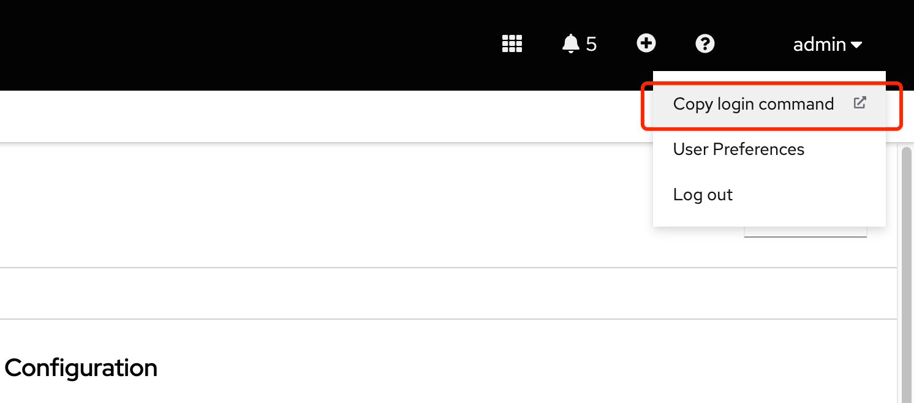
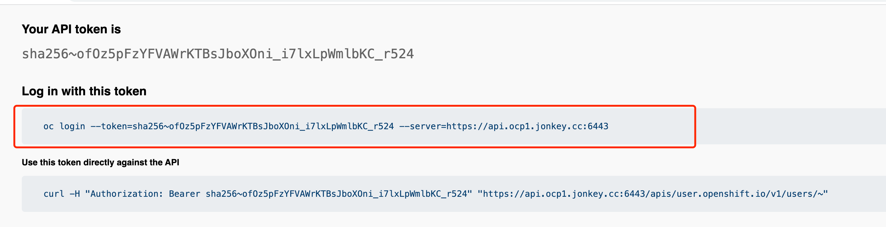
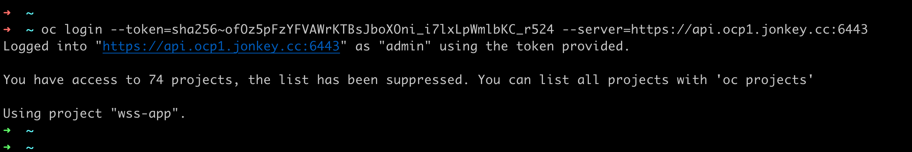
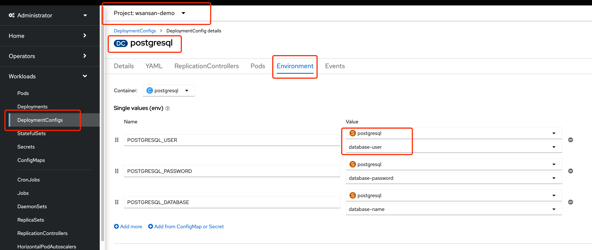
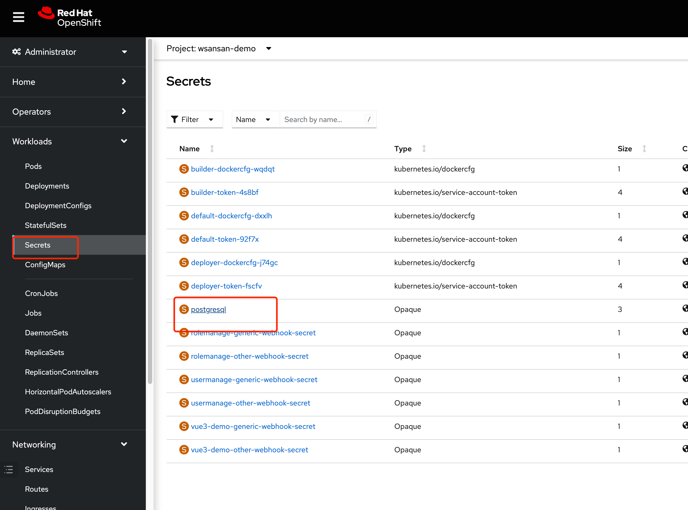
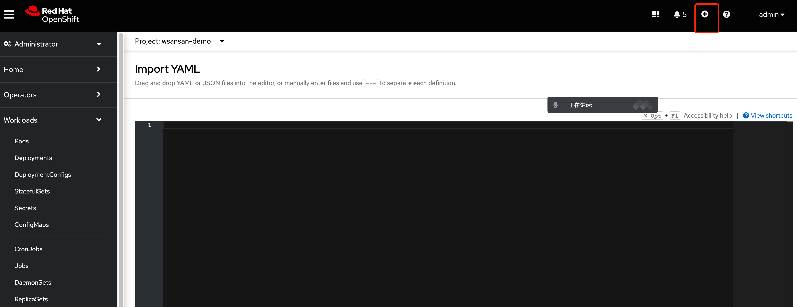
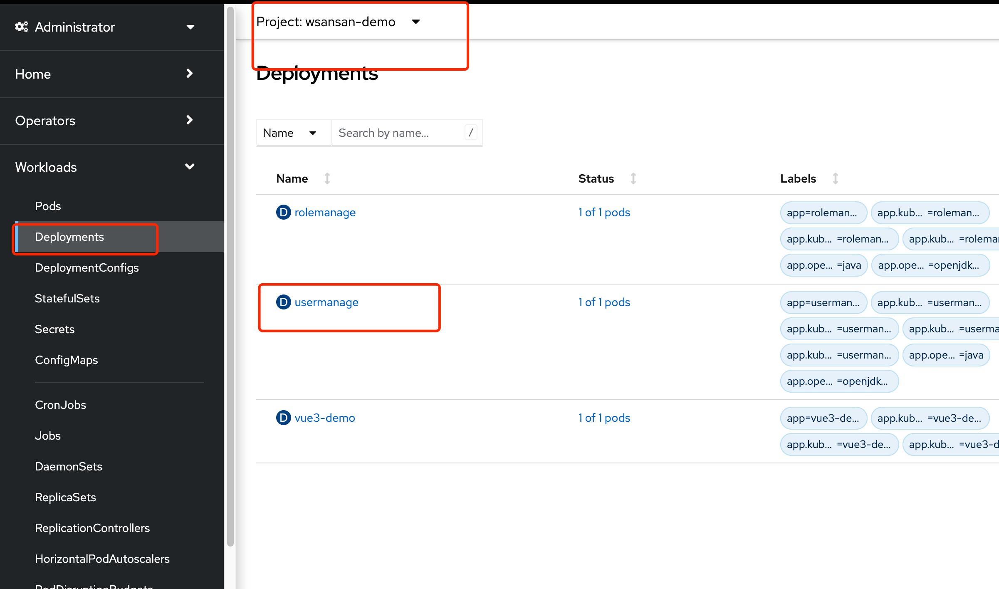
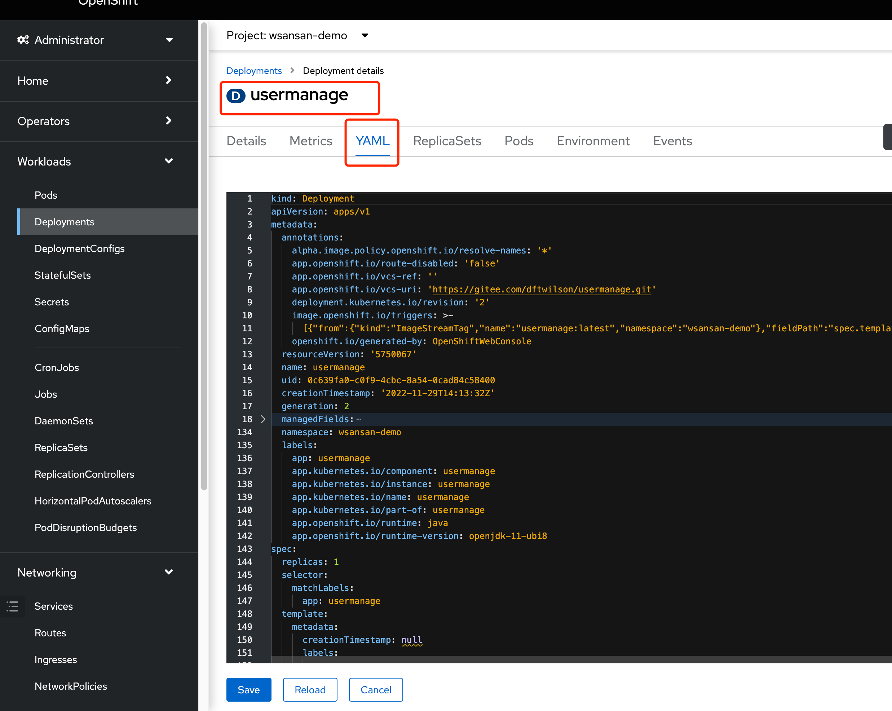
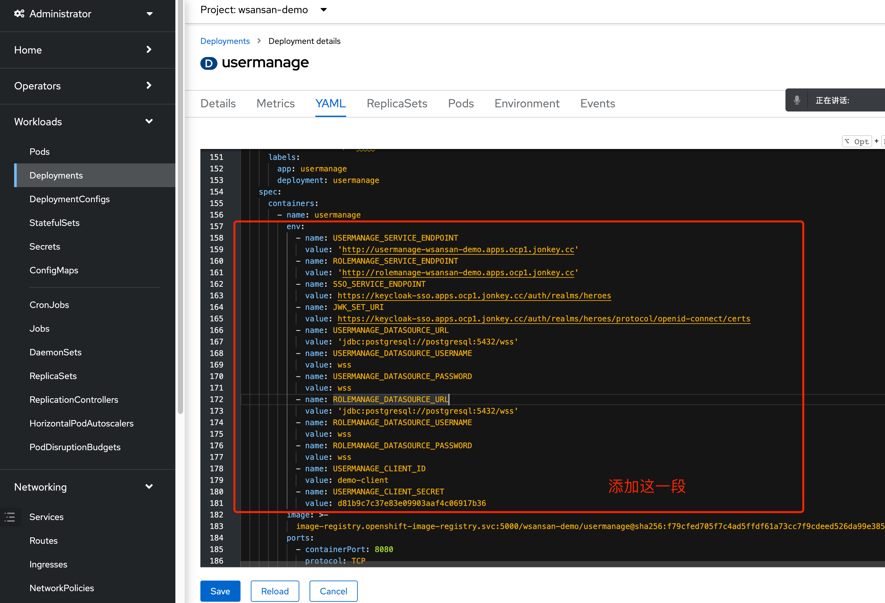
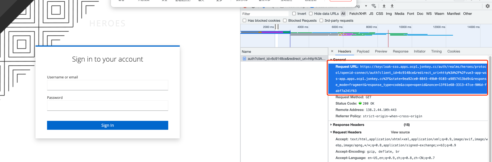

# 环境准备


## 命令行 登陆 ocp 








直接执行即可登陆 




## 应用构建


## postgresql


### 部署 postgresql 

```

# 确认是在 wsansan-demo project 下
➜  ~ oc project
Using project "wsansan-demo" on server "https://api.ocp1.jonkey.cc:6443".
➜  ~
# 创建 postgresql  
➜  ~ oc new-app --name=postgresql --template=postgresql-ephemeral
--> Deploying template "openshift/postgresql-ephemeral" to project wsansan-demo

     PostgreSQL (Ephemeral)
     ---------
     PostgreSQL database service, without persistent storage. For more information about using this template, including OpenShift considerations, see https://github.com/sclorg/postgresql-container/.

     WARNING: Any data stored will be lost upon pod destruction. Only use this template for testing

     The following service(s) have been created in your project: postgresql.

            Username: userLV1
            Password: 8BXFlfJlRisegtsq
       Database Name: sampledb
      Connection URL: postgresql://postgresql:5432/

     For more information about using this template, including OpenShift considerations, see https://github.com/sclorg/postgresql-container/.

     * With parameters:
        * Memory Limit=512Mi
        * Namespace=openshift
        * Database Service Name=postgresql
        * PostgreSQL Connection Username=userLV1 # generated
        * PostgreSQL Connection Password=8BXFlfJlRisegtsq # generated
        * PostgreSQL Database Name=sampledb
        * Version of PostgreSQL Image=10-el8

--> Creating resources ...
    secret "postgresql" created
    service "postgresql" created
    deploymentconfig.apps.openshift.io "postgresql" created
--> Success
    Application is not exposed. You can expose services to the outside world by executing one or more of the commands below:
     'oc expose service/postgresql'
    Run 'oc status' to view your app.
```


### 配置 postgresql


```
# 进入 postgresql 内部
➜  ~ oc rsh postgresql-1-6cjvm
sh-4.4$ psql
psql (10.21)
Type "help" for help.

postgres=# \l
                                 List of databases
   Name    |  Owner   | Encoding |  Collate   |   Ctype    |   Access privileges
-----------+----------+----------+------------+------------+-----------------------
 postgres  | postgres | UTF8     | en_US.utf8 | en_US.utf8 |
 sampledb  | userLV1  | UTF8     | en_US.utf8 | en_US.utf8 |
 template0 | postgres | UTF8     | en_US.utf8 | en_US.utf8 | =c/postgres          +
           |          |          |            |            | postgres=CTc/postgres
 template1 | postgres | UTF8     | en_US.utf8 | en_US.utf8 | =c/postgres          +
           |          |          |            |            | postgres=CTc/postgres
(4 rows)
#  创建 wss 数据库 
postgres=# CREATE DATABASE wss;
CREATE DATABASE
postgres=# \l
                                 List of databases
   Name    |  Owner   | Encoding |  Collate   |   Ctype    |   Access privileges
-----------+----------+----------+------------+------------+-----------------------
 postgres  | postgres | UTF8     | en_US.utf8 | en_US.utf8 |
 sampledb  | userLV1  | UTF8     | en_US.utf8 | en_US.utf8 |
 template0 | postgres | UTF8     | en_US.utf8 | en_US.utf8 | =c/postgres          +
           |          |          |            |            | postgres=CTc/postgres
 template1 | postgres | UTF8     | en_US.utf8 | en_US.utf8 | =c/postgres          +
           |          |          |            |            | postgres=CTc/postgres
 wss       | postgres | UTF8     | en_US.utf8 | en_US.utf8 |
(5 rows)

postgres=#
postgres=#
postgres=# \c wss
You are now connected to database "wss" as user "postgres".
wss=# \dt
Did not find any relations.
wss=#
wss=#
wss=# 

创建数据库表 并导入数据
wss=# CREATE TABLE IF NOT EXISTS person (
wss(# id serial PRIMARY KEY,
wss(# name varchar(200) UNIQUE NOT NULL,
wss(# password varchar(200) NOT NULL,
wss(# created timestamp NOT NULL,
wss(# role_id integer NOT NULL
wss(# );
CREATE TABLE
wss=#
wss=#
wss=# CREATE TABLE IF NOT EXISTS role (
wss(# id serial PRIMARY KEY,
wss(# name varchar(200) UNIQUE NOT NULL,
wss(# descri varchar(200),
wss(# isdefault varchar(200)
wss(# );
CREATE TABLE
wss=#
wss=# CREATE TABLE IF NOT EXISTS user_role (
wss(# id serial PRIMARY KEY,
wss(# rolename varchar(200)  NOT NULL,
wss(# author_id integer NOT NULL
wss(# );
CREATE TABLE
wss=#
wss=#
wss=#
wss=# insert into person (id,name,password,created,role_id) values (1,'wang','123456','2022-01-01',2);
INSERT 0 1
wss=# insert into person (id,name,password,created,role_id) values (2,'zhang','123456','2022-01-01',2);
INSERT 0 1
wss=# insert into role (id,name,descri,isdefault) values (1,'admin','系统管理','0');
INSERT 0 1
wss=# insert into role (id,name,descri,isdefault) values (2,'user','普通用户','1');
INSERT 0 1
wss=# insert into role (id,name,descri,isdefault) values (3,'customer','客户合作商','0');
INSERT 0 1
wss=# insert into role (id,name,descri,isdefault) values (4,'manager','业务经理','0');
INSERT 0 1
wss=# insert into user_role (id,rolename,author_id) values (1,'user',1);
INSERT 0 1
wss=# insert into user_role (id,rolename,author_id) values (2,'user',2);
INSERT 0 1
wss=#
wss=# \dt
           List of relations
 Schema |   Name    | Type  |  Owner
--------+-----------+-------+----------
 public | person    | table | postgres
 public | role      | table | postgres
 public | user_role | table | postgres
(3 rows)
wss=# select * from person;
 id | name  | password |       created       | role_id
----+-------+----------+---------------------+---------
  1 | wang  | 123456   | 2022-01-01 00:00:00 |       2
  2 | zhang | 123456   | 2022-01-01 00:00:00 |       2
(2 rows)
```


### 获取 postgresql 账号信息

按照下图所示，找到 postgresql secret 







修改 postgresql 里边的值，可以先把这个secret 删掉，然后按照下图方法添加secret，重新生成




```
kind: Secret
apiVersion: v1
metadata:
  name: postgresql
  labels:
    template: postgresql-persistent-template
    template.openshift.io/template-instance-owner: 12dfa81d-976e-4e49-a16d-2c4520231ea4
  annotations:
    template.openshift.io/expose-database_name: '{.data[''database-name'']}'
    template.openshift.io/expose-password: '{.data[''database-password'']}'
    template.openshift.io/expose-username: '{.data[''database-user'']}'
data:
  database-name: d3Nz
  database-password: d3Nz
  database-user: d3Nz
type: Opaque

```


## 配置 usemanage 环境变量 











插入内容如下

```

          env:
            - name: USERMANAGE_SERVICE_ENDPOINT
              value: 'http://usermanage-wsansan-demo.apps.ocp1.jonkey.cc'
            - name: ROLEMANAGE_SERVICE_ENDPOINT
              value: 'http://rolemanage-wsansan-demo.apps.ocp1.jonkey.cc'
            - name: SSO_SERVICE_ENDPOINT
              value: https://keycloak-sso.apps.ocp1.jonkey.cc/auth/realms/heroes
            - name: JWK_SET_URI
              value: https://keycloak-sso.apps.ocp1.jonkey.cc/auth/realms/heroes/protocol/openid-connect/certs
            - name: USERMANAGE_DATASOURCE_URL
              value: 'jdbc:postgresql://postgresql:5432/wss'
            - name: USERMANAGE_DATASOURCE_USERNAME
              value: wss
            - name: USERMANAGE_DATASOURCE_PASSWORD
              value: wss
            - name: ROLEMANAGE_DATASOURCE_URL
              value: 'jdbc:postgresql://postgresql:5432/wss'
            - name: ROLEMANAGE_DATASOURCE_USERNAME
              value: wss
            - name: ROLEMANAGE_DATASOURCE_PASSWORD
              value: wss
            - name: USERMANAGE_CLIENT_ID
              value: demo-client
            - name: USERMANAGE_CLIENT_SECRET
              value: d81b9c7c37e83e09903aaf4c06917b36

```


## 访问应用





