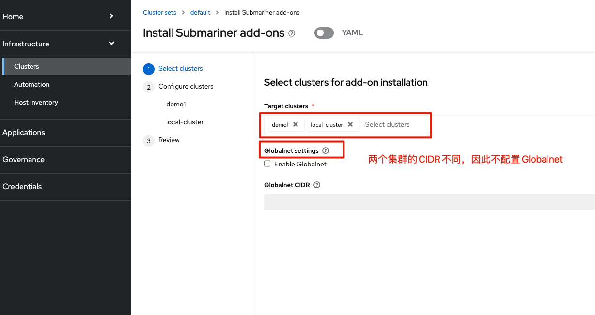

# 安装





# 配置


## 获取 subctl commands 

按照以下步骤，获取 subctl 命令

```
podman login registry.redhat.io

oc image extract registry.redhat.io/rhacm2/subctl-rhel8:v0.14 --path="/dist/subctl-v0.14*-linux-amd64.tar.xz":/tmp/ --confirm
tar -C /tmp/ -xf /tmp/subctl-v0.14*-linux-amd64.tar.xz

sudo mv /tmp/subctl-v0.14.5/subctl-v0.14.5-linux-amd64 /usr/local/sbin/subctl
```


