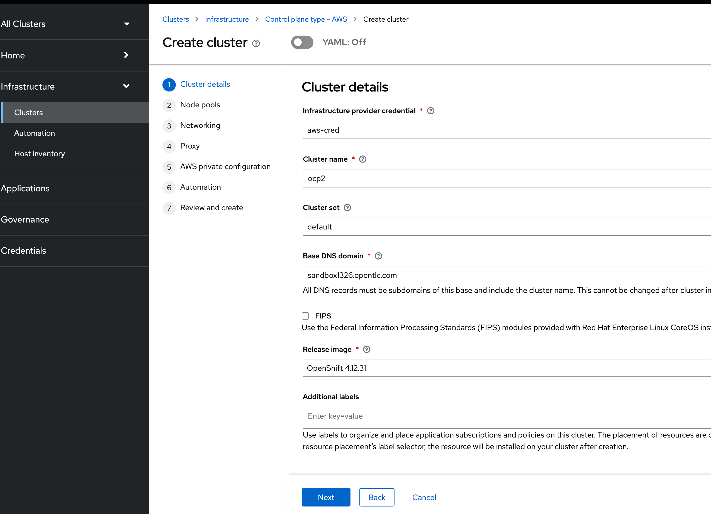

# 目标

1. 验证submariner 模式


# 安装测试集群

## 安装测试集群ocp1


## 安装测试集群ocp2





# 安装


执行以下命令，为节点添加 label，gateway pod 会部署在打了label的node上，否则无法部署

```
oc label node worker3.test5.ocp.example.com submariner.io/gateway=true

oc label node worker3.test6.ocp.example.com submariner.io/gateway=true
```

部署成功后


# 配置


## 获取 subctl commands 

按照以下步骤，获取 subctl 命令

```
podman login registry.redhat.io

oc image extract registry.redhat.io/rhacm2/subctl-rhel8:v0.14 --path="/dist/subctl-v0.14*-linux-amd64.tar.xz":/tmp/ --confirm
tar -C /tmp/ -xf /tmp/subctl-v0.14*-linux-amd64.tar.xz

sudo mv /tmp/subctl-v0.14.5/subctl-v0.14.5-linux-amd64 /usr/local/sbin/subctl
```


# Demo

##  跨集群直接通过pod ip 访问

1. 在test5集群部署应用hello
2. 在test6集群上部署tools pod
3. 通过test6集群上的tools pod 直接访问test5集群上的hello pod的ip
4. 可以正常访问

```

# on test5
oc new-project hello-demo

oc create deployment hello-server --image=quay.io/junkai/demo:1.0
oc expose deployment hello-server --port=8080

[root@bastion-test5 ~]# oc get pod -o wide
NAME                            READY   STATUS    RESTARTS   AGE   IP            NODE                            NOMINATED NODE   READINESS GATES
hello-server-8556688746-5t2b5   1/1     Running   0          66s   10.128.2.61   worker2.test5.ocp.example.com   <none>           <none>

这里可以看到在test5 cluster 上 pod 的ip为 10.128.2.61

# test6 cluster
在test6 部署 tools pod 执行curl 
oc new-project tools
oc create deployment tools --image=quay.io/junkai/tools

[root@bastion-test6 ~]# oc get pod -o wide
NAME                     READY   STATUS    RESTARTS   AGE   IP            NODE                            NOMINATED NODE   READINESS GATES
tools-65dbb597c4-fx882   1/1     Running   0          61s   10.133.2.99   worker1.test6.ocp.example.com   <none>           <none>
[root@bastion-test6 ~]#
[root@bastion-test6 ~]#
[root@bastion-test6 ~]# oc rsh tools-65dbb597c4-fx882
sh-4.4$ curl 10.128.2.61:8080
Hello, world!
Version: 1.0.0
Hostname: hello-server-8556688746-5t2b5

```


## 跨集群访问


```
# test5 cluster 

[root@bastion-test5 ~]# subctl export service --namespace hello-demo hello-server
 ✓ Service exported successfully
```


### ocp1 部署服务

```
oc new-project cross-site
oc create deployment hello-world-frontend --image quay.io/jonkey/skupper/hello-world-frontend:20230225 
oc expose deployment hello-world-frontend --port 8080 
oc expose svc hello-world-frontend
oc set env deployment hello-world-frontend BACKEND_SERVICE_HOST_="hello-world-backend.cross-site.svc.clusterset.local"
oc set env deployment hello-world-frontend BACKEND_SERVICE_PORT_="8080"

oc get route 

oc create deployment hello-world-backend --image quay.io/jonkey/skupper/hello-world-backend:20230225 
oc expose deployment hello-world-backend --port 8080 

cat <<EOF | oc apply -f -
apiVersion: multicluster.x-k8s.io/v1alpha1
kind: ServiceExport
metadata:
  name: hello-world-backend
  namespace: cross-site
EOF

```


### ocp2 部署服务


```
# ocp32 cluster 
oc new-project cross-site
oc create deployment hello-world-backend --image quay.io/jonkey/skupper/hello-world-backend:20230225 
oc expose deployment hello-world-backend --port 8080 


cat <<EOF | oc apply -f -
apiVersion: multicluster.x-k8s.io/v1alpha1
kind: ServiceExport
metadata:
  name: hello-world-backend
  namespace: cross-site
EOF


```


### 访问测试


