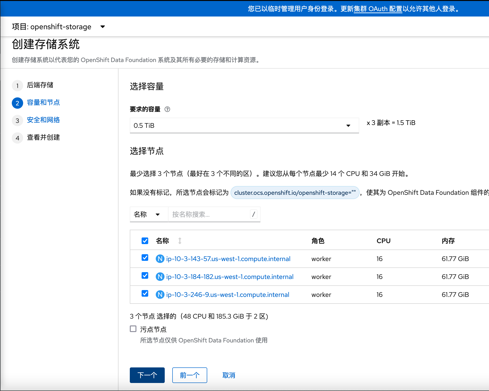

# 目标

做一个 ODF DR 的demo


# 试验环境

OCP4.11 


本试验参考该[教程](https://red-hat-storage.github.io/ocs-training/training/ocs4/odf411-multisite-ramen.html#_verify_managed_clusters_have_non_overlapping_networks)


# 准备工作


## 安装ACM


### 创建MultiClusterHub


```
apiVersion: operator.open-cluster-management.io/v1
kind: MultiClusterHub
metadata:
  name: multiclusterhub
  namespace: open-cluster-management
spec:
  disableHubSelfManagement: true
```


## 安装 OCP1 集群

通过ACM安装OCP1


需要安装ODF，因此需要选择内存大一些的Worker节点


规划容器网络IP


## 安装OCP2 集群


与ocp1 的网络区别开来


## 安装ODF





### 验证安装成功

分别在ocp1 和 ocp2上验证安装ODF成功

```
# 检查ODF状态
oc get storagecluster -n openshift-storage ocs-storagecluster -o jsonpath='{.status.phase}{"\n"}'

# 检查 Multi-Cluster Gateway（MCG）状态
oc get noobaa -n openshift-storage noobaa -o jsonpath='{.status.phase}{"\n"}'

```


## 验证容器网络IP没有重叠

由于使用到了submariner来进行集群间的连接，所以需要保证集群之间的网络不能重叠，通过以下命令进行检查

ocp1 

```
[root@ocp1-bastion-node ~]# oc get networks.config.openshift.io cluster -o json | jq .spec


{
  "clusterNetwork": [
    {
      "cidr": "10.1.0.0/16",
      "hostPrefix": 23
    }
  ],
  "externalIP": {
    "policy": {}
  },
  "networkType": "OpenShiftSDN",
  "serviceNetwork": [
    "10.2.0.0/16"
  ]
}
```

ocp2 

```
[root@ocp2-bastion-node ~]# oc get networks.config.openshift.io cluster -o json | jq .spec

{
  "clusterNetwork": [
    {
      "cidr": "10.4.0.0/16",
      "hostPrefix": 23
    }
  ],
  "externalIP": {
    "policy": {}
  },
  "networkType": "OpenShiftSDN",
  "serviceNetwork": [
    "10.5.0.0/16"
  ]
}
```


## 通过submariner 连接两个集群


### 创建新的 clusterset 


### 安装submariner 插件


## 安装 ODF Multicluster Orchestrator Operator


在  ACM Hub 集群上 安装  ODF Multicluster Orchestrator


安装 ODF Multicluster Orchestrator的时候，会自动安装Openshift DR Hub Operator 


```
[lab-user@bastion ~]$ oc get pods -n openshift-operators
NAME                                        READY   STATUS    RESTARTS   AGE
odf-multicluster-console-789b7c7f4b-2n6tr   1/1     Running   0          2m38s
odfmo-controller-manager-65b46797bb-5h2ds   1/1     Running   0          2m38s
ramen-hub-operator-799f695d5c-tf8z5         2/2     Running   0          2m34s
```


## 在S3之间配置 SSL 访问


在ocp1集群执行 以下命令，获取 ingress 证书


```
oc get cm default-ingress-cert -n openshift-config-managed -o jsonpath="{['data']['ca-bundle\.crt']}" > primary.crt
```


在 ocp2集群执行以下命令，获取ingress整数

```
oc get cm default-ingress-cert -n openshift-config-managed -o jsonpath="{['data']['ca-bundle\.crt']}" > secondary.crt
```


将上边输出的内容copy出来，按照以下格式进行填写

```
apiVersion: v1
data:
  ca-bundle.crt: |
    -----BEGIN CERTIFICATE-----
    <copy contents of cert1 from primary.crt here>
    -----END CERTIFICATE-----

    -----BEGIN CERTIFICATE-----
    <copy contents of cert2 from primary.crt here>
    -----END CERTIFICATE-----

    -----BEGIN CERTIFICATE-----
    <copy contents of cert3 primary.crt here>
    -----END CERTIFICATE----

    -----BEGIN CERTIFICATE-----
    <copy contents of cert1 from secondary.crt here>
    -----END CERTIFICATE-----

    -----BEGIN CERTIFICATE-----
    <copy contents of cert2 from secondary.crt here>
    -----END CERTIFICATE-----

    -----BEGIN CERTIFICATE-----
    <copy contents of cert3 from secondary.crt here>
    -----END CERTIFICATE-----
kind: ConfigMap
metadata:
  name: user-ca-bundle
  namespace: openshift-config
```

生成cm-clusters-crt.yaml 文件， 分别在 hub集群，ocp1，ocp2上执行以下命令 `oc create -f cm-clusters-crt.yaml`

```
apiVersion: v1
data:
  ca-bundle.crt: |
    -----BEGIN CERTIFICATE-----
    MIIDiTCCAnGgAwIBAgIIWJk/ua0Xq08wDQYJKoZIhvcNAQELBQAwJjEkMCIGA1UE
    AwwbaW5ncmVzcy1vcGVyYXRvckAxNjg3ODU2NTU4MB4XDTIzMDYyNzA5MDIzOVoX
    DTI1MDYyNjA5MDI0MFowNDEyMDAGA1UEAwwpKi5hcHBzLm9jcDEucnA2ZmIuc2Fu
    ZGJveDI1OTMub3BlbnRsYy5jb20wggEiMA0GCSqGSIb3DQEBAQUAA4IBDwAwggEK
    AoIBAQCe4ywhBN05SMsPPaMOB7kGARqsE25Q6twuLZPJMoM99xDlgGE4EgM1ckzY
    95kagiXMOs4abPEJHkOTDBBCfTj1NcHwpJNzqBfW2j30LSRPGrDkVSlB+M7ZrDju
    mE4Yw5KOvOjABqTetazHNXInNipDNUhxvdD5EHs+WRHuMsxhcQ2R4WHUBAjeoUNH
    ohnTRKF9w8KA69X4KbQprbm4wcTdIRT88+XVIcyVw7Edy8eoZXZNSbNqQfon27Fl
    e4tL52R0IjV4F6ufPQv4KDBm08DhqJ7CGppNPJkKiav3GnzB1gqkj2pQtjAm+qv/
    /YF6QRAnXlLNDPV+++0WRHCaxCAdAgMBAAGjgawwgakwDgYDVR0PAQH/BAQDAgWg
    MBMGA1UdJQQMMAoGCCsGAQUFBwMBMAwGA1UdEwEB/wQCMAAwHQYDVR0OBBYEFGDK
    uovm74qkWG6YgZTE6mz8xnPAMB8GA1UdIwQYMBaAFLxhH154S9EOIsnwBu6EU/FG
    Axq/MDQGA1UdEQQtMCuCKSouYXBwcy5vY3AxLnJwNmZiLnNhbmRib3gyNTkzLm9w
    ZW50bGMuY29tMA0GCSqGSIb3DQEBCwUAA4IBAQARdi3u6Tp1RRRfCrX1WNCenNA3
    b2szpunFMrFE8Oe784X9zJkCSQo29fKi+yMUH39Fc3KOMayslliofs5NvL5kD3cD
    EaM9x/D0p2uSj68jYLZ4sRVUCQuvrSB92biwdtaFdZ6A3INaCqFAPiZbfHhFYKVg
    2HF5cKIs2G6YAKdirfyebtnaasFEOrGk/jzAamEgf/mfK1/atsNbD2phXcchkfkV
    ihJUfcv5wByt1TcnE2YZoO5S86UxTX3RFg92/66/4h51o++NpSfrs+SbaDVjLCJE
    g7iQrHVtv8YJ9vjaf1Tb2TXdjB8bKqcUOH546qs1TE8poYqUm1kboKVUXNRv
    -----END CERTIFICATE-----
    -----BEGIN CERTIFICATE-----
    MIIDDDCCAfSgAwIBAgIBATANBgkqhkiG9w0BAQsFADAmMSQwIgYDVQQDDBtpbmdy
    ZXNzLW9wZXJhdG9yQDE2ODc4NTY1NTgwHhcNMjMwNjI3MDkwMjM4WhcNMjUwNjI2
    MDkwMjM5WjAmMSQwIgYDVQQDDBtpbmdyZXNzLW9wZXJhdG9yQDE2ODc4NTY1NTgw
    ggEiMA0GCSqGSIb3DQEBAQUAA4IBDwAwggEKAoIBAQDCEUoKxXD4kZcA8MEsQKRE
    ROd9W9KSYlati/Dtv/UJlS3uxJSKvM69VESXO4qTp6EI7ILCDNocfS3/NEvExJuU
    NZsFFqffkOs71aCPkFvTtN9BT1sAhIvzrKJO+W9nY5RHHoRT/nFQLpNJRCytgkLK
    vREVbd28wObu2naeuQ7Cq0bEBXmSHnEKEDflkoTEDjCZSmYq9Ct8lOgsi0dLsXD7
    1QRrNeNC438pgHAs76ya8512wMsg5qEnKJLcLx4mGU71Fo2Q8Uzx1zNCplLARcj2
    3l+CmLCxaW8ajBjfuzIN8OTujJae7qvODDNmdlxoKAyn91IAWOMZD9Wo1itmq7nf
    AgMBAAGjRTBDMA4GA1UdDwEB/wQEAwICpDASBgNVHRMBAf8ECDAGAQH/AgEAMB0G
    A1UdDgQWBBS8YR9eeEvRDiLJ8AbuhFPxRgMavzANBgkqhkiG9w0BAQsFAAOCAQEA
    Bco4qMdBWD4NQcdnqwpuc12NoCeozYu0LqfFsX7eQHMXeGj8Z27pnn9IHLWYSzwD
    rv/4ZlOHxk1JGKOtXiKQPnAxi2iS4ftcVz7Nf6VQ9EpjW7q1ck+i/4Z3b488XoGN
    L5B5Hicpuep8RFRYKP2PpS2oo1fRiuL+Tu2ItDESqe/lsfwbaI+jD3WsZVtTdNFm
    xpka3GlDLZMklbJGkf5Or8eZ6bsqywTRB4AiasNmeVezUfbljlrH5S1+t8ou6GP2
    nucsPLMrm+V1S/InY1MY7vDedRObz8l7pc6omAgIXM6vVSdrJAVx9//vGSbmhOWL
    EyNGGMVYQU/GndG4xrfYhg==
    -----END CERTIFICATE-----
    -----BEGIN CERTIFICATE-----
    MIIDiTCCAnGgAwIBAgIIC1KGEaBYccYwDQYJKoZIhvcNAQELBQAwJjEkMCIGA1UE
    AwwbaW5ncmVzcy1vcGVyYXRvckAxNjg3ODU2ODA5MB4XDTIzMDYyNzA5MDY0OVoX
    DTI1MDYyNjA5MDY1MFowNDEyMDAGA1UEAwwpKi5hcHBzLm9jcDIucnA2ZmIuc2Fu
    ZGJveDI1OTMub3BlbnRsYy5jb20wggEiMA0GCSqGSIb3DQEBAQUAA4IBDwAwggEK
    AoIBAQDBWNN2XwfHhWtZV+tW2RrWhovD4jZ6N+9oMrw3rtN+8kmLJkX5UUzowiLf
    L7eYZ6Pz3a0XnZW3zO3lbdEFZyf6zaN/M4pAL74/oiTuE5LyhVghKNWYvJToqYl5
    73r2HBx4fJ7HbU29nJ/OAW+sY3Cqvs/aewnn1b50QPra835Hscti2LonX44qjSE9
    rlHTld4UVeRnG4YRx8/2BCzjOqCMbpf7Po5aSgqUYb1ljuz4mLvzGfFpsEWo6mp6
    tvncXknblghRia8Zw9QCTDHqb2+kBZTc6WBRkPmsRYk6JQWocFbKKKmhc6YNbRbg
    y+XvrpCDc00E2NTMZd/yCEwTUBE3AgMBAAGjgawwgakwDgYDVR0PAQH/BAQDAgWg
    MBMGA1UdJQQMMAoGCCsGAQUFBwMBMAwGA1UdEwEB/wQCMAAwHQYDVR0OBBYEFEsN
    t75rsn4bx/AzgvIuzHlTeTNuMB8GA1UdIwQYMBaAFFL4Il/B3PARKxn89Qq6C2qJ
    m7q7MDQGA1UdEQQtMCuCKSouYXBwcy5vY3AyLnJwNmZiLnNhbmRib3gyNTkzLm9w
    ZW50bGMuY29tMA0GCSqGSIb3DQEBCwUAA4IBAQBCfHsa7XJ5MEN4UAnAMMIh2Jq0
    UMeQIAq87hi8rZcom1UfStlX45PsaPxO7qP7BjhH6R5IcaMAbWfAK13xZeaJ9fWx
    7q3tMHPzWQPDcBTEkanaMWdK9FTt3Y9XdGYMvcrL4FOSbKdjxpdxM0dy7l/vPj23
    X+U6xa0YtHLpVviHyNByZme8aYzJrN2+weywZr9KIZW4ANDn9xl6LHK9vjuRX5Oj
    YjDN+RR0baSg0YH9BhEQG0UbZk8mkAkUL6mmqHyXpVsRgZKu09huzHIDYJXu0Hi5
    p2kHYirQVSyfhAAANJt6hAeoly8hZ3pZVjYN7FeL9r+z6OPztvdZMI0yBUjh
    -----END CERTIFICATE-----
    -----BEGIN CERTIFICATE-----
    MIIDDDCCAfSgAwIBAgIBATANBgkqhkiG9w0BAQsFADAmMSQwIgYDVQQDDBtpbmdy
    ZXNzLW9wZXJhdG9yQDE2ODc4NTY4MDkwHhcNMjMwNjI3MDkwNjQ4WhcNMjUwNjI2
    MDkwNjQ5WjAmMSQwIgYDVQQDDBtpbmdyZXNzLW9wZXJhdG9yQDE2ODc4NTY4MDkw
    ggEiMA0GCSqGSIb3DQEBAQUAA4IBDwAwggEKAoIBAQC03jl7GdSLMYjjpnwPr6SE
    6hEu4/wUuN7znHXTDnZQ2XvaGAtTJlrAd7LkHDV3puV2+cLrkWL9m1ie6hPWMDGE
    uBXfv+tjlbJlpLAiuwuONVvNkUhaALufkg0CFZtB4ByQnwTUktL1Olqjdmdbv8lZ
    ltaF7iKwOk0y/e1KwK/YHJFICOCLa6Qegc60+vYUFuwzcZWI80s5Ffm5kbbI/qNW
    APK/AnybQBNY/b+9i34WbD3nGYc3feU9ZpkEgiqqEJPEkr1WPPJsAX+WDWmkJotV
    dtJA21Oj04O1iT/tgbobHxn/0X1+3h+Owk7QV+04vBTuDC1j6wZAGOCcBG/OmW7R
    AgMBAAGjRTBDMA4GA1UdDwEB/wQEAwICpDASBgNVHRMBAf8ECDAGAQH/AgEAMB0G
    A1UdDgQWBBRS+CJfwdzwESsZ/PUKugtqiZu6uzANBgkqhkiG9w0BAQsFAAOCAQEA
    c4WLDzKmZkpe03RPaWyvPUCU7/24oGFQyT8Dg+NPNDo/8ko3lhFSLrMvum+CjGlQ
    Qd0kSKbSrD1Qo+aYBO5sfgclYqr+GxM4KyCLdUa8wBxTketBuT5JPGnOPghku5Ix
    GxOuaPbgF6dsQ8b0RULk4WumL6CXnjeNQIH1Jxm4ukT3osPDlQ/jU6UQ956C/Jfw
    pbsOrWnuY5wcT9wCmbN7mjS7ic3bbSynA1g80UCChp8UMUevbM50el7N3DYUsKn8
    /85KTxou/Cip/j65UN0icciNfcCDRklzXCrWtiyD/KFRNowODMBx375B7ps4tynN
    i3uVpBaFnQU6K+9Btq+j6A==
    -----END CERTIFICATE-----
kind: ConfigMap
metadata:
  name: user-ca-bundle
  namespace: openshift-config
```


在 hub，ocp1  和 ocp2 上执行以下命令，为三个集群设置proxy

```
oc patch proxy cluster --type=merge  --patch='{"spec":{"trustedCA":{"name":"user-ca-bundle"}}}'
```


## 打开 Multicluster Web Console


打开 **Administration** → **Cluster Settings** → **Configuration** → **FeatureGate**  ， 打开yaml，按照以下内容修改

```
[...]
spec:
  featureSet: TechPreviewNoUpgrade
```


此时打开ACM console，可以看到增加了一项


## 在 hub cluster 上 创建 Data Policy


