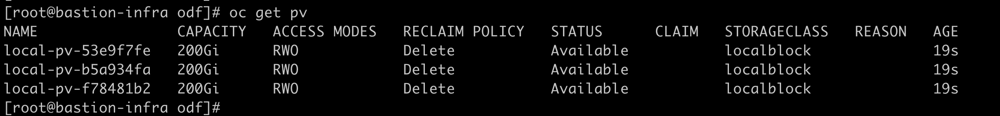
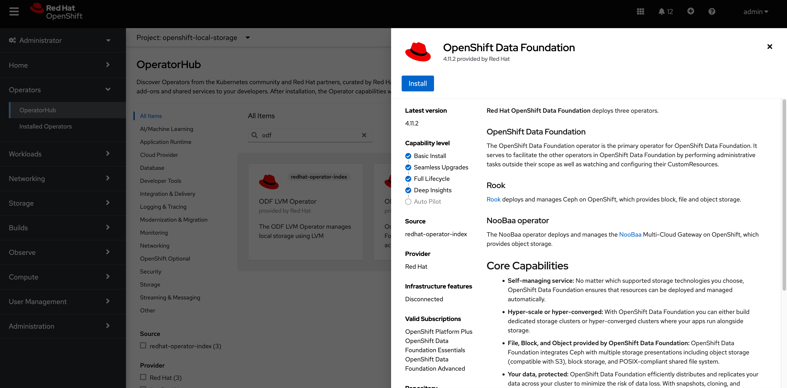
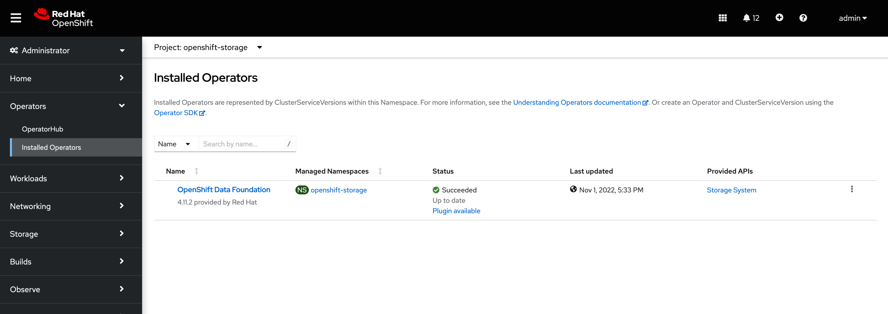
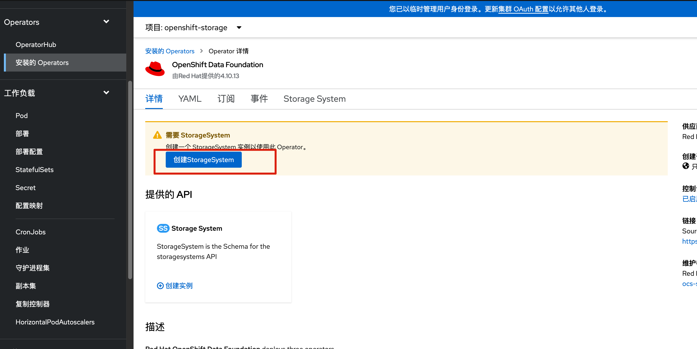
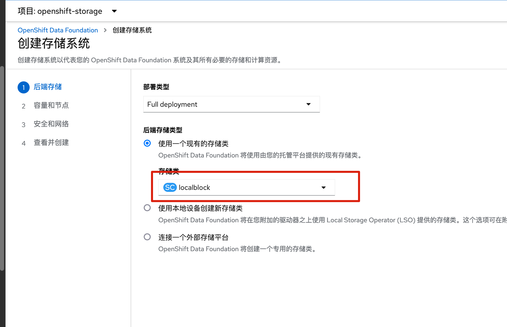
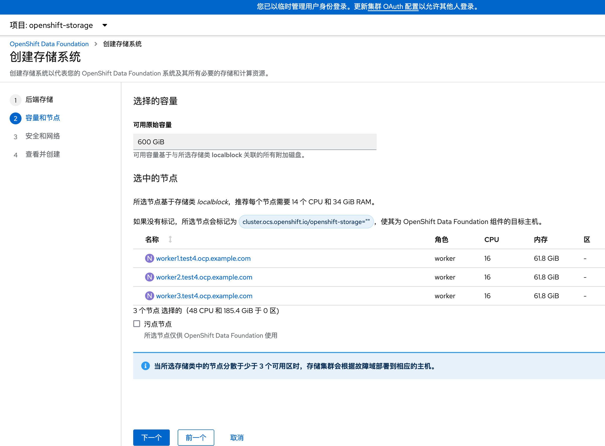
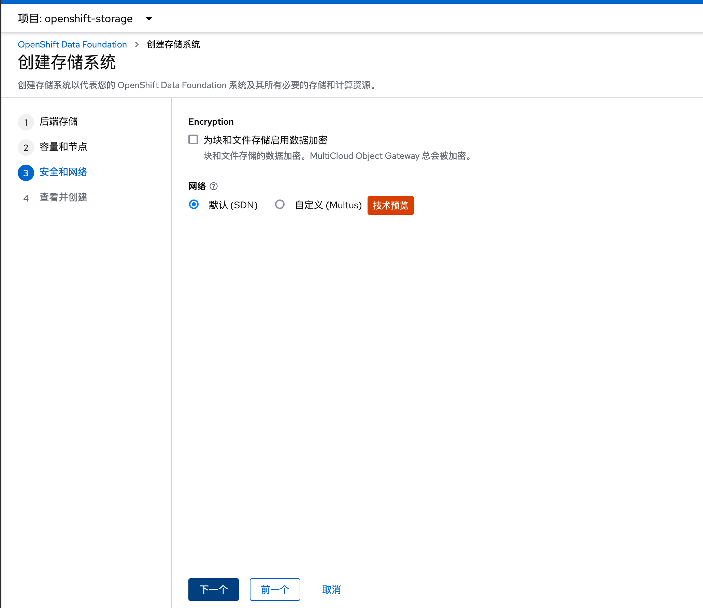
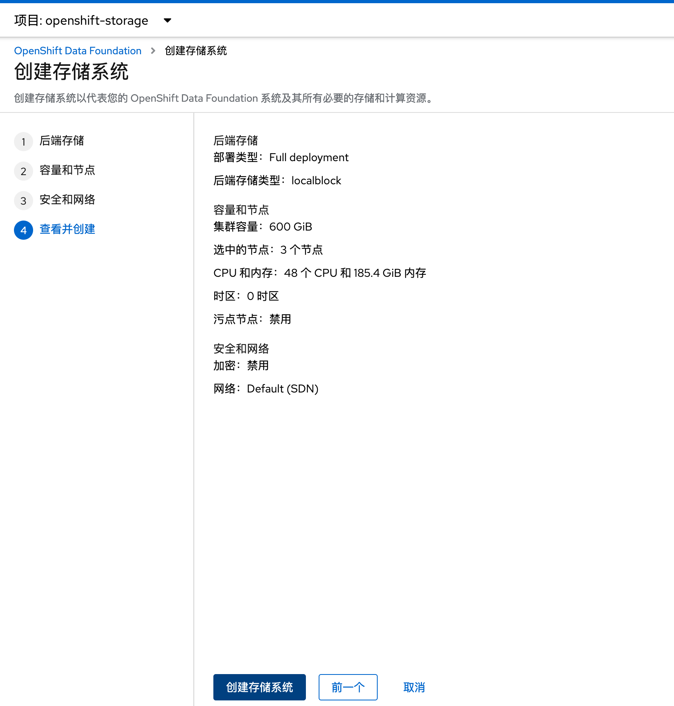

# 安装 openshift-local-storage


```

cat <<EOF | oc apply -f -
apiVersion: v1
kind: Namespace
metadata:
 name: openshift-local-storage
spec: {}
EOF
```


安装odf需要有额外的一块硬盘，为计划安装odf的节点打上label

```
oc label node odf1.test1.ocp.example.com cluster.ocs.openshift.io/openshift-storage=''
oc label node odf2.test1.ocp.example.com cluster.ocs.openshift.io/openshift-storage=''
oc label node odf3.test1.ocp.example.com cluster.ocs.openshift.io/openshift-storage=''
oc label node odf4.test1.ocp.example.com cluster.ocs.openshift.io/openshift-storage=''
oc label node odf5.test1.ocp.example.com cluster.ocs.openshift.io/openshift-storage=''
```


## 创建 LocalVolumeDiscovery 对象


```

cat <<EOF | oc apply -f -
apiVersion: local.storage.openshift.io/v1alpha1
kind: LocalVolumeDiscovery
metadata:
 name: auto-discover-devices
 namespace: openshift-local-storage
spec:
 nodeSelector:
   nodeSelectorTerms:
     - matchExpressions:
       - key: cluster.ocs.openshift.io/openshift-storage
         operator: In
         values:
           - ""
EOF
```


```
[root@bastion-test4 ~]# oc get localvolumediscoveries -n openshift-local-storage

NAME                    AGE
auto-discover-devices   2m7s
[root@bastion-test4 ~]#
[root@bastion-test4 ~]#  oc get localvolumediscoveryresults -n openshift-local-storage
NAME                                             AGE
discovery-result-worker1.test4.ocp.example.com   62s
discovery-result-worker2.test4.ocp.example.com   91s
discovery-result-worker3.test4.ocp.example.com   54s
```


## 创建 LocalVolumeSet 对象

```
cat << EOF | oc apply -f -
apiVersion: local.storage.openshift.io/v1alpha1
kind: LocalVolumeSet
metadata:
 name: local-block
 namespace: openshift-local-storage
spec:
 nodeSelector:
   nodeSelectorTerms:
     - matchExpressions:
         - key: cluster.ocs.openshift.io/openshift-storage
           operator: In
           values:
             - ""
 storageClassName: localblock
 volumeMode: Block
 fstype: ext4
 maxDeviceCount: 1
 deviceInclusionSpec:
   deviceTypes:
   - disk
   deviceMechanicalProperties:
   - NonRotational
EOF


### 
oc create -f localvolumeset.yaml
```

稍等一下，会创建新的PV 




## 检查 diskmaker-manager pod

```
[root@bastion-test4 mirror-registry]# oc get pods -n openshift-local-storage | grep "diskmaker-manager"
diskmaker-manager-6twmc                   2/2     Running   0          73s
diskmaker-manager-h8z28                   2/2     Running   0          73s
diskmaker-manager-ql6lf                   2/2     Running   0          73s
```


## 检查对应的PV已经创建

```
[root@bastion-test4 mirror-registry]# oc get pv -n openshift-local-storage
NAME                CAPACITY   ACCESS MODES   RECLAIM POLICY   STATUS      CLAIM   STORAGECLASS   REASON   AGE
local-pv-2a0fd522   200Gi      RWO            Delete           Available           localblock              62s
local-pv-2b38cb7e   200Gi      RWO            Delete           Available           localblock              62s
local-pv-47aaed09   200Gi      RWO            Delete           Available           localblock              63s
```


#  安装ODF


## 安装operator




ODF operator 部署成功




##  创建 storagecluster 实例


```

cat << EOF > storagecluster.yaml
apiVersion: ocs.openshift.io/v1
kind: StorageCluster
metadata:
 name: ocs-storagecluster
 namespace: openshift-storage
spec:
 manageNodes: false
 resources:
   mds:
     limits:
       cpu: "3"
       memory: "8Gi"
     requests:
       cpu: "3"
       memory: "8Gi"
 monDataDirHostPath: /var/lib/rook
 storageDeviceSets:
 - count: 1  
   dataPVCTemplate:
     spec:
       accessModes:
       - ReadWriteOnce
       resources:
         requests:
           storage: "100Gi"  
       storageClassName: localblock
       volumeMode: Block
   name: ocs-deviceset
   placement: {}
   portable: false
   replica: 3
   resources:
     limits:
       cpu: "2"
       memory: "5Gi"
     requests:
       cpu: "2"
       memory: "5Gi"
EOF

# 执行命令，创建odf对象

oc create -f storagecluster.yaml

```


## 通过UI创建ODF





选择刚才通过 local-storage 创建的storage class 













# Reference


https://access.redhat.com/articles/5692201


