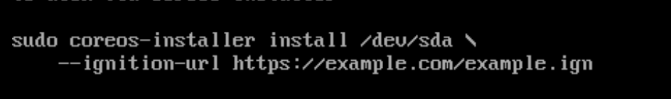

# 目标

1. 在linux 环境上完成测试demo
2. 


# env setup


## setup httpd 

```

dnf install httpd -y

setenforce 0
firewall-cmd --add-service=http  --permanent && firewall-cmd --reload

systemctl enable --now httpd
```


## install butane


```
dnf install -y butane

```


## 生成本地key

```
ssh-keygen -t rsa -b 4096 -N '' -f ~/.ssh/id_rsa
eval "$(ssh-agent -s)"
ssh-add ~/.ssh/id_rsa

cat /root/.ssh/id_rsa.pub
```


## 生成点火文件

```
example.bu

ID_RSA=`cat /root/.ssh/id_rsa.pub`

cat <<EOF > example.bu
variant: fcos
version: 1.5.0
passwd:
  users:
    - name: core
      ssh_authorized_keys:
        - ${ID_RSA}
EOF

执行以下命令生成点火文件
butane --pretty --strict example.bu > example.ign

生成的文件如下
cat example.ign| jq
{
  "ignition": {
    "version": "3.4.0"
  },
  "passwd": {
    "users": [
      {
        "name": "core",
        "sshAuthorizedKeys": [
          "ssh-rsa AAAA..."
        ]
      }
    ]
  }
}
```


## 导入fcos 镜像

本地已经下载了fcos ova 镜像


```
FCOS_OVA='fedora-coreos-38.20230609.3.0-vmware.x86_64.ova'
LIBRARY='fcos-images'
TEMPLATE_NAME='fcos-38.20230609.3.0'

govc library.create -ds=hdd "${LIBRARY}"   # 如果有多个ds，需要指定ds
govc library.import -n "${TEMPLATE_NAME}" "${LIBRARY}" "${FCOS_OVA}"
```


## 创建一个新的vm


### 使用DHCP 自动分配IP


```
CONFIG_ENCODING='base64'
CONFIG_ENCODED=$(cat example.ign | base64 -w0 -)

VM_NAME='fcos-node01'
govc library.deploy "${LIBRARY}/${TEMPLATE_NAME}" "${VM_NAME}"
govc vm.change -vm "${VM_NAME}" -e "guestinfo.ignition.config.data.encoding=${CONFIG_ENCODING}"
govc vm.change -vm "${VM_NAME}" -e "guestinfo.ignition.config.data=${CONFIG_ENCODED}"


# 启动节点
govc vm.info -e "${VM_NAME}"
govc vm.power -on "${VM_NAME}"
```


### 在启动时配置网络

创建一个vm，指定该VM的网络配置

```
LIBRARY='fcos-images'
TEMPLATE_NAME='fcos-38.20230609.3.0'

CONFIG_ENCODING='base64'
CONFIG_ENCODED=$(cat example.ign | base64 -w0 -)

VM_NAME='fcos-node02'
IFACE='ens192'
IPCFG="ip=192.168.3.42::192.168.3.1:255.255.255.0:${VM_NAME}:${IFACE}:off"

govc library.deploy "${LIBRARY}/${TEMPLATE_NAME}" "${VM_NAME}"
govc vm.change -vm "${VM_NAME}" -e "guestinfo.ignition.config.data.encoding=${CONFIG_ENCODING}"
govc vm.change -vm "${VM_NAME}" -e "guestinfo.ignition.config.data=${CONFIG_ENCODED}"
govc vm.change -vm "${VM_NAME}" -e "guestinfo.afterburn.initrd.network-kargs=${IPCFG}"
govc vm.info -e "${VM_NAME}"
govc vm.power -on "${VM_NAME}"

```


### 清理环境 

执行以下命令清理环境

```
VM_NAME='fcos-node02'
govc vm.destroy ${VM_NAME}
rm -rf ~/.ssh/known_hosts
```


## 设置 hostname

设置 hostname

```
ID_RSA=`cat /root/.ssh/id_rsa.pub`
HOSTNAME='fcos-node02.ocp.example.com'

cat <<EOF > example.bu
variant: fcos
version: 1.4.0
passwd:
  users:
    - name: core
      ssh_authorized_keys:
        - ${ID_RSA}
storage:
  files:
    - path: /etc/hostname
      mode: 0644
      contents:
        inline: ${HOSTNAME}
EOF

butane --pretty --strict example.bu > example.ign

LIBRARY='fcos-images'
TEMPLATE_NAME='fcos-38.20230609.3.0'

CONFIG_ENCODING='base64'
CONFIG_ENCODED=$(cat example.ign | base64 -w0 -)

VM_NAME='fcos-node02'
IFACE='ens192'
IPCFG="ip=192.168.3.42::192.168.3.1:255.255.255.0:${VM_NAME}:${IFACE}:off"

govc library.deploy "${LIBRARY}/${TEMPLATE_NAME}" "${VM_NAME}"
govc vm.change -vm "${VM_NAME}" -e "guestinfo.ignition.config.data.encoding=${CONFIG_ENCODING}"
govc vm.change -vm "${VM_NAME}" -e "guestinfo.ignition.config.data=${CONFIG_ENCODED}"
govc vm.change -vm "${VM_NAME}" -e "guestinfo.afterburn.initrd.network-kargs=${IPCFG}"
govc vm.info -e "${VM_NAME}"
govc vm.power -on "${VM_NAME}"

```


## 配置静态IP

目标：

* 配置静态IP
* 配置bond 


## kernel tuning


```

ID_RSA=`cat /root/.ssh/id_rsa.pub`
HOSTNAME='fcos-node02.ocp.example.com'

cat <<EOF > example.bu
variant: fcos
version: 1.4.0
passwd:
  users:
    - name: core
      ssh_authorized_keys:
        - ${ID_RSA}
storage:
  files:
    - path: /etc/hostname
      mode: 0644
      contents:
        inline: ${HOSTNAME}
    - path: /etc/sysctl.d/90-sysrq.conf
      contents:
        inline: |
          kernel.sysrq = 0
EOF

butane --pretty --strict example.bu > example.ign

LIBRARY='fcos-images'
TEMPLATE_NAME='fcos-38.20230609.3.0'

CONFIG_ENCODING='base64'
CONFIG_ENCODED=$(cat example.ign | base64 -w0 -)

VM_NAME='fcos-node02'
IFACE='ens192'
IPCFG="ip=192.168.3.42::192.168.3.1:255.255.255.0:${VM_NAME}:${IFACE}:off"

govc library.deploy "${LIBRARY}/${TEMPLATE_NAME}" "${VM_NAME}"
govc vm.change -vm "${VM_NAME}" -e "guestinfo.ignition.config.data.encoding=${CONFIG_ENCODING}"
govc vm.change -vm "${VM_NAME}" -e "guestinfo.ignition.config.data=${CONFIG_ENCODED}"
govc vm.change -vm "${VM_NAME}" -e "guestinfo.afterburn.initrd.network-kargs=${IPCFG}"
govc vm.info -e "${VM_NAME}"
govc vm.power -on "${VM_NAME}"

```


## 用户和用户组


### 用户配置

目标：

* 创建用户 zhangsan，该用户使用 秘钥登录 
* 创建用户 lisi，该用户使用密码登录  


生成密码 

```
[root@fcos-centos9 base-access]# podman run -ti --rm quay.io/coreos/mkpasswd --method=yescrypt
Password:
$y$j9T$m5QbmMPzDook1Up5fy/lX1$2o8BJ5hXLcirOgdOP2cqfjUNDFSHvDz83yC1CkJvEa/


# password: 123 
```


准备配置文件

注意：如果想要使用账号密码登录，需要先开启使用账号密码登录模式 


```

variant: fcos
version: 1.5.0
passwd:
  users:
    - name: core
      ssh_authorized_keys:
        - ssh-rsa AAAAB3NzaC1yc2EAAAADAQABAAACAQDNJz89AxdrE+XZu75CVYhQ1kIqs1cBYdpqO8vSV1z9TGhl6eTGNtFmxMvPfZ+fNHVjgT1N3vZWwLcuQTpNFuE/xPDCDXWFL7vJkmh7O3FhgGRtjCHPupEabYGNm8K6Ej3gU10c7cDdfCxcrg4xELCuvFFkCYk6u4GDSAv7ReZ6ZL0JsBCJbN0+pvnlMwl6S2LGJJRuuL+eZ/X9KTcvz4PbX0DQ1s97XmTgNtn8akOdVNyOtEm8fsX0wtOfOGhNOWHTVTlks5//tz+Ra9qCh39P3jEgD/5hPI6keKuV3CHUJ3Jf9P5y0R2nguO3luF+lTc+7bKdqtgj1WFTSB8rd/TZ6Fx19k5RHNJYsC+zNvfyP5ZByw2XLhPjDG6l8Gpwz0ODh6rncWhBhv6EDtwUdDn1u8AKSD+4TG2hh5slP2CFcyRUQdjo/QjAFGxpDPRqhSGpdWouD1nCgj6/lSzqoompsRO+AiuXfcNTrHb2v6GburscgwJFmCQV6YxG6fMLYvbLFDaWddW4KzaAR9liYeSzTOSLkz1dwAvr7F8bVRuyn2IabovM6aT5n3cXMmHtdW0qZJ8JVwI+Er8ms0cEV90+Ef/HHAL46gLhEkSfltjRskX9m6EYGQk1AkiMljLz71amdVKtx5Q6rQsOILcfEYWxc+8yM+6KQqirWKhrrAXp3Q== root@fcos-centos9.ocp.example.com
    - name: zhangsan
      ssh_authorized_keys:
        - ssh-rsa AAAAB3NzaC1yc2EAAAADAQABAAACAQCntXZQMfkdKPt+WO1TLXGAbQD8MCqtqBFywYvWStSL9RXWDVQz62CujBfoUdWV9YFvJVlfomma/xdVCZa21q6hI1D//VfSxxKlezLuKb2qxO6hOLfcWvt84FcsQEC+qw0IMrCHJrTHshR1hJV9ItChU8arx72rwhoxAFTSAQlMuMpgkps/jvQMfAZQcwnszf9wm2lXqqIFBvnYNvP5JcaQknQCraJcgWEqlA6iLDDpZoLaMs2owlDItPaTshSir87i5+CaJ6PaDV7pAnSAEKPY/JWUCuHaP8iJaPdRO1sapP0jkK30V4q/46fCHxsJQ1osf+Two5ad2JtgGQquQUVbgmIqkyHGqpF4qV46+6OVpXEUgL/54tCPaiTD3XxjMtO6y2oU6HMT0rPZT8xw8217SHtxnST2XgpRktC/k5sqWzJBgRbG/TJc/S2vl+5gG62QguWGvPwPxTzzLAxHSc8OHHNSXeSdQ6THcbmQ0dIlIHo2MN7kynXYQ4Xp/RelMkOx2758qMkOcBN3QaVRnROnBKD8ynizgJylHG0MgQfPNwsN2xjR1uTRD21TYS5OTnWLBASWbTlaOIM4GMe4k6FHs9j92aPK7JffuaCIp6S+EpqHW+1yUMsAvPwqXm2RTKGYc42a4MkywhvB2GtRmc9Dgp5z5QEWQ4GscSs7AvF/Yw== junkchen@junkchen-mac
        - ssh-ed25519 AAAAC3NzaC1lZDI1NTE5AAAAIChxcF10BzvSHIRaoBWi46hba2irW2HBUm+RtXsVsyGK junkchen@redhat.com
    - name: lisi
      password_hash: $y$j9T$m5QbmMPzDook1Up5fy/lX1$2o8BJ5hXLcirOgdOP2cqfjUNDFSHvDz83yC1CkJvEa/
storage:
  files:
    - path: /etc/ssh/sshd_config.d/20-enable-passwords.conf
      mode: 0644
      contents:
        inline: |
          # Fedora CoreOS disables SSH password login by default.
          # Enable it.
          # This file must sort before 40-disable-passwords.conf.
          PasswordAuthentication yes
  

```


生成点火文件

```
butane --pretty --strict user.bu > user.ign
```


### 用户组 


```

variant: fcos
version: 1.5.0
passwd:
  groups:
    - name: engineering
    - name: marketing
      gid: 9000
  users:
    - name: core
      ssh_authorized_keys:
        - ssh-rsa AAAAB3NzaC1yc2EAAAADAQABAAACAQDNJz89AxdrE+XZu75CVYhQ1kIqs1cBYdpqO8vSV1z9TGhl6eTGNtFmxMvPfZ+fNHVjgT1N3vZWwLcuQTpNFuE/xPDCDXWFL7vJkmh7O3FhgGRtjCHPupEabYGNm8K6Ej3gU10c7cDdfCxcrg4xELCuvFFkCYk6u4GDSAv7ReZ6ZL0JsBCJbN0+pvnlMwl6S2LGJJRuuL+eZ/X9KTcvz4PbX0DQ1s97XmTgNtn8akOdVNyOtEm8fsX0wtOfOGhNOWHTVTlks5//tz+Ra9qCh39P3jEgD/5hPI6keKuV3CHUJ3Jf9P5y0R2nguO3luF+lTc+7bKdqtgj1WFTSB8rd/TZ6Fx19k5RHNJYsC+zNvfyP5ZByw2XLhPjDG6l8Gpwz0ODh6rncWhBhv6EDtwUdDn1u8AKSD+4TG2hh5slP2CFcyRUQdjo/QjAFGxpDPRqhSGpdWouD1nCgj6/lSzqoompsRO+AiuXfcNTrHb2v6GburscgwJFmCQV6YxG6fMLYvbLFDaWddW4KzaAR9liYeSzTOSLkz1dwAvr7F8bVRuyn2IabovM6aT5n3cXMmHtdW0qZJ8JVwI+Er8ms0cEV90+Ef/HHAL46gLhEkSfltjRskX9m6EYGQk1AkiMljLz71amdVKtx5Q6rQsOILcfEYWxc+8yM+6KQqirWKhrrAXp3Q== root@fcos-centos9.ocp.example.com
    - name: zhangsan
      groups:
        - engineering
        - wheel
        - sudo
      ssh_authorized_keys:
        - ssh-rsa AAAAB3NzaC1yc2EAAAADAQABAAACAQCntXZQMfkdKPt+WO1TLXGAbQD8MCqtqBFywYvWStSL9RXWDVQz62CujBfoUdWV9YFvJVlfomma/xdVCZa21q6hI1D//VfSxxKlezLuKb2qxO6hOLfcWvt84FcsQEC+qw0IMrCHJrTHshR1hJV9ItChU8arx72rwhoxAFTSAQlMuMpgkps/jvQMfAZQcwnszf9wm2lXqqIFBvnYNvP5JcaQknQCraJcgWEqlA6iLDDpZoLaMs2owlDItPaTshSir87i5+CaJ6PaDV7pAnSAEKPY/JWUCuHaP8iJaPdRO1sapP0jkK30V4q/46fCHxsJQ1osf+Two5ad2JtgGQquQUVbgmIqkyHGqpF4qV46+6OVpXEUgL/54tCPaiTD3XxjMtO6y2oU6HMT0rPZT8xw8217SHtxnST2XgpRktC/k5sqWzJBgRbG/TJc/S2vl+5gG62QguWGvPwPxTzzLAxHSc8OHHNSXeSdQ6THcbmQ0dIlIHo2MN7kynXYQ4Xp/RelMkOx2758qMkOcBN3QaVRnROnBKD8ynizgJylHG0MgQfPNwsN2xjR1uTRD21TYS5OTnWLBASWbTlaOIM4GMe4k6FHs9j92aPK7JffuaCIp6S+EpqHW+1yUMsAvPwqXm2RTKGYc42a4MkywhvB2GtRmc9Dgp5z5QEWQ4GscSs7AvF/Yw== junkchen@junkchen-mac
        - ssh-ed25519 AAAAC3NzaC1lZDI1NTE5AAAAIChxcF10BzvSHIRaoBWi46hba2irW2HBUm+RtXsVsyGK junkchen@redhat.com
    - name: lisi
      groups:
        - marketing
        - wheel
        - sudo
      password_hash: $y$j9T$m5QbmMPzDook1Up5fy/lX1$2o8BJ5hXLcirOgdOP2cqfjUNDFSHvDz83yC1CkJvEa/
storage:
  files:
    - path: /etc/ssh/sshd_config.d/20-enable-passwords.conf
      mode: 0644
      contents:
        inline: |
          # Fedora CoreOS disables SSH password login by default.
          # Enable it.
          # This file must sort before 40-disable-passwords.conf.
          PasswordAuthentication yes


```


## 安装VIM


## 安装docker-ce


```
variant: fcos
version: 1.5.0
systemd:
  units:
    # Install Docker CE
    - name: rpm-ostree-install-docker-ce.service
      enabled: true
      contents: |
        [Unit]
        Description=Install Docker CE
        Wants=network-online.target
        After=network-online.target
        Before=zincati.service
        ConditionPathExists=!/var/lib/%N.stamp

        [Service]
        Type=oneshot
        RemainAfterExit=yes
        ExecStart=/usr/bin/curl --output-dir "/etc/yum.repos.d" --remote-name https://download.docker.com/linux/fedora/docker-ce.repo
        ExecStart=/usr/bin/rpm-ostree override remove moby-engine containerd runc --install docker-ce
        ExecStart=/usr/bin/touch /var/lib/%N.stamp
        ExecStart=/usr/bin/systemctl --no-block reboot

        [Install]
        WantedBy=multi-user.target
passwd:
  users:
    - name: core
      ssh_authorized_keys:
        - ssh-rsa AAAAB3NzaC1yc2EAAAADAQABAAACAQDNJz89AxdrE+XZu75CVYhQ1kIqs1cBYdpqO8vSV1z9TGhl6eTGNtFmxMvPfZ+fNHVjgT1N3vZWwLcuQTpNFuE/xPDCDXWFL7vJkmh7O3FhgGRtjCHPupEabYGNm8K6Ej3gU10c7cDdfCxcrg4xELCuvFFkCYk6u4GDSAv7ReZ6ZL0JsBCJbN0+pvnlMwl6S2LGJJRuuL+eZ/X9KTcvz4PbX0DQ1s97XmTgNtn8akOdVNyOtEm8fsX0wtOfOGhNOWHTVTlks5//tz+Ra9qCh39P3jEgD/5hPI6keKuV3CHUJ3Jf9P5y0R2nguO3luF+lTc+7bKdqtgj1WFTSB8rd/TZ6Fx19k5RHNJYsC+zNvfyP5ZByw2XLhPjDG6l8Gpwz0ODh6rncWhBhv6EDtwUdDn1u8AKSD+4TG2hh5slP2CFcyRUQdjo/QjAFGxpDPRqhSGpdWouD1nCgj6/lSzqoompsRO+AiuXfcNTrHb2v6GburscgwJFmCQV6YxG6fMLYvbLFDaWddW4KzaAR9liYeSzTOSLkz1dwAvr7F8bVRuyn2IabovM6aT5n3cXMmHtdW0qZJ8JVwI+Er8ms0cEV90+Ef/HHAL46gLhEkSfltjRskX9m6EYGQk1AkiMljLz71amdVKtx5Q6rQsOILcfEYWxc+8yM+6KQqirWKhrrAXp3Q== root@fcos-centos9.ocp.example.com
```


## toolbox


# BareMetal 安装


# 升级OS demo

## 升级前准备

下载一个历史版本的CoreOS

 

```
RELEASE=$(curl https://builds.coreos.fedoraproject.org/prod/streams/stable/releases.json | jq -r '.releases[-2].version')

https://builds.coreos.fedoraproject.org/prod/streams/stable/builds/40.20240602.3.0/x86_64/fedora-coreos-40.20240602.3.0-live.x86_64.iso

```


## 设置 update stream 


* stable

​	稳定版是最可靠的发布版本，只有经过测试版本一段时间的验证后，才会发布到稳定版中

* testing

​	测试版代表即将进入稳定版的内容。该版本会定期更新，为社区提供机会提前发现重大更改，在它们进入稳定版之前进行测试

* next

​	未来版代表系统的未来发展方向。该版本通常用于实验新功能，并测试将平台升级到下一个 Fedora 主要版本的变更。未来版的内容最终会进入测试版，然后进入稳定版


```
sudo systemctl stop zincati.service

# Perform the rebase to a different stream
# Supported architectures: aarch64, x86_64
# Available streams: "stable", "testing", and "next"
ARCH="$(arch)"
STREAM="testing"
sudo rpm-ostree rebase "fedora/${ARCH}/coreos/${STREAM}"
```


# demo


## 安装vim，并设置为默认编辑器


```
```


# TODO

1. 点火文件各个版本的区别？
2. 



