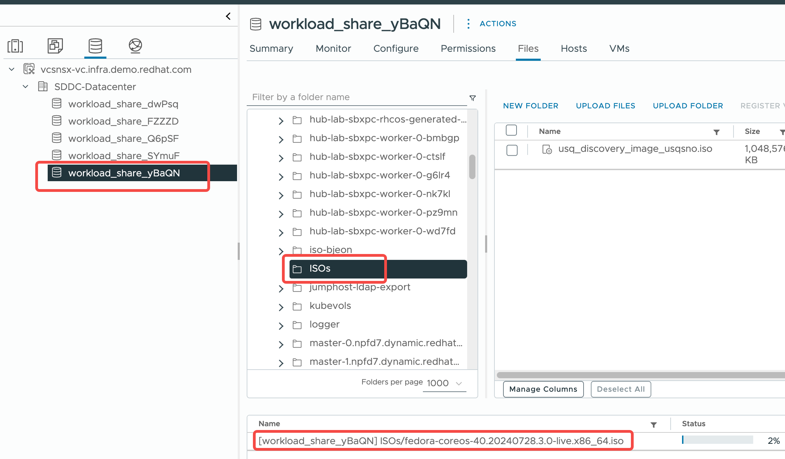

# 目标

1. 记录内部的vcenter 环境配置


# 初始化


## 配置yum源


## 上传fcos iso

在服务器上保存fcos iso 镜像 




## bastion 初始化


```
yum install -y httpd
systemctl enable --now httpd

firewall-cmd --permanent --zone=public --add-service=http
firewall-cmd --permanent --zone=public --add-service=https
firewall-cmd --reload

```


