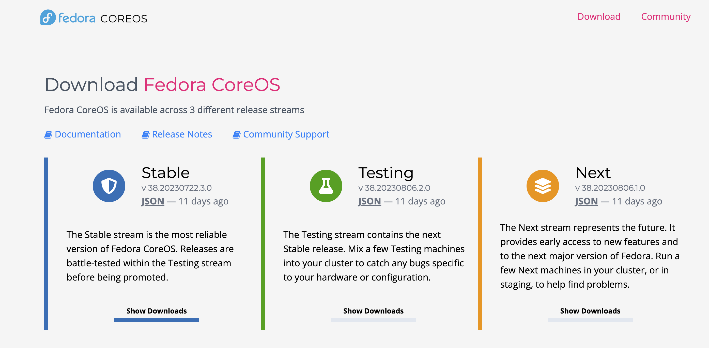

# 目标

1. 在 VMware fusion 上部署 Fedora CoreOS


# 准备工作


## ovftool 


Ovftool  路径，在MacOS中，默认路径

```
/Applications/VMware Fusion.app/Contents/Library/VMware OVF Tool/ovftool

```


## 下载 ova 文件


### 通过 coreos-installer 下载

```
安装 coreos-installer 
brew install coreos-installer 

STREAM="stable"
coreos-installer download -s "${STREAM}" -p vmware -f ova
```


### 下载 

https://fedoraproject.org/coreos/download/?stream=stable#baremetal




