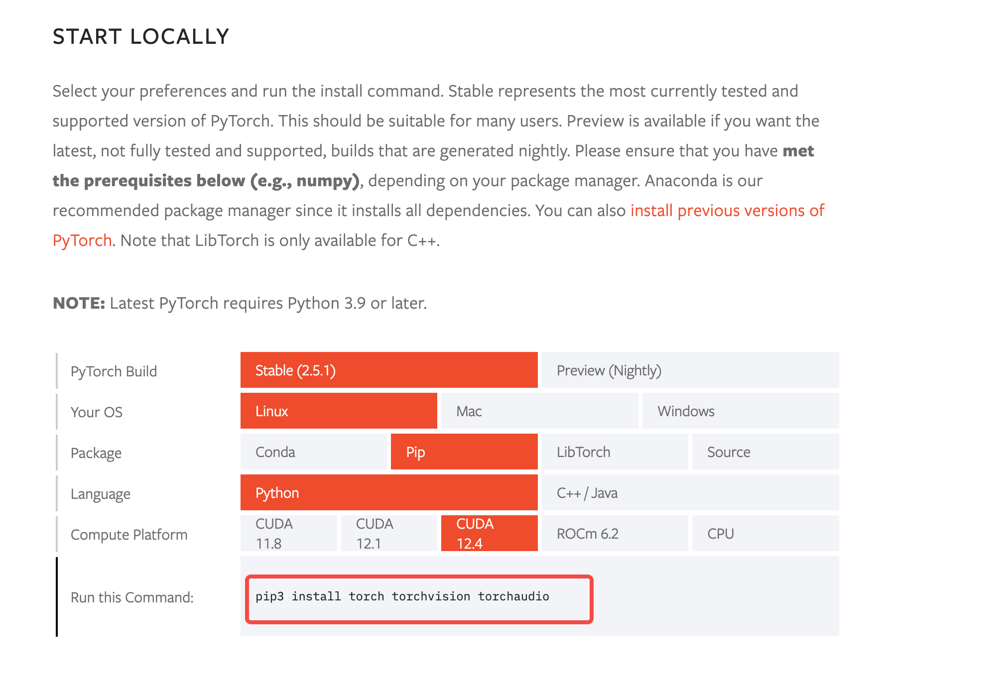

# 基本过程


```

ilab config init 


# download model 
podman login registry.redhat.io

ilab model download --repository docker://registry.redhat.io/rhelai1/granite-7b-redhat-lab --release latest


ilab model download --repository instructlab/granite-7b-lab-GGUF --filename=granite-7b-lab-Q4_K_M.gguf


```


```
# 清理行尾空格 

sed -i 's/[[:space:]]*$//' qna.yaml
```


# important


1. There is a limit to how much content can exist in the question/answer pairs for the model to process. Due to this, only add a maximum of around 2300 words to your question and answer seed example pairs in the `qna.yaml` file.
2. 


# test-record


```
python3 -m venv --upgrade-deps venv
source venv/bin/activate
pip cache remove llama_cpp_python

# 说明
这里有一个版本的问题，需要指定 pip requests.txt 的内容 

pip install 'instructlab[cuda]' \
   -C cmake.args="-DLLAMA_CUDA=on" \
   -C cmake.args="-DLLAMA_NATIVE=off"


```


# CentOS 9 install instructLab record


## install python 3.11


使用 pyenv 

```
sudo dnf install git gcc zlib-devel bzip2 bzip2-devel readline-devel sqlite sqlite-devel openssl-devel tk-devel libffi-devel xz-devel -y
 
# 安装 pyenv 
curl https://pyenv.run | bash

# 配置环境变量 
echo 'export PYENV_ROOT="$HOME/.pyenv"' >> ~/.bashrc
echo 'export PATH="$PYENV_ROOT/bin:$PATH"' >> ~/.bashrc
echo 'eval "$(pyenv init --path)"' >> ~/.bashrc
echo 'eval "$(pyenv init -)"' >> ~/.bashrc
source ~/.bashrc

# 安装 3.11 
pyenv install 3.11
pyenv global 3.11


# 验证 
python --version 

```


### install ilab via demo 


```

pip3 install git+https://github.com/instructlab/instructlab.git@v0.19.3


安装指定版本的instructlab，通过
pip install instructlab==0.20.0 


# 训练的时候，指定训练轮数  --num-epochs 
ilab model train --device cpu --pipeline simple  --num-epochs 1 

```


## setup env

```

# download model

ilab model download --repository TheBloke/Mistral-7B-Instruct-v0.2-GGUF --filename=mistral-7b-instruct-v0.2.Q4_K_M.gguf


ilab model download --repository TheBloke/Mistral-7B-Instruct-v0.2-GGUF --filename=mistral-7b-instruct-v0.2.Q4_K_M.gguf --hf-token 


# download mixtral 模型
ilab model download --repository mistralai/Mixtral-8x7B-Instruct-v0.1 --hf-token 


mistralai/Mixtral-8x7B-Instruct-v0.1
```


## 查看 nvidia 信息


查看 CUDA 信息 

* CUDA: 12.7 
* 

```
(venv) [instruct@instructlab lab2]$ nvidia-smi
Thu Dec 12 08:28:38 2024
+-----------------------------------------------------------------------------------------+
| NVIDIA-SMI 565.57.01              Driver Version: 565.57.01      CUDA Version: 12.7     |
|-----------------------------------------+------------------------+----------------------+
| GPU  Name                 Persistence-M | Bus-Id          Disp.A | Volatile Uncorr. ECC |
| Fan  Temp   Perf          Pwr:Usage/Cap |           Memory-Usage | GPU-Util  Compute M. |
|                                         |                        |               MIG M. |
|=========================================+========================+======================|
|   0  NVIDIA A10G                    Off |   00000000:00:1E.0 Off |                    0 |
|  0%   15C    P8              8W /  300W |       1MiB /  23028MiB |      0%      Default |
|                                         |                        |                  N/A |
+-----------------------------------------+------------------------+----------------------+

+-----------------------------------------------------------------------------------------+
| Processes:                                                                              |
|  GPU   GI   CI        PID   Type   Process name                              GPU Memory |
|        ID   ID                                                               Usage      |
|=========================================================================================|
|  No running processes found                                                             |
```


安装 torch 

https://pytorch.org/get-started/locally/





```
pip3 install torch torchvision torchaudio

```


## ilab config init 


```
(venv) [instruct@instructlab instructlab]$ ilab config init
Existing training profiles were found in /home/instruct/.local/share/instructlab/internal/train_configuration/profiles
Do you also want to restore these profiles to the default values? [y/N]: y
Welcome to InstructLab CLI. This guide will help you to setup your environment.
Please provide the following values to initiate the environment [press Enter for defaults]:
Path to taxonomy repo [/home/instruct/.local/share/instructlab/taxonomy]:
Path to your model [/home/instruct/.cache/instructlab/models/merlinite-7b-lab-Q4_K_M.gguf]:
Generating `/home/instruct/.config/instructlab/config.yaml` and `/home/instruct/.local/share/instructlab/internal/train_configuration/profiles`...
Detecting Hardware...
We chose Nvidia 1x L4 as your designated training profile. This is for systems with 24 GB of vRAM.
This profile is the best approximation for your system based off of the amount of vRAM. We modified it to match the number of GPUs you have.
Is this profile correct? [Y/n]: y
Initialization completed successfully, you're ready to start using `ilab`. Enjoy!
```


## command

```

# generate 

ilab data generate --sdg-scale-factor 5 --gpus 1

ilab -v model train --data-path /home/instruct/.local/share/instructlab/datasets/knowledge_train_msgs_2024-12-12T14_42_11.jsonl


# train via cpu 
ilab model train --data-path ./datasets-no-generation/skills_train_msgs_2024-10-01T18_01_15.jsonl --pipeline=full --device=cpu
```


https://github.com/instructlab/instructlab/blob/main/docs/demo-slides.md


## demo


```

# server
ilab model serve --model-path ~/.cache/instructlab/models/mistral-7b-instruct-v0.2.Q4_K_M.gguf

# client chat 
ilab model chat -m ~/.cache/instructlab/models/mistral-7b-instruct-v0.2.Q4_K_M.gguf


```


# demo-url


https://github.com/rhai-code/instructlab_knowledge/blob/main/qna.yaml


# 使用不同模型 


# instructLAB vs RHEL


## on instructLab  demo node 


```

(venv) [instruct@instructlab instructlab]$ cat /etc/redhat-release
Red Hat Enterprise Linux release 9.4 (Plow)

(venv) [instruct@instructlab instructlab]$ uname -r
5.14.0-427.33.1.el9_4.x86_64
```


## on rhel AI node


```
```


# skill and knowledge


## skill

技能是执行性的。当你为模型创建一个技能时，你是在**教它如何完成某项任务**，比如“给我写首歌”，“重新排列句子中的单词” 或“总结一封电子邮件”


### Core skill

核心技能是基础技能，例如数学、推理和编码

与知识型技能和组合型技能不同，核心技能不能贡献到 taxonomy 中。因此，当提到将“技能”贡献给 taxonomy 时，指的是组合型技能，而非核心技能。


###  不支持提交贡献的skill

虽然 instructlab 是通过 

```
```


# 相关信息


##   Base model and teacher model 

### Base Model

**定义**：
Base Model 是指在训练过程的初始阶段使用的模型。它通常是一个预训练模型（Pretrained Model），具备一定的通用能力，但尚未针对特定任务或目标进行优化。


学生模型通常是一个相对较小、计算效率更高的网络，它的设计目的是在保持或接近教师模型的性能的同时，减少模型的复杂性和计算需求。学生模型在训练过程中会尝试模仿教师模型的行为，通过学习教师模型的输出逻辑和特征表达来提高自身的性能。学生模型不仅学习真实的标签（硬标签）来进行监督学习，还学习教师模型的输出（软标签），以此获得更细腻的概率分布信息，从而更好地泛化到新的数据样本上


**特点**：

1. **预训练阶段的成果**：
   通常通过大规模数据集进行无监督或自监督训练，具有较好的通用性。
2. **未优化的特定任务性能**：
   虽然具有一定的能力，但在特定任务（例如对话生成、代码生成）上可能需要进一步微调。
3. **起点模型**：
   Base Model 是 Fine-tuning 或其他优化阶段（如 RLHF 或蒸馏）的起点。

**用途**：

- 提供一个可靠的起点，节省从零开始训练的成本。
- 与后续的 Fine-tuned Model（微调模型）或 Instruct-tuned Model（指令微调模型）进行对比评估性能提升。


### Teacher Model

**定义**：
Teacher Model 是在训练过程中作为指导者的高性能模型，负责提供正确答案（目标输出）或更丰富的学习信号，帮助优化 Base Model 或 Student Model。

教师模型通常是一个预先训练好的、性能较高的深度神经网络。这个模型在特定任务上已经达到了较高的精确度，拥有强大的表示能力和丰富的信息。在知识蒸馏的上下文中，教师模型的角色是提供指导或示范，帮助学生模型学习并提高其性能。教师模型的输出通常被用来生成所谓的“软标签”（soft labels），这些软标签包含了比硬标签（hard labels，即真实的类别标签）更丰富的信息，如输出层的概率分布，这有助于捕捉和传递教师模型的知识

**特点**：

1. **性能更优**：
   通常比 Base Model 和 Student Model 更强大，可能是通过额外的训练或更复杂的架构实现的。
2. **指导作用**：
   Teacher Model 的输出（例如概率分布、特征表示或答案）用于监督学生模型，减少学习误差。
3. **不直接部署**：
   Teacher Model 通常不用于生产环境，因为它可能过于复杂或资源密集。

**用途**：

- **知识蒸馏（Knowledge Distillation）**：
  将 Teacher Model 的知识压缩到一个更小、更高效的模型中。
- **监督学习**：
  用于生成高质量标注数据指导学生模型训练。
- **强化学习**：
  在 RLHF 中，Teacher Model 的输出可以作为奖励函数的一部分，指导模型进行更好的探索。


# Reference

https://docs.redhat.com/en/documentation/red_hat_enterprise_linux_ai/1.1/html/creating_a_custom_llm_using_rhel_ai/customize_taxonomy_tree#customize_llm_create_knowledge


