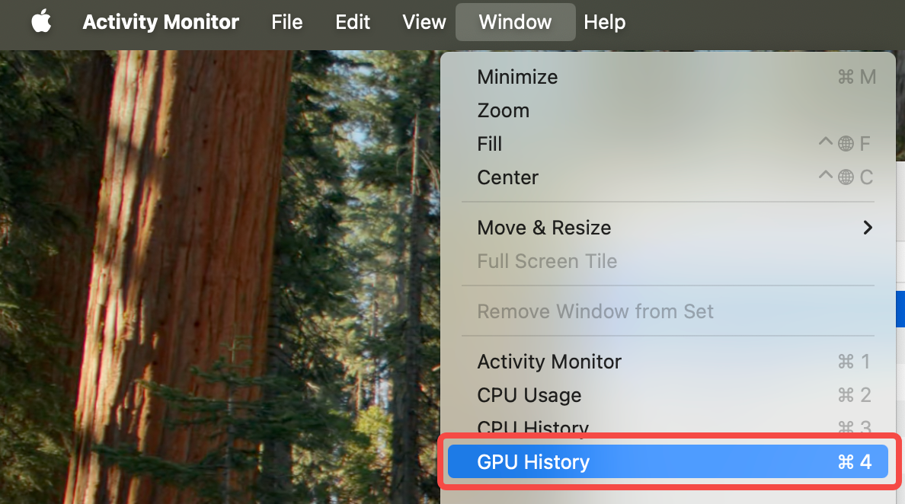
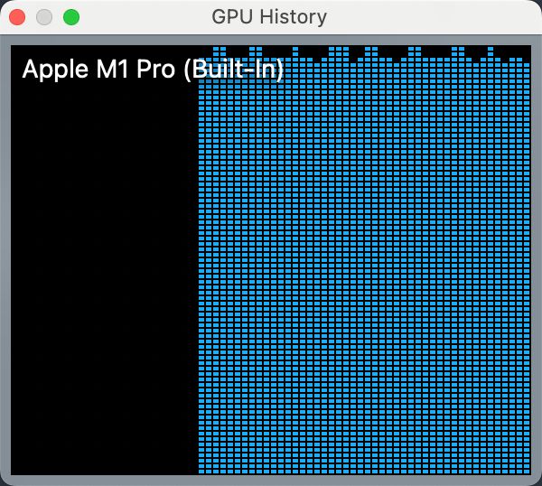
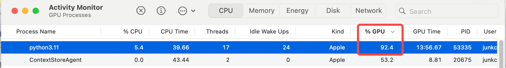

# 目标

1. 记录instructlab 在 macos 执行 


# 过程


```

ilab data generate --sdg-scale-factor 5 --pipeline simple


ilab model train --pipeline simple --device mps


# 注意
=

```


# 查看结果


打开Activity Monitor，然后选择 windows -> GPU History，打开 GPU History




以下蓝色部分表示GPU使用率




可以查看



