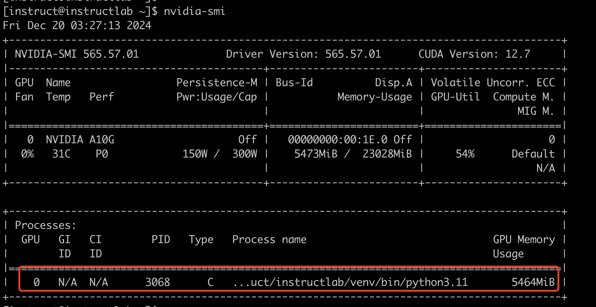

# Term


| Name | 说明                        |
| ---- | --------------------------- |
| SDG  | Synthetic Data Generation， |


# demo


```

ilab model download --repository instructlab/granite-7b-lab-GGUF --filename=granite-7b-lab-Q4_K_M.gguf 
ilab model download --repository instructlab/merlinite-7b-lab-GGUF --filename=merlinite-7b-lab-Q4_K_M.gguf


ilab model serve --model-path /var/home/instruct/.cache/instructlab/models/granite-7b-lab-Q4_K_M.gguf


ilab model chat -m /var/home/instruct/.cache/instructlab/models/granite-7b-lab-Q4_K_M.gguf

mkdir -p /home/instruct/.local/share/instructlab/taxonomy/knowledge/instructlab/overview

cp -av ~/files/instructlab_knowledge/qna.yaml /home/instruct/.local/share/instructlab/taxonomy/knowledge/instructlab/overview

ilab taxonomy diff


ilab data generate --model /home/instruct/.cache/instructlab/models/merlinite-7b-lab-Q4_K_M.gguf --sdg-scale-factor 5 --gpus 1

# 查看生成的数据
less /home/instruct/.local/share/instructlab/datasets/knowledge_train_msgs_*

ilab data list

# 重新训练模型 
ilab model train --pipeline simple --model-path instructlab/granite-7b-lab --local --device cuda


ilab model serve --model-path /home/instruct/.local/share/instructlab/checkpoints/ggml-model-f16.gguf


```




## 检查GPU信息


```
import torch
print("GPU Available:", torch.cuda.is_available())
print("GPU Name:", torch.cuda.get_device_name(0) if torch.cuda.is_available() else "No GPU detected")


```


# train


```

# 没有GPU的时候，执行以下命令，
ilab data generate --pipeline simple


```


# download model from redhat registry 


TODO： 

test each model in redhat registry 


# provide rhel AI server 


## Runnig a model server as a service 


## Allowing access to a model from a secure endpoint 


# difference between knowledge and skill


# rhel-ai update


## 查看当前版本

使用 `bootc status` 可以看到当前版本

从下面内容可以看到，当前版本为 rhel 1.2 

```
[instruct@bastion ~]$ sudo bootc status
apiVersion: org.containers.bootc/v1alpha1
kind: BootcHost
metadata:
  name: host
spec:
  image:
    image: registry.redhat.io/rhelai1/bootc-nvidia-rhel9:1.2
    transport: registry
  bootOrder: default
status:
  staged: null
  booted:
    image:
      image:
        image: registry.redhat.io/rhelai1/bootc-nvidia-rhel9:1.2
        transport: registry
      version: 9.20241008.0
      timestamp: null
      imageDigest: sha256:0f226d72947d498f2ed42e841047d63c631375ded5285f0cb6c4e9b2408585ae
    cachedUpdate: null
    incompatible: false
    pinned: false
    store: ostreeContainer
    ostree:
      checksum: 882b214d9518dcb41afd65f174f5867a9c218a20be21829cba2490fcc5e9fe1d
      deploySerial: 0
  rollback: null
  rollbackQueued: false
  type: bootcHost
```


或者使用 rpm-ostree 查看，同样可以看到目前使用的 版本 是 

```
rpm-ostree status
State: idle
warning: Failed to query journal: couldn't find current boot in journal
Deployments:
● ostree-unverified-registry:registry.redhat.io/rhelai1/bootc-nvidia-rhel9:1.2
                   Digest: sha256:0f226d72947d498f2ed42e841047d63c631375ded5285f0cb6c4e9b2408585ae
                  Version: 9.20241008.0 (2024-10-11T15:37:48Z)
```


## 升级 rhel-ai 版本 


https://access.redhat.com/solutions/7086221


```
podman login 

[cloud-user@ip-10-31-10-4 ~]$ sudo cp /run/containers/0/auth.json /etc/ostree/
[cloud-user@ip-10-31-10-4 ~]$ 
[cloud-user@ip-10-31-10-4 ~]$ 
[cloud-user@ip-10-31-10-4 ~]$ sudo bootc upgrade
No changes in registry.redhat.io/rhelai1/bootc-nvidia-rhel9:1.1 => 
sha256:0618bf4feab4e612bd16470af2be4d3587143602ebb8bea3772dfca9cff6f4a2
No update available.
[cloud-user@ip-10-31-10-4 ~]$ 
```


# TODO

download rhel AI model


