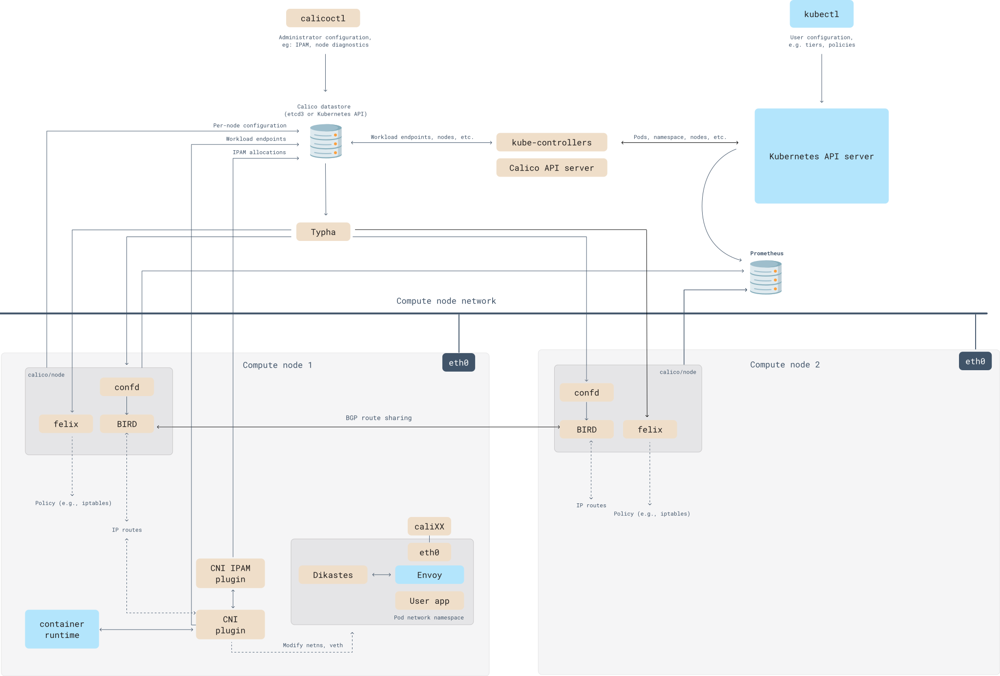
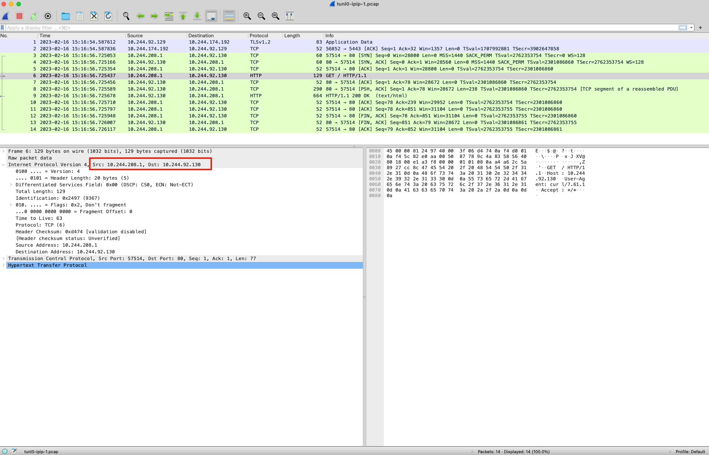
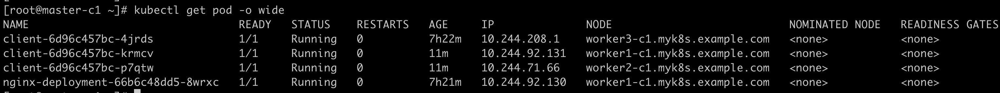
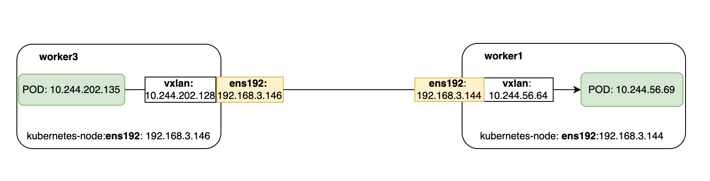

# 目标

1.  介绍 Calico 架构以及相关组件
1. 通过试验验证 Calico 在 ipip，vxlan 模式下如何通信


# calico 架构





## calico API Server

可以使用 kubectl 直接管理 Calico


## Felix

Calico Agent，运行在每台Workload的节点上，主要负责配置路由及ACLs等信息来确保Endpoint的连通状态；。

根据具体的编排器环境，Felix负责：

**接口管理**

将有关接口的信息编入内核，以便内核能够正确处理来自该端点的流量。特别是，确保主机响应来自每个工作负载的ARP请求，提供主机的MAC，并为它所管理的接口启用IP转发。它还监控接口，以确保编程在适当的时候应用。

**路由编程**

将其主机上的端点的路由编程到Linux内核的FIB（转发信息库）。这可以确保到达主机上的以这些端点为目的地的数据包被相应地转发。

**ACL编程**

在Linux内核中编程ACL，以确保只有有效的流量可以在端点之间发送，并且端点不能规避Calico的安全措施。

**状态报告**

提供网络健康数据。特别是在配置其主机时报告错误和问题。这些数据被写入数据存储，以便对网络的其他组件和运营商可见。


## Typha

作为数据存储和Felix实例之间的一个守护程序运行，通过减少每个节点对数据存储的影响来增加规模。

Typha代表Felix和confd等所有客户端维护一个单一的数据存储连接。它缓存数据存储的状态，并复制事件，以便它们可以被推广到更多监听器。因为一个Typha实例可以支持数百个Felix实例，可以将数据存储的负载降低很多。由于Typha可以过滤掉与Felix无关的更新，它也减少了Felix的CPU使用。在一个大规模（100多个节点）的Kubernetes集群中，这是至关重要的，因为API服务器产生的更新数量随着节点数量的增加而增加。


## Etcd

分布式键值存储，主要负责网络元数据一致性，确保Calico网络状态的准确性，可以与kubernetes共用

Calico 有两种数据存储驱动

* etcd: 直接链接到一个etcd集群
* Kubernetes： 通过kubernetes 进行数据保存

### 使用kubernetes 的好处

1. 不需要一个单独的etcd集群，方便管理
2. 可以通过Kubernetes的RBAC进行ETCD资源的访问控制
3. 可以通过kubernetes 的audit log 来记录etcd的操作记录

### 使用外部etcd的好处

1. 可以在非kubernetes环境中部署
2. 允许分离 Kubernetes 和 Calico 资源，例如允许独立etcd扩展数据存储
3. 允许运行包含多个 Kubernetes 集群的 Calico 集群，例如，具有 Calico 主机保护的裸机服务器与 Kubernetes 集群互通；或多个 Kubernetes 集群之间互通


## BIRD

BIRD是一个标准的路由程序，它会从内核里面获取哪一些IP的路由发生了变化，然后通过标准BGP的路由协议扩散到整个其他的宿主机上，让外界都知道这个IP在这里，你们路由的时候得到这里来

主要负责把Felix写入Kernel的路由信息分发到当前Calico网络，确保Workload间的通信的有效性


## confd

开源的、轻量级的配置管理工具。监控Calico数据存储对BGP配置和全局默认的日志变更，如AS号、日志级别和IPAM信息。

Confd根据存储中的数据更新，动态生成BIRD配置文件。当配置文件发生变化时，confd会触发BIRD加载新的文件。


# calicoctl


##  calicoctl 配置


```
export KUBECONFIG=~/.kube/config
export DATASTORE_TYPE=kubernetes

calicoctl get ippool -o wide 
```


## 查看节点状态


```
[root@master1-k8s ~]# calicoctl node status
Calico process is running.

IPv4 BGP status
+---------------+-------------------+-------+----------+-------------+
| PEER ADDRESS  |     PEER TYPE     | STATE |  SINCE   |    INFO     |
+---------------+-------------------+-------+----------+-------------+
| 192.168.3.144 | node-to-node mesh | up    | 04:01:17 | Established |
| 192.168.3.145 | node-to-node mesh | up    | 12:12:55 | Established |
| 192.168.3.146 | node-to-node mesh | up    | 04:01:17 | Established |
+---------------+-------------------+-------+----------+-------------+

IPv6 BGP status
No IPv6 peers found.
```


## 查看ipam 

IPAM： IP Address Management 

可以看到，每一个节点会分配一个网段

```
[root@master1-k8s ~]# calicoctl ipam show --show-blocks
+----------+-------------------+-----------+------------+--------------+
| GROUPING |       CIDR        | IPS TOTAL | IPS IN USE |   IPS FREE   |
+----------+-------------------+-----------+------------+--------------+
| IP Pool  | 10.244.0.0/16     |     65536 | 16 (0%)    | 65520 (100%) |
| Block    | 10.244.202.128/26 |        64 | 4 (6%)     | 60 (94%)     |
| Block    | 10.244.218.64/26  |        64 | 4 (6%)     | 60 (94%)     |
| Block    | 10.244.238.192/26 |        64 | 4 (6%)     | 60 (94%)     |
| Block    | 10.244.56.64/26   |        64 | 4 (6%)     | 60 (94%)     |
+----------+-------------------+-----------+------------+--------------+

# 登陆到 worker node 查看路由情况

[root@worker2-k8s ~]# route -n
Kernel IP routing table
Destination     Gateway         Genmask         Flags Metric Ref    Use Iface
0.0.0.0         192.168.3.1     0.0.0.0         UG    100    0        0 ens192
10.244.56.64    192.168.3.144   255.255.255.192 UG    0      0        0 ens192
10.244.202.128  192.168.3.146   255.255.255.192 UG    0      0        0 ens192
10.244.218.64   192.168.3.141   255.255.255.192 UG    0      0        0 ens192
10.244.238.192  0.0.0.0         255.255.255.192 U     0      0        0 *
10.244.238.196  0.0.0.0         255.255.255.255 UH    0      0        0 calie9b76698b67
10.244.238.197  0.0.0.0         255.255.255.255 UH    0      0        0 cali5026b88a962
10.244.238.198  0.0.0.0         255.255.255.255 UH    0      0        0 cali32ee8688a3d
172.17.0.0      0.0.0.0         255.255.0.0     U     0      0        0 docker0
192.168.3.0     0.0.0.0         255.255.255.0   U     100    0        0 ens192
```


calico IPAM管理逻辑

1.  Calico每个Node一个分配一个Block
2. 每个Block默认为64个IP
3. 当单个Node启动的Pod超过64时，才会分配下一个Block


## 查看 workloadendpoints

这里显示了pod 与 相关网卡的映射关系

```
[root@master1-k8s ~]# calicoctl get workloadendpoints
WORKLOAD                            NODE                            NETWORKS            INTERFACE
client-6d96c457bc-bd2p9             worker1-k8s.myk8s.example.com   10.244.56.65/32     cali3745790aa7e
client-6d96c457bc-c4g2d             worker1-k8s.myk8s.example.com   10.244.56.66/32     cali125b553761d
client-6d96c457bc-nn2m6             worker3-k8s.myk8s.example.com   10.244.202.130/32   calibe7f2613b91
client-6d96c457bc-prsd2             worker2-k8s.myk8s.example.com   10.244.238.195/32   cali5026b88a962
client-6d96c457bc-rb45h             worker3-k8s.myk8s.example.com   10.244.202.131/32   cali6dcb580d758
client-6d96c457bc-v7qh4             worker2-k8s.myk8s.example.com   10.244.238.194/32   cali32ee8688a3d
nginx-deployment-66b6c48dd5-hfqkp   worker1-k8s.myk8s.example.com   10.244.56.67/32     calieae43b83db8
```


同时也可以从另一个角度来验证该问题

```

[root@master1-k8s ~]# kubectl exec -it client-6d96c457bc-v7qh4 sh
kubectl exec [POD] [COMMAND] is DEPRECATED and will be removed in a future version. Use kubectl exec [POD] -- [COMMAND] instead.
sh-4.4# nettools -S eth0
sh: nettools: command not found
sh-4.4#
sh-4.4# ethtool -S eth0
NIC statistics:
     peer_ifindex: 17      # 这里可以看到 peer 的id 是17， 从上边信息可以看到，这个pod位于worker2节点上
     rx_queue_0_xdp_packets: 0
     rx_queue_0_xdp_bytes: 0
     rx_queue_0_drops: 0
     rx_queue_0_xdp_redirect: 0
     rx_queue_0_xdp_drops: 0
     rx_queue_0_xdp_tx: 0
     rx_queue_0_xdp_tx_errors: 0
     tx_queue_0_xdp_xmit: 0
     tx_queue_0_xdp_xmit_errors: 0
sh-4.4#

####### 登陆到 worker2, 执行  ip addr 可以获取相关信息

[root@worker2-k8s ~]# ip addr
1: lo: <LOOPBACK,UP,LOWER_UP> mtu 65536 qdisc noqueue state UNKNOWN group default qlen 1000
    link/loopback 00:00:00:00:00:00 brd 00:00:00:00:00:00
    inet 127.0.0.1/8 scope host lo
       valid_lft forever preferred_lft forever
    inet6 ::1/128 scope host
       valid_lft forever preferred_lft forever
2: ens192: <BROADCAST,MULTICAST,UP,LOWER_UP> mtu 1500 qdisc mq state UP group default qlen 1000
    link/ether 00:50:56:9d:1a:f2 brd ff:ff:ff:ff:ff:ff
    inet 192.168.3.145/24 brd 192.168.3.255 scope global noprefixroute ens192
       valid_lft forever preferred_lft forever
    inet6 fe80::250:56ff:fe9d:1af2/64 scope link noprefixroute
       valid_lft forever preferred_lft forever
3: docker0: <NO-CARRIER,BROADCAST,MULTICAST,UP> mtu 1500 qdisc noqueue state DOWN group default
    link/ether 02:42:12:de:87:ad brd ff:ff:ff:ff:ff:ff
    inet 172.17.0.1/16 brd 172.17.255.255 scope global docker0
       valid_lft forever preferred_lft forever
15: vxlan.calico: <BROADCAST,MULTICAST,UP,LOWER_UP> mtu 1450 qdisc noqueue state UNKNOWN group default
    link/ether 66:b6:a5:9d:e1:c9 brd ff:ff:ff:ff:ff:ff
    inet 10.244.238.192/32 scope global vxlan.calico
       valid_lft forever preferred_lft forever
    inet6 fe80::64b6:a5ff:fe9d:e1c9/64 scope link
       valid_lft forever preferred_lft forever
16: calie9b76698b67@if3: <BROADCAST,MULTICAST,UP,LOWER_UP> mtu 1450 qdisc noqueue state UP group default
    link/ether ee:ee:ee:ee:ee:ee brd ff:ff:ff:ff:ff:ff link-netnsid 0
    inet6 fe80::ecee:eeff:feee:eeee/64 scope link
       valid_lft forever preferred_lft forever
17: cali32ee8688a3d@if3: <BROADCAST,MULTICAST,UP,LOWER_UP> mtu 1450 qdisc noqueue state UP group default
    link/ether ee:ee:ee:ee:ee:ee brd ff:ff:ff:ff:ff:ff link-netnsid 1
    inet6 fe80::ecee:eeff:feee:eeee/64 scope link
       valid_lft forever preferred_lft forever
18: cali5026b88a962@if3: <BROADCAST,MULTICAST,UP,LOWER_UP> mtu 1450 qdisc noqueue state UP group default
    link/ether ee:ee:ee:ee:ee:ee brd ff:ff:ff:ff:ff:ff link-netnsid 2
    inet6 fe80::ecee:eeff:feee:eeee/64 scope link
       valid_lft forever preferred_lft forever

```


# Calico 网络


## CNI


CNI（容器网络接口）是一个标准API，允许将不同的网络实现插入Kubernetes。每当创建或销毁Pod时，Kubernetes都会调用API。CNI插件有两种类型：

- CNI网络插件：负责向Kubernetes Pod网络中添加Pod或从Kubernetes Pod网络中删除Pod。这包括创建/删除每个Pod的网络接口，以及将其连接/断开与其他网络实现的连接。
- CNI IPAM插件：负责在Pod创建或删除时分配和释放Pod的IP地址。根据插件的不同，这可能包括为每个节点分配一个或多个IP地址（CIDR）范围，或从底层公共云网络获取IP地址以分配给Pod。


## overlay

如果 Kubernetes 集群的节点不在同一个子网里，没法通过二层网络把 IP 包发送到下一跳地址，这种情景下就可以使用 Overlay 模式

### IPIP

将一个IP包封装到另一个IP包中，把IP层封装到IP层的一个tunnel中，通过两端的路由做一个tunnel，把两个原来不通的网络通过点对点连接。ipip是linux内核模块，加载ipip模块后可以使用IP-in-IP Tunnel，calico以ipip模式运行时，每个主机上会出现一个tunl0的网卡设备用来进行ipip tunnel的封装


### vxlan

通过vxlan进行封包


## underlay

### BGP

Border Gateway Protocol边界网关协议是互联网上一个核心的去中心化自治路由协议。它通过维护IP路由表或“前缀”表来实现自治系统A(Autonomous System)之间的可达性，属于矢量路由协议。BGP不使用传统的内部网关协议（IGP）的指标，而使用基于路径、网络策略或规则集来决定路由。因此，它更适合被称为矢量性协议，而不是路由协议。每个AS都有一个AS号，64512到65535共1023个AS号码可用于私有网络，calico默认使用的AS是64512，AS内部的BGP Speaker通过BGP协议交换路由信息。BGP Speaker之间有bgp mesh(node to node mesh)和bgp route reflector(bgp rr)两种互联模式


```
[root@master-c3 calico]# calicoctl get node -o wide
NAME                           ASN       IPV4               IPV6
master-c3.myk8s.example.com    (64512)   192.168.3.110/24
worker1-c3.myk8s.example.com   (64512)   192.168.3.111/24
worker2-c3.myk8s.example.com   (64512)   192.168.3.112/24
worker3-c3.myk8s.example.com   (64512)   192.168.3.113/24
```


#### BGP mesh

全互联模式，就是一个 `BGP Speaker` 需要与其它所有的 `BGP Speaker` 建立 bgp 连接（形成一个bgp mesh）。

网络中 bgp 总连接数是按照 O(n^2) 增长的，有太多的 `BGP Speaker` 时，会消耗大量的连接。

Calico 默认使用全互联的方式，扩展性比较差，一般建议100节点以内的集群使用mesh模式


#### BGP Router Reflector 

RR模式，就是在网络中指定一个或多个 `BGP Speaker` 作为 反射路由（Router Reflector），RR 与所有的 `BGP Speaker` 建立 bgp 连接。

每个 `BGP Speaker` 只需要与 RR 交换路由信息，就可以得到全网路由信息。

RR 必须与所有的 `BGP Speaker` 建立 BGP 连接，以保证能够得到全网路由信息。

在 Calico 中可以通过 `Global Peer` 实现 RR 模式。

`Global Peer` 是一个 `BGP Speaker` ，需要手动在 Calico 中创建，所有的 node 都会与 `Global peer` 建立 BGP 连接。

关闭了全互联模式后，再将 RR 作为 `Global Peers` 添加到 Calico 中，Calico 网络就切换到了 RR 模式，可以支撑容纳更多的 node。


## CrossSubnet


在使用场景上当主机节点处于不同网络分段，需要跨网段通信时，BGP模式将会失效，此时要使用IPIP，vxlan模式。 Calico的BGP Mesh模式适合在小规模集群(节点数量小于100个)中直接互联，由于随着集群节点数量的增加，路由规则将成指数级增长会给集群网络带来很大压力。大规模集群需要使用BGP Route Reflector 模式


Calico 网络从overlay 和 underlay 角度而言，分为两大块

Calico Overlay 有两种模式可选

* Overlay
  * IPIP
  * vxlan

两种模式均支持以下参数

- Always: 永远进行 IPIP，vxlan 封装(默认)
- CrossSubnet: 只在跨网段时才进行 IPIP，vxlan 封装，适合有 Kubernetes 节点在其他网段的情况，属于中肯友好方案
- Never: 从不进行 IPIP，vxlan 封装，适合确认所有 Kubernetes 节点都在同一个网段下的情况


In general, we recommend running Calico without network overlay/encapsulation. This gives you the highest performance and simplest network; the packet that leaves your workload is the packet that goes on the wire.

However, selectively using overlays/encapsulation can be useful when running on top of an underlying network that cannot easily be made aware of workload IPs. A common example is if you are using Calico networking in AWS across multiple VPCs/subnets. In this case, Calico can selectively encapsulate only the traffic that is routed between the VPCs/subnets, and run without encapsulation within each VPC/subnet. You might also decide to run your entire Calico network with encapsulation as an overlay network – as a quick way to get started without setting up BGP peering or other routing information in your underlying network.


#### 最佳实践


Calico has an option to selectively encapsulate only traffic that crosses subnet boundaries. We recommend using the **cross-subnet** option with IP in IP or VXLAN to minimize encapsulation overhead. Cross-subnet mode provides better performance in AWS multi-AZ deployments, Azure VNETs, and on networks where routers are used to connect pools of nodes with L2 connectivity.


# DEMO


## IPIP-always

从字面来理解，就是把一个IP数据包又套在一个IP包里，即把 IP 层封装到 IP 层的一个 tunnel。它的作用其实基本上就相当于一个基于IP层的网桥！一般来说，普通的网桥是基于mac层的，根本不需 IP，而这个 ipip 则是通过两端的路由做一个 tunnel，把两个本来不通的网络通过点对点连接起来。 


| name                | ip            |
| ------------------- | ------------- |
| master1             | 192.168.3.141 |
| worker1             | 192.168.3.144 |
| worker2             | 192.168.3.145 |
| worker3             | 192.168.3.146 |
| Host2(集群外部节点) | 192.168.3.148 |


### 配置 IPIP模式

修改 `custom-resources.yaml` 文件

```

apiVersion: operator.tigera.io/v1
kind: Installation
metadata:
  name: default
spec:
  # Configures Calico networking.
  calicoNetwork:
    # Note: The ipPools section cannot be modified post-install.
    ipPools:
    - blockSize: 26
      cidr: 10.244.0.0/16
      encapsulation: IPIP   # 修改这一行，安装IPIP模式
      natOutgoing: Enabled
      nodeSelector: all()
...
```


检查结果

```
[root@master-c1 calico]# calicoctl get ippool -o wide
NAME                  CIDR            NAT    IPIPMODE   VXLANMODE   DISABLED   DISABLEBGPEXPORT   SELECTOR
default-ipv4-ippool   10.244.0.0/16   true   Always     Never       false      false              all()

```


配置不同的模式，可以在安装的时候选择不同的配置，也可以在安装后，修改配置

```
kubectl edit ipPool/default-ipv4-ippool
```


### Demo 准备

部署测试环境

```

kubectl create deployment client --image  quay.io/junkai/tools

# 部署nginx 服务
cat <<EOF | kubectl apply -f -
apiVersion: apps/v1
kind: Deployment
metadata:
  name: nginx-deployment
spec:
  selector:
    matchLabels:
      app: nginx
  replicas: 1
  template:
    metadata:
      labels:
        app: nginx
    spec:
      containers:
      - name: nginx
        image: nginx:1.14.2
        ports:
        - containerPort: 80
EOF

```


### pod->node->pod (pod 在不同节点)

场景如下，在一个kubernetes集群中 node1 


#### 查看路由规则


在 worker3 上查看路由信息，目标POD ip=10.244.92.130， 按照calico 产生的路由表，可以看到，需要将请求转发到 192.168.3.126 节点

```

[root@worker3-c1 ~]# ip route
default via 192.168.3.1 dev ens192 proto static metric 100
10.244.71.64/26 via 192.168.3.127 dev tunl0 proto bird onlink
10.244.92.128/26 via 192.168.3.126 dev tunl0 proto bird onlink    # 目标IP 范围
10.244.174.192/26 via 192.168.3.125 dev tunl0 proto bird onlink
blackhole 10.244.208.0/26 proto bird
10.244.208.1 dev cali573926084b2 scope link
172.17.0.0/16 dev docker0 proto kernel scope link src 172.17.0.1 linkdown
192.168.3.0/24 dev ens192 proto kernel scope link src 192.168.3.128 metric 100

```


#### 在worker1-ens192 上抓包 


```
tcpdump -i ens192 -vv -s0 -w ens192-ipip-1.pcap
```


#### 在 worker1-tunl0 上抓包

```
tcpdump -i tunl0 -vv -s0 -w tunl0-ipip-1.pcap
```





#### 在worker1-calia3c74f30c95 上抓包


查找对应的网卡信息，从下图可以得知 pod IP=10.244.92.130， 该pod位于 worker1


登陆到worker1， 执行以下命令，获取到pod对应的虚拟网卡信息

```
[root@worker1-c1 ~]# route -n | grep 10.244.92.130
10.244.92.130   0.0.0.0         255.255.255.255 UH    0      0        0 calia3c74f30c95
```

基于以上信息，对该 虚拟网卡进行抓包

```

tcpdump -i calia3c74f30c95 -vv -s0 -w cali-ipip-1.pcap

```


### pod->service


访问 service 的请求，会被 iptable 重定向到svc对应的 endpoints 后端 pod 


#### 测试过程


```
# 创建 SVC
kubectl expose deploy nginx-deployment --port=80

[root@master-c1 ~]# kubectl get svc
NAME               TYPE        CLUSTER-IP    EXTERNAL-IP   PORT(S)   AGE
kubernetes         ClusterIP   10.96.0.1     <none>        443/TCP   19h
nginx-deployment   ClusterIP   10.98.32.59   <none>        80/TCP    3s

[root@master-c1 ~]# kubectl get pod -o wide
NAME                                READY   STATUS    RESTARTS   AGE    IP              NODE                           NOMINATED NODE   READINESS GATES
client-6d96c457bc-4jrds             1/1     Running   0          9h     10.244.208.1    worker3-c1.myk8s.example.com   <none>           <none>
client-6d96c457bc-krmcv             1/1     Running   0          156m   10.244.92.131   worker1-c1.myk8s.example.com   <none>           <none>
client-6d96c457bc-p7qtw             1/1     Running   0          156m   10.244.71.66    worker2-c1.myk8s.example.com   <none>           <none>
nginx-deployment-66b6c48dd5-8wrxc   1/1     Running   0          9h     10.244.92.130   worker1-c1.myk8s.example.com   <none>           <none>
[root@master-c1 ~]#
[root@master-c1 ~]# kubectl exec -it client-6d96c457bc-4jrds sh
kubectl exec [POD] [COMMAND] is DEPRECATED and will be removed in a future version. Use kubectl exec [POD] -- [COMMAND] instead.
sh-4.4# curl 10.98.32.59
<!DOCTYPE html>
<html>
<head>
<title>Welcome to nginx!</title>
<style>
    body {
        width: 35em;
        margin: 0 auto;
        font-family: Tahoma, Verdana, Arial, sans-serif;
    }
</style>
</head>
<body>
<h1>Welcome to nginx!</h1>
<p>If you see this page, the nginx web server is successfully installed and
working. Further configuration is required.</p>

<p>For online documentation and support please refer to
<a href="http://nginx.org/">nginx.org</a>.<br/>
Commercial support is available at
<a href="http://nginx.com/">nginx.com</a>.</p>

<p><em>Thank you for using nginx.</em></p>
</body>
</html>
sh-4.4#
```


#### 在 worker1-ens192 抓包


#### 在 worker1-tunl0 抓包


#### 在 worker1-calicxxx 抓包


### pod->pod (同一个节点)





#### 在ens192 抓包

```
tcpdump -i ens192 -vv -s0 -w ens192-ipip-2.pcap
```

数据不经过 ens192 网卡


#### 在tunl0上抓包


```
tcpdump -i tunl0 -vv -s0 -w tunl0-ipip-2.pcap
```

没有数据包从tunl0 经过


#### 在 calia3c74f30c95 上抓包

```
tcpdump -i calia3c74f30c95 -vv -s0 -w cali-ipip-2.pcap
```


可以看到calico为每一个pod都创建了相关的静态路由，通过


### pod-> 外部服务


#### 测试过程

1. 在集群外部部署HTTPD服务，IP 为 192.168.3.148
2. 从 pod（10.244.92.131） 发起 请求访问外部http-server
3. 在http-server  抓包
4. 在 worker1 节点上，分别对 ens192， tunl0， caliab181ed4113 抓包


```
yum install -y httpd
echo "Successful Web Server Test" > /var/www/html/index.html
systemctl start httpd
```


#### 查看路由规则

从这里可以看出

```
[root@worker1-c1 ~]# route -n
Kernel IP routing table
Destination     Gateway         Genmask         Flags Metric Ref    Use Iface
0.0.0.0         192.168.3.1     0.0.0.0         UG    100    0        0 ens192
10.244.71.64    192.168.3.127   255.255.255.192 UG    0      0        0 tunl0
10.244.92.128   0.0.0.0         255.255.255.192 U     0      0        0 *
10.244.92.129   0.0.0.0         255.255.255.255 UH    0      0        0 cali2e3ad606b7a
10.244.92.130   0.0.0.0         255.255.255.255 UH    0      0        0 calia3c74f30c95
10.244.92.131   0.0.0.0         255.255.255.255 UH    0      0        0 caliab181ed4113
10.244.174.192  192.168.3.125   255.255.255.192 UG    0      0        0 tunl0
10.244.208.0    192.168.3.128   255.255.255.192 UG    0      0        0 tunl0
172.17.0.0      0.0.0.0         255.255.0.0     U     0      0        0 docker0
192.168.3.0     0.0.0.0         255.255.255.0   U     100    0        0 ens192      # 匹配路由规则
```


#### 	在worker1-ens192上抓包分析


```
1. 在ens192 上抓包
tcpdump -i ens192 -vv -s0 -w ens192-ipip-3.pcap

2. 在tunl0 上抓包
tcpdump -i tunl0 -vv -s0 -w tunl0-ipip-3.pcap

3. 在calixxx 上抓包
tcpdump -i caliab181ed4113 -vv -s0 -w cali-ipip-3.pcap
```

在 ens192 和 caliab181ed4113 上可以抓到数据包， tunl0 没有数据包


#### 在 worker1-calicxxx 抓包


#### 在HTTP-Server 上抓包


## vxlan-Crosssubnet


| name                         | ip            |
| ---------------------------- | ------------- |
| master-c2.myk8s.example.com  | 192.168.3.115 |
| worker1-c2.myk8s.example.com | 192.168.3.116 |
| worker2-c2.myk8s.example.com | 192.168.3.117 |
| worker3-c2.myk8s.example.com | 192.168.3.118 |


### 安装为 vxlan-CrossSubnet 模式

参考以下内容修改 custom-resources.yaml  

```
apiVersion: operator.tigera.io/v1
kind: Installation
metadata:
  name: default
spec:
  # Configures Calico networking.
  calicoNetwork:
    # Note: The ipPools section cannot be modified post-install.
    ipPools:
    - blockSize: 26
      cidr: 10.244.0.0/16
      encapsulation: VXLANCrossSubnet   # 配置为vxlancrosssubnet 模式
      natOutgoing: Enabled
      nodeSelector: all()

```


## Vxlan-ways


| name                          | IP            |
| ----------------------------- | ------------- |
| master1-k8s.myk8s.example.com | 192.168.3.141 |
| worker1-k8s.myk8s.example.com | 192.168.3.144 |
| worker2-k8s.myk8s.example.com | 192.168.3.145 |
| worker3-k8s.myk8s.example.com | 192.168.3.146 |


### 安装为vxlan-always模式

修改 `custom-resources.yaml` 文件

```
apiVersion: operator.tigera.io/v1
kind: Installation
metadata:
  name: default
spec:
  # Configures Calico networking.
  calicoNetwork:
    # Note: The ipPools section cannot be modified post-install.
    ipPools:
    - blockSize: 26
      cidr: 10.244.0.0/16
      encapsulation: VXLAN
      natOutgoing: Enabled
      nodeSelector: all()
```


查看结果，可以看到 VXLANMODE 值 为 Always 

```
[root@master1-k8s ~]# calicoctl get ippool -o wide
NAME                  CIDR            NAT    IPIPMODE   VXLANMODE   DISABLED   DISABLEBGPEXPORT   SELECTOR
default-ipv4-ippool   10.244.0.0/16   true   Never      Always      false      false              all()

```


当`vxlanMode`参数设置为 `Always` 的时候，三层和二层的通信都通过vxlan的方式进行通信，当值为`CrossSubnet`的时候只有三层才进行vxlan的方式进行通信


安装后，可以看到 对应的网络设备


### pod->pod （不同节点）





#### 测试过程

1. 在集群中部署 client pod
2. 部署 nginx server pod， 确保client pod和 server pod 分别部署在不同的node上
3. 在client 上访问 nginx  server pod 


#### 在ens192 抓包


从抓包可以看到，一个


#### 在 vxlan 抓包


#### 在calicxxx 抓包


# Other


## 修改calico 网络类型


```
kubectl edit ipPool/default-ipv4-ippool
```

### Configure IP in IP encapsulation for only cross-subnet traffic

IP in IP encapsulation can be performed selectively, and only for traffic crossing subnet boundaries.

To enable this feature, set `ipipMode` to `CrossSubnet`.

```
apiVersion: projectcalico.org/v3
kind: IPPool
metadata:
  name: ippool-ipip-cross-subnet-1
spec:
  cidr: 192.168.0.0/16
  ipipMode: CrossSubnet
  natOutgoing: true
```


### Configure IP in IP encapsulation for all inter workload traffic

With `ipipMode` set to `Always`, Calico routes traffic using IP in IP for all traffic originating from a Calico enabled-host, to all Calico networked containers and VMs within the IP pool.

```
apiVersion: projectcalico.org/v3
kind: IPPool
metadata:
  name: ippool-ipip-1
spec:
  cidr: 192.168.0.0/16
  ipipMode: Always
  natOutgoing: true
```


### Configure VXLAN encapsulation for only cross subnet traffic

VXLAN encapsulation can be performed selectively, and only for traffic crossing subnet boundaries.

To enable this feature, set `vxlanMode` to `CrossSubnet`.

```
apiVersion: projectcalico.org/v3
kind: IPPool
metadata:
  name: ippool-vxlan-cross-subnet-1
spec:
  cidr: 192.168.0.0/16
  vxlanMode: CrossSubnet
  natOutgoing: true
```


### Configure VXLAN encapsulation for all inter workload traffic

With `vxlanMode` set to `Always`, Calico routes traffic using VXLAN for all traffic originating from a Calico enabled host, to all Calico networked containers and VMs within the IP pool.

```
apiVersion: projectcalico.org/v3
kind: IPPool
metadata:
  name: ippool-vxlan-1
spec:
  cidr: 192.168.0.0/16
  vxlanMode: Always
  natOutgoing: true
```


## 路由表 Flags 标志


U up表示当前为启动状态

H host表示该路由为一个主机，多为达到数据包的路由

G Gateway 表示该路由是一个网关，如果没有说明目的地是直连的

D Dynamicaly 表示该路由是重定向报文修改

M 表示该路由已被重定向报文修改


# TODO


1. 为每一个场景准备package流向图
2. 针对每一个插件的最佳实践
   1. 应用场景说明
   2. 使用建议


# Reference

https://www.cnblogs.com/gxc888/p/15511444.html

https://www.onitroad.com/jc/linux/sec/firewall/firewalld-log.html

https://lqingcloud.cn/post/calico-07/

https://blog.csdn.net/ptmozhu/article/details/73301971

https://wqblogs.com/2020/12/14/calico%E9%83%A8%E7%BD%B2/

https://cloud.tencent.com/developer/article/1495301

https://www.tnblog.net/hb/article/details/7871

https://blog.csdn.net/ptmozhu/article/details/73301971


