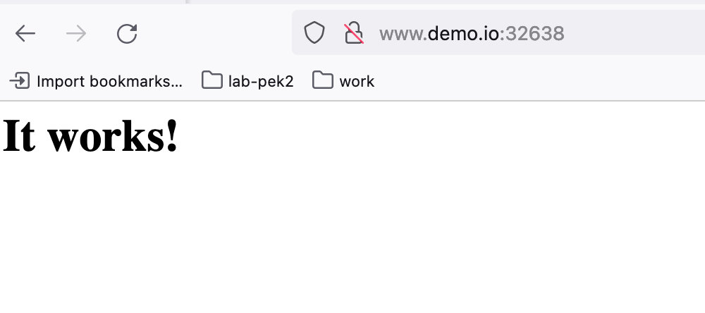

# install kubernetes cluster 


##  utils 节点

### 初始化

```
hostnamectl set-hostname utils.myk8s.example.com

cat <<EOF>> /etc/hosts
192.168.26.100 utils.myk8s.example.com
192.168.26.141 master1.myk8s.example.com
192.168.26.142 worker1.myk8s.example.com
192.168.26.143 worker2.myk8s.example.com
EOF

nmcli con mod ens160 ipv4.addresses 192.168.26.100/24
nmcli con mod ens160 ipv4.gateway 192.168.26.2
nmcli con mod ens160 ipv4.method manual
nmcli con mod ens160 ipv4.dns "192.168.26.2"
nmcli con up ens160

```


### harbor 

#### 安装docker-ce 

```

dnf config-manager --add-repo=https://download.docker.com/linux/centos/docker-ce.repo
yum install -y docker-ce 

# 修改 docker-ce cgroup driver  

cat <<EOF | sudo tee /etc/docker/daemon.json
{
  "exec-opts": ["native.cgroupdriver=systemd"],
  "log-driver": "json-file",
  "log-opts": {
    "max-size": "100m"
  },
  "storage-driver": "overlay2"
}
EOF


systemctl enable --now docker 

```


### 安装yum 源

同步base源


## 安装控制节点 

```
hostnamectl set-hostname master1.myk8s.example.com

nmcli con mod ens160 ipv4.addresses 192.168.26.141/24
nmcli con mod ens160 ipv4.gateway 192.168.26.2
nmcli con mod ens160 ipv4.method manual
nmcli con mod ens160 ipv4.dns "192.168.26.2"
nmcli con up ens160

cat <<EOF>> /etc/hosts
192.168.26.137 master1.myk8s.example.com
192.168.26.145 worker1.myk8s.example.com
192.168.26.146 worker2.myk8s.example.com
EOF

swapoff  -a
sed -i '/swap/d' /etc/fstab

setenforce 0
sudo sed -i 's/^SELINUX=enforcing$/SELINUX=permissive/' /etc/selinux/config

modprobe overlay
modprobe br_netfilter

tee /etc/sysctl.d/k8s.conf<<EOF
net.bridge.bridge-nf-call-iptables = 1
net.bridge.bridge-nf-call-ip6tables = 1
net.ipv4.ip_forward = 1
EOF

sysctl --system

# 安装docker-ce 

dnf config-manager --add-repo=https://download.docker.com/linux/centos/docker-ce.repo
yum install -y docker-ce 

systemctl enable docker
systemctl start docker
systemctl status docker


# 控制节点
firewall-cmd --permanent --add-port=6443/tcp
firewall-cmd --permanent --add-port=2379-2380/tcp
firewall-cmd --permanent --add-port=10250/tcp
firewall-cmd --permanent --add-port=10251/tcp
firewall-cmd --permanent --add-port=10252/tcp
firewall-cmd --reload


# 计算节点
firewall-cmd --permanent --add-port=10250/tcp
firewall-cmd --permanent --add-port=30000-32767/tcp
firewall-cmd --reload


# 使用阿里云的资源 
cat <<EOF > /etc/yum.repos.d/kubernetes.repo
[kubernetes]
name=Kubernetes
baseurl=https://mirrors.aliyun.com/kubernetes/yum/repos/kubernetes-el7-x86_64/
enabled=1
gpgcheck=1
repo_gpgcheck=1
gpgkey=https://mirrors.aliyun.com/kubernetes/yum/doc/yum-key.gpg https://mirrors.aliyun.com/kubernetes/yum/doc/rpm-package-key.gpg
EOF

#  安装 k8s 1.22 版本 

yum --showduplicates list kubeadm

version=1.22.10-0
yum install -y kubectl-${version} kubelet-${version}  kubeadm-${version} 


sudo systemctl enable --now kubelet
sudo systemctl enable --now docker 


lsmod | grep br_netfilter


# 使用本地镜像
scp -r root@192.168.26.100:/var/www/html/repos .

kubeadm init --kubernetes-version=v1.22.10 --pod-network-cidr=10.244.0.0/16 --image-repository=registry.aliyuncs.com/google_containers


docker tag registry.aliyuncs.com/google_containers/pause:3.5 registry.k8s.io/pause:3.5

```


###  控制节点安装后配置

```

source <(kubectl completion bash)
yum install -y bash-completion

```


## 故障排查

### 现象

安装的时候，docker 没有启动容器，查看日志，发现以下错误

```

Kubelet: misconfiguration: kubelet cgroup driver: \"systemd\" is different from docker cgroup driver: \"cgroupfs\""

```

分析原因应该是 OS 的cgroup driver 与 docker 的cgropu driver 不一致， 执行 `docker info` 查看docker的cgroup driver 是cgroupfs 


```
[root@localhost ~]# docker info
Client:
 Context:    default
 Debug Mode: false
 Plugins:
  app: Docker App (Docker Inc., v0.9.1-beta3)
  buildx: Docker Buildx (Docker Inc., v0.8.2-docker)
  scan: Docker Scan (Docker Inc., v0.17.0)

Server:
 Containers: 0
  Running: 0
  Paused: 0
  Stopped: 0
 Images: 7
 Server Version: 20.10.16
 Storage Driver: overlay2
  Backing Filesystem: xfs
  Supports d_type: true
  Native Overlay Diff: true
  userxattr: false
 Logging Driver: json-file
 Cgroup Driver: cgroupfs     #  这里是cgroupfs 
 Cgroup Version: 1

######## 


```


### 解决方案

```

cat <<EOF | sudo tee /etc/docker/daemon.json
{
  "exec-opts": ["native.cgroupdriver=systemd"],
  "log-driver": "json-file",
  "log-opts": {
    "max-size": "100m"
  },
  "storage-driver": "overlay2"
}
EOF
systemctl daemon-reload
systemctl restart docker
```


## 计算节点


### worker1


```
hostnamectl set-hostname worker1.myk8s.example.com

nmcli con mod ens160 ipv4.addresses 192.168.26.142/24
nmcli con mod ens160 ipv4.gateway 192.168.26.2
nmcli con mod ens160 ipv4.method manual
nmcli con mod ens160 ipv4.dns "192.168.26.2"
nmcli con up ens160

cat <<EOF>> /etc/hosts
192.168.26.137 master1.myk8s.example.com
192.168.26.145 worker1.myk8s.example.com
192.168.26.146 worker2.myk8s.example.com
EOF

swapoff  -a
sed -i '/swap/d' /etc/fstab

setenforce 0
sudo sed -i 's/^SELINUX=enforcing$/SELINUX=permissive/' /etc/selinux/config

modprobe overlay
modprobe br_netfilter

tee /etc/sysctl.d/k8s.conf<<EOF
net.bridge.bridge-nf-call-iptables = 1
net.bridge.bridge-nf-call-ip6tables = 1
net.ipv4.ip_forward = 1
EOF

sysctl --system


# 安装 docker-ce 

dnf config-manager --add-repo=https://download.docker.com/linux/centos/docker-ce.repo
yum install -y docker-ce 

systemctl enable --now docker 

# 修改 docker-ce cgroup driver  

cat <<EOF | sudo tee /etc/docker/daemon.json
{
  "exec-opts": ["native.cgroupdriver=systemd"],
  "log-driver": "json-file",
  "log-opts": {
    "max-size": "100m"
  },
  "storage-driver": "overlay2"
}
EOF

systemctl daemon-reload && systemctl restart docker

# 计算节点
firewall-cmd --permanent --add-port=10250/tcp
firewall-cmd --permanent --add-port=30000-32767/tcp
firewall-cmd --reload


# 使用阿里云的资源 
cat <<EOF > /etc/yum.repos.d/kubernetes.repo
[kubernetes]
name=Kubernetes
baseurl=https://mirrors.aliyun.com/kubernetes/yum/repos/kubernetes-el7-x86_64/
enabled=1
gpgcheck=1
repo_gpgcheck=1
gpgkey=https://mirrors.aliyun.com/kubernetes/yum/doc/yum-key.gpg https://mirrors.aliyun.com/kubernetes/yum/doc/rpm-package-key.gpg
EOF

#  安装 k8s 1.22 版本 

yum --showduplicates list kubeadm

version=1.22.10-0
yum install -y kubelet-${version}  kubeadm-${version} 


systemctl enable --now kubelet


systemctl enable kubelet && systemctl start kubelet


# load image 

scp -r root@192.168.26.100:/var/www/html/repos/images .

cd images 
for each in `ls *.tar`; do docker load -i $each; done

```


### worker2

```
hostnamectl set-hostname worker2.myk8s.example.com

nmcli con mod ens160 ipv4.addresses 192.168.26.143/24
nmcli con mod ens160 ipv4.gateway 192.168.26.2
nmcli con mod ens160 ipv4.method manual
nmcli con mod ens160 ipv4.dns "192.168.26.2"
nmcli con up ens160

cat <<EOF>> /etc/hosts
192.168.26.100 utils.myk8s.example.com
192.168.26.137 master1.myk8s.example.com
192.168.26.145 worker1.myk8s.example.com
192.168.26.146 worker2.myk8s.example.com
EOF

swapoff  -a
sed -i '/swap/d' /etc/fstab

setenforce 0
sudo sed -i 's/^SELINUX=enforcing$/SELINUX=permissive/' /etc/selinux/config

modprobe overlay
modprobe br_netfilter

tee /etc/sysctl.d/k8s.conf<<EOF
net.bridge.bridge-nf-call-iptables = 1
net.bridge.bridge-nf-call-ip6tables = 1
net.ipv4.ip_forward = 1
EOF

sysctl --system


# 安装 docker-ce 

dnf config-manager --add-repo=https://download.docker.com/linux/centos/docker-ce.repo
yum install -y docker-ce 

systemctl enable --now docker 

# 修改 docker-ce cgroup driver  

cat <<EOF | sudo tee /etc/docker/daemon.json
{
  "exec-opts": ["native.cgroupdriver=systemd"],
  "log-driver": "json-file",
  "log-opts": {
    "max-size": "100m"
  },
  "storage-driver": "overlay2"
}
EOF

systemctl daemon-reload
systemctl restart docker


# 计算节点
firewall-cmd --permanent --add-port=10250/tcp
firewall-cmd --permanent --add-port=30000-32767/tcp
firewall-cmd --reload


# 使用阿里云的资源 
cat <<EOF > /etc/yum.repos.d/kubernetes.repo
[kubernetes]
name=Kubernetes
baseurl=https://mirrors.aliyun.com/kubernetes/yum/repos/kubernetes-el7-x86_64/
enabled=1
gpgcheck=1
repo_gpgcheck=1
gpgkey=https://mirrors.aliyun.com/kubernetes/yum/doc/yum-key.gpg https://mirrors.aliyun.com/kubernetes/yum/doc/rpm-package-key.gpg
EOF

#  安装 k8s 1.22 版本 

yum --showduplicates list kubeadm

version=1.22.10-0
yum install -y kubelet-${version}  kubeadm-${version} 

systemctl enable --now kubelet


# load image 

scp -r root@192.168.26.100:/var/www/html/repos/images .
cd images 
for each in `ls *.tar`; do docker load -i $each; done

```


# install calico

```

curl -LO https://projectcalico.docs.tigera.io/manifests/tigera-operator.yaml
kubectl apply -f tigera-operator.yaml
curl -LO https://projectcalico.docs.tigera.io/manifests/custom-resources.yaml 

# via local web server
curl -LO http://192.168.26.100/repos/calico/tigera-operator.yaml
curl -LO http://192.168.26.100/repos/calico/custom-resources.yaml

kubectl apply -f tigera-operator.yaml

```

## 修改文件配置文件

```
vi custom-resources.yaml

... 
spec:
  # Configures Calico networking.
  calicoNetwork:
    # Note: The ipPools section cannot be modified post-install.
    ipPools:
    - blockSize: 26
      cidr: 10.244.0.0/16     # 修改这一行，与之前kubeadm init 中的参数一致
      encapsulation: VXLANCrossSubnet
      natOutgoing: Enabled
      nodeSelector: all()


#  kubectl apply -f custom-resources.yaml

# 在所有节点上关闭防火墙 
systemctl stop firewalld
```


## 使用本地镜像仓库 

修改安装文件中路径，使用本地镜像仓库

```


# 下载文件到本地 
scp -r root@192.168.26.100:/var/www/html/repos .


# 加载本地镜像
cd /root/repos/images

for each in `ls *.tar` ; do  docker load -i $each; done


```


# install dashboard


```
curl -LO https://raw.githubusercontent.com/kubernetes/dashboard/v2.5.0/aio/deploy/recommended.yaml

```


## 修改配置文件

```
vi recommended.yaml 

 32 kind: Service
 33 apiVersion: v1
 34 metadata:
 35   labels:
 36     k8s-app: kubernetes-dashboard
 37   name: kubernetes-dashboard
 38   namespace: kubernetes-dashboard
 39 spec:
 40   type: NodePort    # 添加这一行
 41   ports:
 42     - port: 443
 43       targetPort: 8443
 44   selector:
 45     k8s-app: kubernetes-dashboard
 
```


## 使用本地镜像仓库 

修改安装文件，使用本地镜像仓库


## 创建用户token

```

cat <<EOF> dashboard-user.yaml
---
# create-user
apiVersion: v1
kind: ServiceAccount
metadata:
  name: admin-user
  namespace: kubernetes-dashboard

---
# rolebinding
apiVersion: rbac.authorization.k8s.io/v1
kind: ClusterRoleBinding
metadata:
  name: admin-user
roleRef:
  apiGroup: rbac.authorization.k8s.io
  kind: ClusterRole
  name: cluster-admin
subjects:
- kind: ServiceAccount
  name: admin-user
  namespace: kubernetes-dashboard
EOF

# 创建sa 以及 rolebinding 
[root@master1 dashboard]# kubectl apply -f dashboard-user.yaml
serviceaccount/admin-user created
clusterrolebinding.rbac.authorization.k8s.io/admin-user created
  
# 获取token, 执行以下命令获取token， 将以下token 输入 dashboard 页面，登陆dashboard (1.24 可用)
kubectl -n kubernetes-dashboard create token admin-user

# 获取token, 执行以下命令
[root@master1 ~]# kubectl -n kubernetes-dashboard get secret
NAME                               TYPE                                  DATA   AGE
admin-user-token-r6qwk             kubernetes.io/service-account-token   3      3h29m
default-token-zpkqb                kubernetes.io/service-account-token   3      3h36m
kubernetes-dashboard-certs         Opaque                                0      3h36m
kubernetes-dashboard-csrf          Opaque                                1      3h36m
kubernetes-dashboard-key-holder    Opaque                                2      3h35m
kubernetes-dashboard-token-8fwp9   kubernetes.io/service-account-token   3      3h36m


# 从上边命令中获取admin token 是admin-user-token-r6qwk， 通过以下命令获取token 
[root@master1 install]# kubectl -n kubernetes-dashboard get secrets admin-user-token-r6qwk -o json | jq -r ".data.token" | base64 -d
eyJhbGciOiJSUzI1NiIsImtpZCI6ImdTRy1FZ3RmcWp1WFk0U1g1TFlUTnlmd203NTg2Y1ViX0tsNF9KTE1SdTgifQ.eyJpc3MiOiJrdWJlcm5ldGVzL3NlcnZpY2VhY2NvdW50Iiwia3ViZXJuZXRlcy5pby9zZXJ2aWNlYWNjb3VudC9uYW1lc3BhY2UiOiJrdWJlcm5ldGVzLWRhc2hib2FyZCIsImt1YmVybmV0ZXMuaW8vc2VydmljZWFjY291bnQvc2VjcmV0Lm5hbWUiOiJhZG1pbi11c2VyLXRva2VuLXI2cXdrIiwia3ViZXJuZXRlcy5pby9zZXJ2aWNlYWNjb3VudC9zZXJ2aWNlLWFjY291bnQubmFtZSI6ImFkbWluLXVzZXIiLCJrdWJlcm5ldGVzLmlvL3NlcnZpY2VhY2NvdW50L3NlcnZpY2UtYWNjb3VudC51aWQiOiIyMDQxOTU4My05NTFmLTQzOWUtYTI2MS1iOGI3YzY0YzA0NTMiLCJzdWIiOiJzeXN0ZW06c2VydmljZWFjY291bnQ6a3ViZXJuZXRlcy1kYXNoYm9hcmQ6YWRtaW4tdXNlciJ9.GKEv_zp-41FFsAhzmpa-c-TnufxaUbKdJGCmNYI4rWchmI4kTfMZdEZ-7JkDtDXLAZZULU1gO4jXiYttOuE1jmg5DLp4FL-XEGDJjNSG7NK5BjXm0Uog-9OGi-SdvpvAlLpBEt4c2oChfE64lqMGBoHHLUkIiWcFZ9HPMInySscj26cqiQjMlAh6bOg7k-m39J8aoLGM-RU9JKa47OoN2OMASqF2PXTuIKmLlixNCTyErk0sn-CIyqOBQW1bqJf0gJ0PnQyPprLKJ6_c2buyAYQ04Q2bWNZQwHqBI7jGtRS2y92dGTGmCobYQuyapm2lfYglShokMeTAceW0WwindA
```


# install ingress

## 使用nodeport 部署ingress controller 

下载安装所需要的镜像和deploy文件

```
docker pull k8s.gcr.io/ingress-nginx/controller:v1.2.0
docker pull k8s.gcr.io/ingress-nginx/kube-webhook-certgen:v1.1.1

curl -LO  https://raw.githubusercontent.com/kubernetes/ingress-nginx/controller-v1.2.0/deploy/static/provider/cloud/deploy.yaml

# 修改service type 为 Nodeport
sed -i 's/LoadBalancer/NodePort/g' deploy.yaml
```


修改文件

把文件中的 image 中 sha256 删掉 

```
 sed -i 's/@sha256.*$//g' deploy.yaml
 
 
[root@master1 nginx-ingress]# cat deploy.yaml | grep image
        image: k8s.gcr.io/ingress-nginx/controller:v1.2.0@sha256:d8196e3bc1e72547c5dec66d6556c0ff92a23f6d0919b206be170bc90d5f9185
        imagePullPolicy: IfNotPresent
        image: k8s.gcr.io/ingress-nginx/kube-webhook-certgen:v1.1.1@sha256:64d8c73dca984af206adf9d6d7e46aa550362b1d7a01f3a0a91b20cc67868660
        imagePullPolicy: IfNotPresent
        image: k8s.gcr.io/ingress-nginx/kube-webhook-certgen:v1.1.1@sha256:64d8c73dca984af206adf9d6d7e46aa550362b1d7a01f3a0a91b20cc67868660
        imagePullPolicy: IfNotPresent

```


修改后是这一个样子

```
[root@master1 nginx-ingress]# cat deploy.yaml | grep image
        image: k8s.gcr.io/ingress-nginx/controller:v1.2.0
        imagePullPolicy: IfNotPresent
        image: k8s.gcr.io/ingress-nginx/kube-webhook-certgen:v1.1.1
        imagePullPolicy: IfNotPresent
        image: k8s.gcr.io/ingress-nginx/kube-webhook-certgen:v1.1.1
        imagePullPolicy: IfNotPresent
```


将同步下来的镜像分别load 到其他的节点中 


部署ingress

```

kubectl apply -f deploy.yaml
```


### 测试用例-1

```

kubectl create deployment demo --image=httpd --port=80
kubectl expose deployment demo

kubectl create ingress demo --class=nginx --rule www.demo.io/=demo:80

# 在本地 /etc/hosts 文件中添加关于 www.demo.io 的解析
# 通过以下命令获取nodeport 
[root@master1 nginx-ingress]# kubectl -n ingress-nginx get svc
NAME                                 TYPE        CLUSTER-IP      EXTERNAL-IP   PORT(S)                      AGE
ingress-nginx-controller             NodePort    10.107.137.22   <none>        80:32638/TCP,443:31218/TCP   11m
ingress-nginx-controller-admission   ClusterIP   10.106.226.56   <none>        443/TCP                      11m

# 通过浏览器访问 http://www.demo.io:32638，如下图所示，可以正常工作 
```




### 测试用例-2

```

kubectl create deployment mydemo1 --image quay.io/junkai/demo:1.0
kubectl expose deployment mydemo1 --port=8080

kubectl create ingress mydemo --class=nginx --rule www.mydemo.io/=mydemo1:8080

# 在本地 /etc/hosts 文件中添加关于 www.demo.io 的解析
# 通过以下命令获取nodeport 
[root@master1 nginx-ingress]# kubectl -n ingress-nginx get svc
NAME                                 TYPE        CLUSTER-IP      EXTERNAL-IP   PORT(S)                      AGE
ingress-nginx-controller             NodePort    10.107.137.22   <none>        80:32638/TCP,443:31218/TCP   11m
ingress-nginx-controller-admission   ClusterIP   10.106.226.56   <none>        443/TCP                      11m

# 通过浏览器访问 http://www.mydemo.io:32638

```


## 使用hostnetwork 部署ingress controller

```
vi deploy.yaml 

...
apiVersion: apps/v1
kind: Deployment
metadata:
  labels:
    app.kubernetes.io/component: controller
    app.kubernetes.io/instance: ingress-nginx
    app.kubernetes.io/name: ingress-nginx
    app.kubernetes.io/part-of: ingress-nginx
    app.kubernetes.io/version: 1.2.0
  name: ingress-nginx-controller
  namespace: ingress-nginx
spec:
  minReadySeconds: 0
  revisionHistoryLimit: 10
  selector:
    matchLabels:
      app.kubernetes.io/component: controller
      app.kubernetes.io/instance: ingress-nginx
      app.kubernetes.io/name: ingress-nginx
  template:
    metadata:
      labels:
        app.kubernetes.io/component: controller
        app.kubernetes.io/instance: ingress-nginx
        app.kubernetes.io/name: ingress-nginx
    spec:
      hostNetwork: true    # 添加这一行 
      containers:
      - args:
        - /nginx-ingress-controller


```


# 部署测试应用


```
kubectl create ns demo 

kubectl -n demo  create deployment demo1 --image quay.io/junkai/demo:1.0 

```


# troubleshooting

## ns terminating

```

如下所示，有一个namespace 状态为 Terminating , 然后通过加 --force 参数无法删除

[root@master1 install]# kubectl get ns
NAME                   STATUS        AGE
calico-apiserver       Active        4h27m
calico-system          Active        4h30m
default                Active        4h37m
demo                   Active        4h29m
ingress-nginx          Terminating   169m
kube-node-lease        Active        4h37m
kube-public            Active        4h37m
kube-system            Active        4h37m
kubernetes-dashboard   Active        4h26m
tigera-operator        Active        4h35m

第一步： 导出namespace 的文件


NAMESPACE=ingress-nginx
kubectl get namespace ${NAMESPACE} -o json > tmp.json

# 修改

    "spec": {
        "finalizers": [
            "kubernetes"   ##  删除这一行 
        ]
    },
    
# 修改后变成这个样子
    "spec": {
        "finalizers": [ ]
    },

第二步： 开启 proxy

[root@master1 demo]# kubectl proxy
Starting to serve on 127.0.0.1:8001


第三步： 执行修改后的文件，删掉namespace

NAMESPACE=ingress-nginx

curl -k -H "Content-Type: application/json" -X PUT --data-binary @tmp.json http://127.0.0.1:8001/api/v1/namespaces/${PROJECT_NAME}/finalize


```

