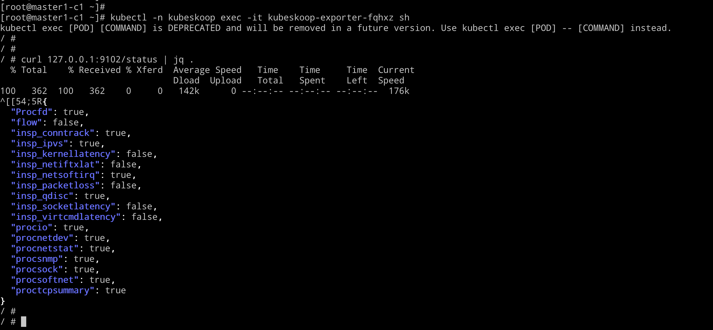

# 目标

1. 梳理kubeskoop支持的metrics和event，说明每个指标和事件的含义


# 探针配置说明


## 查看当前生效的探针




```
[root@master1-c1 ~]# kubectl -n kubeskoop exec -it kubeskoop-exporter-fqhxz sh
kubectl exec [POD] [COMMAND] is DEPRECATED and will be removed in a future version. Use kubectl exec [POD] -- [COMMAND] instead.
Defaulted container "inspector" out of: inspector, inspector-prepare (init)
/ #
/ # curl 127.0.0.1:9102/status | jq .
  % Total    % Received % Xferd  Average Speed   Time    Time     Time  Current
                                 Dload  Upload   Total   Spent    Left  Speed
100   362  100   362    0     0   132k      0 --:--:-- --:--:-- --:--:--  176k
{
  "Procfd": true,
  "flow": false,
  "insp_conntrack": true,
  "insp_ipvs": true,
  "insp_kernellatency": false,
  "insp_netiftxlat": false,
  "insp_netsoftirq": true,
  "insp_packetloss": false,
  "insp_qdisc": true,
  "insp_socketlatency": false,
  "insp_virtcmdlatency": false,
  "procio": true,
  "procnetdev": true,
  "procnetstat": true,
  "procsnmp": true,
  "procsock": true,
  "procsoftnet": true,
  "proctcpsummary": true
}
/ #

```


## 调整探针，event 方案

修改 configmap kubeskoop-config 内容，可以按照需求开启，关闭 探针 和 事件

```
[root@master1-c3 install]# kubectl -n kubeskoop get cm kubeskoop-config  -o yaml
apiVersion: v1
data:
  config.yaml: |-
    debugmode: true
    metric_config:
      interval: 15
      port: 9102
      probes:
      - netdev
      - io
      - socketlatency
      - packetloss
      - sock
      - tcpsummary
      - tcp
      - tcpext
      - udp
      - net_softirq
      - virtcmdlatency
    event_config:
      port: 19102
      loki_enable: true
      loki_address: loki-service
      probes:
      - tcpreset
      - packetloss
kind: ConfigMap
```


##  metrics 探针列表


| name            | 说明                                                         | Default Enable |
| --------------- | ------------------------------------------------------------ | -------------- |
| netdev          | Infromation of network device, support metrics               | `true`         |
| io              | Infromation of io syscalls, support metrics                  | `true`         |
| socketlatency   | Latency statistics of socket recv/send syscalls, support metrics and events | `true`         |
| packetloss      | Infromation of io syscalls, support metrics                  | `true`         |
| net_softirq     | Network softirq sched and excute latency, support metrics and events | `true`         |
| tcpext          | Infromation of tcp netstat, support metrics                  | `true`         |
| tcpsummary      | Infromation of tcp detail connection statistic, support metrics | `true`         |
| tcp             | Infromation of snmp statistics, support metrics              | `true`         |
| sock            | Statistics of sock allocation and memory usage, support metrics | `true`         |
| softnet         | Statistics of softnet packet processing, support metrics     | `true`         |
| udp             | Infromation of udp datagram processing, support metrics and events | `true`         |
| virtcmdlatency  | Infromation of virtio-net command excution, support metrics and events | `true`         |
| kernellatency   | Infromation of linux kernel sk_buff handle latency, support metrics and events | `false`        |
| tcpreset        | Infromation of tcp stream aborting with reset flag, support events | `true`         |
| conntrack       | Infromation of conntrack information, support metrics        | `fasle`        |
| biolatency      | Infromation of block device io latency, support events       | `false`        |
| netif_txlatency | Infromation of network interface queuing and sending latency, support metrics and events | `false`        |


## 事件探针列表


| name           | 说明 | Default Enable |
| -------------- | ---- | -------------- |
| netiftxlatency |      |                |
| biolatency     |      |                |
| net_softirq    |      |                |
| tcpreset       |      |                |
| kernellatency  |      |                |
| packetloss     |      |                |
| socketlatency  |      |                |
| virtcmdlatency |      |                |


# 探针


## socket


### socketlatancy

socketlatancy 

* 说明： 追踪socket 出现延迟的情况
* 开销： 高，追踪所有socket的读写情况
* 使用场景： 怀疑进程由于调度，处理不及时等原因，读取数据慢的情况

#### 指标

| 指标                                  | 说明                         | 类型  |
| ------------------------------------- | ---------------------------- | ----- |
| inspector_pod_socketlatencyread1ms    | Socket数据读取延迟大于1ms    | gauge |
| inspector_pod_socketlatencyread100ms  | Socket数据读取延迟大于100ms  | gauge |
| inspector_pod_socketlatencywrite1ms   | socket 数据写入延迟大于1ms   | gauge |
| inspector_pod_socketlatencywrite100ms | socket 数据写入延迟大于100ms | gauge |


#### 事件

| 事件               | 说明                |
| ------------------ | ------------------- |
| SOCKETLAT_READSLOW | socket 读取出现延迟 |
| SOCKETLAT_SENDSLOW | socket 写入出现延迟 |


### sock

说明： procfs 中对socket的统计指标

开销： 低， 从profs 中采集

适用场景： 日常观测链接状态，socket泄露，reuse，socket内存占用过高等情况


#### 指标

| 指标                     | 说明                             | 类型  |
| ------------------------ | -------------------------------- | ----- |
| inspector_pod_sockinuse  | 处于 inuse 状态的socket的数量    | gauge |
| inspector_pod_sockorphan | 处于orphan 状态的socket的数量    | gauge |
| inspector_pod_socktw     | 处于time_wait 状态的socket的数量 | gauge |
| inspector_pod_sockalloc  | socket 分配数量                  | gauge |
| inspector_pod_sockmem    | socket 占用内存                  | Gauge |


说明：

* orphan socket ：orphan socket 是没有与任何文件描述符关联的socket，当你调用close() 关闭一个socket后，你就不再拥有这个socket的引用了，但是它仍然存在于操作系统中，直到操作系统完成四次挥手流程。因为 
* inuse socket: 

```
[root@master1-c3 ~]# cat /proc/net/sockstat
sockets: used 519
TCP: inuse 229 orphan 0 tw 23 alloc 257 mem 4
UDP: inuse 1 mem 0
UDPLITE: inuse 0
RAW: inuse 0
FRAG: inuse 0 memory 0
```


## 传输层


### tcp/udp/tcpext

说明：procfs 中 tcp 和 udp 相关的计数器， 从  `/proc/net/snmp`  拿到指标，或者 `netstat -st` 获取信息

开销： 低

使用场景： 日常对TCP，UDP相关状态的观测，出现TCP连接异常重传，建立连接失败，reset报文等情况的信息采集，出现DNS解析失败的情况采集

#### 指标

| 指标                                  | 说明                                                         | 类型  |
| ------------------------------------- | ------------------------------------------------------------ | ----- |
| inspector_pod_tcpactiveopens          | 主动打开的tcp连接数量                                        | gauge |
| inspector_pod_tcppassiveopens         | 被动打开的tcp连接数量                                        |       |
| inspector_pod_tcpretranssegs          | Tcp 重传的报文数量                                           |       |
| inspector_pod_tcpexttcpabortonclose   | 用户态程序在缓冲区内还有数据时关闭 socket 的次数             |       |
| inspector_pod_tcpexttcpabortondata    | socket 收到未知数据导致被关闭的次数                          |       |
| inspector_pod_tcpexttcpabortonlinger  | `tcp_close()` 中，因 `tp->linger2` 被设置小于 0，导致 `FIN_WAIT_2` 立即切换到 `CLOSE` 状态的次数 |       |
| inspector_pod_tcpexttcpabortonmemory  | 因内存问题关闭连接的次数                                     |       |
| inspector_pod_tcpexttcpabortontimeout | 因各种计时器(RTO/PTO/keepalive)的重传次数超过上限而关闭连接的次数 |       |
| inspector_pod_udprcvbuferrors         | Udp 接收队列不足导致的接收失败                               |       |
|                                       |                                                              |       |


### tcp summary

说明： 对pod中所有TCP连接的总体统计

开销： 中，遍历所有链接

适用场景： 偶发延迟，连接失败等场景下提供TCP连接的失败信息


#### 指标

| 指标                                       | 说明                                 | 类型 |
| ------------------------------------------ | ------------------------------------ | ---- |
| inspector_pod_tcpsummarytcpestablishedconn | 处于established 状态的链接数量       |      |
| inspector_pod_tcpsummarytcptimewaitconn    | 处于 timewait 状态的链接数量         |      |
| inspector_pod_tcpsummarytcprxqueue         | tcp连接接收队列存在的数据包bytes总数 |      |
| inspector_pod_tcpsummarytcptxqueue         | tcp连接发送队列存在的数据包bytes总数 |      |


### tcpreset

说明： tcp reset 报文追踪

开销： 低

适用场景： TCP 连接被异常reset时，追踪内核中的reset位置


#### 事件

| 事件             | 说明                                             |
| ---------------- | ------------------------------------------------ |
| TCP_NOSOCK       | 因为没有找到socket（访问到未知端口）导致的reset  |
| TCPRESET_ACTIVE  | 由于资源，用户态关闭等原因主动发送TCP reset 报文 |
| TCPRESET_PROCESS | 由于TCP握手出现异常等原因发送的TCP reset 报文    |
| TCPRESET_RECEIVE | 收到了对端的reset报文                            |


## 网络层

### ip 

说明： procfs 中 IP相关的计数器

开销： 低

适用场景： 日常对IP状态进行的观测，出现丢包等问题时辅助排查问题


#### 指标


| 指标                            | 说明                               |
| ------------------------------- | ---------------------------------- |
| inspector_pod_ipinnoroutes      | 查找路由时，目的地不可达次数       |
| inspector_pod_ipintruncatedpkts | 数据包长度小于IP头中标识长度的次数 |


### kernellatency 

说明： 内核中各个阶段处理报文延迟的追踪

开销： 高

适用场景： 连接超时，网络抖动


#### 指标

| 指标                                    | 说明                              |
| --------------------------------------- | --------------------------------- |
| inspector_pod_kernellatency_rxslow      | 内核中接收数据包处理时间超过10ms  |
| inspector_pod_kernellatency_rxslow100ms | 内核中接收数据包处理时间超过100ms |
| inspector_pod_kernellatency_txslow      | 内核中发送数据包处理时间超过10ms  |
| inspector_pod_kernellatency_rxslow100ms | 内核中发送数据包处理时间超过100ms |


#### 事件


| 事件          | 说明             |
| ------------- | ---------------- |
| RXKERNEL_SLOW | 内核收包出现延迟 |
| RTKERNEL_SLOW | 内核发包出现延迟 |


### ipvs

说明： procfs中IPVS相关状态的统计

开销：低

适用场景： 日常对IPVS 相关状态的观测


#### 指标

| 指标                           | 说明              |
| ------------------------------ | ----------------- |
| inspector_pod_ipvsconnections  | ipvs 连接数       |
| inspector_pod_incomingpackages | ipvs 入数据包数   |
| inspector_pod_outgoingpackages | ipvs 出数据包数   |
| inspector_pod_incomingbytes    | ipvs 入数据字节数 |
| inspector_pod_outgoingbytes    | ipvs 出数据字节数 |


### conntrack 

说明：对conntrack模块的汇总，通过netlink模块遍历所有的conntrack状态， 可以执行  `conntrack -S` 命令查看conntrack 的连接信息

开销： 高

适用场景：连接建立失败，丢包，conntrack串流等问题

说明： 通过开启 flow 探针获取以下指标

#### 指标

| 指标                                 | 说明                                                         |
| ------------------------------------ | ------------------------------------------------------------ |
| inspector_pod_conntrackentries       | conntrack当前条目数                                          |
| inspector_pod_conntrackmaxentries    | conntrack最大条目数                                          |
| inspector_pod_conntrackdrop          | 数据包启动一个新的连接，但是没有可用的内存为其分配新的状态条目 |
| inspector_pod_conntrackearlydrop     | conntrack表已满。为了接受新连接，丢弃了没有双向通信的现有连接 |
| inspector_pod_conntrackerror         | 收到与已知连接不匹配的icmp错误数据包                         |
| inspector_pod_conntrackfound         | 保持为0，仅出于向后兼容的目的而存在                          |
| inspector_pod_conntrackignore        | 不需要做连接跟踪的包                                         |
| inspector_pod_conntrackinsert        | 保持为0，仅出于向后兼容的目的而存在                          |
| inspector_pod_conntrackinsertfailed  | 数据包开始新的连接，但是插入状态表失败。例如，当伪装时NAT引擎恰巧选择了相同的源地址和端口时，可能会发生这种情况 |
| inspector_pod_conntrackinvalid       | 数据包与现有连接不匹配，并且未创建新连接                     |
| inspector_pod_conntracksearchrestart | 查找由于另一个CPU的插入或删除而中断                          |


## 网络设备


### netdev

说明： procfs中对网络设备状态的统计

开销：低©

使用场景： 日常监控，网络抖动，底层网络丢包等情况


#### 指标

| 指标                          | 说明         |
| ----------------------------- | ------------ |
| inspector_pod_netdevrxbytes   | 接收字节数   |
| inspector_pod_netdevrxdropped | 接收丢包数   |
| inspector_pod_netdevrxerror   | 接收错误包数 |
| inspector_pod_netdevrxpackets | 接收数据包数 |
| inspector_pod_netdevtxbytes   | 发送字节数   |
| inspector_pod_netdevtxdropped | 发送丢报数   |
| inspector_pod_netdevtxerror   | 发送错误包数 |
| inspector_pod_netdevtxpackets | 发送数据包数 |


### qdisc

说明：通过netlink获取qdisc 统计计数

开销：低

适用场景： 日常监控，网络抖动丢包等情况

#### 指标

| 指标                          | 说明                   |
| ----------------------------- | ---------------------- |
| inspector_pod_qdiscbytes      | qdisc 经过的字节       |
| inspector_pod_qdiscpackets    | qdisc 经过的数据包数量 |
| inspector_pod_qdiscdrops      | qdis 丢包数            |
| inspector_pod_qdisqlen        | qdisc 队列长度         |
| inspector_pod_qdiscbacklog    | qdisc backlog 数量     |
| inspector_pod_qdiscoverlimits | qdisc数据包limit       |


### netiftxlatency

说明： 网络设备发送延迟追踪，基于eBPF实现

开销： 高

适用场景： 连接超时，网络抖动等情况


#### 指标

| 指标                                    | 说明                      |
| --------------------------------------- | ------------------------- |
| inspector_pod_netiftxlat_qdiscslow100ms | qdisc 处理时间超过100ms   |
| inspector_pod_netiftxlat_netdevlow100ms | 底层设备发送时间超过100ms |


#### 事件

| 事件               | 说明                      |
| ------------------ | ------------------------- |
| TXLAT_QDISC_100MS  | qdisc 处理时间超过100ms   |
| TXLAT_NETDEV_100MS | 底层设备发送时间超过100ms |


### softnet

说明：通过procfs 获取 softnet的统计信息

开销： 低

适用场景：日常监控，出现节点级别的网络异常时提供支持信息

#### 指标

| 指标                           | 说明                 |
| ------------------------------ | -------------------- |
| inspector_pod_softnetprocessed | softnet 处理的报文数 |
| inspector_pod_softnetdropped   | softnet 丢弃的报文数 |


### netsoftirq

说明： 提供了与网络相关的两种中断（netif_rx，netif_tx）的调度和执行时长

开销： 高， 对所有数据包进行处理

适用场景：出现偶发延迟，网络抖动


#### 指标

| 指标                                      | 说明                                             |
| ----------------------------------------- | ------------------------------------------------ |
| inspector_pod_net_softirq_schedslow       | 从软中断发起到ksoftirqd开始执行间隔时间超过10ms  |
| inspector_pod_net_softirq_schedslow100ms  | 从软中断发起到ksoftirqd开始执行间隔时间超过100ms |
| inspector_pod_net_softirq_excuteslow      | 从软中断开始执行到执行完成的耗时超过10ms         |
| inspector_pod_net_softirq_excuteslow100ms | 从软中断开始执行到执行完成的耗时超过100ms        |


#### 事件


| 事件                    | 说明                                             |
| ----------------------- | ------------------------------------------------ |
| NETSOFTIRQ_SCHED_SLOW   | 从软中断发起到ksoftirqd开始执行间隔时间超过10ms  |
| NETSOFTIRQ_SCHED_100MS  | 从软中断发起到ksoftirqd开始执行间隔时间超过100ms |
| NETSOFTIRQ_EXCUTE_SLOW  | 从软中断开始执行到执行完成的耗时超过10ms         |
| NETSOFTIRQ_EXCUTE_100MS | 从软中断开始执行到执行完成的耗时超过100ms        |


## Driver


### virtcmdlatency

说明： 追踪虚拟化virtio设备底层命令执行延迟 

开销： 高

适用场景：云上设备，使用virtio做虚拟化，出现偶发性的延迟和抖动


#### 指标

| 指标                              | 说明                                  |
| --------------------------------- | ------------------------------------- |
| inspector_pod_virtcmdlatency      | Virtio send command 执行时间超过10ms  |
| inspector_pod_virtcmdlatency100ms | Virtio send command 执行时间超过100ms |


#### 事件

| 事件          | 说明                           |
| ------------- | ------------------------------ |
| VIRTCMDEXCUTE | Virtio send command 执行时间慢 |


## IO


### fd

说明：统计pod内部进程打开的文件和socket 

开销：高，通过遍历所有的描述符获取信息

适用场景： fd 泄露，socket 泄露


#### 指标

| 指标                       | 说明             |
| -------------------------- | ---------------- |
| inspector_pod_fdopenfd     | 打开fd 数量      |
| inspector_pod_fdopensocket | 打开 socket 数量 |


### IO

说明：profs 中 io 相关的统计

开销：低

适用场景：由于用户进程响应慢导致的延迟增高，重传升高

#### 指标

| 指标                           | 说明                 |
| ------------------------------ | -------------------- |
| inspector_pod_ioioreadbytes    | 文件系统读操作字节数 |
| inspector_pod_ioiowritebytes   | 文件系统写操作字节数 |
| inspector_pod_ioioreadsyscall  | 文件系统读操作次数   |
| inspector_pod_ioiowritesyscall | 文件系统写操作次数   |


### biolatancy

说明： 追踪块设备读取、写入的延迟

开销：中

适用场景：IO读写慢导致的网络网络抖动，延迟升高等


#### 事件

| 事件         | 说明                |
| ------------ | ------------------- |
| BIOLAT       | 块设备读写超过10ms  |
| BIOLAT_100MS | 块设备读写超过100ms |


# Reference

https://blog.netdata.cloud/understanding-interrupts-softirqs-and-softnet-in-linux/

https://satori-monitoring.readthedocs.io/zh/latest/builtin-metrics/tcpext.html

https://gist.github.com/wych42/5146bb0acd0aa05adf076a449d795890

