# 目标

1. kubeskoop 使用说明


# 简介


## 架构

KubeSkoop 是一个Kubernetes网络诊断工具. 针对不同的网络插件和IaaS提供商自动构建Kubernetes集群中Pod的网络访问图，结合eBPF对内核关键路径的深度监控和分析，来分析常见的Kubernetes集群网络问题。 显著地简化了Kubernetes网络问题的诊断难度


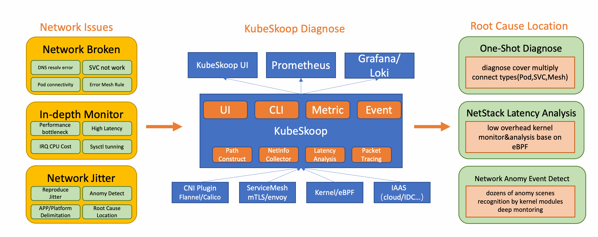


## 关键特性

### 一键诊断网络链路

- 诊断kubernetes集群中各种网络访问方式和链路：Pod,Service,Node and Ingress/Egress Traffic.
- 覆盖完整的Linux协议栈的配置错误场景: Socket,Bridge,Veth,Netfilter,sysctls…
- 支持诊断多种云供应商的IAAS层网络错误配置

### 深度网络监控

- 通过eBPF实现无侵入的Kernel Monitor
- 通过BTF在各种版本的Kernel上直接运行
- 通过标准的Prometheus接口暴露深度监控Metrics

### 网络异常事件识别

- 几十种网络异常场景自动分析识别
- 通过 Grafana Loki 展示网络异常事件


# 安装


通过以下步骤，可以在Kubernetes集群中快速部署Skoop exporter及其与Prometheus，Grafana和Loki构成的可观测性组合

```
kubectl apply -f https://raw.githubusercontent.com/alibaba/kubeskoop/main/deploy/skoopbundle.yaml
```

通过以下步骤，确认安装完成以及获取访问入口：

```
# 查看Skoop exporter的运行状态
kubectl get pod -n kubeskoop -l app=kubeskoop-exporter -o wide

# 查看Probe采集探针的运行状态
POD=`kubectl get pod -n kubeskoop  -l app=kubeskoop-exporter --no-headers |head -1 | awk '{print $1}'`
kubectl get --raw /api/v1/namespaces/kubeskoop/pods/${POD}:9102/proxy/status |jq .

# 获取Prometheus服务的入口
kubectl get service -n kubeskoop prometheus-service -o wide

# 获取Grafana控制台的访问入口， 默认账号密码是 admin/kubeskoop 
kubectl get service -n kubeskoop grafana -o wide
```


## 检测探针运行情况


```
POD=`kubectl get pod -n kubeskoop  -l app=kubeskoop-exporter --no-headers |head -1 | awk '{print $1}'`

kubectl get --raw /api/v1/namespaces/kubeskoop/pods/${POD}:9102/proxy/status |jq .

# demo 
[root@master1-c5 ~]# kubectl get --raw /api/v1/namespaces/kubeskoop/pods/${POD}:9102/proxy/status |jq .
{
  "available_probes": {
    "event": [
      "netiftxlat",
      "socketlatency",
      "tcpreset",
      "virtcmdLatency",
      "conntrack",
      "biolatency",
      "kernellatency",
      "netsoftirq",
      "packetloss"
    ],
    "metrics": [
      "tcpext",
      "sock",
      "ip",
      "kernellatency",
      "netiftxlat",
      "socketlatency",
      "virtcmdLatency",
      "conntrack",
      "io",
      "ipvs",
      "tcp",
      "tcpsummary",
      "netsoftirq",
      "qdisc",
      "fd",
      "udp",
      "softnet",
      "packetloss",
      "flow",
      "netdev"
    ]
  },
  "inuse_probes": {
    "event": [
      {
        "name": "tcpreset",
        "state": "Running"
      },
      {
        "name": "packetloss",
        "state": "Running"
      }
    ],
    "metrics": [
      {
        "name": "netdev",
        "state": "Running"
      },
      {
        "name": "tcpext",
        "state": "Running"
      },
      {
        "name": "socketlatency",
        "state": "Running"
      },
      {
        "name": "sock",
        "state": "Running"
      },
      {
        "name": "tcpsummary",
        "state": "Running"
      },
      {
        "name": "packetloss",
        "state": "Running"
      },
      {
        "name": "udp",
        "state": "Running"
      },
      {
        "name": "tcp",
        "state": "Running"
      },
      {
        "name": "io",
        "state": "Running"
      }
    ]
  }
}
```


# 网络链路探测


## 安装诊断命令


```

# 如果安装失败，可以尝试使用代理
export GOPROXY=https://proxy.golang.com.cn,direct

go install github.com/alibaba/kubeskoop/cmd/skoop@main
```


## calico 诊断测试

如果使用过程中出现了 ` diagnose error: error create node: cannot find interface` 错误，可以通过参数指定网卡

```
[root@master1-c4 ~]# skoop -s 10.244.2.199 -d 192.168.3.99 -p 53  --calico-host-interface ens192 --http --http-address "0.0.0.0:8080"
I1004 10:37:21.427403 4151430 web.go:106] HTTP server listening on http://0.0.0.0:8080
```


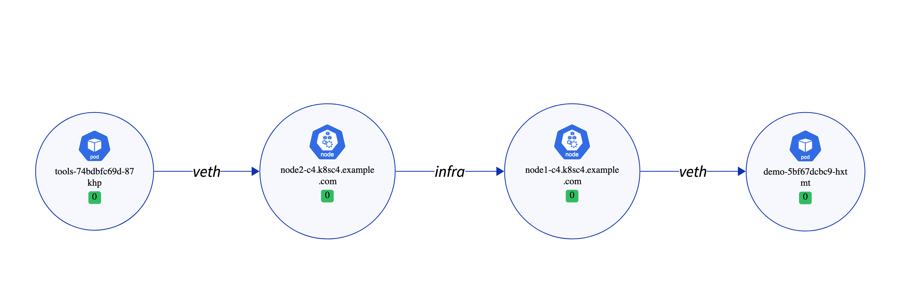


## flannel诊断测试

安装skoop命令之后，可以通过执行以下

```
[root@master1-c5 ~]# skoop -s 10.244.1.2 -d 192.168.3.99 -p 53 --flannel-host-interface ens192 --http --http-address "0.0.0.0:8080"
I1004 10:28:52.864945  722814 web.go:106] HTTP server listening on http://0.0.0.0:8080
```


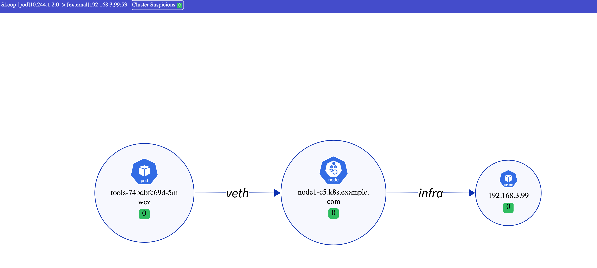


## 一个网络不通的实例

一个kubernetes 集群，一个master节点，两个node节点

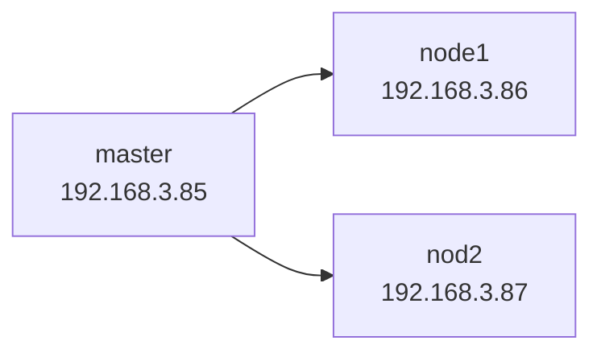


1. 在 192.168.3.86 节点上配置防火墙规则，此时所有从node2到node1的流量会被丢弃

` iptables -I INPUT -s 192.168.3.87 -j DROP`

2. 从node2 的pod 到 node1 pod执行探测， 执行以下命令 `skoop -s 10.244.3.70 -d 10.244.2.201 -p 8080   --calico-host-interface ens192 --http --http-address "0.0.0.0:8080"`

```
[root@master1-c4 ~]# kubectl  -n tools get pod -o wide
NAME                     READY   STATUS    RESTARTS   AGE     IP             NODE                         NOMINATED NODE   READINESS GATES
demo-5bf67dcbc9-hxtmt    1/1     Running   0          52m     10.244.2.201   node1-c4.k8sc4.example.com   <none>           <none>
tools-74bdbfc69d-q4h8h   1/1     Running   0          36s     10.244.3.72    node2-c4.k8sc4.example.com   <none>           <none>
tools-74bdbfc69d-qf4sl   1/1     Running   0          5d19h   10.244.2.199   node1-c4.k8sc4.example.com   <none>           <none>
```

3. 错误信息如下

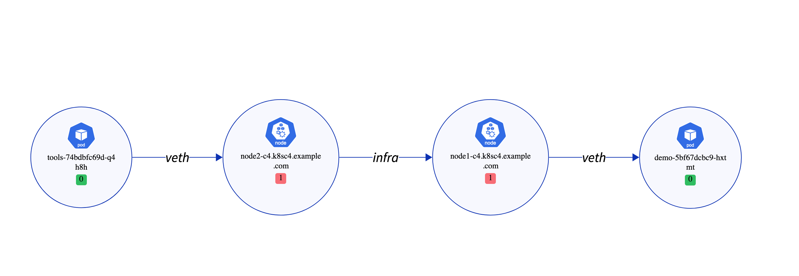

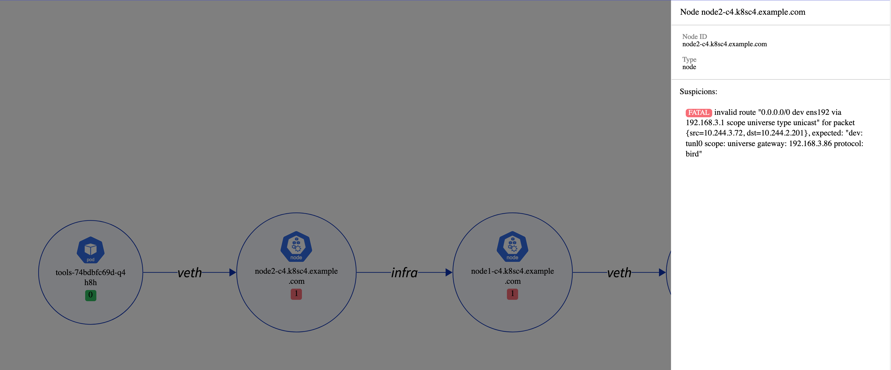


4. 删除iptables 规则后，可以看到网络恢复正常

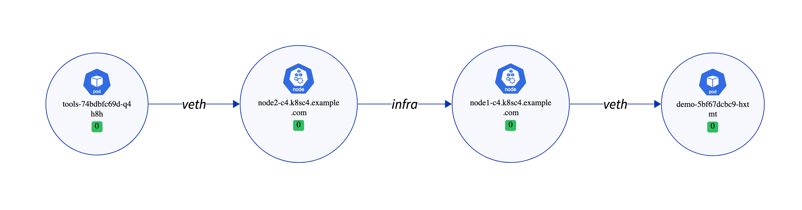


# 网络监控


## 监控指标 

通过 <node-IP>:9102/metrics 可以查看当前的监控指标， 指标详细说明，可以参考文档 《kubeskoop-metrics.pdf》


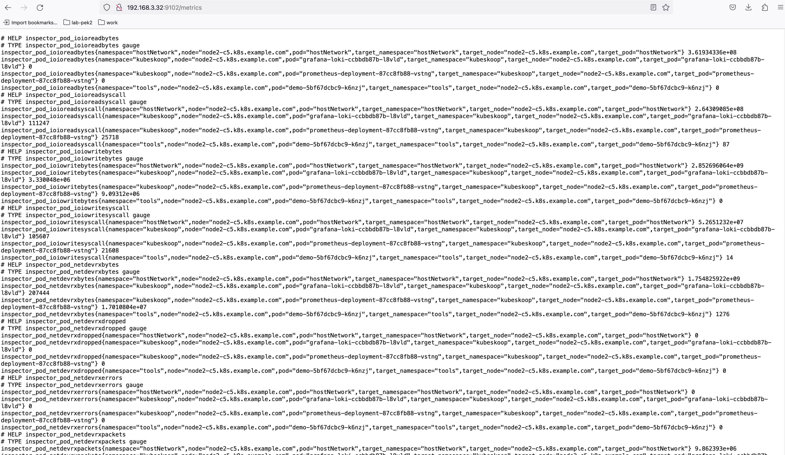


## 查看 grafana 页面


```
[root@master1-c5 ~]# kubectl get svc -n kubeskoop
NAME                 TYPE        CLUSTER-IP       EXTERNAL-IP   PORT(S)        AGE
grafana              NodePort    10.104.219.212   <none>        80:32758/TCP   95m
loki-service         ClusterIP   10.108.17.105    <none>        3100/TCP       95m
prometheus-service   NodePort    10.104.51.215    <none>        80:31272/TCP   95m
```


通过访问 http://<IP>:32758 可以访问grafana 页面


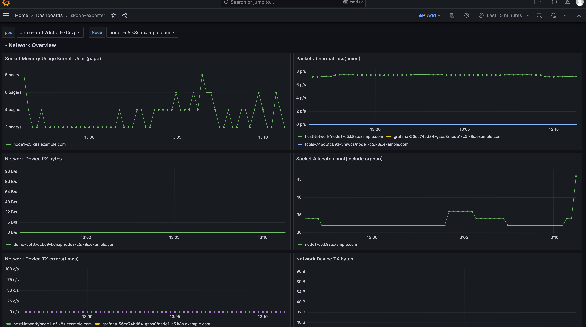


# 异常事件

kubeskooop 通过loki支持事件记录


添加 loki datasource 

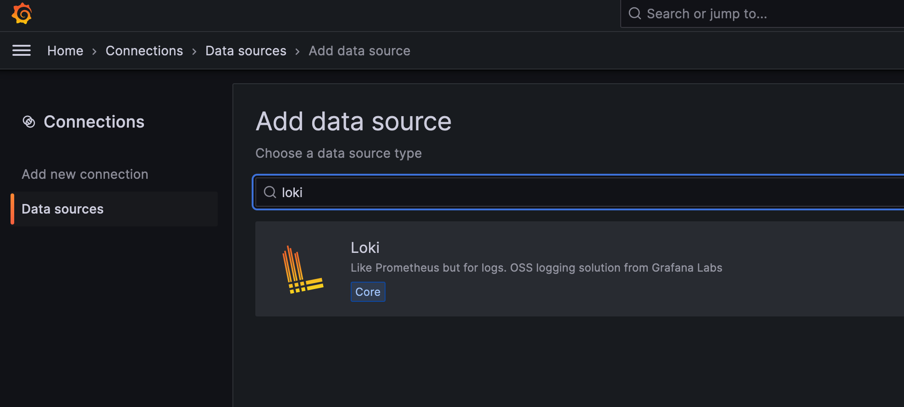


URL中填写 ： `http://loki-service.kubeskoop.svc.cluster.local:3100`

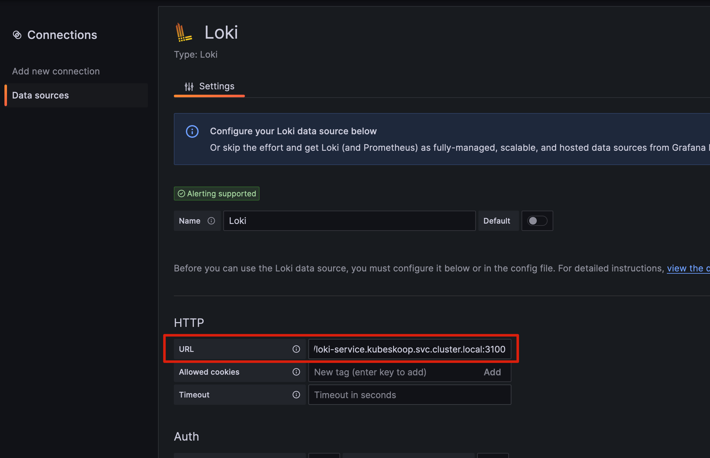


添加 loki datasource 之后，可以新建一个dashboard，查询发生的事件

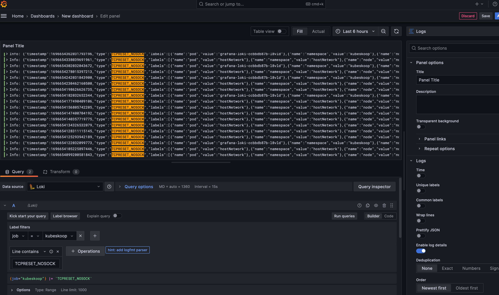


# 安全

扫描 kubeskoop-exporter 镜像，存在以下安全漏洞


