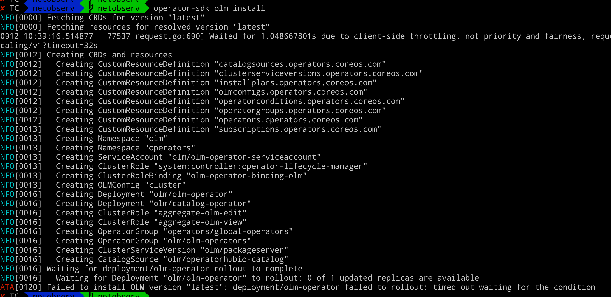

# 目标

1. 在 minikube 上安装 netobserv


# 安装


## 在minikube上安装 OLM


optional:  配置代理 

```
export http_proxy=http://127.0.0.1:1087;export https_proxy=http://127.0.0.1:1087;export no_proxy=192.168.26.0/24

```


```

operator-sdk olm install


```


安装过程中出现失败，不过不用担心，

