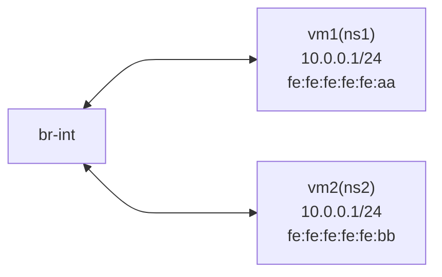

# 目标

1. 通过


# 实验


## 实验环境

1. 实验运行在Centos8 环境
2. 没有使用真实的VM，




## 实验准备


```

dnf install -y https://repos.fedorapeople.org/repos/openstack/openstack-yoga/rdo-release-yoga-1.el8.noarch.rpm

yum install -y openvswitch2.11.x86_64
yum install -y net-tools tcpdump 

systemctl enable --now openvswitch
systemctl status openvswitch

```


## 创建虚拟机


```
# 创建虚拟机 vm1（ns1）
ip netns add ns1
ip link add veth0 type veth peer name ovs-veth0
ip link set veth0 netns ns1

ovs-vsctl add-br br-int
ovs-vsctl add-port br-int ovs-veth0
ip link set ovs-veth0 up

ip netns exec ns1 ip address add 10.0.0.1/24 dev veth0
ip netns exec ns1 ip link set veth0 up
ip netns exec ns1 ifconfig veth0 hw ether fe:fe:fe:fe:fe:aa


# 创建虚拟机 vm2（ns2） 
ip netns add ns2
ip l a veth0 type veth peer name ovs-veth1
ip l s veth0 netns ns2
ovs-vsctl add-port br-int ovs-veth1
ip l s ovs-veth1 up
ip netns exec ns2 ip add a 10.0.0.2/24 dev veth0
ip netns exec ns2 ip l s veth0 up
ip netns exec ns2 ifconfig veth0 hw ether fe:fe:fe:fe:fe:bb
```


## 添加流表


```
ovs-ofctl add-flow br-int 'table=0,in_port=1 actions=load:0x1->NXM_NX_REG1[],goto_table:1'
ovs-ofctl add-flow br-int 'table=0,in_port=2 actions=load:0x2->NXM_NX_REG1[],goto_table:1'

ovs-ofctl add-flow br-int 'table=1,priority=100,dl_src=fe:fe:fe:fe:fe:aa actions=learn(table=2,hard_timeout=30,priority=100,delete_learned,cookie=0x1,NXM_OF_ETH_DST[]=NXM_OF_ETH_SRC[],load:NXM_NX_REG1[]->NXM_NX_REG2[],load:0x1->NXM_NX_REG0[31]),resubmit(,4)'
ovs-ofctl add-flow br-int 'table=1,priority=100 actions=resubmit(,2),resubmit(,3)'
ovs-ofctl add-flow br-int 'table=3,priority=100 actions=output:NXM_NX_REG2[]'
ovs-ofctl add-flow br-int 'table=3,priority=10 actions=drop'
ovs-ofctl add-flow br-int 'table=4,priority=100 actions=output:2'
```


查看流表信息，此时通过流表的packets 数量为0 

```
[root@ovs-node3 ~]# ovs-ofctl dump-flows br-int
 cookie=0x0, duration=19.811s, table=0, n_packets=1, n_bytes=70, in_port="ovs-veth0" actions=load:0x1->NXM_NX_REG1[],resubmit(,1)
 cookie=0x0, duration=19.803s, table=0, n_packets=0, n_bytes=0, in_port="ovs-veth1" actions=load:0x2->NXM_NX_REG1[],resubmit(,1)
 cookie=0x0, duration=2638.993s, table=0, n_packets=31, n_bytes=2362, priority=0 actions=NORMAL
 cookie=0x0, duration=19.792s, table=1, n_packets=1, n_bytes=70, priority=100,dl_src=fe:fe:fe:fe:fe:aa actions=learn(table=2,hard_timeout=30,priority=100,delete_learned,cookie=0x1,NXM_OF_ETH_DST[]=NXM_OF_ETH_SRC[],load:NXM_NX_REG1[]->NXM_NX_REG2[],load:0x1->NXM_NX_REG0[31]),resubmit(,4)
 cookie=0x0, duration=19.785s, table=1, n_packets=0, n_bytes=0, priority=100 actions=resubmit(,2),resubmit(,3)
 cookie=0x1, duration=7.823s, table=2, n_packets=0, n_bytes=0, hard_timeout=30, priority=100,dl_dst=fe:fe:fe:fe:fe:aa actions=load:0x1->NXM_NX_REG2[],load:0x1->NXM_NX_REG0[31]
 cookie=0x0, duration=19.778s, table=3, n_packets=0, n_bytes=0, priority=100 actions=output:NXM_NX_REG2[]
 cookie=0x0, duration=19.772s, table=3, n_packets=0, n_bytes=0, priority=10 actions=drop
 cookie=0x0, duration=19.589s, table=4, n_packets=1, n_bytes=70, priority=100 actions=output:"ovs-veth1"
```


## 测试


```

[root@ovs-node3 ~]# ip netns exec ns2 ping 10.0.0.1
PING 10.0.0.1 (10.0.0.1) 56(84) bytes of data.
64 bytes from 10.0.0.1: icmp_seq=1 ttl=64 time=0.779 ms
64 bytes from 10.0.0.1: icmp_seq=2 ttl=64 time=0.099 ms

# 查看 arp
[root@ovs-node3 ~]# ip netns exec ns2 arp -an
? (10.0.0.1) at fe:fe:fe:fe:fe:aa [ether] on veth0

```


### 查看流表

```
[root@ovs-node3 ~]# ovs-ofctl dump-flows br-int
 cookie=0x0, duration=533.494s, table=0, n_packets=4, n_bytes=364, in_port="ovs-veth0" actions=load:0x1->NXM_NX_REG1[],resubmit(,1)
 cookie=0x0, duration=533.486s, table=0, n_packets=5, n_bytes=434, in_port="ovs-veth1" actions=load:0x2->NXM_NX_REG1[],resubmit(,1)
 cookie=0x0, duration=3152.676s, table=0, n_packets=31, n_bytes=2362, priority=0 actions=NORMAL
 cookie=0x0, duration=533.475s, table=1, n_packets=4, n_bytes=364, priority=100,dl_src=fe:fe:fe:fe:fe:aa actions=learn(table=2,hard_timeout=30,priority=100,delete_learned,cookie=0x1,NXM_OF_ETH_DST[]=NXM_OF_ETH_SRC[],load:NXM_NX_REG1[]->NXM_NX_REG2[],load:0x1->NXM_NX_REG0[31]),resubmit(,4)
 cookie=0x0, duration=533.468s, table=1, n_packets=5, n_bytes=434, priority=100 actions=resubmit(,2),resubmit(,3)
 cookie=0x1, duration=4.852s, table=2, n_packets=3, n_bytes=294, hard_timeout=30, priority=100,dl_dst=fe:fe:fe:fe:fe:aa actions=load:0x1->NXM_NX_REG2[],load:0x1->NXM_NX_REG0[31]
 cookie=0x0, duration=533.461s, table=3, n_packets=5, n_bytes=434, priority=100 actions=output:NXM_NX_REG2[]
 cookie=0x0, duration=533.455s, table=3, n_packets=0, n_bytes=0, priority=10 actions=drop
 cookie=0x0, duration=533.272s, table=4, n_packets=4, n_bytes=364, priority=100 actions=output:"ovs-veth1"
```


### 查看抓包数据

```
[root@ovs-node3 ~]# ip netns exec ns2 tcpdump -i veth0 -vv -nn -e
dropped privs to tcpdump
tcpdump: listening on veth0, link-type EN10MB (Ethernet), capture size 262144 bytes
12:39:54.101416 fe:fe:fe:fe:fe:aa > fe:fe:fe:fe:fe:bb, ethertype IPv4 (0x0800), length 98: (tos 0x0, ttl 64, id 60495, offset 0, flags [DF], proto ICMP (1), length 84)
    10.0.0.1 > 10.0.0.2: ICMP echo request, id 12082, seq 1, length 64
12:39:54.101470 fe:fe:fe:fe:fe:bb > fe:fe:fe:fe:fe:aa, ethertype IPv4 (0x0800), length 98: (tos 0x0, ttl 64, id 29260, offset 0, flags [none], proto ICMP (1), length 84)
    10.0.0.2 > 10.0.0.1: ICMP echo reply, id 12082, seq 1, length 64
12:39:55.142705 fe:fe:fe:fe:fe:aa > fe:fe:fe:fe:fe:bb, ethertype IPv4 (0x0800), length 98: (tos 0x0, ttl 64, id 61041, offset 0, flags [DF], proto ICMP (1), length 84)
    10.0.0.1 > 10.0.0.2: ICMP echo request, id 12082, seq 2, length 64
```


# OVS 命令


Open vSwitch中有多个命令，分别有不同的作用，大致如下：

- ovs-vsctl用于控制ovs db
- ovs-ofctl用于管理OpenFlow switch 的 flow
- ovs-dpctl用于管理ovs的datapath
- ovs-appctl用于查询和管理ovs daemon


## ovs-ofctl

查看 网桥上 每个port 的信息

```
[root@ovs-node2 ~]# ovs-ofctl dump-ports-desc br-int
OFPST_PORT_DESC reply (xid=0x2):
 1(ovs-veth0): addr:ee:c2:43:18:c6:e1
     config:     0
     state:      0
     current:    10GB-FD COPPER
     speed: 10000 Mbps now, 0 Mbps max
 2(ovs-veth1): addr:16:53:2a:01:d7:4b
     config:     0
     state:      0
     current:    10GB-FD COPPER
     speed: 10000 Mbps now, 0 Mbps max
 LOCAL(br-int): addr:5a:76:b3:e4:cc:4b
     config:     PORT_DOWN
     state:      LINK_DOWN
     speed: 0 Mbps now, 0 Mbps max
```

