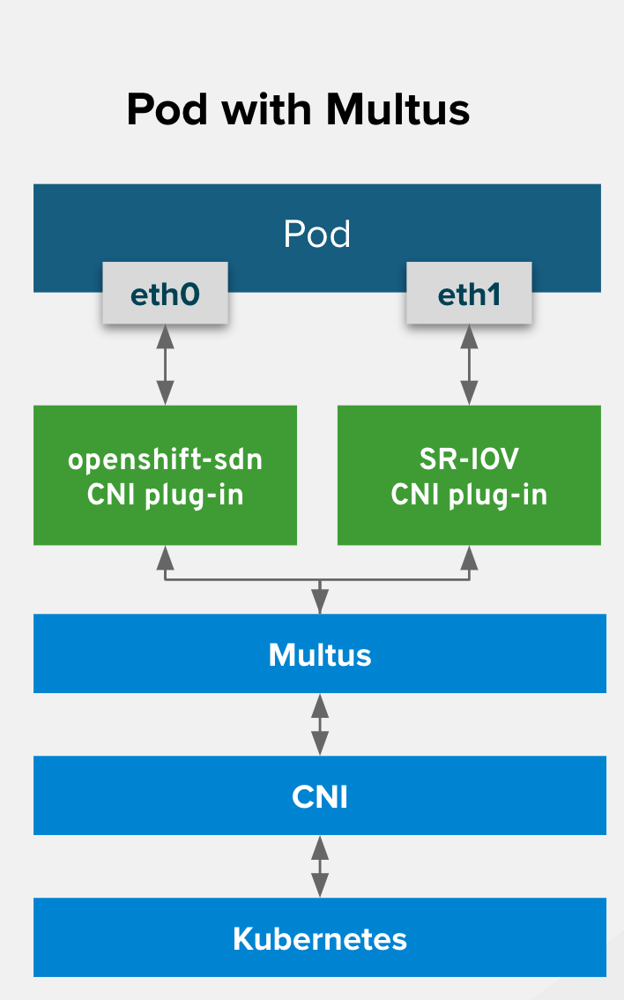

# 目标


# 架构





# basic command


```

oc get network-attachment-definition


```


# ipvlan


## Demo1


```
# oc edit networks.operator.openshift.io
...
spec:
  additionalNetworks:
  - name: ipvlan-static
    namespace: multus-test
    rawCNIConfig: |-
      {
        "name": "ipvlan-static",
        "cniVersion": "0.3.1",
        "type": "ipvlan",
        "ipam": {
          "type": "static"
        }
      }
    type: Raw
  clusterNetwork:
  - cidr: 10.31.0.0/16
    hostPrefix: 23
...

```

### deploy demo pod


```

cat << EOF | oc apply -f -
apiVersion: apps/v1
kind: Deployment
metadata:
  creationTimestamp: null
  labels:
    app: demo1
  name: demo1
  namespace: multus-test
spec:
  replicas: 1
  selector:
    matchLabels:
      app: demo1
  strategy: {}
  template:
    metadata:
      annotations:
        k8s.v1.cni.cncf.io/networks: |-
          [
           {
             "name": "ipvlan-static",
             "namespace": "multus-test",
             "ips": ["192.168.3.202/24"],
             "default-route": ["192.168.3.1"]
           }
          ]
      creationTimestamp: null
      labels:
        app: demo1
    spec:
      containers:
      - image: quay.io/junkai/demo:1.0
        name: demo
        resources: {}
status: {}
EOF

```


