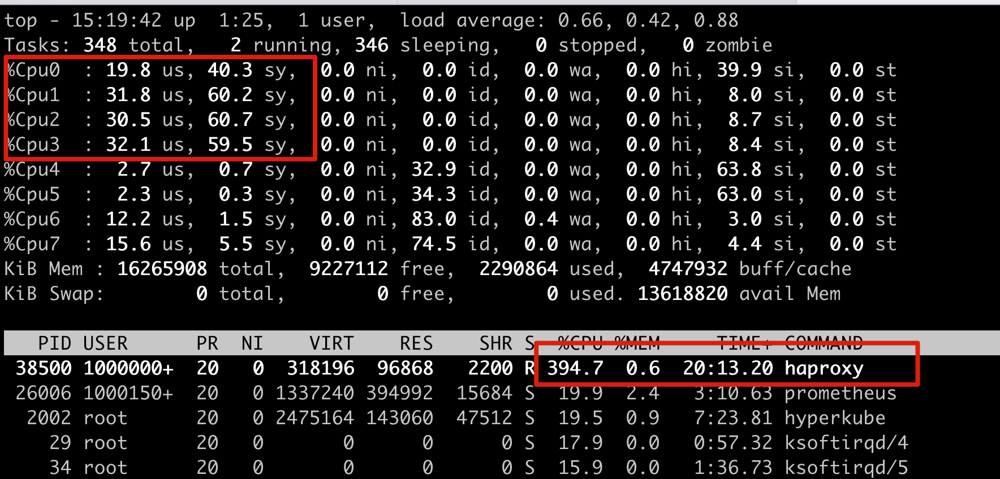

# 目标

配置ocp3.11 router 绑核

router 中无法通过配置环境变量的方式来配置绑核，需要通过修改haproxy-template来实现


# 配置Router 绑核


## 获取haproxy-config.template 文件


```
# oc project default 
# oc get po
NAME                       READY     STATUS    RESTARTS   AGE
router-2-40fc3             1/1       Running   0          11d
# oc exec router-2-40fc3 cat haproxy-config.template > haproxy-config.template
# oc exec router-2-40fc3 cat haproxy.config > haproxy.config
```


## 修改模板文件

打开 haproxy-config.template 文件，然后在模板文件中添加 `cpu-map auto:1/1-4 0-3` 

> 说明： cpu-map auto:1/1-4 0-3， 绑核前面4个， 可以按照自己的实际情况进行修改

```

global
  maxconn {{env "ROUTER_MAX_CONNECTIONS" "20000"}}
{{- $threads := env "ROUTER_THREADS" }}
{{- if ne "" (firstMatch "[1-9][0-9]*" $threads) }}
  nbthread {{ $threads }}
{{-  end }}

  cpu-map auto:1/1-4 0-3   # 添加这一行


  daemon
```


## 更新模板


```

oc create configmap customrouter --from-file=haproxy-config.template


oc set volume dc/router --add --overwrite --name=config-volume --mount-path=/var/lib/haproxy/conf/custom --source='{"configMap": { "name": "customrouter"}}' 
oc set env dc/router TEMPLATE_FILE=/var/lib/haproxy/conf/custom/haproxy-config.template

```


## 检查结果


```
[root@lb1 router]# oc get pod
NAME                          READY     STATUS    RESTARTS   AGE
docker-registry-1-b5qg9       1/1       Running   1          11d
logging-eventrouter-1-xr9sj   1/1       Running   19         358d
registry-console-1-fr58f      1/1       Running   0          4h
router-5-8s6vk                1/1       Running   0          18m
router-5-pqz2q                1/1       Running   0          18m
[root@lb1 router]# oc rsh router-5-8s6vk
sh-4.2$ vi haproxy.config

这里可以看到     cpu-map auto:1/1-4 0-3
```


# 检查结果

1. 对Router进行压测
2. 登陆router 节点，执行`top`， 从结果来看，符合预期，绑核在前面4个核上 




# Reference

https://docs.openshift.com/container-platform/3.11/install_config/router/customized_haproxy_router.html#install-config-router-customized-haproxy

https://docs.openshift.com/container-platform/3.11/scaling_performance/routing_optimization.html