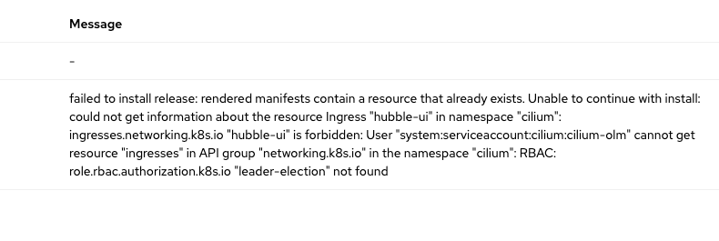
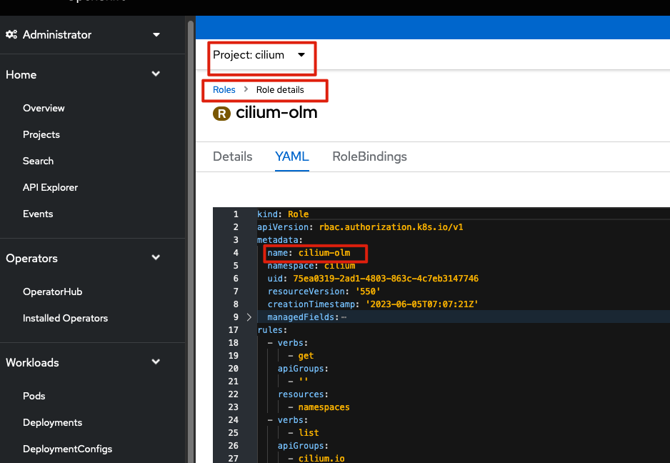
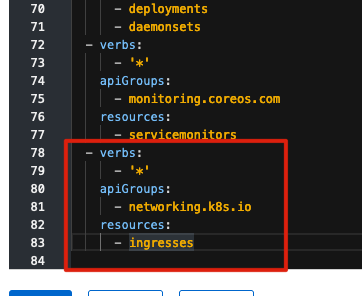
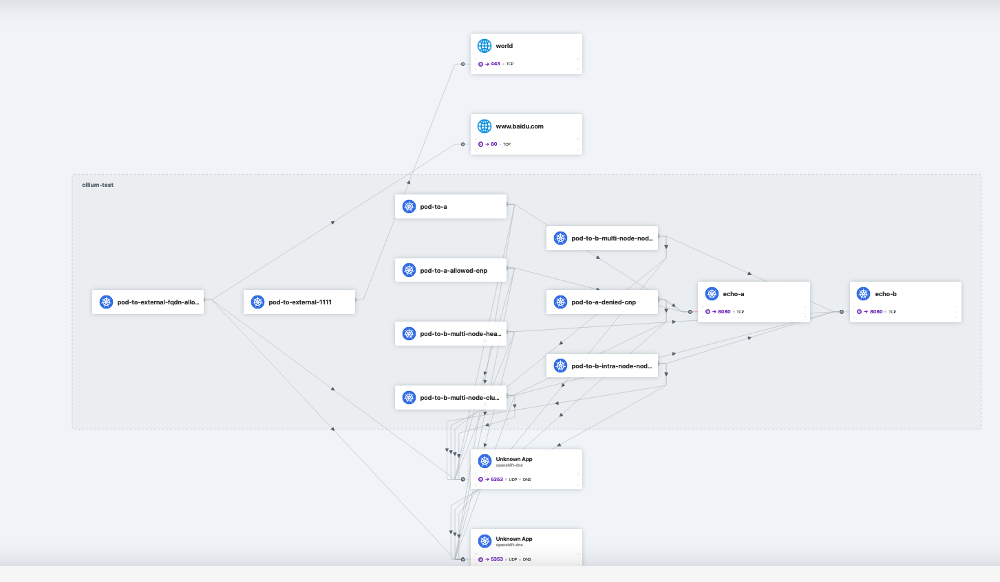

#### 

# 目标

1. 在OCP4 上安装cilium
2. 配置 Hubble 
3. 配置underlay 网络
4. 对接BGP网络


# 安装 Cilium


## 安装文件

1. 安装文件中需要指定 `networkTYpe: Cilium` 
2. 需要准备 Cilium 相关镜像

```
apiVersion: v1
baseDomain: ocp.example.com
compute:
- hyperthreading: Enabled
  name: worker
  replicas: 3
controlPlane:
  hyperthreading: Enabled
  name: master
  replicas: 3
metadata:
  name: test4
networking:
  clusterNetwork:
  - cidr: 10.128.0.0/14
    hostPrefix: 23
  networkType: Cilium
  serviceNetwork:
  - 172.30.0.0/16
platform:
  none: {}
fips: false
pullSecret: '{"auths":{"quay.ocp.example.com":{"auth":"YmFzZWltYWdlOmJNUEdURS9hVXhudExlb0hhTlhnR0tVanRZcHV2UStET0VSSkZQckZJTStjekxpVEQxSW04KzVnSUhnUFNSdTQ="}}}'
sshKey: 'ssh-rsa AAAAB3NzaC1yc2EAAAADAQABAAABgQCyhPWVf4oObrf+/9ppsxM6i47PiEzvDwho22kUBLlB/jaaaMhBTDpwRuEWzyRleL2pi1XACV38GGdDq0hMVud8SxDP/pSkJ8HFOFzwNThNc9onkbCZY9AIzzJ9FJE0esX4oIl4MSGXpU7swkDyK8+HOMlbvbuygwqaP+J/9wrd2xvQzF4wYZVCczE5jZOQtg7ye5ntWrIL6aperwc5y+UxBUHY6SJJ0YzOz0FtPodIEfO6fK7UYYlE8tRyQ7RHnNRv5Z2dW588MC+4TKgkpqcOc5yiPzV475y9XpjYCTtDapBzmC3e/vEECLnZkX2GBvzOPzUYUrOzWBbVR6stohqEsUJVb+PKMLsZpME1zw0iymg9W13zU81pNZwxw0F2YPyzJx2XRjzKIJmmd3fuCG16RLQGkbRdP+58IrtX3mWxT21ds2vdcJA1TO1wHowOaXu+VRaxsou3+BpIcCbpj3fHHwO+Mwrm/HWCvXPM5RhNv4FvLrPTrmrYY+/E6SIy+Pk= root@bastion-test4.test4.ocp.example.com'
additionalTrustBundle: |
  -----BEGIN CERTIFICATE-----
  MIIFuTCCA6GgAwIBAgIUR7SUF0oFtT7yEZ2lIws8BmAItxwwDQYJKoZIhvcNAQEN
  BQAwbDELMAkGA1UEBhMCQ04xETAPBgNVBAgMCFNoZW56aGVuMREwDwYDVQQHDAhT
  aGVuemhlbjEQMA4GA1UECgwHQ29tcGFueTEMMAoGA1UECwwDR1BTMRcwFQYDVQQD
  DA5jYS5leGFtcGxlLmNvbTAeFw0yMzAzMjgwODUyNDhaFw0zMzAzMjUwODUyNDha
  MGwxCzAJBgNVBAYTAkNOMREwDwYDVQQIDAhTaGVuemhlbjERMA8GA1UEBwwIU2hl
  bnpoZW4xEDAOBgNVBAoMB0NvbXBhbnkxDDAKBgNVBAsMA0dQUzEXMBUGA1UEAwwO
  Y2EuZXhhbXBsZS5jb20wggIiMA0GCSqGSIb3DQEBAQUAA4ICDwAwggIKAoICAQDH
  6zLtkxRDIPQQdRsr2aKEmEfsRca4P5C2bZN7RU3+YmMMOCOwQimk5n+CWvZMIHvT
  5D4PqJkbVJF2MzHl+nvIkzT/yVcYlqiEu8bxU/7/cpdu96tKcRXU6I/YIl/4io61
  tqaeBVo+Me90bmsQdhW1lCd+EaP1GEZoP3kOnZl/Y86zi6NKVDZDnSoegrejajOb
  eutwxQYajs6izVbmcO3WS4/XfS3iN2uHvLevzvsYAjH3maYfLsG9wQyTb1reOI/S
  EY/hOI0qCfL3/mIASKEUnT0lG+E9Drjf2y9B8yTM9Hwb9RhrrPTJavBF7zxgyrXK
  LU+l3Vb0XYPf7LHObvJFK5rbzH3dmbegJy9IAysA6ZbKZtDsWfCCNmA0qy5H9yfu
  lvyng67uuXswDwYDVR0TAQH/BAUwAwEB/zANBgkqhkiG9w0BAQ0FAAOCAgEALldn
  xcGfG7STXjviBCqefYKOEeSQmdoPk8wTmreTCQ0te8z9Q4/xOPIifNQoXHA/Odfw
  x597WIv+kCuaOvoMouT9hk2LXSWAtiJNgpVxg5/ztICsamlmiQLJQADc86BxQwoB
  3Fq2cq91bm/IfQGrUYIiXRjzLXn/d18lq0k70E3B3EEV/8FNkQTKRZLgHu88bf4P
  8aBqAIwGduQTal8jwqcrlGBysYSdU35pKaMxA9YZF2QaCa8ddTP4Gx+5LJ+ml5kn
  qchgWcAF7q6ZlTiEPYpn8nykJBWxxrKzmGiw+P1khZXq5cBlkCgy6i18QfPQxQcx
  KtPxUSKzPNPptBfB8lpBRIffYSeES9j4Gk1CMwmf6HYu95yUWcCoXU7XkU547h5f
  tWay0gciD87C9AbnwU1SyA6w+OGqegA9eMUnNkunFIfIhI3w1uV1mpFxDELtBZ07
  vQ9KrRllAY25FRj/8xY2C3SFCjTNpGW7HxeH0T3TYyXWKLgOeXPMyH8JZsFoBXbw
  7UjK97H1/MaAiB6RDBrvkXobG1ZQcfdG5mMH+CmIzsj9gFHAAce2p+ucliGIZRZD
  b8KmUx8Cx1lDJrr8vz7JxwM/PRuI1oGAbfbjLdl83pygARm6k2IzTkiYfcZuiGyB
  mEK2y0WMUWZeUMD7I0+l85YbkA6JMU4aT4Dy11U=
  -----END CERTIFICATE-----
imageContentSources:
- mirrors:
  - quay.ocp.example.com/ocp4/openshift4
  source: quay.io/openshift-release-dev/ocp-release
- mirrors:
  - quay.ocp.example.com/ocp4/openshift4
  source: quay.io/openshift-release-dev/ocp-v4.0-art-dev
```


## 安装前准备

安装 Cilium 需要准备相关镜像，为了方便安装，我在本地配置了Quay 同时配置了proxy，为了使用proxy 来获取所需的Cilium 镜像，在安装时，需要先配置一个 machineconfig 来配置代理

```

cat <<EOF > mirror-registries.conf
[[registry]]
  prefix = ""
  location = "registry.redhat.io"
  mirror-by-digest-only = false

  [[registry.mirror]]
    location = "quay.ocp.example.com/registry.redhat.io"

[[registry]]
  prefix = ""
  location = "quay.io"
  mirror-by-digest-only = false

  [[registry.mirror]]
    location = "quay.ocp.example.com/quay.io"

[[registry]]
  prefix = ""
  location = "registry.connect.redhat.com"
  mirror-by-digest-only = false

  [[registry.mirror]]
    location = "quay.ocp.example.com/registry.connect.redhat.com"
EOF

REGISTRIES=`base64 -w0 mirror-registries.conf`

cat <<EOF > 099-worker-mirror-registries.yaml
apiVersion: machineconfiguration.openshift.io/v1
kind: MachineConfig
metadata:
  labels:
    machineconfiguration.openshift.io/role: worker
  name: 099-worker-mirror-registries
spec:
  config:
    ignition:
      version: 3.1.0
    storage:
      files:
      - contents:
          source: data:text/plain;charset=utf-8;base64,${REGISTRIES}
        filesystem: root
        mode: 420
        path: /etc/containers/registries.conf.d/099-mirror-registries.conf
EOF


cat <<EOF > 099-master-mirror-registries.yaml
apiVersion: machineconfiguration.openshift.io/v1
kind: MachineConfig
metadata:
  labels:
    machineconfiguration.openshift.io/role: master
  name: 099-master-mirror-registries
spec:
  config:
    ignition:
      version: 3.1.0
    storage:
      files:
      - contents:
          source: data:text/plain;charset=utf-8;base64,${REGISTRIES}
        filesystem: root
        mode: 420
        path: /etc/containers/registries.conf.d/099-mirror-registries.conf
EOF

# 将生成的 machineconfig 文件，写入ocp 安装目录，并生成对应的点火文件
cp 099-worker-mirror-registries.yaml ~/ocp4/openshift/
cp 099-master-mirror-registries.yaml ~/ocp4/openshift/
```


## 安装 vxlan 模式


使用 govc 安装 

```
openshift-install create ignition-configs


cat <<EOF > append-bootstrap.ign
{
    "ignition": {
        "config": {
            "merge": [{
                    "source": "http://192.168.3.97/rhcos/test4/bootstrap.ign"
                }
            ]
        },
        "version": "3.1.0"
    }
}
EOF

chmod +r bootstrap.ign

scp bootstrap.ign root@192.168.3.97:/data/rhcos/test4/bootstrap.ign

curl http://192.168.3.97/rhcos/test4/bootstrap.ign | md5sum 

```


### 配置 Hubble


```
apiVersion: cilium.io/v1alpha1
kind: CiliumConfig
metadata: 
  name: cilium
  namespace: cilium
spec:
  debug:
    enabled: false
  cni:
    binPath: /var/lib/cni/bin
    confPath: /var/run/multus/cni/net.d
  endpointRoutes:
    enabled: true
  hubble:
    enabled: true
    metrics:
      enabled:
      - dns:query;ignoreAAAA
      - drop
      - tcp
      - flow
      - icmp
      - http
      serviceMonitor:
        enabled: true
    tls:
      enabled: true
    relay:
      enabled: true
    ui:
      enabled: true
      ingress:
        enabled: true
        hosts:
          - hubble.apps.test4.ocp.example.com
  ipam:
    mode: cluster-pool
    operator:
      clusterPoolIPv4MaskSize: "23"
      clusterPoolIPv4PodCIDR: 10.128.0.0/14
  kubeProxyReplacement: probe
  nativeRoutingCIDR: 10.128.0.0/14
  prometheus:
    enabled: true
    serviceMonitor:
      enabled: true
  operator:
    prometheus:
      enabled: true
      serviceMonitor:
        enabled: true
```


此时 会 报这个错误



解决方法

修改 Role cilium-olm 




在 对应的 Role 文件中 添加 以下内容

```

  - verbs:
      - '*'
    apiGroups:
      - networking.k8s.io
    resources:
      - ingresses
      
      
```





### 部署测试应用


#### 配置SCC

在OCP 上部署测试应用，需要运行以下SCC 

```
oc apply -f - <<EOF
apiVersion: security.openshift.io/v1
kind: SecurityContextConstraints
metadata:
  name: cilium-test
allowHostPorts: true
allowHostNetwork: true
users:
  - system:serviceaccount:cilium-test:default
priority: null
readOnlyRootFilesystem: false
runAsUser:
  type: MustRunAsRange
seLinuxContext:
  type: MustRunAs
volumes: null
allowHostDirVolumePlugin: false
allowHostIPC: false
allowHostPID: false
allowPrivilegeEscalation: false
allowPrivilegedContainer: false
allowedCapabilities: null
defaultAddCapabilities: null
requiredDropCapabilities: null
groups: null
EOF
```


#### 创建测试应用


```
kubectl create ns cilium-test

kubectl apply -n cilium-test -f https://raw.githubusercontent.com/cilium/cilium/v1.13/examples/kubernetes/connectivity-check/connectivity-check.yaml
```


> 说明：  connectivity-check.yaml 文件中有一些地方会访问 google.com， 这个会导致失败，所以可以在部署前将 google.com 替换为 baidu.com


#### Hubble 结果

登陆 `http://hubble.apps.test4.ocp.example.com`  可以看到以下结果




### 清理环境


```
oc delete ns cilium-test
oc delete scc cilium-test
```


# 配置BGP

前面配置了overlay模式，后续我们考虑对接BGP 路由器，通过BGP与外部网络进行对接


## OCP node 信息


| NO   | Name    | ip            |
| ---- | ------- | ------------- |
| 1    | master1 | 192.168.3.121 |
| 2    | master2 | 192.168.3.122 |
| 3    | master3 | 192.168.3.123 |
| 4    | worker1 | 192.168.3.124 |
| 5    | worker2 | 192.168.3.125 |
| 6    | worker3 | 192.168.3.126 |


## BGP 模拟器安装，配置

这里使用 **Quagga** 来做BGP模拟器，目前貌似该软件只能部署在centos7 上，我们先准备一个centos 7 节点，然后执行以下操作

```
hostnamectl set-hostname bgp-simulator.ocp.example.com

yum install quagga -y
cp /usr/share/doc/quagga-0.99.22.4/zebra.conf.sample /etc/quagga/zebra.conf
cd /etc/quagga/
cp zebra.conf zebra.conf.bak
cp /usr/share/doc/quagga-0.99.22.4/zebra.conf.sample /etc/quagga/zebra.conf
cp /usr/share/doc/quagga-0.99.22.4/bgpd.conf.sample /etc/quagga/bgpd.conf

```


参考以下内容修改 zebra.conf文件

```
vim zebra.conf

! -*- zebra -*-
!
! zebra sample configuration file
!
! $Id: zebra.conf.sample,v 1.1 2002/12/13 20:15:30 paul Exp $
!
hostname bgp-simulator.ocp.example.com
password zebra
enable password zebra
!
! Interface's description.
!
!interface lo
! description test of desc.
!
!interface sit0
! multicast

!
! Static default route sample.
!
!ip route 0.0.0.0/0 203.181.89.241
!

!log file zebra.log

启动服务
systemctl enable zebra --now
systemctl status zebra
```


参照以下内容修改/etc/quagga/bgpd.conf 文件

说明：下面将所有的ocp node 加入

```

[root@bgp-simulator quagga]# cat /etc/quagga/bgpd.conf
! -*- bgp -*-
!
! BGPd sample configuratin file
!
! $Id: bgpd.conf.sample,v 1.1 2002/12/13 20:15:29 paul Exp $
!
hostname bgpd
password zebra
!enable password please-set-at-here
!
!bgp mulitple-instance
!
router bgp 64512
bgp router-id 10.19.0.1  		# 不知道啥意思，照抄就行
network 10.19.0.0/16        # 不知道啥意思，照抄就行

neighbor 192.168.3.121 remote-as 64512 				# node ip， AS id 为 64512 
neighbor 192.168.3.122 remote-as 64512
neighbor 192.168.3.123 remote-as 64512
neighbor 192.168.3.124 remote-as 64512
neighbor 192.168.3.125 remote-as 64512
neighbor 192.168.3.126 remote-as 64512

! bgp router-id 10.0.0.1
! network 10.0.0.0/8
! neighbor 10.0.0.2 remote-as 7675
! neighbor 10.0.0.2 route-map set-nexthop out
! neighbor 10.0.0.2 ebgp-multihop
! neighbor 10.0.0.2 next-hop-self
!
access-list all permit any
!
!route-map set-nexthop permit 10
! match ip address all
! set ip next-hop 10.0.0.1
!
log file /var/log/quagga/bgpd.log
!
log stdout

启动服务
systemctl enable bgpd --now
systemctl status bgpd
```


# Reference

https://docs.cilium.io/en/v1.13/network/concepts/routing/#native-routing

https://itnext.io/running-cilium-cni-plugin-on-openshift-f161b9411400

https://docs.cilium.io/en/v1.13/installation/k8s-install-openshift-okd/#k8s-install-openshift-okd

