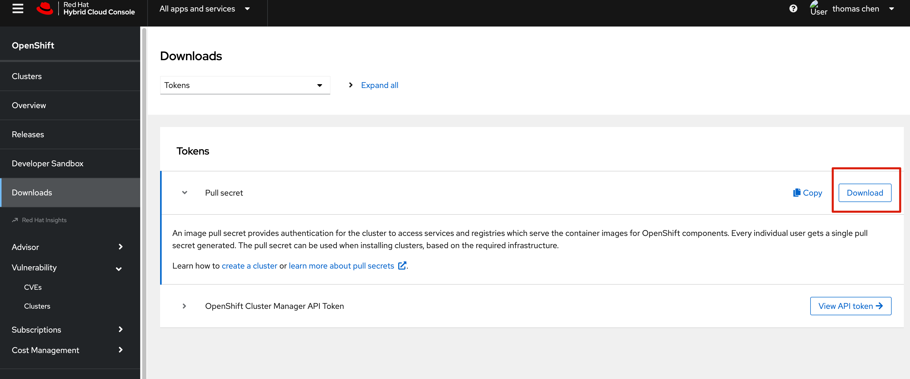

# 目标

使用个人开发者账号，安装ocp4.12 


# 准备工作


登陆 https://console.redhat.com/openshift/downloads#tool-pull-secret  获取个人 secret 




下载 oc 和 openshift-install 工具

```

mkdir -p ~/install 
cd  ~/install 

curl -LO https://mirror.openshift.com/pub/openshift-v4/clients/ocp/4.12.9/openshift-client-linux.tar.gz
curl -LO https://mirror.openshift.com/pub/openshift-v4/clients/ocp/4.12.9/openshift-install-linux.tar.gz

tar zxvf openshift-client-linux.tar.gz  -C /usr/local/bin/
tar zxvf openshift-install-linux.tar.gz -C /usr/local/bin/

# 检查版本
[root@bastion-test1 install]# oc version
Client Version: 4.12.9
Kustomize Version: v4.5.7
[root@bastion-test1 install]# openshift-install version
openshift-install 4.12.9
built from commit 15d8ffe8fa3a5ab2f36f7e0a54126c98733aaf25
release image quay.io/openshift-release-dev/ocp-release@sha256:96bf74ce789ccb22391deea98e0c5050c41b67cc17defbb38089d32226dba0b8
release architecture amd64
```


同步镜像到本地

```
export OCP_RELEASE=4.12.9
export LOCAL_SECRET_JSON='/root/install/pull-secret.txt'
export ARCHITECTURE='x86_64'
export REMOVABLE_MEDIA_PATH='/root'

oc adm release mirror -a ${LOCAL_SECRET_JSON} \
  --from=quay.io/openshift-release-dev/ocp-release:${OCP_RELEASE}-${ARCHITECTURE} \
  --to-dir=${REMOVABLE_MEDIA_PATH}/mirror
```


下载 rhcos ova 文件到本地


1. 登陆 yum.ocp.example.com 节点，该节点已经配置了httpd 服务，在上边配置 rhcos目录
2. 在httpd server 上下载 rhcos ova 文件

```
mkdir -p /data/rhcos

cat << EOF > /etc/httpd/conf.d/rhcos.conf
Alias /rhcos "/data/rhcos"
<Directory "/data/rhcos">
  Options +Indexes +FollowSymLinks
  Require all granted
</Directory>
<Location /rhcos>
  SetHandler None
</Location>
EOF

systemctl restart httpd

cd /data/rhcos
curl -LO https://mirror.openshift.com/pub/openshift-v4/x86_64/dependencies/rhcos/4.12/4.12.3/rhcos-vmware.x86_64.ova


```


