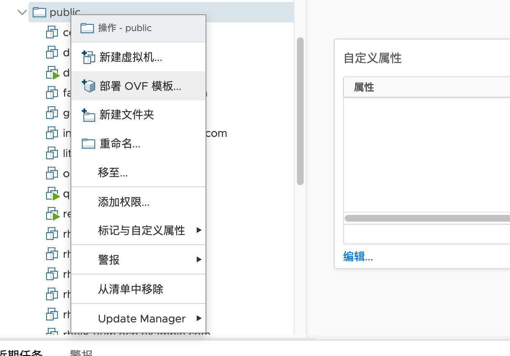
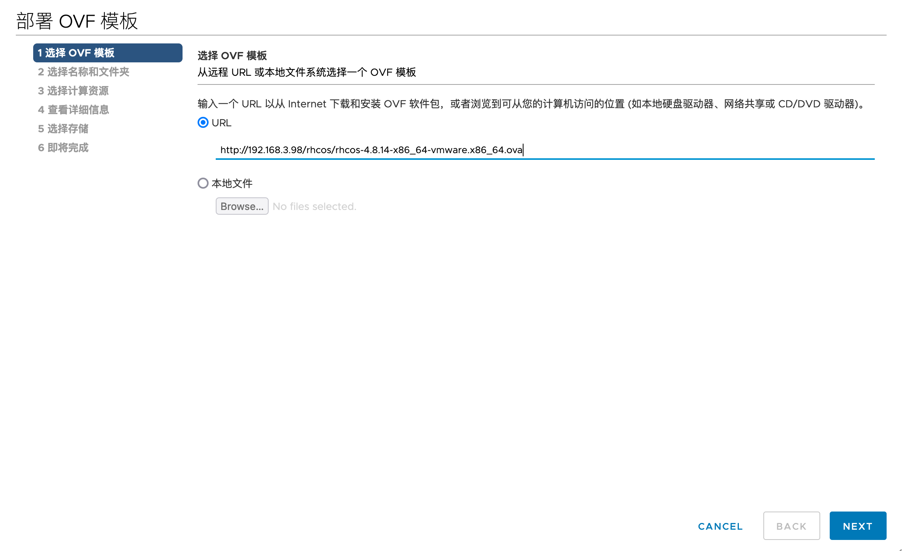
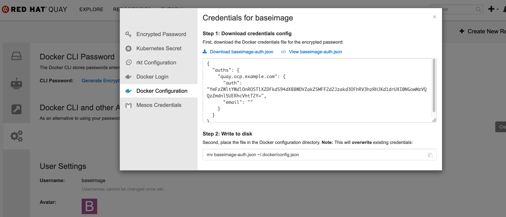
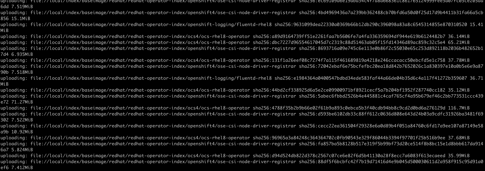

# 目标

1. 安装OCP4.8.45


## 部署架构


# prepare registry node 

## clone node

```
export GOVC_URL=192.168.3.10
export GOVC_INSECURE=true
export GOVC_USERNAME='administrator@vsphere.local'
export GOVC_PASSWORD='xxx'

govc vm.clone -vm centos7-template -on=false -host=esxi.ocp.example.com -ds=data3 -folder=public registry.ocp.example.com
govc vm.clone -vm rhel7-template -on=false -host=esxi.ocp.example.com -ds=data4 -folder=public yum.ocp.example.com

govc vm.clone -vm rhel7-template -on=false -host=esxi.ocp.example.com -ds=data4 -folder=ocp4.8 bastion48.ocp.ocp48.com

govc vm.clone -vm centos7-template -on=false -host=esxi.ocp.example.com -ds=data3 -folder=public demo-node

在ui上为其添加一块100G的硬盘，将磁盘格式化为xfs格式，并挂载到/data 目录下

```


## 修改DNS 配置

### 添加 ocp48.example.com.zone 文件

```
[root@dns named]# cat ocp48.example.com.zone
$TTL 1D
@   IN SOA  @ ns1.ocp48.example.com. (
                    2022072400   ; serial
                    3H           ; refresh
                    30M          ; retry
                    2W           ; expire
                    1W )         ; minimum
@   NS  ns1.ocp48.example.com.
ns1        IN  A   192.168.3.99
dns        IN  A   192.168.3.99
registry   IN  A   192.168.3.100

api        IN  A   192.168.3.120
api-int    IN  A   192.168.3.120

bootstrap      IN  A   192.168.3.119
bastion-48    IN  A   192.168.3.120
master1-48    IN  A   192.168.3.121
master2-48    IN  A   192.168.3.122
master3-48    IN  A   192.168.3.123

infra1-48     IN  A   192.168.3.124
infra2-48     IN  A   192.168.3.125
infra3-48     IN  A   192.168.3.126

worker1-48    IN  A   192.168.3.127
worker2-48    IN  A   192.168.3.128
worker3-48    IN  A   192.168.3.129

*.apps     IN  A   192.168.3.120

```

### 添加相关的记录到反向解析文件中

```
cat 3.168.192.in-addr.arpa.zone

...
119   IN  PTR bootstrap.ocp48.example.com.
120   IN  PTR bastion-48.ocp48.example.com.
121   IN  PTR master1-48.ocp48.example.com.
122   IN  PTR master2-48.ocp48.example.com.
123   IN  PTR master3-48.ocp48.example.com.
124   IN  PTR infra1-48.ocp48.example.com.
125   IN  PTR infra2-48.ocp48.example.com.
126   IN  PTR infra3-48.ocp48.example.com.
127   IN  PTR worker1-48.ocp48.example.com.
128   IN  PTR worker2-48.ocp48.example.com.
129   IN  PTR worker3-48.ocp48.example.com.
...
```

### 修改 /etc/named.conf 文件

在文件中添加以下内容

```
...
zone "ocp48.example.com" IN {
    type master;
    file "ocp48.example.com.zone";
};
...
```


### 重启DNS服务

```
systemctl restart named
```


## 准备bastion 节点

### 初始化bastion 网络

从rhel8-template clone一个作为bastion节点，执行以下命令初始化网络

```
nmcli con mod ens192 ipv4.addresses 192.168.3.120/24
nmcli con mod ens192 ipv4.gateway 192.168.3.1
nmcli con mod ens192 ipv4.method manual
nmcli con mod ens192 ipv4.dns "192.168.3.99"
nmcli con up ens192
```


### 下载ocp所需工具

```
mkdir -p ~/install 
cd  ~/install 

curl -LO https://mirror.openshift.com/pub/openshift-v4/clients/ocp/4.8.45/openshift-client-linux.tar.gz
curl -LO https://mirror.openshift.com/pub/openshift-v4/clients/ocp/4.8.45/openshift-install-linux-4.8.45.tar.gz

tar zxvf openshift-client-linux.tar.gz  -C /usr/local/bin/
tar zxvf openshift-install-linux-4.8.45.tar.gz -C /usr/local/bin/

# 查看oc 工具的版本
[root@bastion-48 install]# oc version
Client Version: 4.8.45
[root@bastion-48 install]#
[root@bastion-48 install]# openshift-install version
openshift-install 4.8.45
built from commit b67c48b3ba135f2a02b791b6bc42ca6cf0780c88
release image quay.io/openshift-release-dev/ocp-release@sha256:e9bcc5d74c4d6651f15601392e7eec52a9feacbf583ca5323ddeb9d3a878d75d
```

###  同步镜像到本地

```

export OCP_RELEASE=4.8.46
export LOCAL_SECRET_JSON='/root/install/pull-secret.txt'
export ARCHITECTURE='x86_64'
export REMOVABLE_MEDIA_PATH='/root'

oc adm release mirror -a ${LOCAL_SECRET_JSON} \
  --from=quay.io/openshift-release-dev/ocp-release:${OCP_RELEASE}-${ARCHITECTURE} \
  --to-dir=${REMOVABLE_MEDIA_PATH}/mirror

```

### 准备ova镜像

#### 下载镜像

```

curl -LO https://mirror.openshift.com/pub/openshift-v4/x86_64/dependencies/rhcos/4.8/latest/rhcos-4.8.14-x86_64-vmware.x86_64.ova

# 将ova文件放置在httpd server

scp rhcos-4.8.14-x86_64-vmware.x86_64.ova root@192.168.3.98:/opt/repos/rhcos/
```


#### 导入镜像

参考以下步骤导入ova 文件







### 配置yum源

```
[root@bastion-48 ~]# cat /etc/yum.repos.d/rhel8.6.repo
[rhel-8-for-x86_64-baseos-rpms]
name=rhel-8-for-x86_64-baseos-rpms
baseurl=http://rhel8-yum.ocp.example.com/repos/rhel8.6/rhel-8-for-x86_64-baseos-rpms
enabled=1
gpgcheck=0
[rhel-8-for-x86_64-appstream-rpms]
name=rhel-8-for-x86_64-appstream-rpms
baseurl=http://rhel8-yum.ocp.example.com/repos/rhel8.6/rhel-8-for-x86_64-appstream-rpms
enabled=1
gpgcheck=0
[fast-datapath-for-rhel-8-x86_64-rpms]
name=fast-datapath-for-rhel-8-x86_64-rpms
baseurl=http://rhel8-yum.ocp.example.com/repos/rhel8.6/fast-datapath-for-rhel-8-x86_64-rpms
enabled=1
gpgcheck=0
```


### 安装govc

```
scp root@192.168.3.30:/usr/local/bin/govc /usr/local/bin/govc

# vi ~/.bashrc 
# add below lines 
export GOVC_URL=192.168.3.10
export GOVC_INSECURE=true
export GOVC_USERNAME='administrator@vsphere.local'
export GOVC_PASSWORD='1234Abcd~!@#'

source <(oc completion bash)

```


### 安装&配置haproxy

#### 安装HAProxy

使用bastion作为HAproxy节点

```
yum -y install haproxy
setsebool -P haproxy_connect_any=1

```

#### 配置 HAproxy

vim /etc/haproxy/haproxy.cfg

```
# Global settings
#---------------------------------------------------------------------
global
    maxconn     20000
    log         127.0.0.1 local0 info
    chroot      /var/lib/haproxy
    pidfile     /var/run/haproxy.pid
    user        haproxy
    group       haproxy
    daemon

    # turn on stats unix socket
    stats socket /var/lib/haproxy/stats

#---------------------------------------------------------------------
# common defaults that all the 'listen' and 'backend' sections will
# use if not designated in their block
#---------------------------------------------------------------------
defaults
  maxconn 20000
  mode    tcp
  log     global
  option  dontlognull
  retries 3
  timeout http-request 10s
  timeout queue        1m
  timeout connect      10s
  timeout client       86400s
  timeout server       86400s
  timeout tunnel       86400s

listen stats
    bind :9000
    mode http
    stats enable
    stats uri /
    monitor-uri /healthz

frontend api-server
    bind *:6443
    default_backend api-server

backend api-server
    option  httpchk GET /readyz HTTP/1.0
    option  log-health-checks
    balance roundrobin
    server bootstrap 192.168.3.119:6443 weight 1 verify none check check-ssl inter 1s fall 2 rise 3
    server master1 192.168.3.121:6443 weight 1 verify none check check-ssl inter 1s fall 2 rise 3
    server master2 192.168.3.122:6443 weight 1 verify none check check-ssl inter 1s fall 2 rise 3
    server master3 192.168.3.123:6443 weight 1 verify none check check-ssl inter 1s fall 2 rise 3

frontend machine-config-server
    bind *:22623
    default_backend machine-config-server

backend machine-config-server
    balance roundrobin
    server bootstrap 192.168.3.119:22623 check
    server master1 192.168.3.121:22623 check
    server master2 192.168.3.122:22623 check
    server master3 192.168.3.123:22623 check

frontend router-http
    bind *:80
    default_backend router-http

backend router-http
    balance source
    mode tcp
    server router1 192.168.3.124:80 check
    server router2 192.168.3.125:80 check

frontend router-https
    bind *:443
    default_backend router-https

backend router-https
    balance source
    mode tcp
    server router1 192.168.3.124:443 check
    server router2 192.168.3.125:443 check

```

#### HAproxy 安装后配置

```
systemctl restart haproxy
systemctl status haproxy
systemctl enable haproxy

firewall-cmd --add-port=9000/tcp --permanent
firewall-cmd --add-port=6443/tcp --permanent
firewall-cmd --add-port=22623/tcp --permanent
firewall-cmd --add-port=80/tcp --permanent
firewall-cmd --add-port=443/tcp --permanent
firewall-cmd --reload

# 设置防火墙
sed -i s/SELINUX=enforcing/SELINUX=permissive/ /etc/selinux/config
setenforce 0

```


#### 配置rsyslog

```
vim /etc/rsyslog.conf

# 添加以下三行
$ModLoad imudp
$UDPServerRun 514
local0.*    /var/log/haproxy.log

# 重启服务
systemctl restart haproxy rsyslog

# 查看日志
tail -f /var/log/haproxy.log
```


## 将本地镜像推送到quay

### 安装镜像仓库证书

同步镜像仓库的证书文件到本地

```
scp root@192.168.3.95:/opt/certs/myrootCA.crt /etc/pki/ca-trust/source/anchors/myrootCA.crt
update-ca-trust
```

### 从quay获取pull-secret 文件内容





    "quay.ocp.example.com": {
      "auth": "YmFzZWltYWdlOnROSTlXZDFkdS94dXBBWDVZakZSMFF2d2Jzakd3OFhRV3hzRHJKd1drUXI0NGowMzVQQzZmdnl5UERhcVhtT2Y=",
      "email": ""
    }

将下载下来的证书推送到 bastion 节点 

```
scp baseimage-auth.json root@192.168.3.120:~/install
```


> 注意： 添加harbor secret 信息时 使用一下命令， 要注意后面的 -w0 
```
echo -n 'admin:Harbor12345' | base64 -w0
```

### push image to registry 

> 之前开了代理，这里最好把代理关掉，或者重新开一个终端

```
export LOCAL_REGISTRY='quay.ocp.example.com'
export LOCAL_REPOSITORY='baseimage/openshift4'
export LOCAL_SECRET_JSON='/root/install/baseimage-auth.json'

oc image mirror -a ${LOCAL_SECRET_JSON} \
--from-dir=/root/mirror 'file://openshift/release:4.8.46-x86_64*' \
${LOCAL_REGISTRY}/${LOCAL_REPOSITORY}

```

### 查看推送后的数据


# 安装

 


## on bastion node 

```
ssh-keygen  -N '' -f ~/.ssh/id_rsa

eval "$(ssh-agent -s)"
ssh-add ~/.ssh/id_rsa

cat /root/.ssh/id_rsa.pub
```


## 生成install-config文件

install-config.yaml 内容如下 

```
apiVersion: v1
baseDomain: example.com
compute:
- hyperthreading: Enabled
  name: worker
  replicas: 3
controlPlane:
  hyperthreading: Enabled
  name: master
  replicas: 3
metadata:
  name: ocp48
networking:
  clusterNetwork:
  - cidr: 10.128.0.0/14
    hostPrefix: 23
  networkType: OpenShiftSDN
  serviceNetwork:
  - 172.30.0.0/16
platform:
  none: {}
fips: false
pullSecret: '{"auths":{"quay.ocp.example.com":{"auth":"YmFzZWltYWdlOnROSTlXZDFkdS94dXBBWDVZakZSMFF2d2Jzakd3OFhRV3hzRHJKd1drUXI0NGowMzVQQzZmdnl5UERhcVhtT2Y="}}}' 
sshKey: 'ssh-rsa AAAAB3NzaC1yc2EAAAADAQABAAABgQCiVu/VhVM3K0O3VDS4KR6DA32GPlfKWfyqg9OwocFgTTRHO8V2rBLg/NuqYq6BrElpNT0uYAay+DjNUrGuVFpDtiXWAfBUiYC0C6OA+DTch4pOoPkCtz3T9dUlFWqU9es3vk6SIV6drkjpeA+fLBWJLLUNNjo6QHkC39W3aCuG6W5jOELBNM704/1Xy9+7KDx/j9Bmctacg9XRXN0AyYyC9iEAP8wBXuiyJnQ2+6r8oKyHBxUQ+ZPj2sGJhpXVfjRtoLJs0NNoDX8e5ShVO2DGQZIpciom2cna7eHyhmASFs5xD4iXD1PqEf/cn8uAAUOb868YfuuuljoPjGuRRCw/6HhSKw1YztG6fX3VUQWM2Uosms3WnFRRj7SD9f4Ul48jtTUtyMtiYLwqQ7SD6Z8R+3KzMgUSJ8hEVBGO1z7p32bdpYedG/l5kDQJAKMBaFXle1HNhBrW9N+1f3ax7Og6dyPn4qtAT1hpecx8EyugKS8fLtXzmKLLdQdbMuhJX98= root@bastion-48.ocp48.example.com'
additionalTrustBundle: |
  -----BEGIN CERTIFICATE-----
  MIIFuzCCA6OgAwIBAgIUe5hWcSRhKkV9DyxL67mRMvL9d4kwDQYJKoZIhvcNAQEN
  BQAwbTELMAkGA1UEBhMCQ04xEjAQBgNVBAgMCUd1YW5nZG9uZzERMA8GA1UEBwwI
  U2hlbnpoZW4xDDAKBgNVBAoMA0NNQjEMMAoGA1UECwwDRlRDMRswGQYDVQQDDBJj
  YS5vY3AuZXhhbXBsZS5jb20wHhcNMjIwMzI0MDMzNjMyWhcNMzIwMzIxMDMzNjMy
  WjBtMQswCQYDVQQGEwJDTjESMBAGA1UECAwJR3Vhbmdkb25nMREwDwYDVQQHDAhT
  aGVuemhlbjEMMAoGA1UECgwDQ01CMQwwCgYDVQQLDANGVEMxGzAZBgNVBAMMEmNh
  Lm9jcC5leGFtcGxlLmNvbTCCAiIwDQYJKoZIhvcNAQEBBQADggIPADCCAgoCggIB
  AL1m948yEBsTvhpKiiCjuEaLdoO/haCiFViKM05IEFys/wv/BqLDZLuAo8R2l6iu
  iLLX9rU+dCuWV2bYDk2rrMnthFu5ky2TQrGVueGznYgFLhPOki+PPUSvk04lTLol
  EvHUbBx0GkzxZQhbLsXh5mCKjj5k7jOzv/taUOyUn58ae2J98fcM6wDbrl7soIpe
  AzBtPRQ46cX62TKyZxBA4GaPihZNImfF3dnNQ2BeatUGOGgKxTmZkZdQONUFDiw0
  QKYreo84GBszXLyMCI7i4fBApi+oyhq8T3eHdk2tUcQFZN+rHFjyO8Ydl9mYoIub
  BdZzBQRWsdOYBKAUDYplmoP31GiCmPLXds9BpqsyfPJU9hqwWdAStNhSDNM/23jB
  TYYcOw+TvEPddZUYaADulg9ITLCRAkQfUdecsP0LVqT9CE9KiMxvKURSVOYeILO9
  ln//rylvllrH1tf0ShBwHlOkkWgYJu69yzpP/R1NAfHXZFa0f3GcHdNxht6i2RtS
  UqA8RZn5YbWC3LEpGSQfEOTloC3b69sBAhcG9eBk0RSBCz6bzT79Fwzp28eM7PZd
  ys5wnONrSbOjXs+4XsSAfpZQDCosxYi19Sa0ZNjpQOvIWcdrki7XbdCALpkC9ceL
  QQRB2gcYuJIUr36XekcMEpA1ZOW6cqvjiX6qyAsmoEzxAgMBAAGjUzBRMB0GA1Ud
  DgQWBBQgVhLd2f8C/1x71qWgG6+gOnU4rDAfBgNVHSMEGDAWgBQgVhLd2f8C/1x7
  1qWgG6+gOnU4rDAPBgNVHRMBAf8EBTADAQH/MA0GCSqGSIb3DQEBDQUAA4ICAQB0
  n7yVUoZTmnukWXPyYCVnfnX8YHQloHKLZxjkEHrNz87OY0A0wdBbSV0WR14Fk9r/
  aXLwW+ScaPvBHAfBqI/gtNtSJ4kF7OpopqSh5zLE3k2RgI421ZrCOQ3Mi7SBUvwe
  /6c8b8XO6Iz6qg83T0BKX/A+fvohK0o7egviJBtFthViqIXfiXuFkXGf08LVcCue
  deRsr+cT9atRTZk1zrqFeWW0NoeeMQGzAqLI8Cl3Tm4Rdd9mkz1cKB2Wx6wuhLfT
  A6tQtGg2OjtzEHllFDX0ZUuqMOYiChXV4Cf24ILkaNFRQDT9b89ZvZrudfywzXa0
  NKkupP5tvRwI4FDyJHexo1oByLWQELg9Bzyu5D7bmvx3OrsUAvbIjsoCX/pIARSV
  TA1bEqp5lGAVlQ73asXm1SpLRuf/ngrhaTJVBhb+nuP1nw6b7CAC7/ryHUpylePm
  1WKsqMPcRjVRqJbzu49xnDtYlyR5iXAJFOVPyBfXebgFdenm72kvTtQ4b6XZKC1g
  X966unXHGDJ6toIFUqd8C6DK83rfFU++wJx8iF3rohaVcsfs7MvLXKGNXWpZa4cV
  1NG8eNXFThrQW02p6DUpNUg+mfOn+DkJLyHeycQ+HJmHmdWX67f+Z2QQzXj2jWfL
  hBjIcdrXzcqM237y7znt55VqmAeGs0fiJENWvZv/Bg==
  -----END CERTIFICATE-----
imageContentSources:
- mirrors:
  - quay.ocp.example.com/baseimage/openshift4
  source: quay.io/openshift-release-dev/ocp-release
- mirrors:
  - quay.ocp.example.com/baseimage/openshift4
  source: quay.io/openshift-release-dev/ocp-v4.0-art-dev
```


## 生成点火文件

```
mkdir -p ~/ocp
cp ~/install/install-config.yaml ocp/

cd ~/ocp 
openshift-install create manifests

openshift-install create ignition-configs
```


## 将点火文件放入HTTP server

```
cat <<EOF > append-bootstrap.ign
{
    "ignition": {
        "config": {
            "merge": [{
                    "source": "http://192.168.3.98/rhcos/bootstrap.ign"
                }
            ]
        },
        "version": "3.1.0"
    }
}
EOF

chmod +r bootstrap.ign
scp bootstrap.ign root@192.168.3.98:/opt/repos/rhcos/bootstrap.ign
```


## 更改OVA文件属性


```

[root@bastion-48 ocp]# govc device.info -vm /Datacenter/vm/public/rhcos-4.8.14 disk-*
Name:           disk-1000-0
  Type:         VirtualDisk
  Label:        Hard disk 1
  Summary:      16,777,216 KB
  Key:          2000
  Controller:   pvscsi-1000
  Unit number:  0
  File:         [data2] rhcos-4.8.14/rhcos-4.8.14.vmdk


[root@bastion-48 ocp]# govc vm.change -vm /Datacenter/vm/public/rhcos-4.8.14 -e disk.EnableUUID=TRUE -e=guestinfo.ignition.config.data.encoding=base64

```


## 安装控制节点

```
# clone 控制节点
for name in \
  bootstrap \
  master1-48 \
  master2-48 \
  master3-48 
do
  govc vm.clone -vm rhcos-4.8.14 -on=false -host=esxi.ocp.example.com -ds=datastore1 -folder=OCP4.8 $name.ocp48.example.com
  govc vm.change -vm /Datacenter/vm/OCP4.8/$name.ocp48.example.com -c=8 -m=16384
  govc vm.disk.change -vm /Datacenter/vm/OCP4.8/$name.ocp48.example.com -disk.key 2000 -size 100G
done

# 修改配置
govc vm.change -vm /Datacenter/vm/OCP4.8/bootstrap.ocp48.example.com -e "guestinfo.afterburn.initrd.network-kargs=ip=192.168.3.119::192.168.3.1:255.255.255.0:bootstrap.ocp48.example.com::none:192.168.3.99" -e guestinfo.ignition.config.data="$(cat append-bootstrap.ign | base64 -w0)"

govc vm.change -vm /Datacenter/vm/OCP4.8/master1-48.ocp48.example.com -e "guestinfo.afterburn.initrd.network-kargs=ip=192.168.3.121::192.168.3.1:255.255.255.0:master1-48.ocp48.example.com::none:192.168.3.99" -e guestinfo.ignition.config.data="$(cat master.ign | base64 -w0)"
govc vm.change -vm /Datacenter/vm/OCP4.8/master2-48.ocp48.example.com -e "guestinfo.afterburn.initrd.network-kargs=ip=192.168.3.122::192.168.3.1:255.255.255.0:master2-48.ocp48.example.com::none:192.168.3.99" -e guestinfo.ignition.config.data="$(cat master.ign | base64 -w0)"
govc vm.change -vm /Datacenter/vm/OCP4.8/master3-48.ocp48.example.com -e "guestinfo.afterburn.initrd.network-kargs=ip=192.168.3.123::192.168.3.1:255.255.255.0:master3-48.ocp48.example.com::none:192.168.3.99" -e guestinfo.ignition.config.data="$(cat master.ign | base64 -w0)"


# 启动控制节点

for name in \
  bootstrap \
  master1-48 \
  master2-48 \
  master3-48 
do
  govc vm.power -on $name.ocp48.example.com
done

```


## 安装计算节点

```

# clone 计算节点
govc vm.clone -on=false -vm rhcos-4.8.14 -host=esxi.ocp.example.com -ds=data1 -folder=OCP4.8 worker1-48.ocp48.example.com
govc vm.clone -on=false -vm rhcos-4.8.14 -host=esxi.ocp.example.com -ds=data2 -folder=OCP4.8 worker2-48.ocp48.example.com
govc vm.clone -on=false -vm rhcos-4.8.14 -host=esxi.ocp.example.com -ds=data3 -folder=OCP4.8 worker3-48.ocp48.example.com
govc vm.clone -on=false -vm rhcos-4.8.14 -host=esxi.ocp.example.com -ds=data4 -folder=OCP4.8 infra1-48.ocp48.example.com
govc vm.clone -on=false -vm rhcos-4.8.14 -host=esxi.ocp.example.com -ds=data1 -folder=OCP4.8 infra2-48.ocp48.example.com
govc vm.clone -on=false -vm rhcos-4.8.14 -host=esxi.ocp.example.com -ds=data2 -folder=OCP4.8 infra3-48.ocp48.example.com

# 修改计算节点配置
for name in \
  worker1-48 \
  worker2-48 \
  worker3-48 \
  infra1-48 \
  infra2-48 \
  infra3-48 
do
  govc vm.change -vm /Datacenter/vm/OCP4.8/$name.ocp48.example.com -c=8 -m=16384
  govc vm.disk.change -vm /Datacenter/vm/OCP4.8/$name.ocp48.example.com -disk.key 2000 -size 100G
done

# 
govc vm.change -vm /Datacenter/vm/OCP4.8/worker1-48.ocp48.example.com -e "guestinfo.afterburn.initrd.network-kargs=ip=192.168.3.127::192.168.3.1:255.255.255.0:worker1-48.ocp48.example.com::none:192.168.3.99" -e guestinfo.ignition.config.data="$(cat worker.ign | base64 -w0)"
govc vm.change -vm /Datacenter/vm/OCP4.8/worker2-48.ocp48.example.com -e "guestinfo.afterburn.initrd.network-kargs=ip=192.168.3.128::192.168.3.1:255.255.255.0:worker2-48.ocp48.example.com::none:192.168.3.99" -e guestinfo.ignition.config.data="$(cat worker.ign | base64 -w0)"
govc vm.change -vm /Datacenter/vm/OCP4.8/worker3-48.ocp48.example.com -e "guestinfo.afterburn.initrd.network-kargs=ip=192.168.3.129::192.168.3.1:255.255.255.0:worker3-48.ocp48.example.com::none:192.168.3.99" -e guestinfo.ignition.config.data="$(cat worker.ign | base64 -w0)"

govc vm.change -vm /Datacenter/vm/OCP4.8/infra1-48.ocp48.example.com -e "guestinfo.afterburn.initrd.network-kargs=ip=192.168.3.124::192.168.3.1:255.255.255.0:infra1-48.ocp48.example.com::none:192.168.3.99" -e guestinfo.ignition.config.data="$(cat worker.ign | base64 -w0)"
govc vm.change -vm /Datacenter/vm/OCP4.8/infra2-48.ocp48.example.com -e "guestinfo.afterburn.initrd.network-kargs=ip=192.168.3.125::192.168.3.1:255.255.255.0:infra2-48.ocp48.example.com::none:192.168.3.99" -e guestinfo.ignition.config.data="$(cat worker.ign | base64 -w0)"
govc vm.change -vm /Datacenter/vm/OCP4.8/infra3-48.ocp48.example.com -e "guestinfo.afterburn.initrd.network-kargs=ip=192.168.3.126::192.168.3.1:255.255.255.0:infra3-48.ocp48.example.com::none:192.168.3.99" -e guestinfo.ignition.config.data="$(cat worker.ign | base64 -w0)"

# 启动节点
for name in \
  worker1-48 \
  worker2-48 \
  worker3-48 \
  infra1-48 \
  infra2-48 \
  infra3-48 
do
  govc vm.power -on $name.ocp48.example.com
done
```


## 观察进度

```
cd ~/${CLUSTERID}
openshift-install wait-for install-complete --log-level debug
```


## 其他命令

```
# approve csr request 

oc get csr -o go-template='{{range .items}}{{if not .status}}{{.metadata.name}}{{"\n"}}{{end}}{{end}}' | xargs oc adm certificate approve


```


# 安装后配置


## 检查master 节点磁盘性能

这一步非常重要，OCP4 对master 节点的磁盘性能要求很高，如果IO不好的话，很容易导致ETCD故障，然后进一步导致集群不稳定，OCP4 的要求小于10ms 

```
oc debug node/<master-node>
chroot /host bash
podman run --volume /var/lib/etcd:/var/lib/etcd:Z quay.io/openshift-scale/etcd-perf

```


## 安装后基本配置

```
# 自动补全
yum install httpd-tools bash-completion -y 
```


## 配置infra node

### 创建infra mcp

```
cat << EOF | oc create -f -
apiVersion: machineconfiguration.openshift.io/v1
kind: MachineConfigPool
metadata:
  name: infra
spec:
  machineConfigSelector:
    matchExpressions:
      - {key: machineconfiguration.openshift.io/role, operator: In, values: [worker,infra]}
  nodeSelector:
    matchLabels:
      node-role.kubernetes.io/infra: ""
EOF
```


### 为节点打label

```
oc label node infra1-48.ocp48.example.com node-role.kubernetes.io/infra=
oc label node infra2-48.ocp48.example.com node-role.kubernetes.io/infra=
oc label node infra3-48.ocp48.example.com node-role.kubernetes.io/infra=
```


### 迁移router pod 到 infra 节点

```
# 为infra 节点打上污点
oc adm taint nodes -l node-role.kubernetes.io/infra node-role.kubernetes.io/infra=reserved:NoSchedule node-role.kubernetes.io/infra=reserved:NoExecute

# 为节点添加内容
oc patch ingresscontroller/default -n  openshift-ingress-operator  --type=merge -p '{"spec":{"nodePlacement": {"nodeSelector": {"matchLabels": {"node-role.kubernetes.io/infra": ""}},"tolerations": [{"effect":"NoSchedule","key": "node-role.kubernetes.io/infra","value": "reserved"},{"effect":"NoExecute","key": "node-role.kubernetes.io/infra","value": "reserved"}]}}}'

# 设置 router 节点的数量 
c patch -n openshift-ingress-operator ingresscontroller/default --patch '{"spec":{"replicas": 3}}' --type=merge
```


## 添加用户

```
yum install -y httpd-tools

htpasswd -bc localuser.user admin admin
oc adm policy add-cluster-role-to-user cluster-admin admin
```


## 离线配置


## 配置router 

### 设置router数量


### 配置router 到infra节点上


# 安装operatorhub

## 准备工作

离线operatorhub 需要提前安装以下工具

* opm
* grpcurl

```
# download opm 
curl -LO https://mirror.openshift.com/pub/openshift-v4/amd64/clients/ocp/4.8.46/opm-linux-4.8.46.tar.gz

tar zxvf opm-linux-4.8.46.tar.gz -C /usr/local/bin

# download grpcurl
curl -LO https://github.com/fullstorydev/grpcurl/releases/download/v1.8.6/grpcurl_1.8.6_linux_x86_64.tar.gz

tar zxvf grpcurl_1.8.6_linux_x86_64.tar.gz -C /usr/local/bin
```


## 离线operatorhub


### 离线所需operator 到本地

```
podman login registry.redhat.io

podman run -p50051:50051 -it registry.redhat.io/redhat/redhat-operator-index:v4.8

grpcurl -plaintext localhost:50051 api.Registry/ListPackages > packages.out

# packages.out 会列出redhat-operator 中所有的 operator 包，挑选出来我们需要的， 如下所示

{
  "name": "cluster-logging"
}
{
  "name": "elasticsearch-operator"
}
{
  "name": "local-storage-operator"
}
{
  "name": "ocs-operator"
}

# 执行以下命令裁剪出仅包含我们需要的operator bundle 的 镜像 
opm index prune -f registry.redhat.io/redhat/redhat-operator-index:v4.8 \
    -p cluster-logging,elasticsearch-operator,local-storage-operator,ocs-operator \
    -t quay.ocp.example.com/baseimage/redhat/redhat-operator-index:v4.8

# 将生成出来的镜像推送到镜像仓库中 
podman push quay.ocp.example.com/baseimage/redhat/redhat-operator-index:v4.8

# 此时可以再次确认下我们的镜像， 执行以下两行命令，可以看到此时的 packages.out 文件里只有我们挑选出来的镜像
podman run -p50051:50051 -it quay.ocp.example.com/baseimage/redhat/redhat-operator-index:v4.8
grpcurl -plaintext localhost:50051 api.Registry/ListPackages > packages.out

# 同步镜像到本地
# 说明，此时pull-secret.json 大致内容如下所示
#####
{
  "auths": {
    "cloud.openshift.com": {
      "auth": "=",
      "email": ""
    },
    "quay.io": {
      "auth": "=",
      "email": ""
    },
    "registry.connect.redhat.com": {
      "auth": "==",
      "email": ""
    },
    "registry.redhat.io": {
      "auth": "==",
      "email": ""
    },
    "quay.ocp.example.com": {
      "auth": "",
      "email": ""
    }
  }
}
################

# 这个需要等待一段时间才会开始下载，稍等片刻 
REG_CREDS=/root/install/pull-secret.json

oc adm catalog mirror \
    quay.ocp.example.com/baseimage/redhat/redhat-operator-index:v4.8 \
    file:///local/index \
    -a ${REG_CREDS} \
    --index-filter-by-os='linux/amd64' 
    
```




### 推送到镜像仓库

在包含 v2 目录的父目录里执行以下命令，将operator 镜像推送到registry 中 

```

REG_CREDS=/root/install/pull-secret.json

oc adm catalog mirror \
    file://local/index/baseimage/redhat/redhat-operator-index:v4.8 \
    quay.ocp.example.com/baseimage/redhat/redhat-operator-index:v4.8 \
    -a ${REG_CREDS} \
    --index-filter-by-os='linux/amd64'
```


## 安装logging


# 离线 operator hub

关于这个，可以参考  [离线安装operator hub](./离线operatorhub.md)


# reference

https://docs.openshift.com/container-platform/4.8/operators/admin/olm-managing-custom-catalogs.html#olm-managing-custom-catalogs

