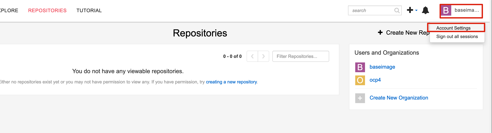

# 目标

记录ocp安装环境准备工作


# 注册个人开发者账号

访问  https://access.redhat.com/  注册 个人开发者账号


激活账号

https://developers.redhat.com/products/rhel/download


如果出现以下错误 


```
You must first accept Red Hat's Terms and conditions. Please visit https://www.redhat.com/wapps/ugc . You may have to log out of and back into the  Customer Portal in order to see the terms. (HTTP error code 401: Unauthorized)
```


解决方案 参考以下链接 

https://access.redhat.com/solutions/2387831


# 安装，配置 DNS


```
dnf install bind bind-utils vim


# 配置防火墙
firewall-cmd  --add-service=dns --zone=public  --permanent
firewall-cmd --reload
```


## 修改 /etc/named.conf 文件


修改内容如下

```
[root@dns named]# diff -uN /etc/named.conf.bak  /etc/named.conf
--- /etc/named.conf.bak	2021-08-25 07:20:38.000000000 +0800
+++ /etc/named.conf	2023-03-28 10:47:08.659121227 +0800
@@ -8,7 +8,7 @@
 //

 options {
-	listen-on port 53 { 127.0.0.1; };
+	listen-on port 53 { any; };
 	listen-on-v6 port 53 { ::1; };
 	directory 	"/var/named";
 	dump-file 	"/var/named/data/cache_dump.db";
@@ -16,7 +16,7 @@
 	memstatistics-file "/var/named/data/named_mem_stats.txt";
 	secroots-file	"/var/named/data/named.secroots";
 	recursing-file	"/var/named/data/named.recursing";
-	allow-query     { localhost; };
+	allow-query     { any; };

 	/*
 	 - If you are building an AUTHORITATIVE DNS server, do NOT enable recursion.
@@ -57,3 +57,15 @@
 include "/etc/named.rfc1912.zones";
 include "/etc/named.root.key";

+zone "test1.ocp.example.com" IN {
+     type master;
+     file "test1.ocp.example.com.zone";
+};
+
+//backward zone
+zone "3.168.192.in-addr.arpa" IN {
+     type master;
+     file "3.168.192.in-addr.arpa.zone";
+};
+
+
```


## 创建 


# 离线 yum 


## 创建本地yum server 


创建本地 yum server 

```
subscription-manager register --username=''
subscription-manager refresh

subscription-manager list --available --matches '*OpenShift*'

subscription-manager attach --pool=<pool_id>
subscription-manager repos --disable="*"
yum repolist 

subscription-manager repos \
    --enable="rhel-8-for-x86_64-baseos-rpms" \
    --enable="rhel-8-for-x86_64-appstream-rpms" \
    --enable="rhocp-4.12-for-rhel-8-x86_64-rpms" \
    --enable="fast-datapath-for-rhel-8-x86_64-rpms"

# 第一次同步时间较长，可以通过tmux 将 session放到后台执行 
yum -y install yum-utils tmux

mkdir -p /data/repos/rhel8

for repo in \
rhel-8-for-x86_64-baseos-rpms \
rhel-8-for-x86_64-appstream-rpms \
rhocp-4.12-for-rhel-8-x86_64-rpms \
fast-datapath-for-rhel-8-x86_64-rpms
do
  reposync -p /data/repos/rhel8 --download-metadata --repo=${repo} -n --delete
done


```


## 配置HTTPD 服务

在 yum server 上安装 httpd 服务

```

yum -y install httpd

cat << EOF > /etc/httpd/conf.d/yum.conf
Alias /repos  "/data/repos/rhel8"
<Directory "/data/repos/rhel8">
  Options +Indexes +FollowSymLinks
  Require all granted
</Directory>
<Location /repos>
  SetHandler None
</Location>
EOF

systemctl enable httpd;
systemctl restart httpd;
firewall-cmd --permanent --zone=public --add-service=http
firewall-cmd --reload

setenforce 0

```


## 节点配置

在其他节点上配置 repo ，即可使用离线repos

```

cat << EOF > /etc/yum.repos.d/rhel8.repo
[rhel-8-for-x86_64-baseos-rpms]
name=rhel-8-for-x86_64-baseos-rpms
baseurl=http://yum.example.com/repos/rhel-8-for-x86_64-baseos-rpms
enabled=1
gpgcheck=0
[rhel-8-for-x86_64-appstream-rpms]
name=rhel-8-for-x86_64-appstream-rpms
baseurl=http://yum.example.com/repos/rhel-8-for-x86_64-appstream-rpms
enabled=1
gpgcheck=0
[fast-datapath-for-rhel-8-x86_64-rpms]
name=fast-datapath-for-rhel-8-x86_64-rpms
baseurl=http://yum.example.com/repos/fast-datapath-for-rhel-8-x86_64-rpms
enabled=1
gpgcheck=0
[rhocp-4.12-for-rhel-8-x86_64-rpms]
name=rhocp-4.12-for-rhel-8-x86_64-rpms
baseurl=http://yum.example.com/repos/rhocp-4.12-for-rhel-8-x86_64-rpms
enabled=1
gpgcheck=0
EOF

```


# quay


## 自签证书


创建自签证书

```

mkdir -p /opt/certs
cd /opt/certs

CNAME_CA=ca.example.com
CER_ROOT_CA=myrootCA

openssl genrsa -out ${CER_ROOT_CA}.key 4096

openssl req -x509 -new -nodes -sha512 -days 3650 \
 -subj "/C=CN/ST=Shenzhen/L=Shenzhen/O=Company/OU=GPS/CN=${CNAME_CA}" \
 -key ${CER_ROOT_CA}.key \
 -out ${CER_ROOT_CA}.crt

CER_NAME=quay.ocp.example.com

openssl genrsa -out ${CER_NAME}.key 4096

openssl req -sha512 -new \
    -subj "/C=CN/ST=Shenzhen/L=Shenzhen/O=Company/OU=GPS/CN=${CER_NAME}" \
    -key ${CER_NAME}.key \
-out ${CER_NAME}.csr

cat > quay.cnf << EOF
[req]
req_extensions = v3_req
distinguished_name = req_distinguished_name

[req_distinguished_name]
[ v3_req ]
basicConstraints = CA:FALSE
keyUsage = nonRepudiation, digitalSignature, keyEncipherment
subjectAltName = @alt_names

[alt_names]
DNS.1 = quay.ocp.example.com
DNS.2 = quay
EOF


openssl x509 -req -in ${CER_NAME}.csr -CA ${CER_ROOT_CA}.crt \
   -CAkey ${CER_ROOT_CA}.key -CAcreateserial -out ${CER_NAME}.crt \
   -days 3650 -extensions v3_req -extfile quay.cnf
```


信任自签证书

```
cp /opt/certs/myrootCA.crt /etc/pki/ca-trust/source/anchors/
update-ca-trust
```


## 安装 Quay


```
yum install -y podman 

```


### 安装 


## 配置


选择之前生成的自签CA 


配置 server name，配置刚才生成的证书文件


数据库配置

- **数据库类型：** Postgres
- **数据库服务器：** quay.ocp.example.com:5432
- **Username:** quayuser
- **Password:** quaypass
- **数据库名称：** quay


Redis  配置

- **Redis Hostname:** quay.ocp.example.com
- **Redis 端口：** 6379 （默认）
- **Redis password：** strongpassword


下载配置


## 使用 Quay

创建账号


## ocp4 基础镜像导入

### 创建用户

为ocp4安装，单独创建一个账号，建议安装和业务不要使用共同的账号

1. 为 本次安装，创建一个 `baseimage` 账号
2. 创建一个名为 ocp4 的组织 


### 离线镜像


### 导入镜像到quay

获取 ocp4 的 秘钥 





输入 `baseimage` 的密码


# 安装NFS 


# Reference


https://mp.weixin.qq.com/s/lpqjIGAJnEqkoQbnwVoe8g


