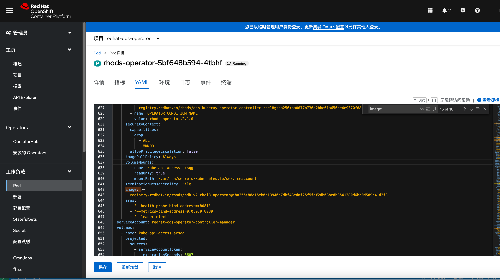

# 目标


1. 安装ods


# 环境准备


```
# 离线 operator hub 4.10 到本地
 oc image mirror -a ~/install/pull-secret.txt registry.redhat.io/redhat/redhat-operator-index:v4.10 file://redhat-operator-index
 
 
 
```


# 配置





```

[root@bastion-test5 ~]# podman run -it --rm -d --entrypoint sh registry.redhat.io/rhods/odh-v2-rhel8-operator@sha256:88d16eb0b13946a7dbf43edaf25f5fef2db63bedb3541280d6bb0d509c41d2f3
Trying to pull registry.redhat.io/rhods/odh-v2-rhel8-operator@sha256:88d16eb0b13946a7dbf43edaf25f5fef2db63bedb3541280d6bb0d509c41d2f3...
Getting image source signatures
Checking if image destination supports signatures
Copying blob 0c10cd59e10e done
Copying blob e0370c39fc85 done
Copying blob d24033584d43 done
Copying config 4f755a8127 done
Writing manifest to image destination
Storing signatures
3b987c154ff7e47822d28f436b7e52a9938ba8d371386da23b8b37c9f1485c7c


[root@bastion-test5 ~]# podman cp 3b987c154ff7:/opt/manifests ./
[root@bastion-test5 ~]# ls

# cd /root/manifests/jupyterhub/notebook-images/overlays/additional


```

