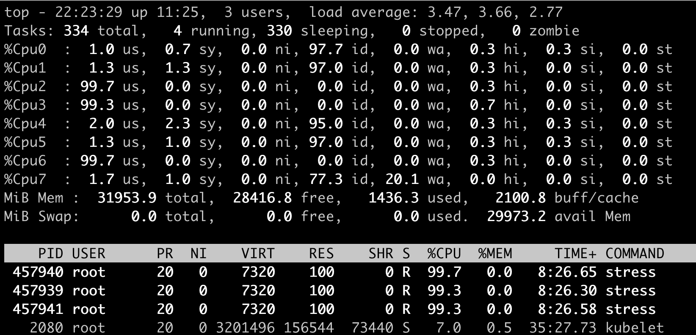

# 目标

* 为OCP4 配置 cpumanager 实现CPU绑核
* 通过对比测试，了解CPU绑核前后的差别


# 绑核配置

## 修改mcp worker 

```

oc edit machineconfigpool worker

######## 
metadata:
  creationTimestamp: 2020-xx-xxx
  generation: 3
  labels:
    custom-kubelet: cpumanager-enabled   # 添加这一行
```


## 创建kubeletconfig 对象

创建文件 cpumanager-kubeletconfig.yaml， 内容如下。

```
apiVersion: machineconfiguration.openshift.io/v1
kind: KubeletConfig
metadata:
  name: cpumanager-enabled
spec:
  machineConfigPoolSelector:
    matchLabels:
      custom-kubelet: cpumanager-enabled
  kubeletConfig:
     cpuManagerPolicy: static 
     cpuManagerReconcilePeriod: 5s 
```


* **cpuManagerReconcilePeriod** 默认的CPU Manager 调整频率

  

执行 oc create -f cpumanager-kubeletconfig.yaml 创建对象


## 查看结果

```
oc get machineconfig 99-worker-XXXXXX-XXXXX-XXXX-XXXXX-kubelet -o json | grep ownerReference -A7

# oc get machineconfig 99-worker-generated-kubelet -o json | grep ownerReference -A7
        "ownerReferences": [
            {
                "apiVersion": "machineconfiguration.openshift.io/v1",
                "blockOwnerDeletion": true,
                "controller": true,
                "kind": "KubeletConfig",
                "name": "cpumanager-enabled",
                "uid": "973cee9d-393b-4181-af7a-b5e95c779a59"
                
# 登陆到node上查看 
[root@rhel8-bastion ops]# oc debug node/worker5-410.ocp410.example.com
Starting pod/worker5-410ocp410examplecom-debug ...
To use host binaries, run `chroot /host`
Pod IP: 192.168.3.81
If you don't see a command prompt, try pressing enter.
sh-4.4#
sh-4.4# cat /host/etc/kubernetes/kubelet.conf | grep cpuManager
  "cpuManagerPolicy": "static",
  "cpuManagerReconcilePeriod": "5s",
sh-4.4#
```


## 创建一个Demo，并查看相关信息


### 创建demo pod 

设置一个label 

```
oc label node worker6-410.ocp410.example.com cpumanager=true
```


基于以下内容创建pod 

```
apiVersion: v1
kind: Pod
metadata:
  generateName: cpumanager-
spec:
  containers:
  - name: cpumanager
    image: quay.io/junkai/demo:pause-amd64
    resources:
      requests:
        cpu: 1
        memory: "1G"
      limits:
        cpu: 1
        memory: "1G"
  nodeSelector:
    cpumanager: "true"
```


### 查看结果

从这里可以看到该pod 使用了绑定了CPU1 

```
[root@worker6-410 ~]# cat /var/lib/kubelet/cpu_manager_state  | jq
{
  "policyName": "static",
  "defaultCpuSet": "0,2-7",
  "entries": {
    "2b38ebd9-1cf8-483f-8aac-57cba7afaf98": {
      "cpumanager": "1"
    }
  },
  "checksum": 4088866743
}	

```


1. 登陆到pod所在节点 `worker6`
2. 基于 `/pause` 关键字搜索
3. 参考以下命令查看结果

```
[root@worker6-410 ~]# systemd-cgls -l | grep /pause  -B4     
│   │ ├─843929 sshd: root [priv]
│   │ ├─843932 sshd: root@pts/2
│   │ ├─843933 -bash
│   │ ├─846982 systemd-cgls -l
│   │ └─846983 grep --color=auto /pause -B4
--
  └─kubepods-pod2b38ebd9_1cf8_483f_8aac_57cba7afaf98.slice
    ├─crio-conmon-c0dde53c54fabedb0b6694ce4014dc99ce2a9ce4401a27b1c60e6672b88e39cc.scope
    │ └─820657 /usr/bin/conmon -b /run/containers/storage/overlay-containers/c0dde53c54fabedb0b6694ce4014dc99ce2a9ce4401a27b1c60e6672b88e39cc/userdata -c c0dde53c54fabedb0b6694ce4014dc99ce2a9ce4401a27b1c60e6672b88e39cc --exit-dir /var/run/crio/exits -l /var/log/pods/cpumanager_cpumanager-jwvts_2b38ebd9-1cf8-483f-8aac-57cba7afaf98/cpumanager/0.log --log-level info -n k8s_cpumanager_cpumanager-jwvts_cpumanager_2b38ebd9-1cf8-483f-8aac-57cba7afaf98_0 -P /run/containers/storage/overlay-containers/c0dde53c54fabedb0b6694ce4014dc99ce2a9ce4401a27b1c60e6672b88e39cc/userdata/conmon-pidfile -p /run/containers/storage/overlay-containers/c0dde53c54fabedb0b6694ce4014dc99ce2a9ce4401a27b1c60e6672b88e39cc/userdata/pidfile --persist-dir /var/lib/containers/storage/overlay-containers/c0dde53c54fabedb0b6694ce4014dc99ce2a9ce4401a27b1c60e6672b88e39cc/userdata -r /usr/bin/runc --runtime-arg --root=/run/runc --socket-dir-path /var/run/crio -u c0dde53c54fabedb0b6694ce4014dc99ce2a9ce4401a27b1c60e6672b88e39cc -s --log-size-max 1048576
    └─crio-c0dde53c54fabedb0b6694ce4014dc99ce2a9ce4401a27b1c60e6672b88e39cc.scope
      └─820670 /pause
[root@worker6-410 ~]#


[root@worker6-410 ~]# cd /sys/fs/cgroup/cpuset/
kubepods.slice/ machine.slice/
[root@worker6-410 ~]# cd /sys/fs/cgroup/cpuset/kubepods.slice/kubepods-pod2b38ebd9_1cf8_483f_8aac_57cba7afaf98.slice/crio-c0dde53c54fabedb0b6694ce4014dc99ce2a9ce4401a27b1c60e6672b88e39cc.scope/
[root@worker6-410 crio-c0dde53c54fabedb0b6694ce4014dc99ce2a9ce4401a27b1c60e6672b88e39cc.scope]#


[root@worker6-410 crio-c0dde53c54fabedb0b6694ce4014dc99ce2a9ce4401a27b1c60e6672b88e39cc.scope]# for i in `ls cpuset.cpus tasks` ; do echo -n "$i "; cat $i ; done
cpuset.cpus 1
tasks 820670
[root@worker6-410 crio-c0dde53c54fabedb0b6694ce4014dc99ce2a9ce4401a27b1c60e6672b88e39cc.scope]#


[root@worker6-410 crio-c0dde53c54fabedb0b6694ce4014dc99ce2a9ce4401a27b1c60e6672b88e39cc.scope]# grep ^Cpus_allowed_list /proc/820670/status
Cpus_allowed_list:	1
[root@worker6-410 crio-c0dde53c54fabedb0b6694ce4014dc99ce2a9ce4401a27b1c60e6672b88e39cc.scope]#
```


# Demo： 绑核

通过stress 应用来验证绑核后 CPU 的调度情况 


## Request CPU数少于进程数

 

```
apiVersion: v1
kind: Pod
metadata:
  generateName: stress-
spec:
  containers:
  - name: cpumanager
    image: docker.io/progrium/stress
    resources:
      requests:
        cpu: 1
        memory: "1G"
      limits:
        cpu: 1
        memory: "1G"
    command: ["/usr/bin/stress"]
    args: ["-c", "4"]
  nodeSelector:
    cpumanager: "true"

```


绑核的结果可以从 `/var/lib/kubelet/cpu_manager_state` 文件查看， 从下面结果可以看到Cpu1 被分配给pod


```
[root@worker6-410 ~]# cat /var/lib/kubelet/cpu_manager_state  | jq
{
  "policyName": "static",
  "defaultCpuSet": "0,2-7",
  "entries": {
    "3321c680-3fe1-4525-9911-830d9d6cf756": {
      "cpumanager": "1"
    }
  },
  "checksum": 3707799528
}
```


## Request CPU数等于进程数


## Request CPU数大于进程数


```
apiVersion: v1
kind: Pod
metadata:
  generateName: stress-
spec:
  containers:
  - name: cpumanager
    image: docker.io/progrium/stress
    resources:
      requests:
        cpu: 4
        memory: "1G"
      limits:
        cpu: 4
        memory: "1G"
    command: ["/usr/bin/stress"]
    args: ["-c", "1"]
  nodeSelector:
    cpumanager: "true"
```


pod 绑定 CPU1  - CPU4，但是由于POD 本身只有一个进程，因此

```
[root@worker6-410 ~]# cat /var/lib/kubelet/cpu_manager_state  | jq
{
  "policyName": "static",
  "defaultCpuSet": "0,5-7",
  "entries": {
    "56fec313-4e5a-4969-b33b-f2223cf8e3cf": {
      "cpumanager": "1-4"
    }
  },
  "checksum": 690533012
}
```


1. 测试pod 绑定node上 CPU 1-4 
2. 实际只有一个进程，因此在CPU 1-4 中随机选择一个CPU


## Request CPU  500m

```
apiVersion: v1
kind: Pod
metadata:
  generateName: stress-
spec:
  containers:
  - name: cpumanager
    image: docker.io/progrium/stress
    resources:
      requests:
        cpu: "500m"    
        memory: "1G"
      limits:
        cpu: "500m"
        memory: "1G"
    command: ["/usr/bin/stress"]
    args: ["-c", "1"]
```


```
# cat /var/lib/kubelet/cpu_manager_state  | jq
{
  "policyName": "static",
  "defaultCpuSet": "0-7",
  "checksum": 14413152
}
```

总结： 可以看到如果request 的CPU 不足1核，那么是不会分配绑核的


## Request CPU 1500m


```
apiVersion: v1
kind: Pod
metadata:
  generateName: stress-
spec:
  containers:
  - name: cpumanager
    image: docker.io/progrium/stress
    resources:
      requests:
        cpu: "1500m"
        memory: "1G"
      limits:
        cpu: "1500m"
        memory: "1G"
    command: ["/usr/bin/stress"]
    args: ["-c", "3"]
```

总结： 此时没有绑核，分配的资源满足Request 需求，但是没有绑核

```
# cat /var/lib/kubelet/cpu_manager_state  | jq
{
  "policyName": "static",
  "defaultCpuSet": "0-7",
  "checksum": 14413152
}
```


## Request CPU 不等于 Limit CPU

```

apiVersion: v1
kind: Pod
metadata:
  generateName: stress-
spec:
  containers:
  - name: cpumanager
    image: docker.io/progrium/stress
    resources:
      requests:
        cpu: 2
        memory: "1G"
      limits:
        cpu: 4
        memory: "1G"
    command: ["/usr/bin/stress"]
    args: ["-c", "3"]
```


总结： 在request 和limit  CPU 不相等的时候，不绑核

```
[root@worker4-410 ~]# cat /var/lib/kubelet/cpu_manager_state  | jq
{
  "policyName": "static",
  "defaultCpuSet": "0-7",
  "checksum": 14413152
}
```


## Request CPU 等于Limit CPU， Mem不相等

```
apiVersion: v1
kind: Pod
metadata:
  generateName: stress-
spec:
  containers:
  - name: cpumanager
    image: docker.io/progrium/stress
    resources:
      requests:
        cpu: 2
        memory: "1G"
      limits:
        cpu: 2
        memory: "2G"
    command: ["/usr/bin/stress"]
    args: ["-c", "3"]
```

总结：

1. 只有 `Guaranteed` 的pod 才有可能绑核
2. 即使Request CPU 和Limit CPU 相等，但是Request Mem 和Limit Mem 不等，也不能绑核 

```
# cat /var/lib/kubelet/cpu_manager_state  | jq
{
  "policyName": "static",
  "defaultCpuSet": "0-7",
  "checksum": 14413152
}
```


## 不设置CPU Request 和Limit


```
# cat /var/lib/kubelet/cpu_manager_state  | jq
{
  "policyName": "static",
  "defaultCpuSet": "0-7",
  "checksum": 14413152
}
```




# Demo: 不绑核


## Request CPU 小于 进程数


```
apiVersion: v1
kind: Pod
metadata:
  generateName: stress-
spec:
  containers:
  - name: cpumanager
    image: docker.io/progrium/stress
    resources:
      requests:
        cpu: 1
        memory: "1G"
      limits:
        cpu: 1
        memory: "1G"
    command: ["/usr/bin/stress"]
    args: ["-c", "3"]
```


如果不绑核，从下面的信息可以看到，压力被分摊到不同的CPU核上。这个时候CPU没有绑定，任务可以在任何CPU上运行 


## Request CPU 等于进程数

```
apiVersion: v1
kind: Pod
metadata:
  generateName: stress-
spec:
  containers:
  - name: cpumanager
    image: docker.io/progrium/stress
    resources:
      requests:
        cpu: 3
        memory: "3G"
      limits:
        cpu: 3
        memory: "3G"
    command: ["/usr/bin/stress"]
    args: ["-c", "3"]
```


可以看到没有绑核，所以3个进程每个进程的CPU使用率都接近100%，但是在实际上，这里的CPU 100% 是基于多核的时间片来计算的


## Request CPU 大于 进程数 


```
apiVersion: v1
kind: Pod
metadata:
  generateName: stress-
spec:
  containers:
  - name: cpumanager
    image: docker.io/progrium/stress
    resources:
      requests:
        cpu: 3
        memory: "3G"
      limits:
        cpu: 3
        memory: "3G"
    command: ["/usr/bin/stress"]
    args: ["-c", "1"]
```


进程会在单个CPU核上运行，基于操作系统本身的CPU亲和性


# 总结

通过上述实验，可以得出以下结论

1. 必须是 `Guaranteed`  pod 才有可能绑核， 其他QoS的pod无法绑核
2. 绑核的话，CPU 必须是整数，且Request CPU 和Limit CPU 相等， 否则不会绑核


# Reference

https://docs.openshift.com/container-platform/4.10/scalability_and_performance/using-cpu-manager.html

