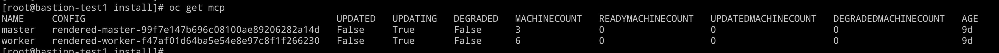
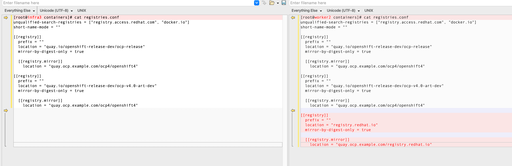

# 目标

* 介绍  ImageContentSourcePolicy 配置方式
* 说明  ImageContentSourcePolicy 与通过 MachineConfig 配置 mirror-by-digest-registries 的区别


# 通过 ImageContentSourcePolicy  配置


## Demo

```
[root@bastion-infra results-1666846836]# cat 3scale-mirror.yaml
apiVersion: operator.openshift.io/v1alpha1
kind: ImageContentSourcePolicy
metadata:
  name: 3scale-mirror
spec:
  repositoryDigestMirrors:
  - mirrors:
    - quay.ocp.example.com/registry.redhat.io
    source: registry.redhat.io
    
    
oc apply -f  3scale-mirror.yaml
```


## 说明

执行以上命令后，会将创建的内容同步到 `/etc/containers/registries.conf`




从这里的对比，可以看出 ImageContentSourcePolicy 工作方式

1.  `ImageContentSourcePolicy` 中的内容，加入 /etc/containers/registries.conf 文件中
2. 通过这个模式来配置的话，不需要重启节点，加快了配置的速度
3. `mirror-by-digest-only = true`, 只能设置为 `false`，  [原因在这里](https://access.redhat.com/solutions/4817401)





# 通过MachineConfig 配置 

可以自由配置，典型配置如下

## Demo


```

cat <<EOF > mirror-registries.conf
[[registry]]
  prefix = ""
  location = "registry.redhat.io"
  mirror-by-digest-only = false

  [[registry.mirror]]
    location = "quay.ocp.example.com/registry.redhat.io"

[[registry]]
  prefix = ""
  location = "quay.io"
  mirror-by-digest-only = false

  [[registry.mirror]]
    location = "quay.ocp.example.com/quay.io"

[[registry]]
  prefix = ""
  location = "registry.connect.redhat.com"
  mirror-by-digest-only = false

  [[registry.mirror]]
    location = "quay.ocp.example.com/registry.connect.redhat.com"

[[registry]]
  prefix = ""
  location = "registry.k8s.io"
  mirror-by-digest-only = false

  [[registry.mirror]]
    location = "quay.ocp.example.com/registry.k8s.io"
EOF

REGISTRIES=`base64 -w0 mirror-registries.conf`

cat <<EOF > 099-worker-mirror-registries.yaml
apiVersion: machineconfiguration.openshift.io/v1
kind: MachineConfig
metadata:
  labels:
    machineconfiguration.openshift.io/role: worker
  name: 099-worker-mirror-registries
spec:
  config:
    ignition:
      version: 3.1.0
    storage:
      files:
      - contents:
          source: data:text/plain;charset=utf-8;base64,${REGISTRIES}
        filesystem: root
        mode: 420
        path: /etc/containers/registries.conf.d/099-mirror-registries.conf
EOF


cat <<EOF > 099-master-mirror-registries.yaml
apiVersion: machineconfiguration.openshift.io/v1
kind: MachineConfig
metadata:
  labels:
    machineconfiguration.openshift.io/role: master
  name: 099-master-mirror-registries
spec:
  config:
    ignition:
      version: 3.1.0
    storage:
      files:
      - contents:
          source: data:text/plain;charset=utf-8;base64,${REGISTRIES}
        filesystem: root
        mode: 420
        path: /etc/containers/registries.conf.d/099-mirror-registries.conf
EOF

oc apply -f 099-worker-mirror-registries.yaml
oc apply -f 099-master-mirror-registries.yaml

```

## 说明

1. 可以按照自己期望的文件内容，灵活配置
2. 需要重启节点，耗时较长
