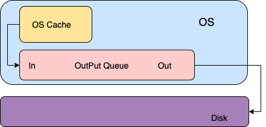

# 安装

在rhcos 上通过 rpm-ostree 安装fio的方式是不推荐的。


## 在RHEL节点上安装

```
yum install -y fio
```


## 在RHCOS 节点上安装

```

# 在 RHCOS 节点上添加 yum 源，参考以下示例。注意，需要按照kernel的版本选择对应的yum源。
# mkdir -p /etc/yum.repos.d

[root@node1 yum.repos.d]# vi /etc/yum.repos.d/rhel.repo
[rhel-7-server-rpms]
name=rhel-7-server-rpms
baseurl=http://192.168.11.121/repos/rhel-7-server-rpms
enabled=1
gpgcheck=0
[rhel-7-server-extras-rpms]
name=rhel-7-server-extras-rpms
baseurl=http://192.168.11.121/repos/rhel-7-server-extras-rpms
enabled=1
gpgcheck=0


# 使用 rpm-ostree 安装 fio

[root@node1 yum.repos.d]# rpm-ostree install fio 
Checking out tree 08ee645... done
Enabled rpm-md repositories: rhel-7-server-rpms rhel-7-server-extras-rpms
rpm-md repo 'rhel-7-server-rpms' (cached); generated: 2020-04-26T03:20:04Z
rpm-md repo 'rhel-7-server-extras-rpms' (cached); generated: 2020-04-24T08:33:04Z
Importing rpm-md... done
Resolving dependencies... done
Will download: 1 package (81.2 kB)
Downloading from 'rhel-7-server-rpms'... done
Importing packages... done
Checking out packages... done
Running pre scripts... done
Running post scripts... done
Running posttrans scripts... done
Writing rpmdb... done
Writing OSTree commit... done
Staging deployment... done
Added:
  iperf3-3.1.7-2.el7.x86_64
Run "systemctl reboot" to start a reboot
```


# 磁盘性能指标


## 磁盘I/O

I/O，即input/output，磁盘的输入输出，输入指的是对磁盘写入数据，输出指的是从磁盘读出数据，磁盘I/O可以理解为读写。应用发起的一次或多次数据请求，I/O请求的数据量又称I/O大小，单位为KiB，例如4KiB、256KiB、1024KiB等；


## IOPS

IOPS (Input/Output Per Second)即每秒的输入输出量(或读写次数)，是衡量磁盘性能的主要指标之一。IOPS是指单位时间内系统能处理的I/O请求数量，一般以每秒处理的I/O请求数量为单位，I/O请求通常为读或写数据操作请求。

> 随机读写频繁的应用，如小文件存储(图片)、OLTP数据库、邮件服务器，关注随机读写性能，IOPS是关键衡量指标。
> 顺序读写频繁的应用，传输大量连续数据，如电视台的视频编辑，视频点播VOD(Video On Demand)，关注连续读写性能。数据吞吐量是关键衡量指标。


## 吞吐量

每秒磁盘I/O的流量，即磁盘写入加上读出的数据的大小。单位时间内可以成功传输的数据数量


> 吞吐量 = IOPS * I/O大小


## 如何选择磁盘

- 当应用的I/O大小较大，例如离线分析、数据仓库等应用。 需要重点关注吞吐量
- 当应用的I/O对时延较为敏感，比较随机且I/O大小相对较小，例如OLTP事务型数据库、企业级应用，如SAP等应用，需要关注磁盘的IOPS


# fio 参数说明

```

filename=/dev/sdc        支持文件系统或者裸设备,压测多个磁盘 --filename=/dev/sda:/dev/sdb
direct=1                 测试过程绕过机器自带的buffer，使测试结果更真实
rw=randwread             测试随机读的I/O
rw=randwrite             测试随机写的I/O
rw=randrw                测试随机混合写和读的I/O
rw=read                  测试顺序读的I/O
rw=write                 测试顺序写的I/O
rw=rw                    测试顺序混合写和读的I/O
bs=4k                    单次io的块文件大小为4k
bsrange=512-2048         同上，指定定数据块的大小范围
size=50g                 本次的测试文件大小为50g，以每次4k的io进行测试
numjobs=30               本次的测试线程为30, 同时并行运行的工作jobs数，相当于一个job克隆，具有相同workload（负载）；
runtime=1000             测试时间为1000秒，如果不写则一直将5g文件分4k每次写完为止
ioengine=libaio          表示测试方式为libaio（Linux AIO，异步I/O）。应用程序使用I/O通常有两种方式：同步同步的I/O一次只能发出一个I/O请求，等待内核完成才返回。这样对于单个线程iodepth总是小于1，但是可以透过多个线程并发执行来解决。通常会用16~32根线程同时工作将iodepth塞满。异步异步的I/O通常使用libaio这样的方式一次提交一批I/O请求，然后等待一批的完成，减少交互的次数，会更有效率
rwmixwrite=30            在混合读写的模式下，写占30%
group_reporting          关于显示结果的，汇总每个进程的信息
此外其他参数
lockmem=1g               只使用1g内存进行测试
zero_buffers             用0初始化系统buffer
nrfiles=8                每个进程生成文件的数量

```


| 参数                       | 说明                                                         |
| :------------------------- | :----------------------------------------------------------- |
| -direct=1                  | 表示测试时忽略I/O缓存，数据直写。                            |
| -iodepth=128               | 表示使用异步I/O（AIO）时，同时发出I/O数的上限为128。         |
| -rw=randwrite              | 表示测试时的读写策略为随机写（random writes）。其它测试可以设置为：<br/> **randread**（随机读random reads）<br/>**read**（顺序读sequential reads）<br/>**write**（顺序写sequential writes）<br/>**randrw**（混合随机读写mixed random reads and writes） |
| -ioengine=libaio           | 表示测试方式为libaio（Linux AIO，异步I/O）。应用程序使用I/O通常有两种方式：同步同步的I/O一次只能发出一个I/O请求，等待内核完成才返回。这样对于单个线程iodepth总是小于1，但是可以透过多个线程并发执行来解决。通常会用16~32根线程同时工作将iodepth塞满。异步异步的I/O通常使用libaio这样的方式一次提交一批I/O请求，然后等待一批的完成，减少交互的次数，会更有效率。 |
| -bs=4k                     | 表示单次I/O的块文件大小为4 KiB。默认值也是4 KiB。<br/>测试IOPS时，建议将**bs**设置为一个较小的值，如4k。<br/>测试吞吐量时，建议将**bs**设置为一个较大的值，如1024k。 |
| -size=1G                   | 表示测试文件大小为1 GiB。                                    |
| -numjobs=1                 | 表示测试线程数为1, 同时并行运行的工作jobs数，相当于一个job克隆，具有相同workload（负载）； |
| -runtime=1000              | 表示测试时间为1000秒。如果未配置，则持续将前述**-size**指定大小的文件，以每次**-bs**值为分块大小写完。<br>如果size先达到指定文件大小，那么时间即使未到达，测试也会结束 |
| -group_reporting           | 表示测试结果里汇总每个进程的统计信息，而非以不同job汇总展示信息。 |
| -filename=/dev/your_device | 指定的云盘设备名，例如/dev/your_device。                     |
| -name=Rand_Write_Testing   | 表示测试任务名称为Rand_Write_Testing，可以随意设定。         |
| rwmixwrite=30              | 在混合读写的模式下，写占30%                                  |


# 测试结果


| **测试模式** | **IOPS(avg)**       | **BW(avg)**                     |
| ------------ | ------------------- | ------------------------------- |
| 4K随机读写   | R：17k <br>  W：17k | R：66.6MiB/s <br> W： 66.5MiB/s |
| 4K随机读     | R：  55.7k          | R： 218MiB/S                    |
| 4K随机写     | W：  17.4k          | W： 68.0MiB/S                   |
| 4K顺序读     | R：48.7k            | R：  190MiB/S                   |
| 4K顺序写     | W：36.2k            | W：141MiB/S                     |
| 64K 随机读写 | R: 2806<br> W: 2808 | R: 175MiB/S <br> W: 176MiB/S    |
| 64K 随机读   | R: 12.2k            | R: 764MiB/S                     |
| 64K 随机写   | W: 5751             | W: 359MiB/S                     |
| 64K 顺序读   | R: 8136             | R: 509MiB/S                     |
| 64K 顺序写   | W: 6687             | W: 418MiB/S                     |
| 1M 随机读写  | R:   287<br>W: 289  | R: 287MiB/S <br> W: 289MiB/S    |
| 1M 随机读    | R: 900              | R: 900MiB/S                     |
| 1M 随机写    | W: 440              | w: 440MiB/S                     |
| 1M 顺序读    | R: 911              | R: 911MiB/S                     |
| 1M 顺序写    | W: 434              | W: 434MiB/S                     |


# 测试 case

## 4k随机读写
```

[root@worker6-410 ~]# fio -filename=/dev/sdd -direct=1 -ioengine=libaio -iodepth=32 -bs=4k -size=16g -readwrite=randrw -numjobs=1 -runtime=300 -name=4k_randrw_test -group_reporting

4k_randrw_test: (g=0): rw=randrw, bs=(R) 4096B-4096B, (W) 4096B-4096B, (T) 4096B-4096B, ioengine=libaio, iodepth=32
fio-3.19
Starting 1 process
Jobs: 1 (f=1): [m(1)][100.0%][r=255MiB/s,w=255MiB/s][r=65.2k,w=65.4k IOPS][eta 00m:00s]
4k_randrw_test: (groupid=0, jobs=1): err= 0: pid=47598: Wed Aug 24 22:40:16 2022
  read: IOPS=38.8k, BW=152MiB/s (159MB/s)(8196MiB/54015msec)
    slat (usec): min=2, max=5196, avg= 4.03, stdev= 4.75
    clat (nsec): min=1492, max=1403.6M, avg=470097.64, stdev=2083577.83
     lat (usec): min=17, max=1403.6k, avg=474.23, stdev=2083.62
    clat percentiles (usec):
     |  1.00th=[   91],  5.00th=[  106], 10.00th=[  118], 20.00th=[  135],
     | 30.00th=[  151], 40.00th=[  169], 50.00th=[  190], 60.00th=[  210],
     | 70.00th=[  241], 80.00th=[  359], 90.00th=[ 1467], 95.00th=[ 2073],
     | 99.00th=[ 2999], 99.50th=[ 5473], 99.90th=[11207], 99.95th=[13829],
     | 99.99th=[19792]
   bw (  KiB/s): min=   16, max=268520, per=100.00%, avg=178967.38, stdev=111377.11, samples=93
   iops        : min=    4, max=67130, avg=44741.80, stdev=27844.27, samples=93
  write: IOPS=38.8k, BW=152MiB/s (159MB/s)(8188MiB/54015msec); 0 zone resets
    slat (usec): min=2, max=1693, avg= 4.34, stdev= 3.38
    clat (usec): min=17, max=2982.3k, avg=344.04, stdev=19516.37
     lat (usec): min=26, max=2982.4k, avg=348.48, stdev=19516.55
    clat percentiles (usec):
     |  1.00th=[    35],  5.00th=[    42], 10.00th=[    47], 20.00th=[    55],
     | 30.00th=[    62], 40.00th=[    72], 50.00th=[    83], 60.00th=[    98],
     | 70.00th=[   115], 80.00th=[   131], 90.00th=[   153], 95.00th=[   186],
     | 99.00th=[   644], 99.50th=[ 10814], 99.90th=[ 14484], 99.95th=[ 15533],
     | 99.99th=[283116]
   bw (  KiB/s): min=    8, max=268248, per=100.00%, avg=178752.90, stdev=111264.10, samples=93
   iops        : min=    2, max=67062, avg=44688.24, stdev=27816.06, samples=93
  lat (usec)   : 2=0.01%, 4=0.01%, 10=0.01%, 20=0.01%, 50=7.19%
  lat (usec)   : 100=25.03%, 250=52.34%, 500=6.20%, 750=1.33%, 1000=1.01%
  lat (msec)   : 2=3.76%, 4=2.46%, 10=0.33%, 20=0.31%, 50=0.01%
  lat (msec)   : 100=0.01%, 250=0.01%, 500=0.01%, 750=0.01%, 1000=0.01%
  lat (msec)   : 2000=0.01%, >=2000=0.01%
  cpu          : usr=11.32%, sys=28.68%, ctx=264949, majf=0, minf=19
  IO depths    : 1=0.1%, 2=0.1%, 4=0.1%, 8=0.1%, 16=0.1%, 32=100.0%, >=64=0.0%
     submit    : 0=0.0%, 4=100.0%, 8=0.0%, 16=0.0%, 32=0.0%, 64=0.0%, >=64=0.0%
     complete  : 0=0.0%, 4=100.0%, 8=0.0%, 16=0.0%, 32=0.1%, 64=0.0%, >=64=0.0%
     issued rwts: total=2098266,2096038,0,0 short=0,0,0,0 dropped=0,0,0,0
     latency   : target=0, window=0, percentile=100.00%, depth=32

Run status group 0 (all jobs):
   READ: bw=152MiB/s (159MB/s), 152MiB/s-152MiB/s (159MB/s-159MB/s), io=8196MiB (8594MB), run=54015-54015msec
  WRITE: bw=152MiB/s (159MB/s), 152MiB/s-152MiB/s (159MB/s-159MB/s), io=8188MiB (8585MB), run=54015-54015msec

Disk stats (read/write):
  sdd: ios=2096636/2094371, merge=0/0, ticks=884602/618745, in_queue=1503348, util=99.99%
  
```

## 4k随机读
```
fio -filename=/dev/sdd -direct=1 -ioengine=libaio -iodepth=32 -bs=4k -size=16g -readwrite=randread -numjobs=1 -runtime=300 -name=4k_randread_test -group_reporting

```

## 4k随机写
```
fio -filename=/dev/sdd -direct=1 -ioengine=libaio -iodepth=32 -bs=4k -size=16g -readwrite=randread -numjobs=1 -runtime=300 -name=4k_randread_test -group_reporting
```


## 4k顺序读
```
fio -filename=/dev/sdd -direct=1 -ioengine=libaio -iodepth=32 -bs=4k -size=16g -readwrite=read -numjobs=1 -runtime=300 -name=4k_read_test -group_reporting
```


## 4k顺序写
```
fio -filename=/dev/sdd -direct=1 -ioengine=libaio -iodepth=32 -bs=4k -size=16g -readwrite=write -numjobs=1 -runtime=300 -name=4k_write_test -group_reporting
```

## 64K 随机读写
```
fio -filename=/dev/sdd -direct=1 -ioengine=libaio -iodepth=32 -bs=64k -size=16g -readwrite=randrw -numjobs=1 -runtime=300 -name=64k_randrw_test -group_reporting
```


## 64K 随机读
```
fio -filename=/dev/sdd -direct=1 -ioengine=libaio -iodepth=32 -bs=64K -size=16g -readwrite=randread -numjobs=1 -runtime=300 -name=64K_randread_test -group_reporting
```

## 64K 随机写
```
fio -filename=/dev/sdd -direct=1 -ioengine=libaio -iodepth=32 -bs=64K -size=16g -readwrite=randwrite -numjobs=1 -runtime=300 -name=64K_randwrite_test -group_reporting
```

## 64k顺序读
```
fio -filename=/dev/sdd -direct=1 -ioengine=libaio -iodepth=32 -bs=64K -size=16g -readwrite=read -numjobs=1 -runtime=300 -name=64K_read_test -group_reporting
```

## 64K 顺序写
```
fio -filename=/dev/sdd -direct=1 -ioengine=libaio -iodepth=32 -bs=64K -size=16g -readwrite=write -numjobs=1 -runtime=300 -name=64K_write_test -group_reporting
```

## 1M 随机读写
```
fio -filename=/dev/sdd -direct=1 -ioengine=libaio -iodepth=32 -bs=1M -size=16g -readwrite=randrw -numjobs=1 -runtime=300 -name=1M_randrw_test -group_reporting
```

## 1M 随机读
```
fio -filename=/dev/sdd -direct=1 -ioengine=libaio -iodepth=32 -bs=1M -size=16g -readwrite=randread -numjobs=1 -runtime=300 -name=1M_randread_test -group_reporting
```

## 1M随机写
```
fio -filename=/dev/sdd -direct=1 -ioengine=libaio -iodepth=32 -bs=1M -size=16g -readwrite=randwrite -numjobs=1 -runtime=300 -name=1M_randwrite_test -group_reporting
```

## 1M顺序读
```
fio -filename=/dev/sdd -direct=1 -ioengine=libaio -iodepth=32 -bs=1M -size=16g -readwrite=read -numjobs=1 -runtime=300 -name=1M_read_test -group_reporting
```

## 1M顺序写
```
fio -filename=/dev/sdd -direct=1 -ioengine=libaio -iodepth=32 -bs=1M -size=16g -readwrite=write -numjobs=1 -runtime=300 -name=1M_write_test -group_reporting
```


# 测试结果分析

```
[root@worker6-410 ~]# fio -filename=/dev/sdd -direct=1 -ioengine=libaio -iodepth=32 -bs=4k -size=16g -readwrite=randread -numjobs=1 -runtime=300 -name=4k_randread_test -group_reporting
4k_randread_test: (g=0): rw=randread, bs=(R) 4096B-4096B, (W) 4096B-4096B, (T) 4096B-4096B, ioengine=libaio, iodepth=32
fio-3.19
Starting 1 process
Jobs: 1 (f=1): [r(1)][100.0%][r=418MiB/s][r=107k IOPS][eta 00m:00s]
4k_randread_test: (groupid=0, jobs=1): err= 0: pid=451497: Thu Aug 25 08:37:36 2022
  read: IOPS=152k, BW=592MiB/s (621MB/s)(16.0GiB/27658msec)
    slat (usec): min=2, max=1227, avg= 4.09, stdev= 3.31
    clat (usec): min=82, max=7964, avg=206.19, stdev=91.51
     lat (usec): min=87, max=7966, avg=210.39, stdev=92.38
    clat percentiles (usec):
     |  1.00th=[  112],  5.00th=[  121], 10.00th=[  128], 20.00th=[  139],
     | 30.00th=[  151], 40.00th=[  165], 50.00th=[  184], 60.00th=[  202],
     | 70.00th=[  227], 80.00th=[  262], 90.00th=[  314], 95.00th=[  359],
     | 99.00th=[  578], 99.50th=[  644], 99.90th=[  766], 99.95th=[  881],
     | 99.99th=[ 1270]
   bw (  KiB/s): min=188944, max=660272, per=100.00%, avg=609428.17, stdev=78715.97, samples=54
   iops        : min=47236, max=165068, avg=152357.06, stdev=19679.01, samples=54
  lat (usec)   : 100=0.06%, 250=77.24%, 500=21.30%, 750=1.28%, 1000=0.09%
  lat (msec)   : 2=0.03%, 4=0.01%, 10=0.01%
  cpu          : usr=21.28%, sys=54.45%, ctx=181547, majf=0, minf=43
  IO depths    : 1=0.1%, 2=0.1%, 4=0.1%, 8=0.1%, 16=0.1%, 32=100.0%, >=64=0.0%
     submit    : 0=0.0%, 4=100.0%, 8=0.0%, 16=0.0%, 32=0.0%, 64=0.0%, >=64=0.0%
     complete  : 0=0.0%, 4=100.0%, 8=0.0%, 16=0.0%, 32=0.1%, 64=0.0%, >=64=0.0%
     issued rwts: total=4194304,0,0,0 short=0,0,0,0 dropped=0,0,0,0
     latency   : target=0, window=0, percentile=100.00%, depth=32

Run status group 0 (all jobs):
   READ: bw=592MiB/s (621MB/s), 592MiB/s-592MiB/s (621MB/s-621MB/s), io=16.0GiB (17.2GB), run=27658-27658msec

Disk stats (read/write):
  sdd: ios=4158928/0, merge=0/0, ticks=702928/0, in_queue=702928, util=99.77%
```


第7行： 输出IOPS（每秒IO操作数） 和 BW（带宽）

第8行：slat： submission latency，即IO提交延时。 nsec 为时间单位，纳秒。该行统计IO生成到提交到内核之间的延时，min为所有最小延时，max为最大延时.

第9行：clat：completion latency，即IO完成延时。msec为时间单位，毫秒。该行统计IO完成需要多少延时，几个统计值与第7行相似。

第10行：lat：latency， 从fio创建该IO单元，到结束这个IO操作

第11~16行：
 统计本次测试IO延时的比重。
 比如第13行，30.00th=[    151]，表示151usec以下延时的IO操作占所有IO操作的30%，50.00th=[     184]，表示184usec以下延时的IO操作占所有IO操作的50%


# 针对ETCD性能需求进行测试

```
fio --rw=write --ioengine=sync --fdatasync=1 --directory=test-data --size=22m --bs=2300 --name=mytest
```

##  WAL 工作原理

WAL(Write Ahead Log)预写日志，是数据库系统中常见的一种手段，用于保证数据操作的原子性和持久性。

在计算机科学中，**「预写式日志」**（Write-ahead logging，缩写 WAL）是关系数据库系统中用于提供原子性和持久性（ACID 属性中的两个）的一系列技术。在使用 WAL 的系统中，所有的修改在提交之前都要先写入 log 文件中。

log 文件中通常包括 redo 和 undo 信息。这样做的目的可以通过一个例子来说明。假设一个程序在执行某些操作的过程中机器掉电了。在重新启动时，程序可能需要知道当时执行的操作是成功了还是部分成功或者是失败了。如果使用了 WAL，程序就可以检查 log 文件，并对突然掉电时计划执行的操作内容跟实际上执行的操作内容进行比较。在这个比较的基础上，程序就可以决定是撤销已做的操作还是继续完成已做的操作，或者是保持原样。

数据库系统通常都会使用预写式日志（write-ahead logging,WAL）来保证原子性和持久性。etcd 首先将键值存储上的某些操作（例如，更新）写入 WAL 文件中， 然后才会应用这些操作。如果其中一个成员在快照期间崩溃并重启，它可以在本地通过 WAL 内容恢复自上次快照以来的事务。

因此，每当客户端添加或更新键值对数据时，etcd 会向 WAL 文件添加一条入库记录条目。再进一步处理之前，etcd 必须 100% 确保 WAL 条目已经被持久化。 要在 Linux 实现这一点，仅使用**write**系统调用是不够的，因为对物理存储的写入操作可能会发生延迟。比如， Linux 可能会将写入的 WAL 条目在内核内存缓存中保留一段时间（例如，页缓存）。如果要确保数据被写入持久化存储，你必须在 write 系统调用之后调用 fdatasync 系统调用，实际上 etcd 就是采用这种方式，下图是使用**strace**命令的输出，参数 8 是 WAL 文件的文件描述符。

## fdatasync

传统的UNIX实现的内核中都设置有缓冲区或者页面高速缓存，大多数磁盘IO都是通过缓冲写的。

当你想将数据write进文件时，内核通常会将该数据复制到其中一个缓冲区中，如果该缓冲没被写满的话，内核就不会把它放入到输出队列中。

当这个缓冲区被写满或者内核想重用这个缓冲区时，才会将其排到输出队列中。等它到达等待队列首部时才会进行实际的IO操作





| 系统调用  | 函数                        | 说明                                                         |
| --------- | --------------------------- | ------------------------------------------------------------ |
| sync      | int sync();                 | 将所有修改过的缓冲区排入写队列，然后就返回了，它并不等实际的写磁盘的操作结束。所以它的返回并不能保证数据的安全性。通常会有一个update系统守护进程每隔30s调用一次sync |
| fsync     | int fsync(int filedes)      | 需要你在入参的位置上传递给他一个fd，然后系统调用就会对这个fd指向的文件起作用。fsync会确保一直到写磁盘操作结束才会返回。所以fsync适合数据库这种程序 |
| fdatasync | int fdatasync(int filedes); | 和fsync类似但是它只会影响文件的一部分，因为除了文件中的数据之外，fsync还会同步文件的属性 |


## 查看engine 类型


```
[root@worker5-410 ~]# fio --enghelp
Available IO engines:
	cpuio
	mmap
	sync
	psync
	vsync
	pvsync
	pvsync2
	null
	net
	netsplice
	ftruncate
	filecreate
	filestat
	libaio
	rdma
	posixaio
	falloc
	e4defrag
	splice
	rados
	rbd
	mtd
	pmemblk
	dev-dax
	libpmem
	sg
	io_uring
```


# ocp4 安装后，测试etcd节点磁盘性能


# Refercent


https://www.ibm.com/cloud/blog/using-fio-to-tell-whether-your-storage-is-fast-enough-for-etcd
https://blog.51cto.com/u_14900374/2519318

https://blog.happyhack.io/2021/08/05/fio-and-etcd/


