# 测试准备

## 测试环境架构

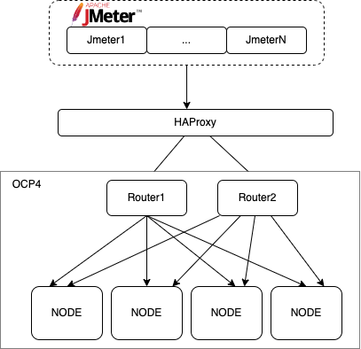

##  准备jmeter

创建Jmeter 虚拟机，安装 java，下载jmeter 

```
yum install -y java

curl -LO https://dlcdn.apache.org//jmeter/binaries/apache-jmeter-5.5.tgz 
```

### jmeter 配置

关闭所有jmeter节点的防火墙

```
systemctl stop firewalld
setenforce 0
```


### 开启jmeter server

在以下测试例子中，我们准备了 jmeter1, jmeter2, jmeter3 三个jmeter节点，其中jmeter1 作为master， 另外两个作为slave，因此需要在slave 节点上开启 jmeter-server

默认情况下，直接启动 jmeter-server，会出现以下错误

 ```
 
 [root@jmeter1 bin]# ./jmeter-server
 Aug 22, 2022 10:09:23 PM java.util.prefs.FileSystemPreferences$1 run
 INFO: Created user preferences directory.
 Server failed to start: java.rmi.server.ExportException: Listen failed on port: 0; nested exception is:
 	java.io.FileNotFoundException: rmi_keystore.jks (No such file or directory)
 An error occurred: Listen failed on port: 0; nested exception is:
 	java.io.FileNotFoundException: rmi_keystore.jks (No such file or directory)
 	
 ```


解决方案

```
cd /root/install/apache-jmeter-5.5/bin

sed -i 's@#server.rmi.ssl.disable=false@server.rmi.ssl.disable=true@g' jmeter.properties
```


## 部署测试应用

```

oc new-project demo2

oc create deployment nginx --image quay.io/junkai/nginx:pressure

oc expose deploy nginx --port=8081   # 注意这里的端口号

oc expose svc/nginxds

oc scale --replicas=10 deployment nginx  # 扩容pod数量
```


## 配置HAproxy


### 安装HAProxy

```
yum install -y haproxy 

setsebool -P haproxy_connect_any=1

systemctl restart haproxy
systemctl status haproxy
systemctl enable haproxy

firewall-cmd --add-port=9000/tcp --permanent
firewall-cmd --add-port=6443/tcp --permanent
firewall-cmd --add-port=22623/tcp --permanent
firewall-cmd --add-port=80/tcp --permanent
firewall-cmd --add-port=443/tcp --permanent
firewall-cmd --reload
```


### 修改HAProxy 配置

默认情况下HAProxy 是单线程，支持测试的话，需要打开多线程，修改HAProxy配置文件。

```
global
    maxconn     20000
    nbthread 4           # 4线程
    cpu-map auto:1/1-4 0-3   # 绑核， 4个线程绑定前4个核
... 
```


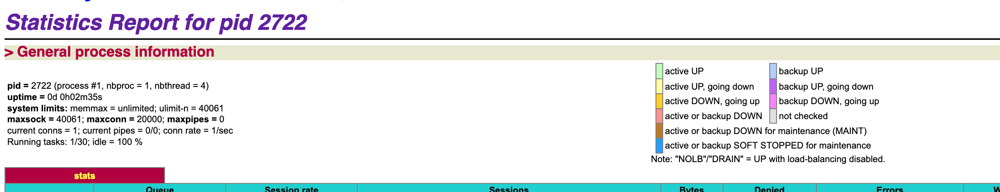


# 配置

## 从GUI配置jmx文件


# jmeter 参数


## 常用参数说明

| 参数                            | 说明                                                         |
| ------------------------------- | ------------------------------------------------------------ |
| ThreadGroup.duration            | 请求的执行时间，ThreadGroup.num_threads * LoopController.loops个请求执行的总时间和Duration设置的时间相比哪个时间短选哪个；如果想要精确的执行时间的话就设置 LoopController.continue_forever = true ，然后执行到Duration设置的时间就结束 |
| ThreadGroup.num_threads         | Jmeter java进程下启动的线程，用来**模拟真实用户数**，1线程数 = 1用户数，Linux下，2g的 java内存，1m 的栈空间，最大启动线程数=2000，**线程数建议不超过1000** |
| LoopController.continue_forever |                                                              |
| ThreadGroup.ramp_time           | 预期线程组的所有线程从启动-运行-释放的总时间 ramp up=0时，表示瞬时加压，启动线程的时间无限趋近于0 **特别注意：**在负载测试的时候，尽量**把ramp up设置大**一些，让性能曲线平缓，容易找到瓶颈点 |
| ThreadGroup.scheduler           |                                                              |
| ThreadGroup.delay               |                                                              |


## 参数设置注意事项


### Ramp-up 设置注意事项

#### Ramp-up 定义

- 预期线程组的所有线程从启动-运行-释放的总时间
- ramp up=0时，表示瞬时加压，启动线程的时间无限趋近于0
- **特别注意：**在负载测试的时候，尽量**把ramp up设置大**一些，让性能曲线平缓，容易找到瓶颈点

#### Ramp-up需要设置足够长的时间来避免在测试刚开始时工作量过大
假如需要大量线程的话，不建议设置成0，0 属于瞬时加压 **过小的 ramp-up period**
如果设置 0，Jmeter 将在测试开始时就启动全部线程并立即发送请求，这样很容易让服务器达到饱满状态，且瞬间会增加很大的负载量，容易让服务器超载，这样是不合理的；
不合理的原因并不是因为平均压力值过高，而是因为所有线程都在初始状态时一起并发访问，从而引起不正常的初始访问峰值，可以通过 Jmeter 的聚合报告看到这种情况

#### Ramp-up还必须足够短，保证最后一个线程在第一个线程完成之前开始运行
如果 Ramp-up 过大，则会降低访问峰值的负载，即没有达到预期的压力峰值，无法获取准确的服务器最大负载情况
具体的表现为：一些线程还没有启动，初期启动的部分线程已经结束了 **导致实际并发量并会小于预期并发量**

#### 如何确定一个合理的ramp-up period
首先，让初始点击率接近平均点击率，前提是确定合理的访问量
初始的 ramp-up period = 平均点击率= 总线程/点击率；假如线程数=100，点击率=10次/s，则ramp-up period = 100/10 = 10s


## nginx-test.jmx 文件


```

<?xml version="1.0" encoding="UTF-8"?>
<jmeterTestPlan version="1.2" properties="5.0" jmeter="5.5">
  <hashTree>
    <TestPlan guiclass="TestPlanGui" testclass="TestPlan" testname="Test Plan" enabled="true">
      <stringProp name="TestPlan.comments"></stringProp>
      <boolProp name="TestPlan.functional_mode">false</boolProp>
      <boolProp name="TestPlan.tearDown_on_shutdown">true</boolProp>
      <boolProp name="TestPlan.serialize_threadgroups">true</boolProp>
      <elementProp name="TestPlan.user_defined_variables" elementType="Arguments" guiclass="ArgumentsPanel" testclass="Arguments" testname="User Defined Variables" enabled="true">
        <collectionProp name="Arguments.arguments"/>
      </elementProp>
      <stringProp name="TestPlan.user_define_classpath"></stringProp>
    </TestPlan>
    <hashTree>
      <ThreadGroup guiclass="ThreadGroupGui" testclass="ThreadGroup" testname="Thread Group" enabled="true">
        <stringProp name="ThreadGroup.on_sample_error">continue</stringProp>
        <elementProp name="ThreadGroup.main_controller" elementType="LoopController" guiclass="LoopControlPanel" testclass="LoopController" testname="Loop Controller" enabled="true">
          <boolProp name="LoopController.continue_forever">false</boolProp>
          <stringProp name="LoopController.loops">1000000000</stringProp>
        </elementProp>
        <stringProp name="ThreadGroup.num_threads">100</stringProp>
        <stringProp name="ThreadGroup.ramp_time">30</stringProp>
        <boolProp name="ThreadGroup.scheduler">true</boolProp>
        <stringProp name="ThreadGroup.duration">600</stringProp>
        <stringProp name="ThreadGroup.delay">1</stringProp>
      </ThreadGroup>
      <hashTree>
        <HTTPSamplerProxy guiclass="HttpTestSampleGui" testclass="HTTPSamplerProxy" testname="HTTP Request" enabled="true">
          <elementProp name="HTTPsampler.Arguments" elementType="Arguments" guiclass="HTTPArgumentsPanel" testclass="Arguments" testname="User Defined Variables" enabled="true">
            <collectionProp name="Arguments.arguments"/>
          </elementProp>
          <stringProp name="HTTPSampler.domain">demo-demo1.apps.ocp410.example.com</stringProp>
          <stringProp name="HTTPSampler.port"></stringProp>
          <stringProp name="HTTPSampler.protocol"></stringProp>
          <stringProp name="HTTPSampler.contentEncoding"></stringProp>
          <stringProp name="HTTPSampler.path">/test1k.html</stringProp>
          <stringProp name="HTTPSampler.method">GET</stringProp>
          <boolProp name="HTTPSampler.follow_redirects">true</boolProp>
          <boolProp name="HTTPSampler.auto_redirects">false</boolProp>
          <boolProp name="HTTPSampler.use_keepalive">true</boolProp>
          <boolProp name="HTTPSampler.DO_MULTIPART_POST">false</boolProp>
          <stringProp name="HTTPSampler.embedded_url_re"></stringProp>
          <stringProp name="HTTPSampler.connect_timeout"></stringProp>
          <stringProp name="HTTPSampler.response_timeout"></stringProp>
        </HTTPSamplerProxy>
        <hashTree/>
      </hashTree>
    </hashTree>
  </hashTree>
</jmeterTestPlan>
```


# 测试

## 开始测试

执行以下命令，直接开始测试，并在测试完毕后生成解析文件到 /var/www/html/result  目录下 

```

./bin/jmeter.sh -n -t nginx-test.jmx -r -l jmeter.jtl -e -o /var/www/html/result
```


```
-n：表示non gui mode，就是非图形化模式。
-t：指定JMX脚本路径，即test plan（测试计划）。后面跟需要运行的JMeter 脚本的路径和脚本名称。
-r: remote 模式，调用slave节点执行压测
-l：指定结果文件路径。后面跟输出结果文件路径和结果文件名称。
1）若没有指定指定结果文件路径，则自动创建，可以生成.csv文件或者.jtl文件。
2）若只写脚本名称，则默认是在当前目录查找或创建。
-e：设置测试完成后生成测试报表。
-o：指定测试报表生成文件夹。文件夹必须为空或不存在。
```


# 测试报告

## Dashboard 页面


### APDEX性能指数

Apdex：APDEX性能指数（Application Performance Index），是一个国际通用标准，Apdex是用户对应用程序性能满意度的量化值。它提供了一个统一的测量和报告用户体验的方法，把最终的用户体验和应用性能作为一个完整的指标进行统一度量


Apdex范围在0-1之间，1表示达到所有用户均满意，越接近1满意度越高。
toleration threshold：耐受阈值。
frustration threshold：挫败阈值。

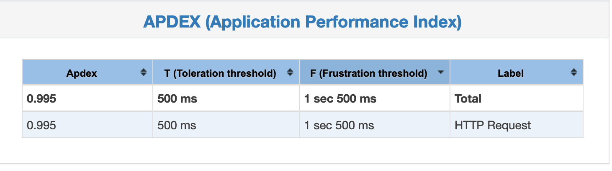


### Requests Summary

请求的通过率(OK)与失败率(KO)，百分比显示

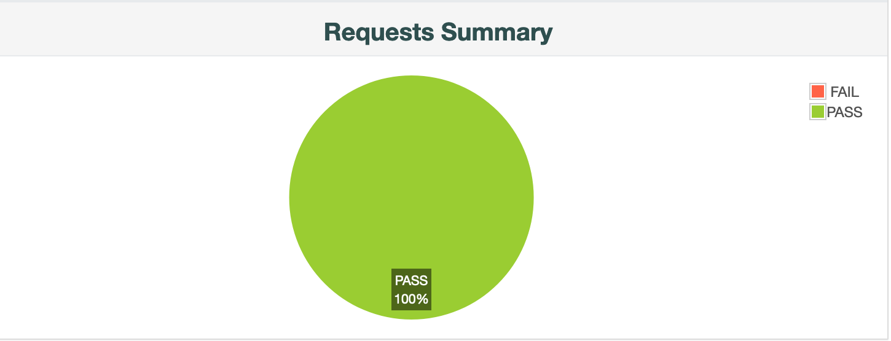


## Charts 页面

Charts 页面，用图表的形式展示测试数据，让测试报告更加直观


### Over Time

#### Response Times Over Time

响应时间，X轴表示的是系统运行的时刻，Y轴表示的是响应时间，F(X,Y)表示系统随着时间的推移，系统的响应时间的变化，可以看出响应时间稳定性。

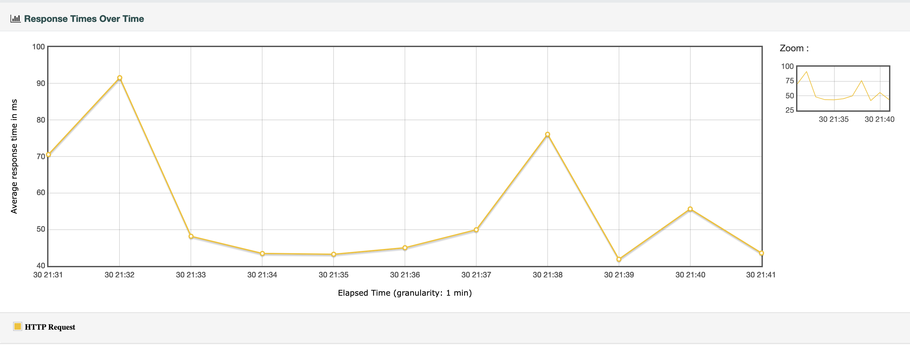


#### Response Time Percentiles Over Time (successful responses)

脚本运行期间，**成功的请求**的响应时间百分比分布图

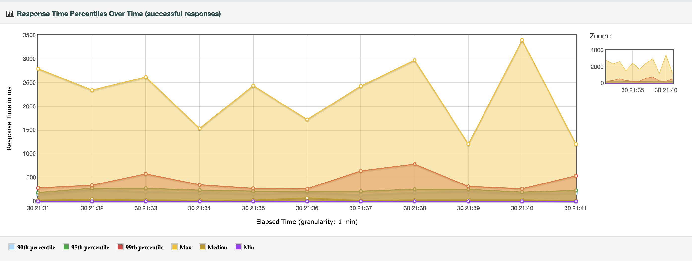


#### Active Threads Over Time

- 脚本运行时间内的活动线程数变化曲线，展示测试过程中活动线程数随时间变化情况。
- 一个线程组对应一条线

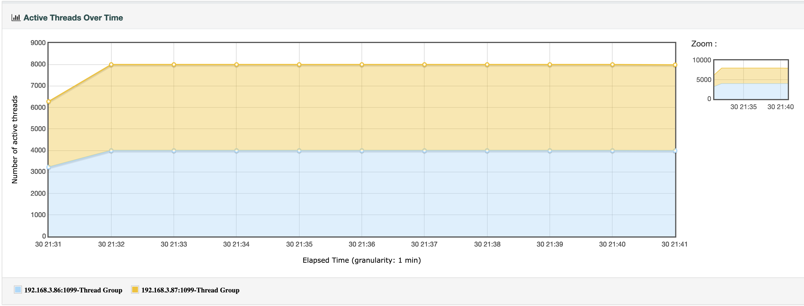


#### Bytes Throughput Over Time

- 脚本运行期间，吞吐率变化趋势图
- 在容量规划、可用性测试和大文件上传下载场景中，吞吐量是很重要的一个监控和分析指标
- 会**忽略**事务控制器样本结果

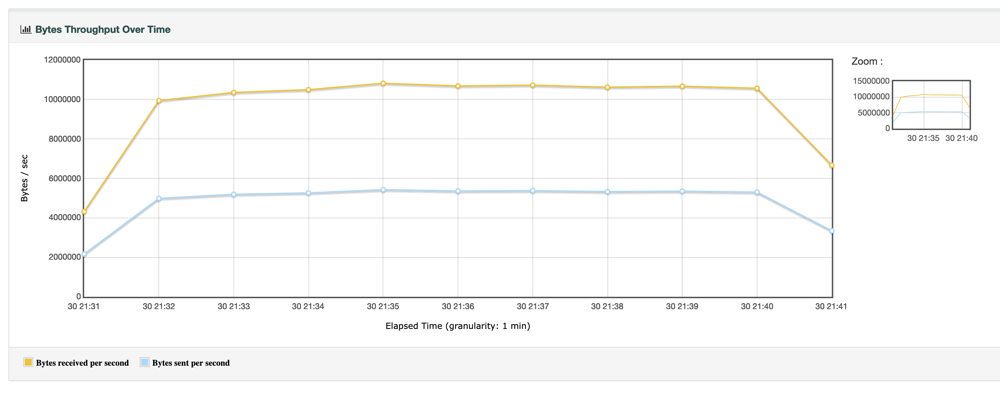

#### Latencies Over Time

- 脚本运行期间，发送一个完整的请求所需时间的变化趋势图
- **可理解理解成：**从发送请求到收到第一个响应所花费的时间
- **包括**事务控制器样本结果

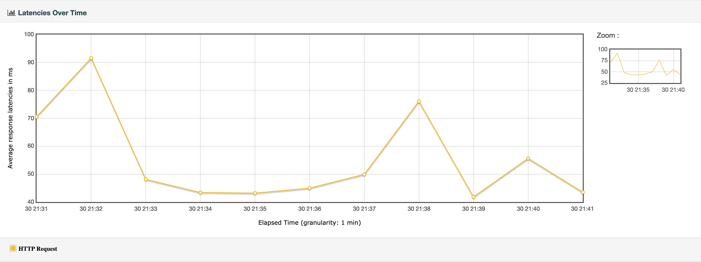


#### Connect Time Over Time

- 脚本运行期间，事务（请求）**建立连接**所花费的平均时间变化趋势图
- 包括 SSL 三次握手的时间
- 当出现链 Connection Time Out 的错误时，Connect Time 就会等于链接超时时间

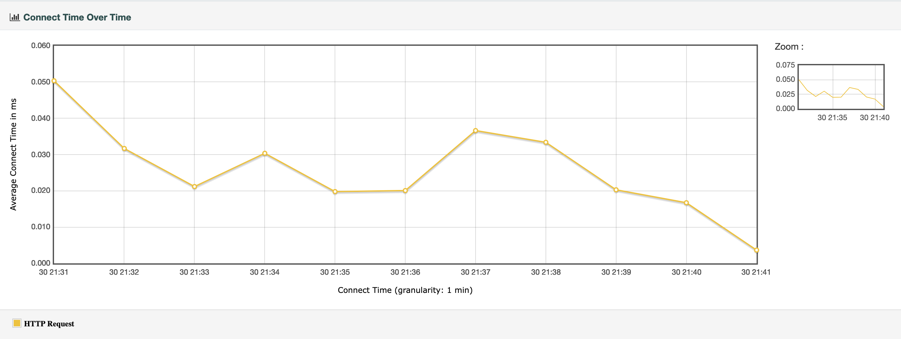


### Throughput


#### Hits Per Second

每秒点击数

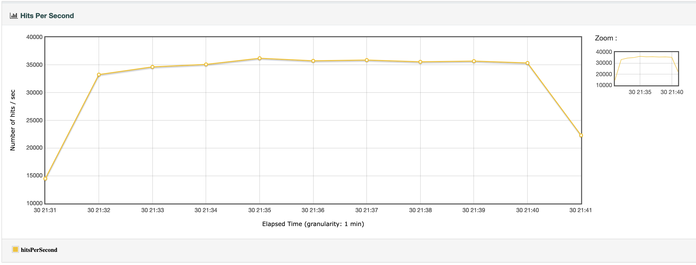


#### Codes Per Second

脚本运行期间，响应状态码的数量变化趋势图

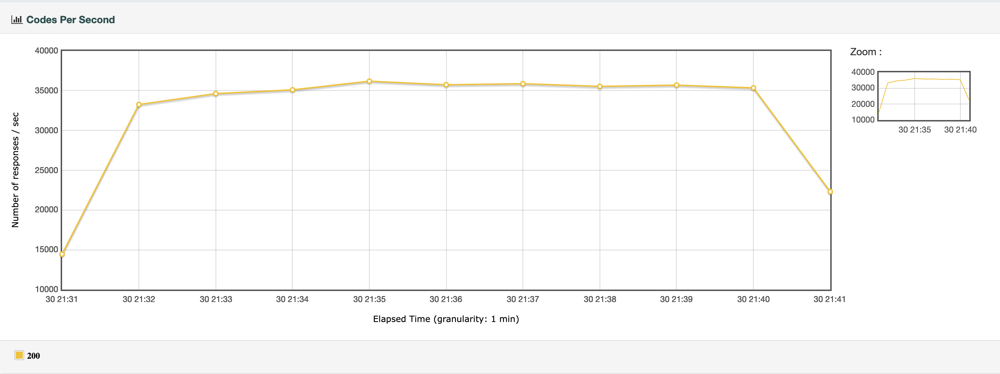


#### Transactions Per Second

- 每秒事务数，即 TPS
- 衡量系统处理能力的重要指标
- **包括**事务控制器样本结果

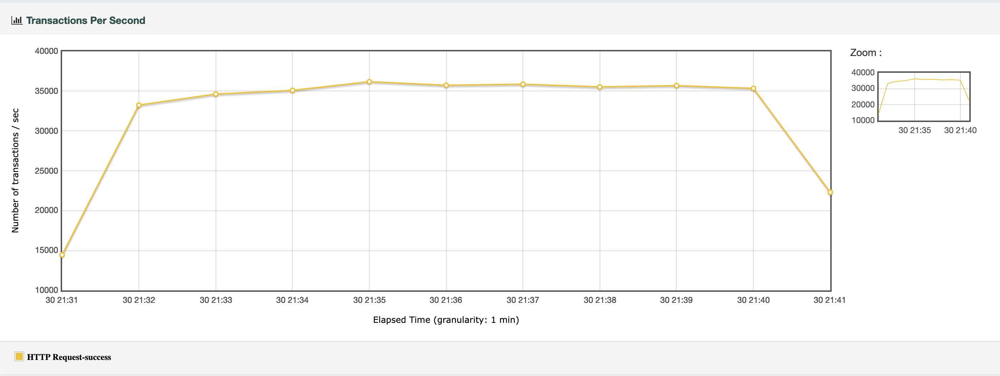


#### Total Transactions Per Second

* 每秒通过事务总数 ” 显示在场景运行时，在每一秒内通过的事务总数
* 失败的事务总署以及停止的事务总数

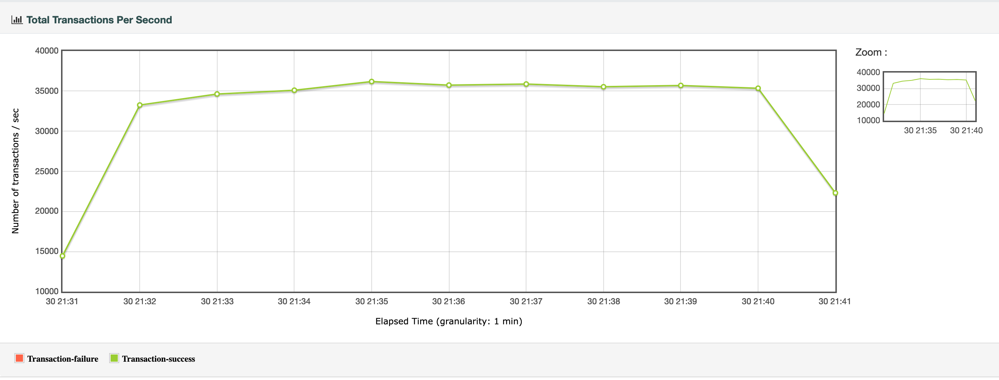


#### Response Time Vs Request

平均响应时间与每秒请求数的关系图

* 横坐标为每秒请求数
* 纵坐标为响应时间中位数 

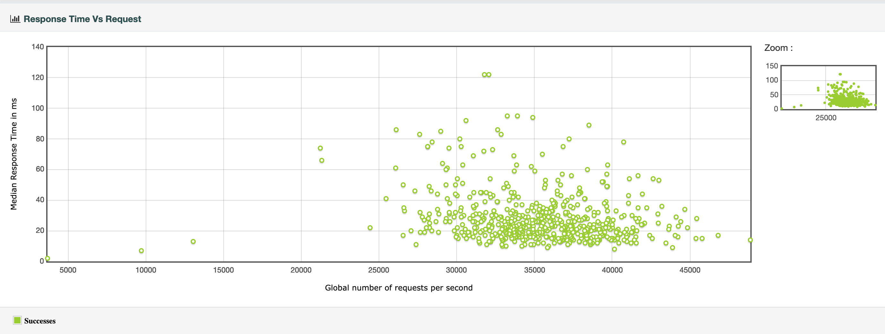


#### Latency Vs Request

完成一个完整的请求所需平均时间与每秒请求数的关系图


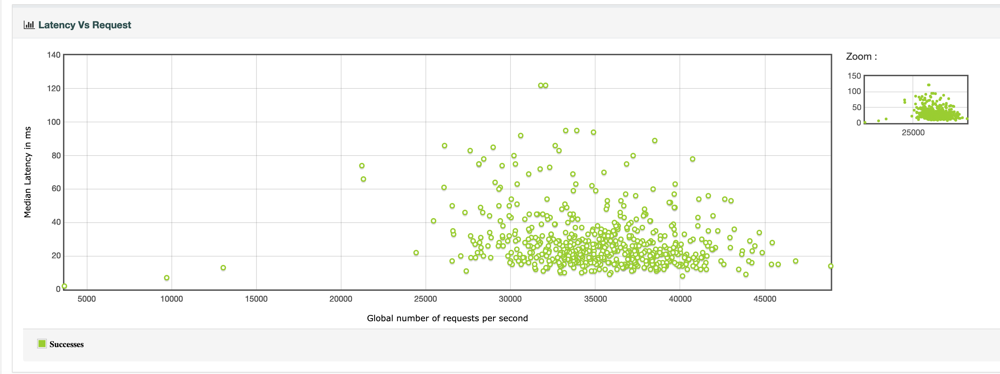


# Reference

https://www.cnblogs.com/poloyy/p/13280899.html

http://www.linuxea.com/2404.html


