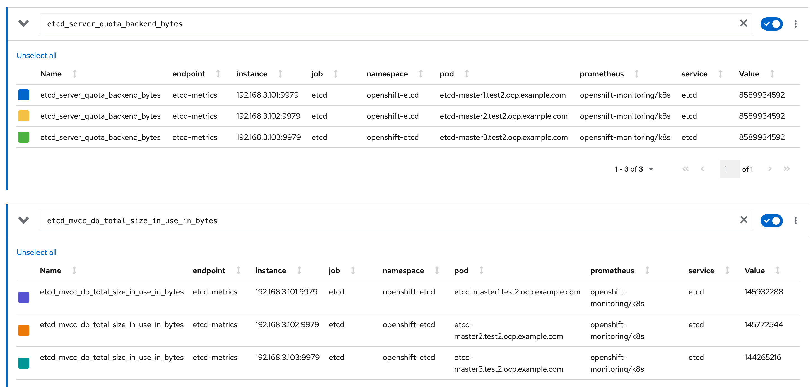

# 目标

1. 记录etcd 的一些信息


# etcd 磁盘碎片整理

openshift etcd 磁盘关注以下几个指标





## 自动碎片整理

Etcd 会自动触发碎片整理，要想知道是否有碎片整理，通过查看日志即可，可以看日志中是否有 `defragment` 字段


```
# oc logs etcd-master1.test2.ocp.example.com  | grep defragment
{"level":"info","ts":"2023-11-06T06:40:11.567Z","caller":"v3rpc/maintenance.go:90","msg":"starting defragment"}
{"level":"info","ts":"2023-11-06T06:40:11.570Z","caller":"backend/backend.go:497","msg":"defragmenting","path":"/var/lib/etcd/member/snap/db","current-db-size-bytes":234262528,"current-db-size":"234 MB","current-db-size-in-use-bytes":124407808,"current-db-size-in-use":"124 MB"}
{"level":"info","ts":"2023-11-06T06:40:12.845Z","caller":"backend/backend.go:549","msg":"finished defragmenting directory","path":"/var/lib/etcd/member/snap/db","current-db-size-bytes-diff":-111833088,"current-db-size-bytes":122429440,"current-db-size":"122 MB","current-db-size-in-use-bytes-diff":-2002944,"current-db-size-in-use-bytes":122404864,"current-db-size-in-use":"122 MB","took":"1.278275759s"}

```


或者查看 `openshift-etcd-operator`  的日志，查看关键字 `defragmented` 


```
[root@bastion-test2 ~]# oc -n openshift-etcd-operator logs etcd-operator-8597888d6-6whwt --timestamps  | grep defragmented
2023-11-06T14:40:12.849597167+08:00 I1106 06:40:12.849356       1 event.go:285] Event(v1.ObjectReference{Kind:"Deployment", Namespace:"openshift-etcd-operator", Name:"etcd-operator", UID:"94a89732-f5e6-4c62-94c1-85cb868d8047", APIVersion:"apps/v1", ResourceVersion:"", FieldPath:""}): type: 'Normal' reason: 'DefragControllerDefragmentSuccess' etcd member has been defragmented: master1.test2.ocp.example.com, memberID: 618053682337092098
2023-11-06T14:40:52.320973699+08:00 I1106 06:40:52.320859       1 event.go:285] Event(v1.ObjectReference{Kind:"Deployment", Namespace:"openshift-etcd-operator", Name:"etcd-operator", UID:"94a89732-f5e6-4c62-94c1-85cb868d8047", APIVersion:"apps/v1", ResourceVersion:"", FieldPath:""}): type: 'Normal' reason: 'DefragControllerDefragmentSuccess' etcd member has been defragmented: master2.test2.ocp.example.com, memberID: 10773665783538110569
2023-11-06T14:41:31.761818752+08:00 I1106 06:41:31.761544       1 event.go:285] Event(v1.ObjectReference{Kind:"Deployment", Namespace:"openshift-etcd-operator", Name:"etcd-operator", UID:"94a89732-f5e6-4c62-94c1-85cb868d8047", APIVersion:"apps/v1", ResourceVersion:"", FieldPath:""}): type: 'Normal' reason: 'DefragControllerDefragmentSuccess' etcd member has been defragmented: master3.test2.ocp.example.com, memberID: 10542513416989883823
2023-11-10T08:41:13.152135322+08:00 I1110 00:41:13.149880       1 event.go:285] Event(v1.ObjectReference{Kind:"Deployment", Namespace:"openshift-etcd-operator", Name:"etcd-operator", UID:"94a89732-f5e6-4c62-94c1-85cb868d8047", APIVersion:"apps/v1", ResourceVersion:"", FieldPath:""}): type: 'Normal' reason: 'DefragControllerDefragmentSuccess' etcd member has been defragmented: master2.test2.ocp.example.com, memberID: 10773665783538110569
2023-11-10T11:26:12.969660247+08:00 I1110 03:26:12.969595       1 event.go:285] Event(v1.ObjectReference{Kind:"Deployment", Namespace:"openshift-etcd-operator", Name:"etcd-operator", UID:"94a89732-f5e6-4c62-94c1-85cb868d8047", APIVersion:"apps/v1", ResourceVersion:"", FieldPath:""}): type: 'Normal' reason: 'DefragControllerDefragmentSuccess' etcd member has been defragmented: master1.test2.ocp.example.com, memberID: 618053682337092098
2023-11-10T11:26:52.275774150+08:00 I1110 03:26:52.274877       1 event.go:285] Event(v1.ObjectReference{Kind:"Deployment", Namespace:"openshift-etcd-operator", Name:"etcd-operator", UID:"94a89732-f5e6-4c62-94c1-85cb868d8047", APIVersion:"apps/v1", ResourceVersion:"", FieldPath:""}): type: 'Normal' reason: 'DefragControllerDefragmentSuccess' etcd member has been defragmented: master3.test2.ocp.example.com, memberID: 10542513416989883823
2023-11-12T18:26:13.352835267+08:00 I1112 10:26:13.351913       1 event.go:285] Event(v1.ObjectReference{Kind:"Deployment", Namespace:"openshift-etcd-operator", Name:"etcd-operator", UID:"94a89732-f5e6-4c62-94c1-85cb868d8047", APIVersion:"apps/v1", ResourceVersion:"", FieldPath:""}): type: 'Normal' reason: 'DefragControllerDefragmentSuccess' etcd member has been defragmented: master2.test2.ocp.example.com, memberID: 10773665783538110569
2023-11-14T09:51:13.608801799+08:00 I1114 01:51:13.608717       1 event.go:285] Event(v1.ObjectReference{Kind:"Deployment", Namespace:"openshift-etcd-operator", Name:"etcd-operator", UID:"94a89732-f5e6-4c62-94c1-85cb868d8047", APIVersion:"apps/v1", ResourceVersion:"", FieldPath:""}): type: 'Normal' reason: 'DefragControllerDefragmentSuccess' etcd member has been defragmented: master1.test2.ocp.example.com, memberID: 618053682337092098
2023-11-14T09:51:53.198136028+08:00 I1114 01:51:53.195757       1 event.go:285] Event(v1.ObjectReference{Kind:"Deployment", Namespace:"openshift-etcd-operator", Name:"etcd-operator", UID:"94a89732-f5e6-4c62-94c1-85cb868d8047", APIVersion:"apps/v1", ResourceVersion:"", FieldPath:""}): type: 'Normal' reason: 'DefragControllerDefragmentSuccess' etcd member has been defragmented: master3.test2.ocp.example.com, memberID: 10542513416989883823
2023-11-14T19:01:13.664937668+08:00 I1114 11:01:13.664833       1 event.go:285] Event(v1.ObjectReference{Kind:"Deployment", Namespace:"openshift-etcd-operator", Name:"etcd-operator", UID:"94a89732-f5e6-4c62-94c1-85cb868d8047", APIVersion:"apps/v1", ResourceVersion:"", FieldPath:""}): type: 'Normal' reason: 'DefragControllerDefragmentSuccess' etcd member has been defragmented: master2.test2.ocp.example.com, memberID: 10773665783538110569


```


## 手工碎片整理

在prometheus 中有一个关于etcd磁盘整理的告警，该告警会在以下两种情况下触发

1. 如果etcd 连续十分钟使用了超过50%的空间
2. 当 etcd 的活跃使用量低于其总数据库大小的 50% 并持续超过 10 分钟时


以下是一个手工碎片整理的过程， 从下面的过程中，可以看出来，磁盘碎片整理，是需要逐个节点执行的。

```
[root@bastion-test2 ~]# oc -n openshift-etcd get pods -l k8s-app=etcd -o wide
NAME                                 READY   STATUS    RESTARTS   AGE    IP              NODE                            NOMINATED NODE   READINESS GATES
etcd-master1.test2.ocp.example.com   4/4     Running   28         176d   192.168.3.101   master1.test2.ocp.example.com   <none>           <none>
etcd-master2.test2.ocp.example.com   4/4     Running   28         176d   192.168.3.102   master2.test2.ocp.example.com   <none>           <none>
etcd-master3.test2.ocp.example.com   4/4     Running   28         176d   192.168.3.103   master3.test2.ocp.example.com   <none>           <none>
[root@bastion-test2 ~]#
[root@bastion-test2 ~]# oc rsh -n openshift-etcd etcd-master1.test2.ocp.example.com etcdctl endpoint status --cluster -w table
+----------------------------+------------------+---------+---------+-----------+------------+-----------+------------+--------------------+--------+
|          ENDPOINT          |        ID        | VERSION | DB SIZE | IS LEADER | IS LEARNER | RAFT TERM | RAFT INDEX | RAFT APPLIED INDEX | ERRORS |
+----------------------------+------------------+---------+---------+-----------+------------+-----------+------------+--------------------+--------+
| https://192.168.3.101:2379 |  893c48cabd31202 |   3.5.6 |  215 MB |     false |      false |       318 |   81779542 |           81779542 |        |
| https://192.168.3.103:2379 | 924e88189b78bdaf |   3.5.6 |  216 MB |      true |      false |       318 |   81779542 |           81779542 |        |
| https://192.168.3.102:2379 | 9583bff2e491d069 |   3.5.6 |  164 MB |     false |      false |       318 |   81779542 |           81779542 |        |
+----------------------------+------------------+---------+---------+-----------+------------+-----------+------------+--------------------+--------+
[root@bastion-test2 ~]#
[root@bastion-test2 ~]# oc rsh -n openshift-etcd etcd-master1.test2.ocp.example.com
sh-4.4# unset ETCDCTL_ENDPOINTS
sh-4.4# etcdctl --command-timeout=30s --endpoints=https://localhost:2379 defrag
Finished defragmenting etcd member[https://localhost:2379]
sh-4.4#
sh-4.4#  etcdctl endpoint status -w table --cluster
+----------------------------+------------------+---------+---------+-----------+------------+-----------+------------+--------------------+--------+
|          ENDPOINT          |        ID        | VERSION | DB SIZE | IS LEADER | IS LEARNER | RAFT TERM | RAFT INDEX | RAFT APPLIED INDEX | ERRORS |
+----------------------------+------------------+---------+---------+-----------+------------+-----------+------------+--------------------+--------+
| https://192.168.3.101:2379 |  893c48cabd31202 |   3.5.6 |  140 MB |     false |      false |       318 |   81780823 |           81780823 |        |
| https://192.168.3.103:2379 | 924e88189b78bdaf |   3.5.6 |  216 MB |      true |      false |       318 |   81780824 |           81780823 |        |
| https://192.168.3.102:2379 | 9583bff2e491d069 |   3.5.6 |  164 MB |     false |      false |       318 |   81780827 |           81780827 |        |
+----------------------------+------------------+---------+---------+-----------+------------+-----------+------------+--------------------+--------+
sh-4.4#
```


