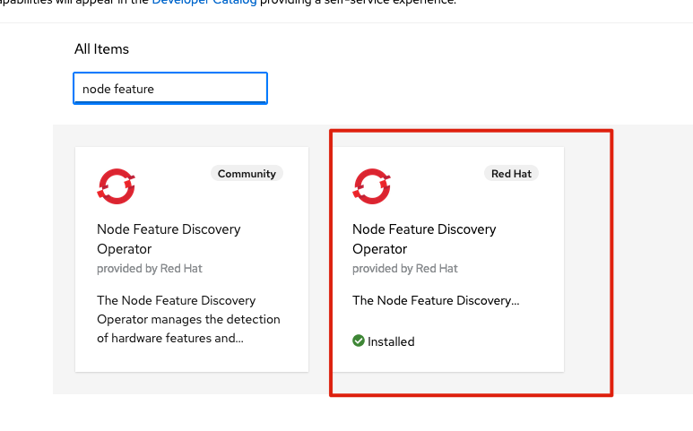
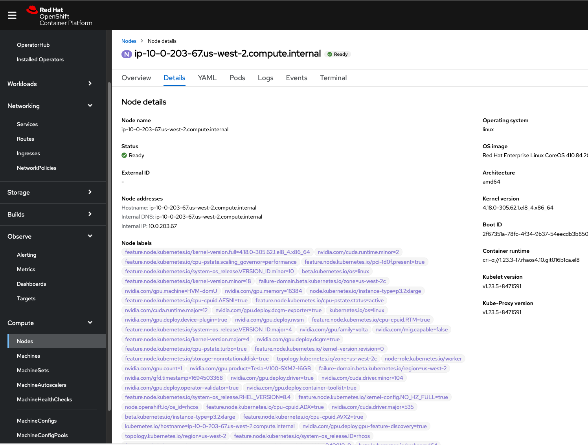
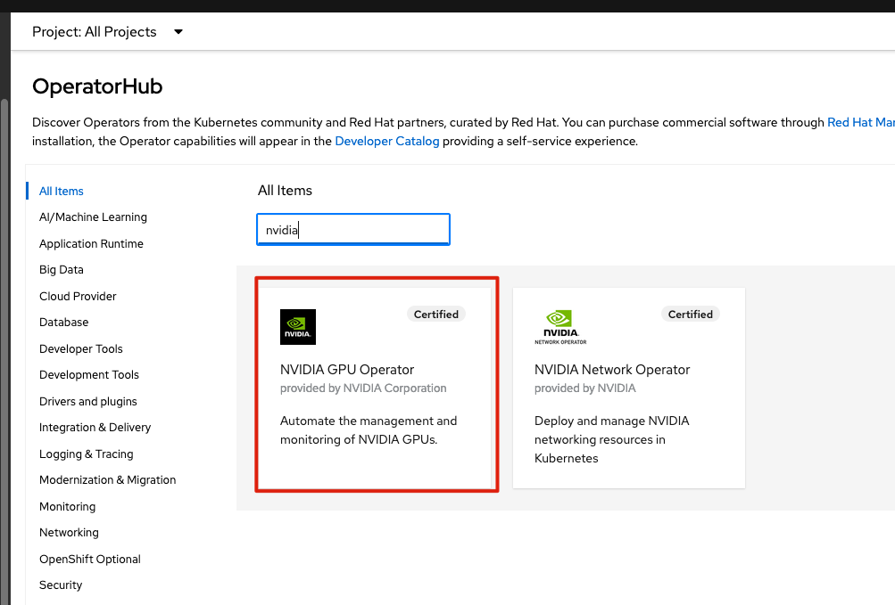
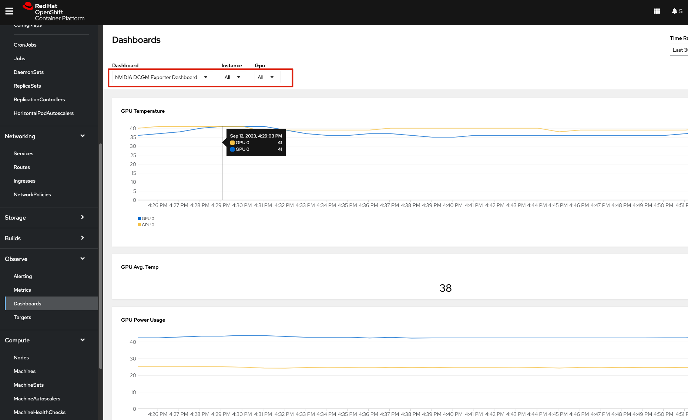

# 目标

安装GPU 

# 安装过程

## 安装 Node Feature Discovery Operator 

按照默认的配置，创建 NFD 实例，实例创建完毕，可以看到Node 被打了很多标签

## 安装GPU operator

### 创建 ClusterPolicy instance

按照默认配置创建 clusterPolicy instance 即可

## 开启 monitor

https://docs.nvidia.com/datacenter/cloud-native/gpu-operator/latest/openshift/enable-gpu-monitoring-dashboard.html#configuring-the-nvidia-dcgm-exporter-dashboard

# Reference

https://gist.github.com/dudash/f88020d369ff4795f4c65d6a4f7eb541

