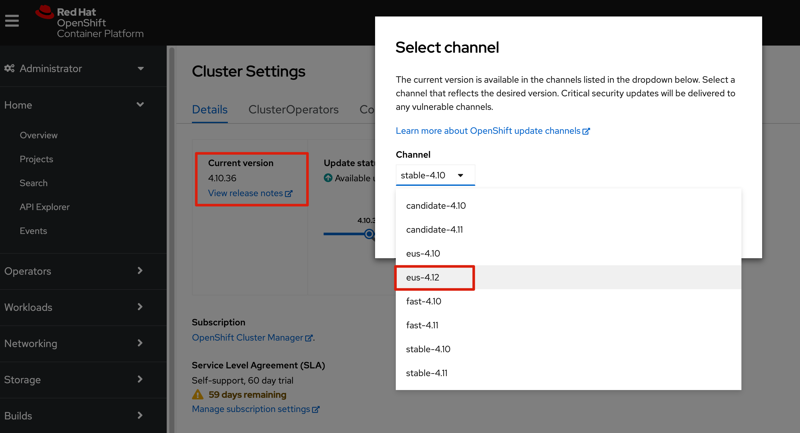
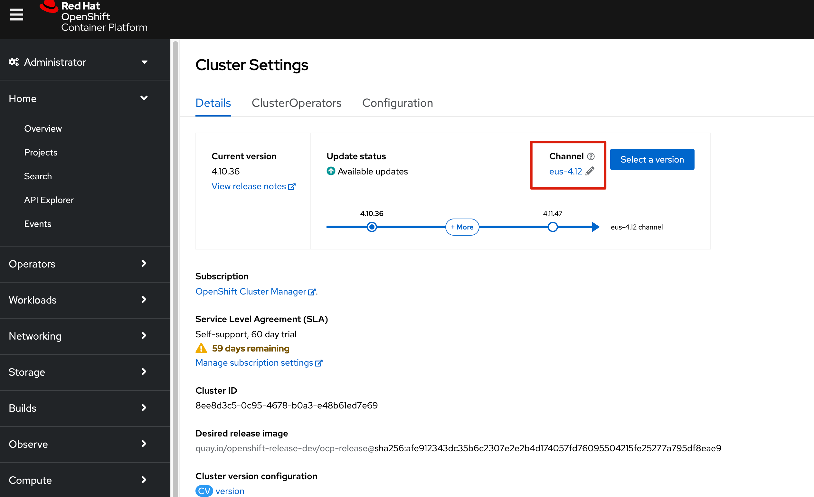
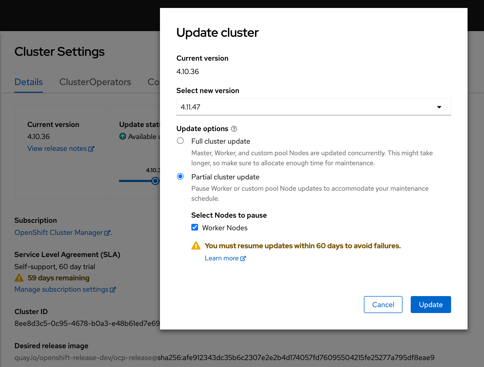
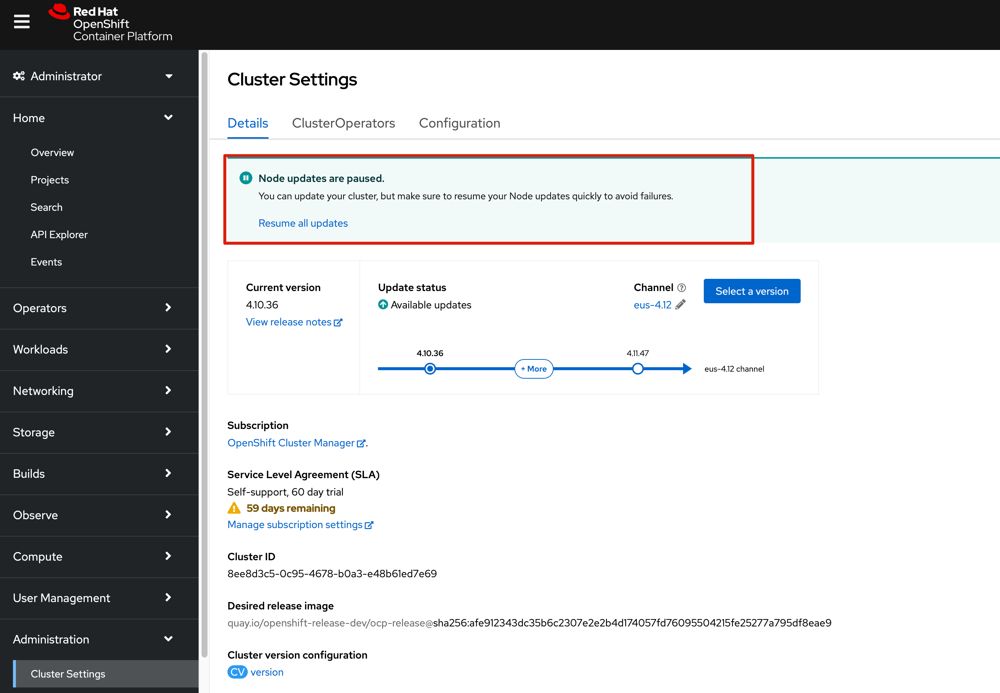
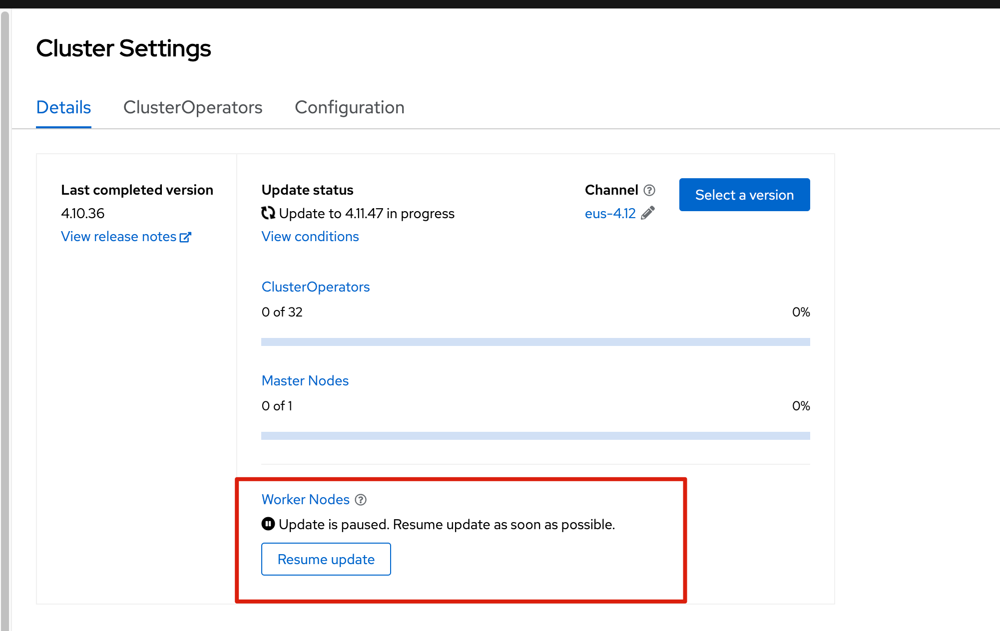
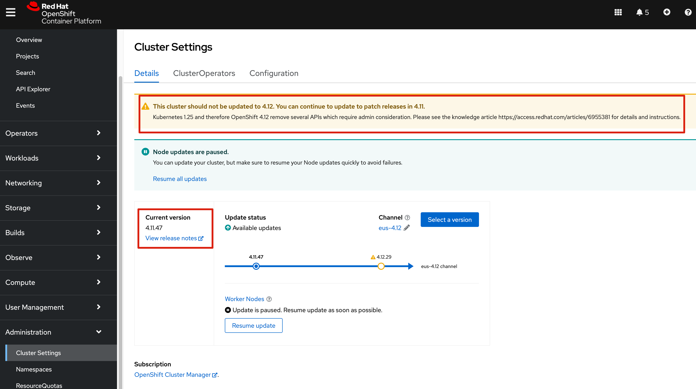
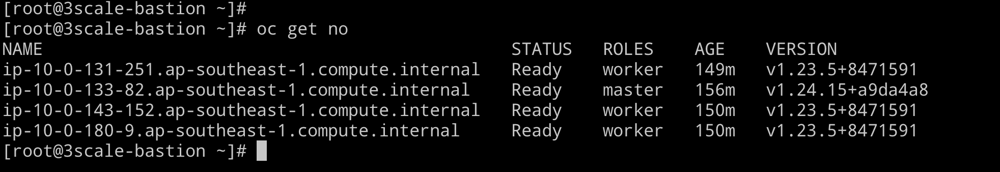
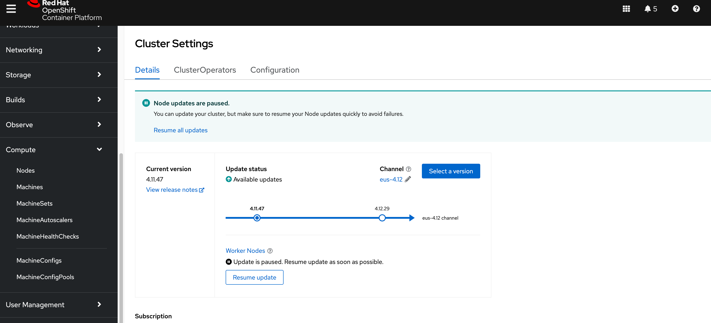
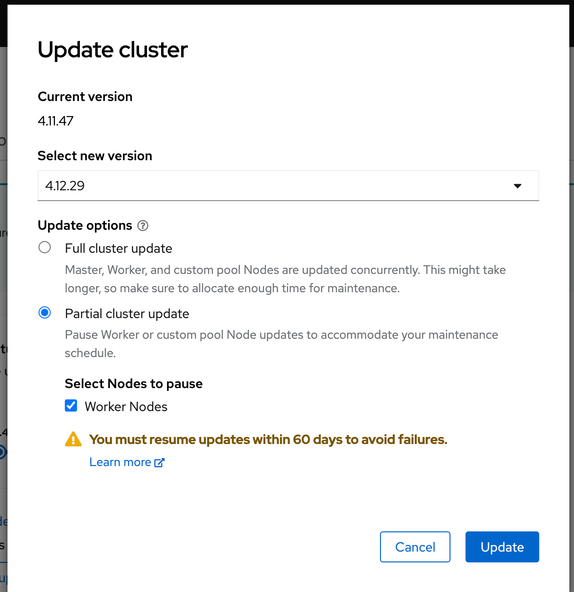

# 目标

1. 通过 EUS upgrade 的方式，将OCP集群从 4.10 升级到4.12 


# 通过UI升级


## 升级到 4.11 

首先选择升级 channel 为 eus-4.12 




​	确认 升级 channel 为 4.12 




选择部分升级，这里需要说明，EUS 升级不是直接升级到4.12，而是先升级到4.11，然后升级到4.12。主要不同的地方是，可以不升级计算节点




此时计算节点 pause




在升级过程中，随时可以恢复计算节点升级




此时 4.11 已经升级完成



从结果上来看，控制节点 版本升级，计算节点没有变化




## 升级到4.12 

从上边的说明，我们可以看到，从4.11 升级到4.12 即从k8s1.24 升级到k8s 1.25， 中间有一些API会被删除，这个时候，需要特别注意，如果集群中有应用在使用即将被删除的API，那需要提前处理，否则的话，会出问题

在升级4.12 前，执行以下命令

```
oc -n openshift-config patch cm admin-acks --patch '{"data":{"ack-4.11-kube-1.25-api-removals-in-4.12":"true"}}' --type=merge
```


执行完上述命令后，warning 消息消失，此时可以继续执行 升级动作




此时，我们有两个选择

* 选择 `Full cluster update`，选择这个会自动恢复被挂起的node节点升级
* 选择 `Partial cluster update`， 选择这个的话，依然只升级控制节点

我们依然选择部分升级




# 通过命令行完成升级


# 总结

通过EUS升级的好处就是，可以少重启一次计算节点，减少重启计算节点的次数，有以下好处

* 提高升级速度
* 减少对业务系统的影响

但是从另外一个角度来看，其实依然是遵循k8s逐个版本升级的基本原则，所以在总的来说上，没有大的影响


# Reference

https://access.redhat.com/articles/6955381

https://access.redhat.com/articles/6955985


