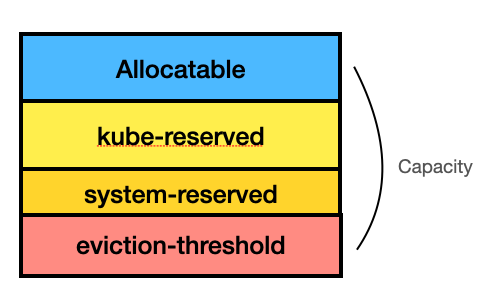

# 目标

1. 理解 kube-reserved 和 system-reserved 概念
2. 在OCP 中配置 system-reserved


# kubernetes 节点可分配资源说明

节点可用资源管理公式如下：

`Capacity = Allocatable + System-Reserved + Kube-Reserved + Eviction-Thresholds`





## kube-reserved

kube-reserved 用来给诸如 kubelet、container runtime、node problem detector 等 Kubernetes 系统守护进程记述其资源预留值。 该配置并非用来给以 Pod 形式运行的系统守护进程预留资源。

除了 `cpu`、`内存` 和 `ephemeral-storage` 之外，`pid` 可用来指定为 Kubernetes 系统守护进程预留指定数量的进程 ID


## system-reserved

`system-reserved` 用于为诸如 `sshd`、`udev` 等系统守护进程记述其资源预留值。 `system-reserved` 也应该为 `kernel` 预留 `内存`，因为目前 `kernel` 使用的内存并不记在 Kubernetes 的 Pod 上。 同时还推荐为用户登录会话预留资源（systemd 体系中的 `user.slice`）。

除了 `cpu`、`内存` 和 `ephemeral-storage` 之外，`pid` 可用来指定为 Kubernetes 系统守护进程预留指定数量的进程 ID。


# OCP reserve 方案

OCP 资源预留方案与Kubernetes 有稍微的区别

| Setting           | Description                                                  |
| :---------------- | :----------------------------------------------------------- |
| `kube-reserved`   | 在OCP中没有使用 `kube-reserved` 这个设置，所有的资源预留，都通过 `system-reserved` 来实现 |
| `system-reserved` | 这个参数主要是为了给 node 组件 和 系统组件预留资源，比如 CRI-O, kubelet |

因此 在ocp中， 没有`kube-reserved`

`[Allocatable] = [Node Capacity] - [system-reserved] - [Hard-Eviction-Thresholds]`


## OCP 预留资源建议


### 内存

节点内存小于等于1G的时候，建议预留资源

- 255 MiB.

Node 节点内存资源超过1GiB的时候


- 25% of the first 4 GiB of memory.
- 20% of the next 4 GiB of memory (between 4 GiB and 8 GiB).
- 10% of the next 8 GiB of memory (between 8 GiB and 16 GiB).
- 6% of the next 112GB of memory (up to 128GB)
- 2% of the remaining memory.


### CPU

- 6% of the first core.
- 1% of the second core.
- 0.5% of the next 2 cores.
- 0.25% of any remaining core.


### Example


举个例子，计算节点配置如下

- CPU: 16 cores.
- Memory: 32 GiB.

推荐的值：

- Recommended reserved CPU = `60m` + `10m` + (2 * `5m`) + (12 * `2.5m`) = `110m`.
  - Consequent allocatable CPU = `16000m`- `110m`= `15890m`.
- Recommended reserved memory = 25% of `4 GiB` + 20% of `4 GiB` + 10% of `8 GiB` + 6% of `16 GiB` = `3.56 GiB`.
  - Consequent allocatable memory = `32 GiB` - `3.56 GiB` = `28.44 GiB`.


# 配置


在 OCP4.7之前的版本，需要手工配置，在4.8以及之后的版本，都可以自动配置


## 自动配置


```
cat >dynamic-node.yaml <<EOF
apiVersion: machineconfiguration.openshift.io/v1
kind: KubeletConfig
metadata:
  name: dynamic-node 
spec:
  autoSizingReserved: true 
  machineConfigPoolSelector:
    matchLabels:
      pools.operator.machineconfiguration.openshift.io/worker: "" 
EOF

oc apply -f dynamic-node.yaml

```


查看结果：登陆到计算节点上，可以看到 

```
sh-4.4# ps -ef | grep -i kubelet | grep -i system
root        2458       1  9 15:07 ?        00:00:15 /usr/bin/kubelet --config=/etc/kubernetes/kubelet.conf --bootstrap-kubeconfig=/etc/kubernetes/kubeconfig --kubeconfig=/var/lib/kubelet/kubeconfig --container-runtime=remote --container-runtime-endpoint=/var/run/crio/crio.sock --runtime-cgroups=/system.slice/crio.service --node-labels=node-role.kubernetes.io/worker,node.openshift.io/os_id=rhcos --node-ip= --minimum-container-ttl-duration=6m0s --volume-plugin-dir=/etc/kubernetes/kubelet-plugins/volume/exec --cloud-provider=aws --hostname-override=ip-10-0-243-26.ap-southeast-1.compute.internal --provider-id=aws:///ap-southeast-1c/i-0eabdee2b159dd66c --pod-infra-container-image=quay.io/openshift-release-dev/ocp-v4.0-art-dev@sha256:2c22c46da48ae4d748ffc5c5e60cadb8b8f1e40d1ff137a9fc17190a45d18703 --system-reserved=cpu=0.11,memory=5Gi,ephemeral-storage=1Gi --v=2

```


# Reference

https://access.redhat.com/solutions/5843241

https://docs.openshift.com/container-platform/4.12/nodes/nodes/nodes-nodes-resources-configuring.html

https://kubernetes.io/docs/tasks/administer-cluster/reserve-compute-resources/


