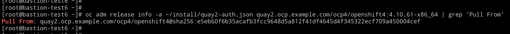

[TOC]


# 目标

从4.10.50 升级到 4.10.61


# 升级前准备


## 检查升级路径


## 离线镜像


# 升级


## 备份


# 


## 执行升级

确认升级版本：执行以下命令，获取目标镜像的sha256，这里要认真一点，避免由于误操作导致的跳版本升级

```
oc adm release info -a ~/install/quay2-auth.json quay2.ocp.example.com/ocp4/openshift4:4.10.61-x86_64 | grep 'Pull From'
```





执行升级

```
oc adm upgrade --allow-explicit-upgrade --to-image quay.io/openshift-release-dev/ocp-release@sha256:$(oc adm release info -a ~/install/quay2-auth.json quay2.ocp.example.com/ocp4/openshift4:4.10.61-x86_64 | grep 'Pull From' | cut -d':' -f3)
```


