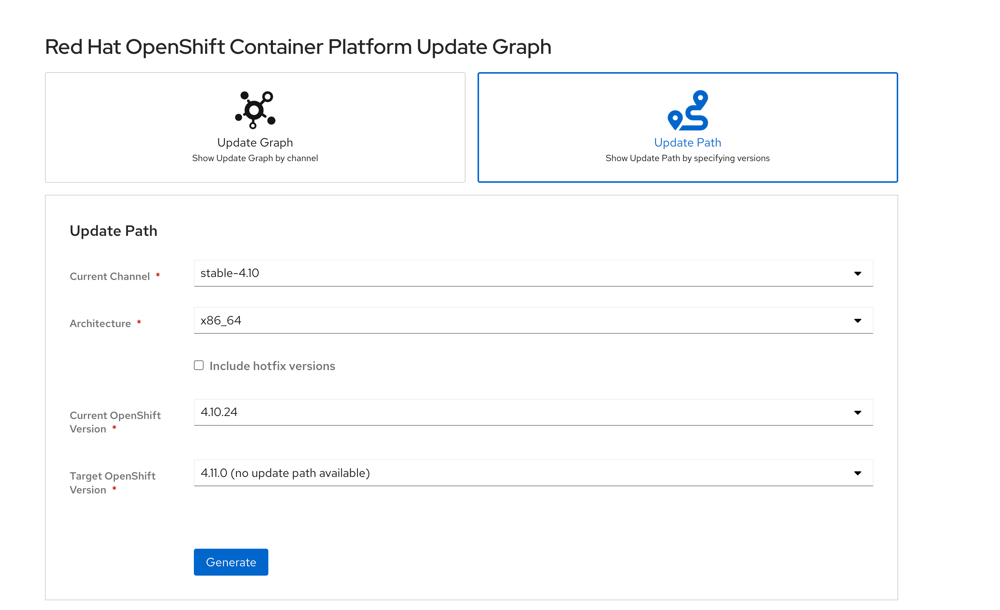

# 目标

* ocp4.10 升级到ocp4.11


# 升级准备

## 确定升级路径

通过ocp[升级路径](https://access.redhat.com/labs/ocpupgradegraph/update_path)确定可以升级的路径，貌似我们不能直接升级，显示no update path available。所以选择强行升级




## 同步离线升级包

```

export OCP_RELEASE=4.11.0

export LOCAL_REGISTRY='registry2.ocp.example.com:5000'
export LOCAL_SECRET_JSON='/root/ocp4/pull-secret.txt'
export LOCAL_REPOSITORY='openshift-release-dev/ocp-v4.0-art-dev'
export ARCHITECTURE='x86_64'
export REMOVABLE_MEDIA_PATH='/root'


 oc adm release mirror -a ${LOCAL_SECRET_JSON}  \
     --from=quay.io/openshift-release-dev/ocp-release:${OCP_RELEASE}-${ARCHITECTURE} \
     --to=${LOCAL_REGISTRY}/${LOCAL_REPOSITORY} \
     --to-release-image=${LOCAL_REGISTRY}/${LOCAL_REPOSITORY}:${OCP_RELEASE}-${ARCHITECTURE}

oc image mirror -a ${LOCAL_SECRET_JSON} \
 --from-dir=/root/mirror 'file://openshift/release:4.9.7-x86_64*' ${LOCAL_REGISTRY}/${LOCAL_REPOSITORY}

```


## 同步离线operator


```
需要
```


# 升级


## 获取升级信息


# 升级后检查

