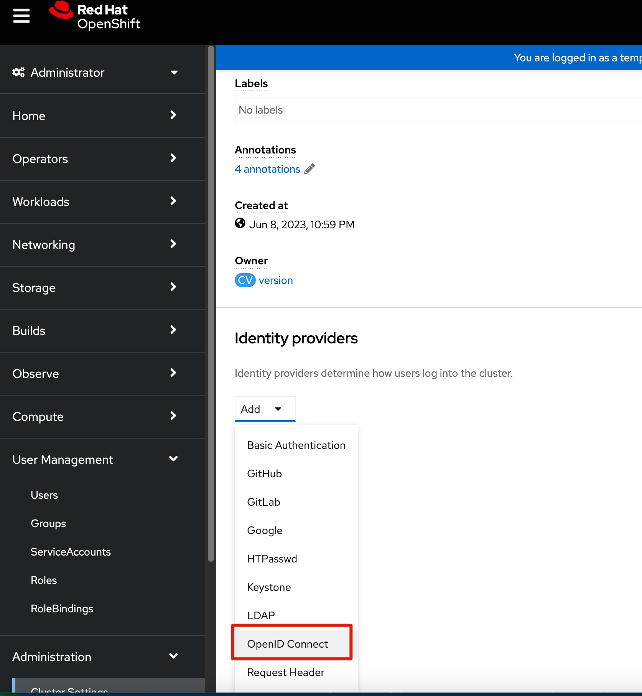

[TOC]


# 目标

1. 通过 template 安装 sso
2. 通过operator 安装sso
3. 配置openshift 对接sso


# 通过template 安装sso


## 离线环境导入imagestream


## 安装sso

创建 Project 


选择 SSO 7.5 


手工设置 SSO 账号，密码，这里如果没有设置的话，后面会自动生成。


部署完成后


选择 openid




配置 


在这里找到route-ca 证书


copy证书


回到之前user 配置页面，把证书贴上去

说明：这里的ca 是 ingress operator 自己生成的CA，如果在这里写了ca，后面在做ingress 证书替换的时候，可能会遇到一个坑，就是 openid 的证书出现x509 的错误，所以这里不填ca也是一个方案


此时 auth operator 会重启，等相关pod重启后，更新完成


退出当前登录用户


## 配置ocp 与sso 对接


## 配置 SSO logout-for-sso7.4

在配置sso 时，需要配置logout才能真正退出session


```
oc edit console.config.openshift.io cluster

# 在下面增加以下几行

apiVersion: config.openshift.io/v1
kind: Console
metadata:
  name: cluster
spec:
  authentication:
    logoutRedirect: "https://sso-sso-app-demo.apps.test7.ocp.example.com/auth/realms/OpenShift/protocol/openid-connect/logout?redirect_uri=https%3A%2F%2Fconsole-openshift-console.apps.test7.ocp.example.com" 
```


其中 `logoutRedirect` 格式说明

1. end-session-endpoint 地址按照以下说明从SSO中获取
2. ocp-console-url： 就是ocp console 的地址，注意，这里需要用url coder，`https://` 要写成 `https%3A%2F%2F`


```

spec:
  authentication:
    logoutRedirect: <end-session-endpoint>?redirect_uri=<ocp-console-url>

```

end-session-endpoint 地址按照以下方式获取


在这里获取logout 地址


## 配置 sso logout -for-sso7.6

在sso7.6 里，[logout 方式发生变化](https://access.redhat.com/documentation/en-us/red_hat_single_sign-on/7.6/html-single/upgrading_guide/index#openid_connect_logout)


`redirect_uri` 以及后面的跳转地址都不需要了

```
oc edit console.config.openshift.io cluster
... 
spec:
  authentication:
    logoutRedirect: https://sso-sso-app-demo.apps.test7.ocp.example.com/auth/realms/OpenShift/protocol/openid-connect/logout
```


# Reference

https://access.redhat.com/solutions/6973001
