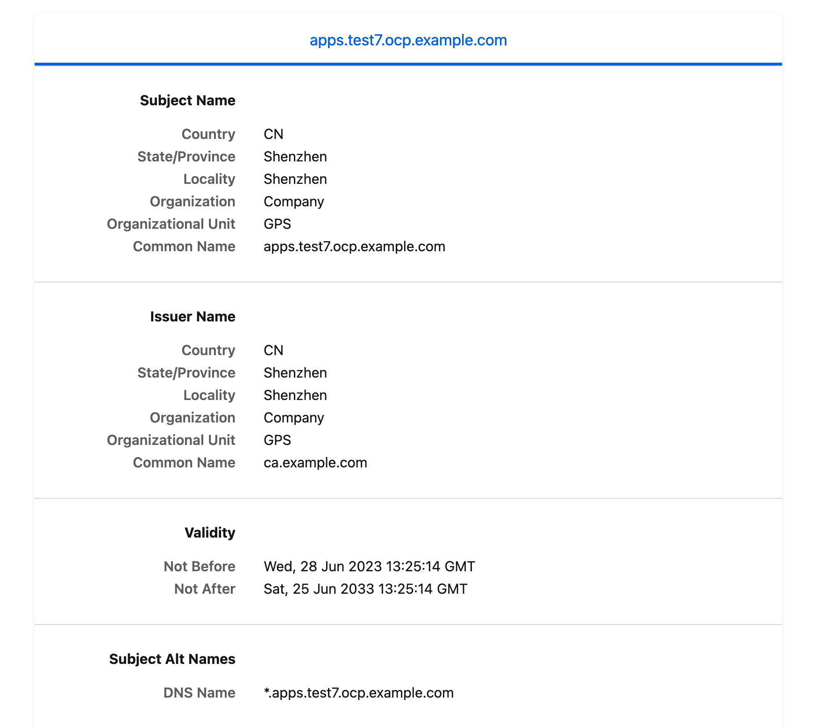
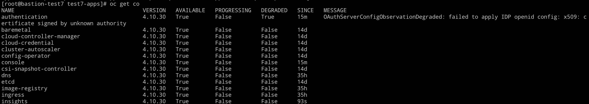
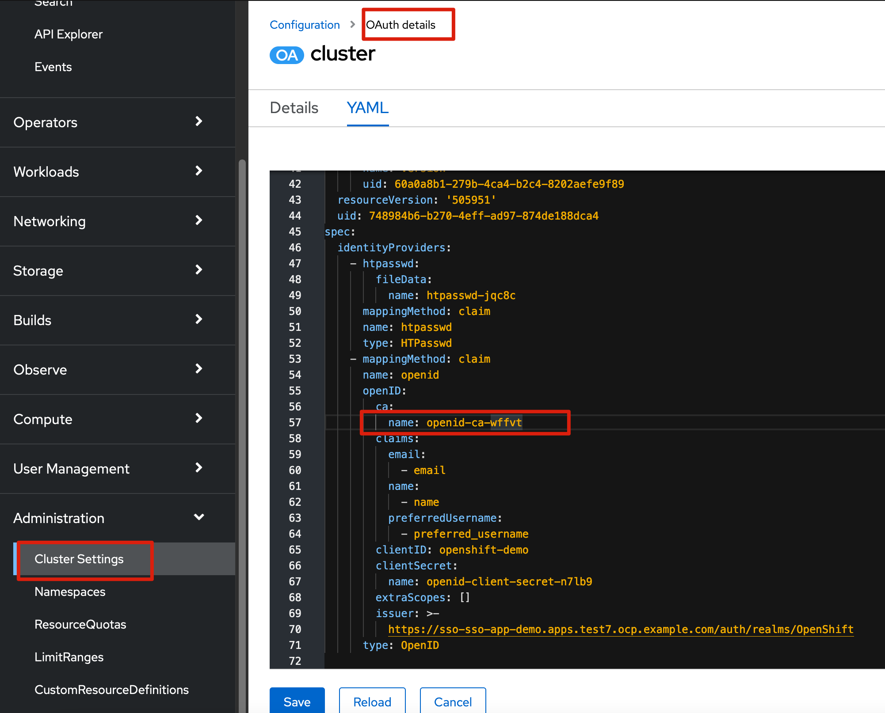
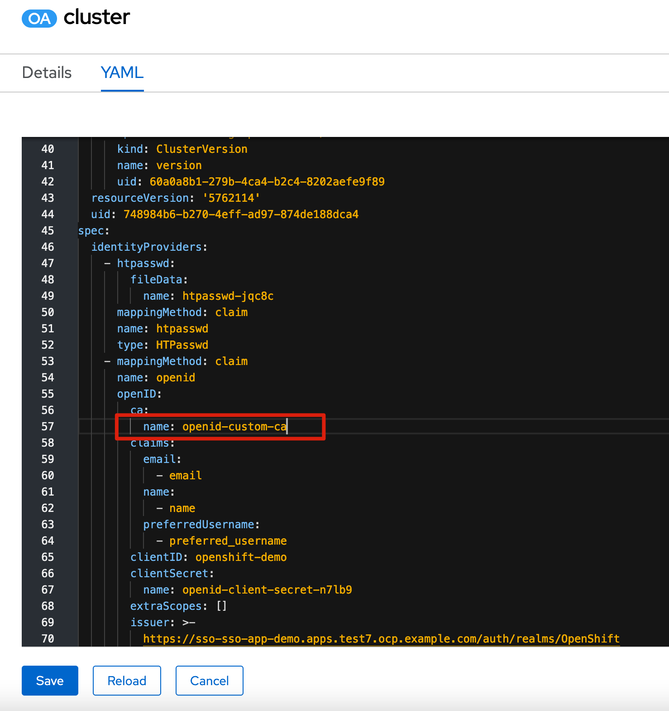

# 背景 & 目标


openshift 在部署的时候会发布自签ingress 证书，如果我们希望把这个证书替换掉，可以参考以下步骤


# 步骤


## 为ingress 签发证书

```
cd /opt/certs
# 这里已经有之前的CA，所以这里不描述如何创建CA

CNAME_CA=ca.ocp.example.com

CER_ROOT_CA=myrootCA

CER_NAME=apps.test7.ocp.example.com

openssl genrsa -out ${CER_NAME}.key 4096

openssl req -sha512 -new \
    -subj "/C=CN/ST=Shenzhen/L=Shenzhen/O=Company/OU=GPS/CN=${CER_NAME}" \
    -key ${CER_NAME}.key \
-out ${CER_NAME}.csr


cat > ingress-test7.cnf << EOF
[req]
req_extensions = v3_req
distinguished_name = req_distinguished_name

[req_distinguished_name]
[ v3_req ]
basicConstraints = CA:FALSE
keyUsage = nonRepudiation, digitalSignature, keyEncipherment
subjectAltName = @alt_names

[alt_names]
DNS.1 = *.apps.test7.ocp.example.com
EOF

openssl x509 -req -in ${CER_NAME}.csr -CA ${CER_ROOT_CA}.crt \
   -CAkey ${CER_ROOT_CA}.key -CAcreateserial -out ${CER_NAME}.crt \
   -days 3650 -extensions v3_req -extfile ingress-test7.cnf

```


## 在OCP上创建相关资源


```
# 使用之前的CA 创建configmap
oc create configmap custom-ca \
    --from-file=ca-bundle.crt=/etc/pki/ca-trust/source/anchors/myrootCA.crt \
    -n openshift-config


# 配置 proxy 使用当前的CA
oc patch proxy/cluster \
    --type=merge \
    --patch='{"spec":{"trustedCA":{"name":"custom-ca"}}}'
    
# 使用刚才签发的证书创建新的secret     
oc create secret tls ingress-cert \
    --cert=apps.test7.ocp.example.com.crt \
    --key=apps.test7.ocp.example.com.key \
    -n openshift-ingress
```


## 替换证书

执行以下命令，替换OCP ingress 证书

```
oc patch ingresscontroller.operator default \
     --type=merge -p \
     '{"spec":{"defaultCertificate": {"name": "ingress-cert"}}}' \
     -n openshift-ingress-operator
```


## 查看结果

从页面来看，生成新的证书




# 遇到问题


我在替换之前，先部署了并且对接了SSO，于是导致下面的问题，其实这个问题是因为我之前在对接 SSO的时候使用了ingress operator 的ca导致的。




查看 OAuth operator， 发现 openid 用了自己的ca，这里尝试替换这个 `openid-ca-wffvt` 




解决方式

把你的ca内容写入下面填空，然后创建对应的configmap

```
apiVersion: v1
data:
  ca.crt: |
    -----BEGIN CERTIFICATE-----
    <your CA content>
    -----END CERTIFICATE-----
kind: ConfigMap
metadata:
  name: openid-custom-ca
  namespace: openshift-config
```

参考下面的图，替换 ca 即可

