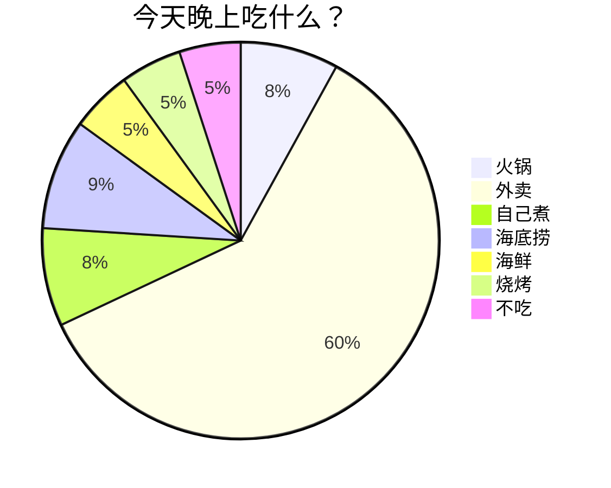
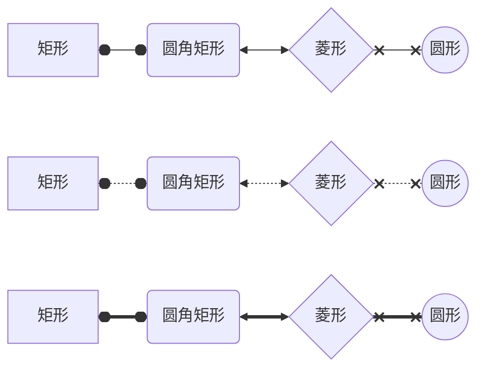
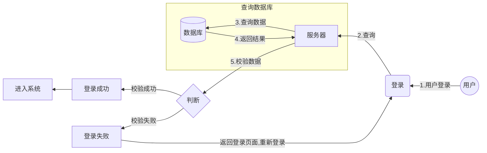

# 目标

markdown 学习笔记

# markdown 流程图

## 饼状图

## other

## demo

# Reference

https://rstyro.github.io/blog/2021/06/28/Markdown%E6%B5%81%E7%A8%8B%E5%9B%BE%E8%AF%AD%E6%B3%95%E7%A4%BA%E4%BE%8B/

https://snowdreams1006.github.io/write/mermaid-flow-chart.html

