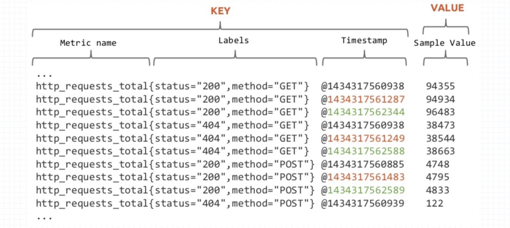

# 基本概念

## 样本

Prometheus会定时到指定的Exportor上pull当前的样本数据，然后根据pull的时间以时间序列的方式保存在内存数据库中，并且定时持久化到硬盘上，Exportor只维护指标的值。每条时间序列由指标名称(metrics)和一组标签集(labelset)确定并命令，也就是说一个指标名称可能对应很多条时间序列。

 可以将时间序列理解为一个以时间为轴的矩阵，如下所示，有三个时间序列在时间轴上分别对应不同的值

在时间序列（time-series）中的每一个点称为一个样本（sample），样本由以下三部分组成：

- 指标名(metric name)：指标名（metric name）和描述当前样本特征的标签（labels）;
- 时间戳(timestamp)：一个精确到毫秒的时间戳;
- 样本值(value)： 一个float64的浮点型数据表示当前样本的值。

# PromQL的数据类型

PromQL的表达式中支持4种数据类型

- 即时向量(Instant Vector):特定或全部的时间序列集合上，具有相同时间戳的一组样本值称为即时向量;
- 范围向量(Range Vector):特定或全部的时间序列集合上，在指定的同一时间范围内的 所有样本值;
- 标量(Scalar):一个浮点型的数据值;
- 字符串(String):支持使用单引号、双引号或反引号进行引用，但反引号中不会对转义 字符进行转义;

# 时间序列选择器

# reference

https://system51.github.io/2021/05/27/PromQL/

https://blog.csdn.net/zhouwenjun0820/article/details/105823389

https://prometheus.fuckcloudnative.io/di-san-zhang-prometheus/di-2-jie-an-zhuang/gettingstarted

