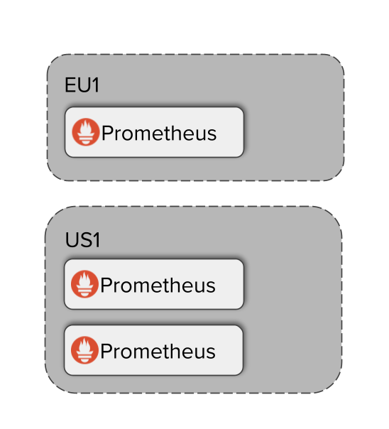

# 目标

1. 通过Demo演示thanos 功能


# Demo

## 架构





## 部署 prometheus

### 生成3个prometheus 配置文件

```

# prometheus instance_eu1
cat << EOF > prometheus0_eu1.yml
global:
  scrape_interval: 15s
  evaluation_interval: 15s
  external_labels:
    cluster: eu1
    replica: 0

scrape_configs:
  - job_name: 'prometheus'
    static_configs:
      - targets: ['172.17.0.1:9090']
EOF

# prometheus instance0_us1
cat << EOF > prometheus0_us1.yml
global:
  scrape_interval: 15s
  evaluation_interval: 15s
  external_labels:
    cluster: us1
    replica: 0

scrape_configs:
  - job_name: 'prometheus'
    static_configs:
      - targets: ['172.17.0.1:9091','172.17.0.1:9092']

EOF

# prometheus instance1_us1
cat << EOF > prometheus1_us1.yml
global:
  scrape_interval: 15s
  evaluation_interval: 15s
  external_labels:
    cluster: us1
    replica: 1

scrape_configs:
  - job_name: 'prometheus'
    static_configs:
      - targets: ['172.17.0.1:9091','172.17.0.1:9092']
EOF

```


### 启动3个prometheus 实例


```
# 创建文件目录 
mkdir -p prometheus0_eu1_data prometheus0_us1_data prometheus1_us1_data

docker run -d --net=host --rm \
    -v $(pwd)/prometheus0_eu1.yml:/etc/prometheus/prometheus.yml \
    -v $(pwd)/prometheus0_eu1_data:/prometheus \
    -u root \
    --name prometheus-0-eu1 \
    quay.io/prometheus/prometheus:v2.38.0 \
    --config.file=/etc/prometheus/prometheus.yml \
    --storage.tsdb.path=/prometheus \
    --web.listen-address=:9090 \
    --web.enable-lifecycle \
    --web.enable-admin-api && echo "Prometheus EU1 started!"


docker run -d --net=host --rm \
    -v $(pwd)/prometheus0_us1.yml:/etc/prometheus/prometheus.yml \
    -v $(pwd)/prometheus0_us1_data:/prometheus \
    -u root \
    --name prometheus-0-us1 \
    quay.io/prometheus/prometheus:v2.38.0 \
    --config.file=/etc/prometheus/prometheus.yml \
    --storage.tsdb.path=/prometheus \
    --web.listen-address=:9091 \
    --web.enable-lifecycle \
    --web.enable-admin-api && echo "Prometheus 0 US1 started!"


docker run -d --net=host --rm \
    -v $(pwd)/prometheus1_us1.yml:/etc/prometheus/prometheus.yml \
    -v $(pwd)/prometheus1_us1_data:/prometheus \
    -u root \
    --name prometheus-1-us1 \
    quay.io/prometheus/prometheus:v2.38.0 \
    --config.file=/etc/prometheus/prometheus.yml \
    --storage.tsdb.path=/prometheus \
    --web.listen-address=:9092 \
    --web.enable-lifecycle \
    --web.enable-admin-api && echo "Prometheus 1 US1 started!"


# 开启防火墙
firewall-cmd --zone=public --add-port=9090/tcp --permanent
firewall-cmd --zone=public --add-port=9091/tcp --permanent
firewall-cmd --zone=public --add-port=9092/tcp --permanent

firewall-cmd --reload

```


### 为 prometheus 添加 sidecar

```
docker run -d --net=host --rm \
    -v $(pwd)/prometheus0_eu1.yml:/etc/prometheus/prometheus.yml \
    --name prometheus-0-sidecar-eu1 \
    -u root \
    quay.io/thanos/thanos:v0.28.0 \
    sidecar \
    --http-address 0.0.0.0:19090 \
    --grpc-address 0.0.0.0:19190 \
    --reloader.config-file /etc/prometheus/prometheus.yml \
    --prometheus.url http://172.17.0.1:9090 && echo "Started sidecar for Prometheus 0 EU1"


docker run -d --net=host --rm \
    -v $(pwd)/prometheus0_us1.yml:/etc/prometheus/prometheus.yml \
    --name prometheus-0-sidecar-us1 \
    -u root \
    quay.io/thanos/thanos:v0.28.0 \
    sidecar \
    --http-address 0.0.0.0:19091 \
    --grpc-address 0.0.0.0:19191 \
    --reloader.config-file /etc/prometheus/prometheus.yml \
    --prometheus.url http://172.17.0.1:9091 && echo "Started sidecar for Prometheus 0 US1"


docker run -d --net=host --rm \
    -v $(pwd)/prometheus1_us1.yml:/etc/prometheus/prometheus.yml \
    --name prometheus-1-sidecar-us1 \
    -u root \
    quay.io/thanos/thanos:v0.28.0 \
    sidecar \
    --http-address 0.0.0.0:19092 \
    --grpc-address 0.0.0.0:19192 \
    --reloader.config-file /etc/prometheus/prometheus.yml \
    --prometheus.url http://172.17.0.1:9092 && echo "Started sidecar for Prometheus 1 US1"
    
```


## 部署 thanos Querier


```

docker run -d --net=host --rm \
    --name querier \
    quay.io/thanos/thanos:v0.28.0 \
    query \
    --http-address 0.0.0.0:29090 \
    --query.replica-label replica \
    --store 172.17.0.1:19190 \
    --store 172.17.0.1:19191 \
    --store 172.17.0.1:19192 && echo "Started Thanos Querier"
    
firewall-cmd --zone=public --add-port=29090/tcp --permanent
firewall-cmd --zone=public --add-port=9100/tcp --permanent
firewall-cmd --reload   
```


## 配置 thanos receive 

> 说明： 以下insecure 如果配置为false，那么访问后端S3需要使用https + 证书

```
cat << EOF > bucket.yml
type: S3
config:
  bucket: "thanos-receive"
  endpoint: "minio-single.ocp.example.com:9000"
  access_key: "UqdwNcb75oZb1XozkORb"
  secret_key: "Y4ABPQBd88HHXAJaZLcaDwh6VTKb76XoZm9TihKT"
  insecure: false
EOF

```


说明：

10901: gRPC 端口，用于与其他 Thanos 组件通信

19291:  HTTP 端口，用于健康检查和 Prometheus 远程写入

```
docker run -d \
  -v $(pwd)/bucket.yml:/etc/thanos/bucket.yml \
  -p 10901:10901 \
  -p 19291:19291 \
  --name thanos-receiver \
  quay.io/thanos/thanos:v0.28.0 \
  receive \
  --tsdb.path=/thanos/receive \
  --objstore.config-file=/etc/thanos/bucket.yml \
  --label='receive_replica="$(hostname)"' \
  --log.level=info

```


## 修改prometheus 配置


### 添加remote-write


修改 prometheus 配置，增加 remote-write 

```
spec:
  remoteWrite:
  - url: http://192.168.3.213:19291/api/v1/receive
```


### 遇到问题


```
level=warn ts=2024-04-28T01:24:07.048111992Z caller=receive.go:716 component=receive component=uploader msg="recurring upload failed" err="upload: check exists: stat s3 object: Get \"https://minio-single.ocp.example.com:9000/thanos-receive/?location=\": http: server gave HTTP response to HTTPS client"
level=warn ts=2024-04-28T01:24:37.046929525Z caller=receive.go:662 component=receive component=uploader msg="upload failed" elapsed=3.954478ms err="upload: check exists: stat s3 object: Get \"https://minio-single.ocp.example.com:9000/thanos-receive/?location=\": http: server gave HTTP response to HTTPS client"
```

