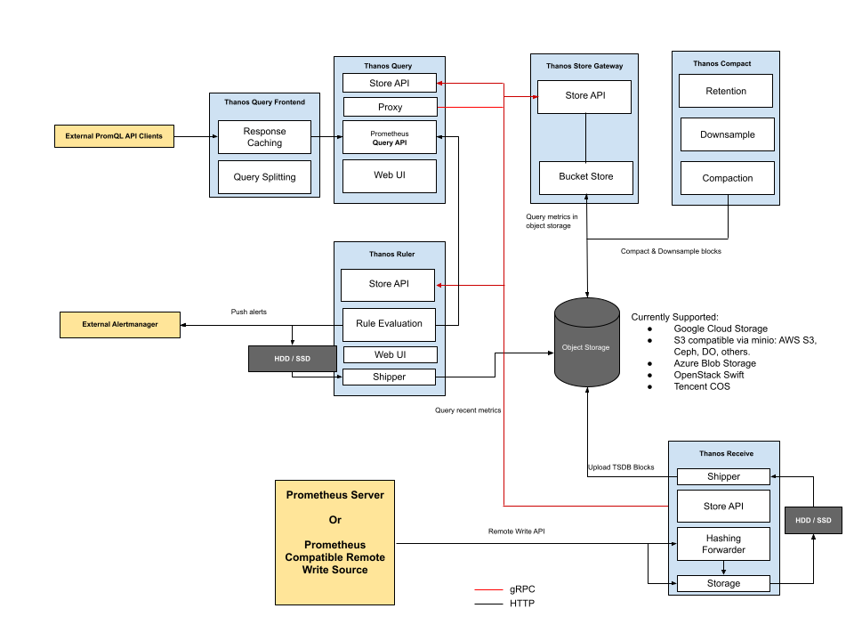

# 架构

## 组件

Sidecar： Thanos 的数据上传组件，用来和 Prometheus 通信，并且将 Prometheus 的监控数据上传到对象存储

Query：Thanos 的查询组件，用来查询监控数据

Store：Thanos 的数据存储组件，用来和对象存储通信，为对象存储提供数据代理服务。

Receive：Thanos 的数据收取组件，支持 Prometheus 的远程写功能，对于同一个 Prometheus 实例，只能在 Sidecar 和 Receiver 中间二选一。

Rule：Thanos 的集中的告警管理组件

Compactor：Thanos 的数据处理组件，用来将监控数据降准和压缩

Query Frontend：Thanos 的查询前端

tools：Thanos 的运维工具。

## Sidecar 模式

从数据发生的 Prometheus 看起，Prometheus 在获取数据以后，通过 Sidecar 将数据上传到 对象存储，Store 从对象存储读取数据供其他组件查询，Query 从 Sidecar 获取实时数据、从 Store 获取历史数据对外提供查询功能，Rule 从 Sidecar 和 Store 获取数据进行规则计算，如果触发告警就推送给 AlertManager ，Compactor 对对象存储进行读写，下载数据进行数据降准和压缩，将处理好的数据上传到对象存储，并且删除已经降准过和压缩过的数据。Query Frontend 在 Query 前边提供查询缓存和查询分解的功能

### 指标写入的整个流程

- 首先 Prometheus 从所采集服务的 metrics 接口抓取指标数据，同时根据自身所配置的 `recording rules` 定期对抓取到的指标数据进行评估，将结果以 TSDB 格式分块存储到本地，每个数据块的存储时长为 2 小时，且默认禁用了压缩功能。
- 然后 `sidecar` 嗅探到 Prometheus 的数据存储目录生成了新的只读数据块时，会将该数据块上传到对象存储桶中做为长期历史数据保存，在上传时会将数据块中的 `meta.json` 进行修改添加 thanos 相关的字段，如 `external_labels`。
- `rule` 根据所配置的 `recording rules` 定期地向 `query` 发起查询获取评估所需的指标值，并将结果以 TSDB 格式分块存储到本地。每个数据块的存储时长为 2 小时，且默认禁用了压缩功能，每个数据块的 `meta.json` 也附带了 thanos 拓展的 `external_lables` 字段。当本地生成了新的只读数据块时，其自身会将该数据块上传到远端对象存储桶中做为长期历史数据保存。
- `compact` 定期将对象存储中地数据块进行压缩和降准采样，进行压缩时数据块中的 truck 会进行合并，对应的 `meta.json` 中的 level 也会一同增长，每次压缩累加 1，初始值为 1。在进行降准采样时会创建新的数据块，根据采样步长从原有的数据块中抽取值存储到新的数据块中，在 `meta.json` 中记录 `resolution` 为采样步长

### 读取指标的流程

- 首先客户端通过 `query API` 向 `query` 发起查询，`query` 将请求转换成 `StoreAPI` 发送到其他的 `query`、`sidecar`、`rule` 和 `store` 上。
- `sidecar` 接收到来自于 `query` 发起的查询请求后将其转换成 `query API` 请求，发送给其绑定的 Prometheus，由 Prometheus 从本地读取数据并响应，返回短期的本地采集和评估数据。
- `rule` 接收到来自于 `query` 发起的查询请求后直接从本地读取数据并响应，返回短期的本地评估数据。
- `store` 接收到来自于 `query` 发起的查询请求后首先从对象存储桶中遍历数据块的 `meta.json`，根据其中记录的时间范围和标签先进行一次过滤。接下来从对象存储桶中读取数据块的 `index` 和 `chunks` 进行查询，部分查询频率较高的`index` 会被缓存下来，下次查询使用到时可以直接读取。最终返回长期的历史采集和评估指标。

## Receiver 模式

收取模式，大致的结构和sidecar模式是一样的，只是没有了 Sidecar 组件，Prometheus 通过远程写（remote_write）功能将数据直接写给 Receive ，Thanos Receiver 默认每 2 小时将时间序列格式的监控数据块上传到一个对象存储的桶中，Thanos Receiver 同样暴露了 Store API，Query 查询数据从 Receive 和 Store 获取，Rule 从 Receive 和 Store 获取数据进行规则计算，Store 和 Compacter 的功能不变

## 特性

Thanos 相比起原生的 Prometheus 具有以下的一些优势：

- 统一查询入口——以 `Querier` 作为统一的查询入口，其自身实现了 Prometheus 的查询接口和 `StoreAPI`，可为其他的 `Querier` 提供查询服务，在查询时会从每个 Prometheus 实例的 `Sidecar` 和 `Store Gateway` 获取到指标数据。
- 查询去重——每个数据块都会带有特定的集群标签， `Querier` 在做查询时会去除集群标签，将指标名称和标签一致的序列根据时间排序合并。虽然指标数据来自不同的采集源，但是只会响应一份结果而不是多份重复的结果。
- 高空间利用率——每个 Prometheus 本身不存储长时间的数据，`Sidecar` 会将 Prometheus 已经持久化的数据块上传到对象存储中。`Compactor` 会定时将远端对象存储中的长期数据进行压缩，并且根据采样时长做清理，节约存储空间。
- 高可用——`Querier` 是无状态服务，天生支持水平拓展和高可用。`Store`、`Rule` 和 `Sidecar` 是有状态服务，在多副本部署的情况下也支持高可用，不过会产生数据冗余，需要牺牲存储空间。
- 存储长期数据——Prometheus 实例的 `Sidecar` 会将本地数据上传到远端对象存储中作为长期数据
- 横向拓展——当 Prometheus 的指标采集压力过大时，可以创建新的 Prometheus 实例，将 `scrape job` 拆分给多个 Prometheus，`Querier` 从多个 Prometheus 查询汇聚结果，降低单个 Prometheus 的压力
- 跨集群查询——需要合并多个集群的查询结果时，仅需要在每个集群的 `Querier` 之上再添加一层 `Querier` 即可，这样的层层嵌套，可以使得集群规模无限制拓展。

 

