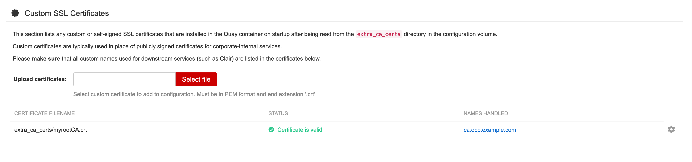
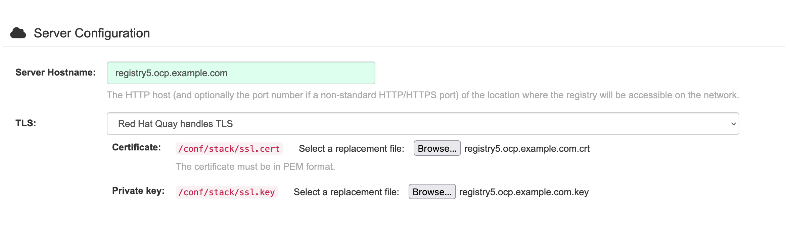
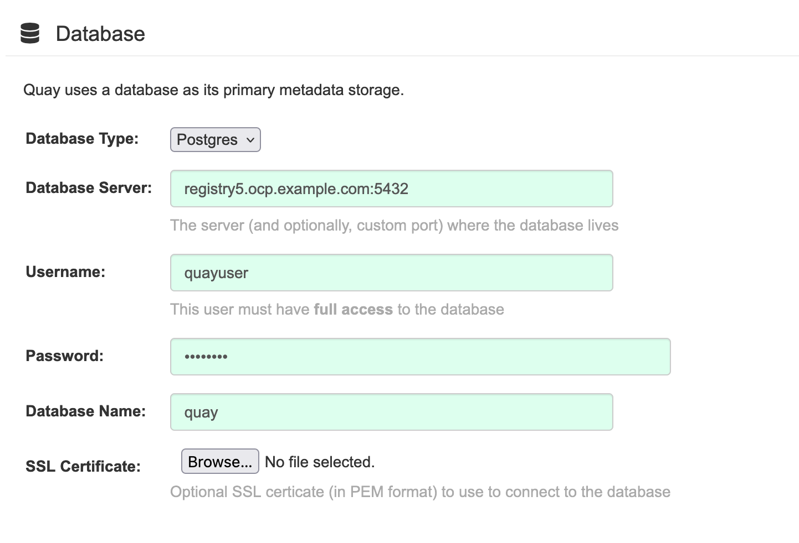
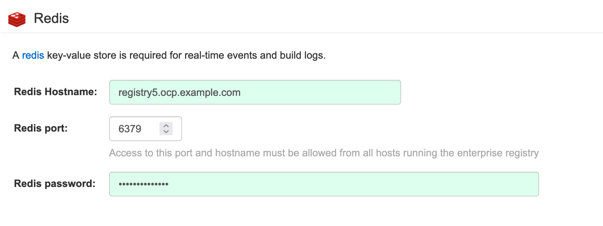
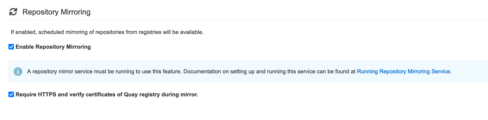
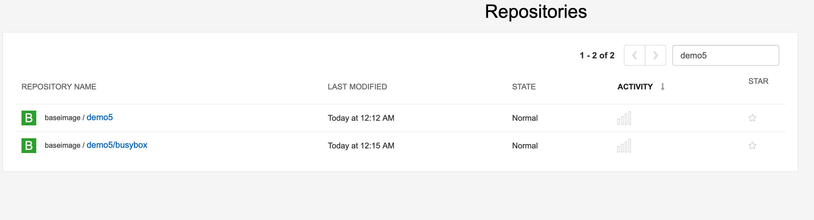

# 目标

* 基于POC的需求，快速安装quay
* 开启 Quay mirror 功能


# 环境准备


## 下载镜像

```

podman pull registry.redhat.io/rhel8/postgresql-10:1
podman pull registry.redhat.io/rhel8/redis-5:1

podman pull registry.redhat.io/quay/quay-rhel8:v3.7.3

```


## 签发证书

使用之前的自签CA为 `registry5.ocp.example.com`

```
CER_ROOT_CA=myrootCA

CER_NAME=registry5.ocp.example.com

openssl genrsa -out ${CER_NAME}.key 4096

openssl req -sha512 -new \
    -subj "/C=CN/ST=Beijing/L=Beijing/O=REDHAT/OU=GPS/CN=registry5.ocp.example.com" \
    -key ${CER_NAME}.key \
    -out ${CER_NAME}.csr

cat > registry5.cnf << EOF
[req]
req_extensions = v3_req
distinguished_name = req_distinguished_name

[req_distinguished_name]
[ v3_req ]
basicConstraints = CA:FALSE
keyUsage = nonRepudiation, digitalSignature, keyEncipherment
subjectAltName = @alt_names

[alt_names]
DNS.1 = registry5.ocp.example.com
DNS.2 = 192.168.3.15
EOF

openssl x509 -req -in ${CER_NAME}.csr -CA ${CER_ROOT_CA}.crt \
   -CAkey ${CER_ROOT_CA}.key -CAcreateserial -out ${CER_NAME}.crt \
   -days 3650 -extensions v3_req -extfile registry5.cnf

```


# 安装


```
yum install -y podman 

sudo podman login registry.redhat.io

firewall-cmd --permanent --add-port=80/tcp
firewall-cmd --permanent --add-port=443/tcp
firewall-cmd --permanent --add-port=5432/tcp
firewall-cmd --permanent --add-port=5433/tcp
firewall-cmd --permanent --add-port=6379/tcp
firewall-cmd --reload

mkdir -p /data/quay-data
export QUAY=/data/quay-data

mkdir -p $QUAY/postgres-quay
setfacl -m u:26:-wx $QUAY/postgres-quay


sudo podman run -d --rm --name postgresql-quay \
  -e POSTGRESQL_USER=quayuser \
  -e POSTGRESQL_PASSWORD=quaypass \
  -e POSTGRESQL_DATABASE=quay \
  -e POSTGRESQL_ADMIN_PASSWORD=adminpass \
  -p 5432:5432 \
  -v $QUAY/postgres-quay:/var/lib/pgsql/data:Z \
  registry.redhat.io/rhel8/postgresql-10:1

确保安装了 Postgres pg_trgm 模块，因为 Quay 需要它
sudo podman exec -it postgresql-quay /bin/bash -c 'echo "CREATE EXTENSION IF NOT EXISTS pg_trgm" | psql -d quay -U postgres'

sudo podman run -d --rm --name redis \
  -p 6379:6379 \
  -e REDIS_PASSWORD=strongpassword \
  registry.redhat.io/rhel8/redis-5:1
 
podman run --rm -it --name quay_config -p 80:8080 -p 443:8443 registry.redhat.io/quay/quay-rhel8:v3.7.3 config secret


```


## 配置

### 证书配置 

配置CA 




配置证书




### postgres 配置


- **数据库类型：** Postgres
- **数据库服务器：**  `registry5.ocp.example.com:5432`
- **Username:**  `quayuser`
- **Password:**  `quaypass`
- **数据库名称：** `quay`




### redis 配置

- **Redis Hostname:**  registry5.ocp.example.com
- **Redis 端口：** 6379（默认）
- **Redis password：** strongpassword



### 开启mirror





### 下载配置文件

下载配置文件，并停止 quay 容器 

```

podman stop quay_config
```


## 启动quay服务


```
export QUAY=/data/quay-data

mkdir $QUAY/config
cp ~/Downloads/quay-config.tar.gz $QUAY/config
cd $QUAY/config
tar xvf quay-config.tar.gz
```


```
# 为镜像数据准备本地存储
mkdir $QUAY/storage
setfacl -m u:1001:-wx $QUAY/storage


 # 部署 Red Hat Quay registry
 sudo podman run -d --rm -p 80:8080 -p 443:8443  \
   --name=quay \
   -v $QUAY/config:/conf/stack:Z \
   -v $QUAY/storage:/datastorage:Z \
   registry.redhat.io/quay/quay-rhel8:v3.7.3
```


### 开启mirror

如果想要开启mirror，需要再执行以下命令，启动 mirror worker 

```

  
sudo podman run -d --rm --name mirroring-worker \
  -v $QUAY/config:/conf/stack:Z \
  -v $QUAY/config/extra_ca_certs/myrootCA.crt:/etc/pki/ca-trust/source/anchors/ca.crt \
  registry.redhat.io/quay/quay-rhel8:v3.7.3 repomirror
```

**注意** 

1. `/etc/pki/ca-trust/source/anchors/ca.crt` 这个值不能改，可以修改前面 `/data/certs/myrootCA.crt` 这个地方 
2. 目标registry 的repository里需要有一个 latest 的label，否则的话会报以下错误

```
registry2.ocp.example.com:8443/baseimage/demo5' with tag pattern '*': ('skopeo inspect failed: See output', '', 'time="2022-08-09T16:07:24Z" level=fatal msg="Error parsing image name \\"docker://registry2.ocp.example.com:8443/baseimage/demo5:latest\\": reading manifest latest in registry2.ocp.example.com:8443/baseimage/demo5: manifest unknown: manifest unknown"\n')
```

3. 只能同步当前repo，不能同步子repo，例如下面这种，我们配置的是同步demo5，那么 demo/busybox 是无法同步的




### 为 quay 设置 http_proxy 代理


```
export QUAY=/data

sudo podman run -d --rm -p 80:8080 \
  -p 443:8443 \
  -e http_proxy=http://192.168.3.90:7890 \
  -e https_proxy=http://192.168.3.90:7890 \
  -e all_proxy=socks://192.168.3.90:7891 \
  -e no_proxy=localhost,127.0.0.0/8,192.168.0.0/16 \
  -e NO_PROXY=.ocp.example.com \
  --name=quay \
  -v $QUAY/config:/conf/stack:Z \
  -v $QUAY/storage:/datastorage:Z \
  registry.redhat.io/quay/quay-rhel8:v3.8.2

```

