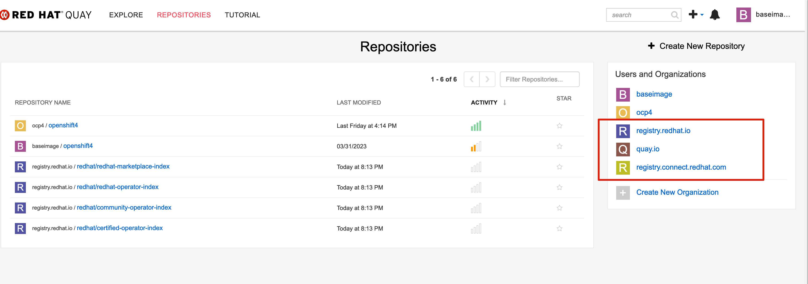

# 目标

在日常使用镜像仓库的过程中，如果镜像仓库有proxy cache 能力，那么有些常用的镜像，我们只有第一次需要通过Internet拉下来，后面就只需要在本地镜像仓库中拉镜像就可以了。  在Quay 3.7 版本中，Proxy Pull-Through Caching 是一个TP功能，默认没有打开。本文主要两个目标

* 打开Quay Proxy Pull-Through Caching 功能
* 如何使用 Proxy


Proxy Pull-Through Caching


# 安装Quay

关于如何安装Quay ，可以参考 [安装Quay](./poc安装quay.md)

## 安装配置

修改  $QUAY/config/config.yaml 文件， 添加  `FEATURE_PROXY_CACHE: true` 

 

# 使用

## 创建cache organization

1. 创建一个Organization
2. 指定Remote Registry， 配置Remote username 和 password ，然后保存


## 创建常用 Organization




## 拉取镜像

通过proxy pull-through cache 拉取镜像，流程如下图所示，第一次拉取的时候，没有缓存，执行之后会自动创建对应的目录

```
podman pull registry6.ocp.example.com/cache/mysql
```


## 配置从本地cache获取镜像

```

mkdir -p $HOME/.config/containers
touch $HOME/.config/containers/registries.conf

# 在$HOME/.config/containers/registries.conf 中增加以下内容

[[registry]]
prefix = "docker.io/library"
insecure = false
blocked = false
location = "registry6.ocp.example.com/cache"
```

此时即可通过 `podman pull docker.io/library/mysql` 从本地拉取镜像


##  配置 mcp 使用 proxy 


```

# 创建 文件 
cat <<EOF > mirror-registries.conf
[[registry]]
  prefix = ""
  location = "registry.redhat.io"
  mirror-by-digest-only = false

  [[registry.mirror]]
    location = "quay.ocp.example.com/registry.redhat.io"

[[registry]]
  prefix = ""
  location = "quay.io"
  mirror-by-digest-only = false

  [[registry.mirror]]
    location = "quay.ocp.example.com/quay.io"

[[registry]]
  prefix = ""
  location = "registry.connect.redhat.com"
  mirror-by-digest-only = false

  [[registry.mirror]]
    location = "quay.ocp.example.com/registry.connect.redhat.com"
    
[[registry]]
  prefix = ""
  location = "docker.io"
  mirror-by-digest-only = false

  [[registry.mirror]]
    location = "quay.ocp.example.com/docker.io"
EOF


REGISTRIES=`base64 -w0 mirror-registries.conf`

cat <<EOF > 99-mirror-registries.yaml
apiVersion: machineconfiguration.openshift.io/v1
kind: MachineConfig
metadata:
  labels:
    machineconfiguration.openshift.io/role: worker
  name: 99-worker-mirror-registries
spec:
  config:
    ignition:
      version: 3.1.0
    storage:
      files:
      - contents:
          source: data:text/plain;charset=utf-8;base64,${REGISTRIES}
        filesystem: root
        mode: 420
        path: /etc/containers/registries.conf.d/99-mirror-registries.conf
---

apiVersion: machineconfiguration.openshift.io/v1
kind: MachineConfig
metadata:
  labels:
    machineconfiguration.openshift.io/role: master
  name: 99-master-mirror-registries
spec:
  config:
    ignition:
      version: 3.1.0
    storage:
      files:
      - contents:
          source: data:text/plain;charset=utf-8;base64,${REGISTRIES}
        filesystem: root
        mode: 420
        path: /etc/containers/registries.conf.d/99-mirror-registries.conf
EOF


oc apply -f 99-mirror-registries.yaml
```


```
[[registry]]
  prefix = ""
  location = "registry.redhat.io"
  mirror-by-digest-only = false

  [[registry.mirror]]
    location = "registry.ocp4.cn/registry.redhat.io"

[[registry]]
  prefix = ""
  location = "quay.io"
  mirror-by-digest-only = false

  [[registry.mirror]]
    location = "registry.ocp4.cn/quay.io"

[[registry]]
  prefix = ""
  location = "registry.access.redhat.com"
  mirror-by-digest-only = false

  [[registry.mirror]]
    location = "registry.ocp4.cn/registry.access.redhat.com"

[[registry]]
  prefix = ""
  location = "registry.connect.redhat.com"
  mirror-by-digest-only = false

  [[registry.mirror]]
    location = "registry.ocp4.cn/registry.connect.redhat.com"

[[registry]]
  prefix = ""
  location = "docker.io"
  mirror-by-digest-only = false

  [[registry.mirror]]
    location = "registry.ocp4.cn/docker.io"

[[registry]]
  prefix = ""
  location = "gcr.io"
  mirror-by-digest-only = false

  [[registry.mirror]]
    location = "registry.ocp4.cn/gcr.io"
```


## quay 使用http_proxy

有些时候，quay 需要科学上网，这是可以在其pod 中配置 http_proxy 环境变量

```
export QUAY=/data

sudo podman run -d --rm -p 80:8080 -p 443:8443 -e http_proxy=http://192.168.3.90:7890 -e https_proxy=http://192.168.3.90:7890 -e all_proxy=socks://192.168.3.90:7891 -e no_proxy=localhost,127.0.0.0/8,192.168.0.0/16 -e NO_PROXY=.ocp.example.com --name=quay -v $QUAY/config:/conf/stack:Z -v $QUAY/storage:/datastorage:Z registry.redhat.io/quay/quay-rhel8:v3.8.2
```


# Reference

https://cloud.redhat.com/blog/red-hat-quay-3.7-introduces-caching-storage-quotas-more

https://www.youtube.com/watch?v=oVlRDuCD6ic


