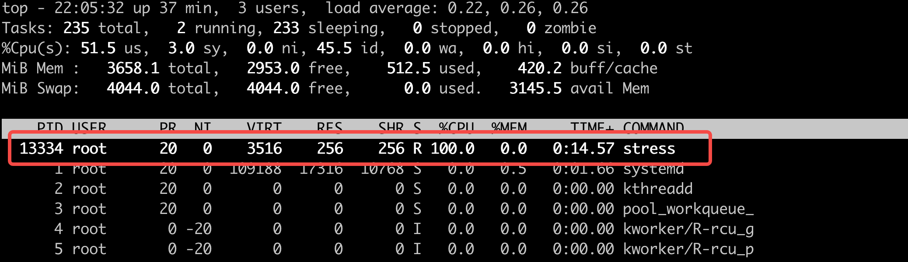
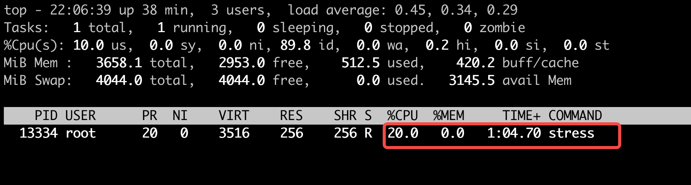

# cgroup v1 和 v2 的区别 


# cgroup-v2 Demo


## CPU 

1. 创建 cgroup

```

cd /sys/fs/cgroup
sudo mkdir mygroup

```


2. 启用 cpu.max (可选)

```
# 检查 文件是否存在 
ls -l /sys/fs/cgroup/mygroup/cpu.max

如果该文件不存在，则执行以下命令开启 
echo "+cpu" > /sys/fs/cgroup/cgroup.subtree_control

```


3. 设置 cpu.max 

```
echo "200000 1000000" | sudo tee /sys/fs/cgroup/mygroup/cpu.max
```


4. 启动测试程序

```

stress --cpu 1 --timeout 600 &
# 找到 pid 
ps -ef | grep stress 

```




5. 限制cpu

```
# 将上边找到的 pid 写入cgroup.procs 中，cpu使用率会被控制在20% 
echo "<PID>" | sudo tee /sys/fs/cgroup/mygroup/cgroup.procs
```

现在再看，cpu 被控制在20% 

