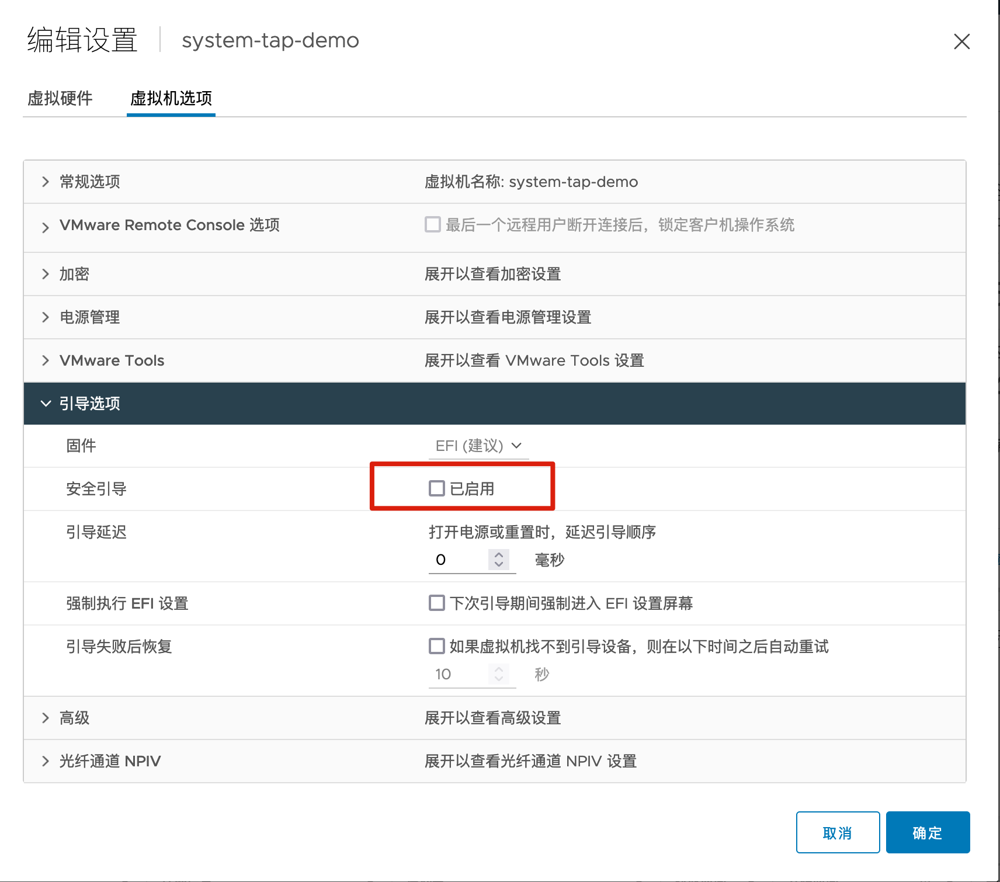

# 目标


# 安装


```
```


注意： 需要在VM上关闭安全引导，否则会报权限错误




# Demo

stap命令与staprun命令的区别在于：
stap命令的操作对象是stp文件或script命令等，而staprun命令的操作对象是编译生成的内核模块。


## demo1-reset

模拟reset 场景

```
server # nc -nl4 192.168.3.225 9001
client # nc -n4  192.168.3.225 9001
```


在server 执行以下命令，查看server端的 进程

```
[root@localhost ~]# netstat -npa | egrep "Recv|ESTAB.*/nc"
Proto Recv-Q Send-Q Local Address           Foreign Address         State       PID/Program name
tcp        0      0 192.168.3.239:34188     192.168.3.225:9001      ESTABLISHED 622407/nc

kill server 端的连接进程
kill -9 622407

此时client 端的链接还在，还可以继续发消息，在client端尝试发送消息到对端，此时对端就会发出rst消息
```


# Reference


https://access.redhat.com/solutions/5441


